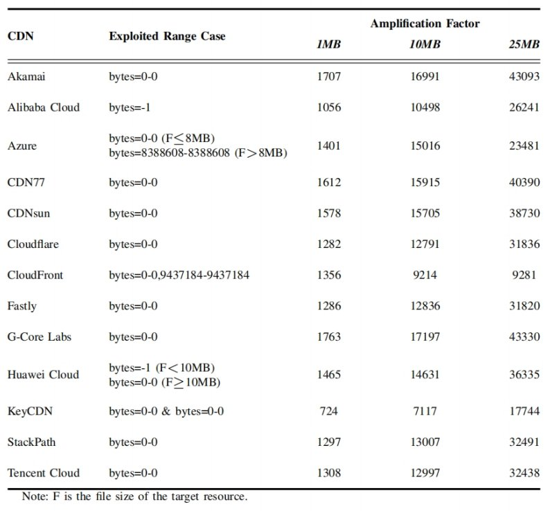
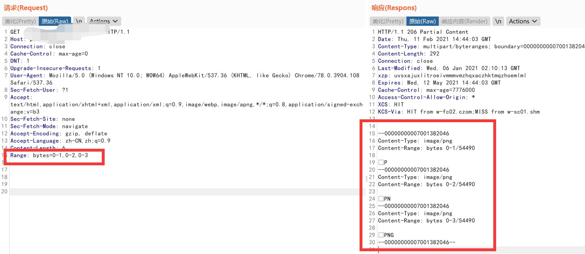
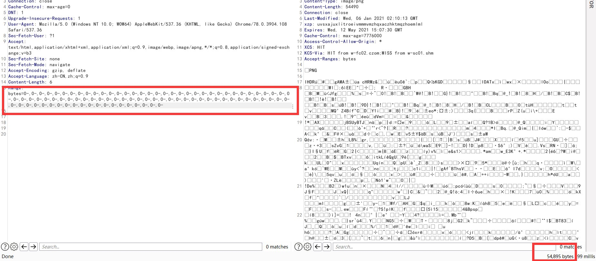
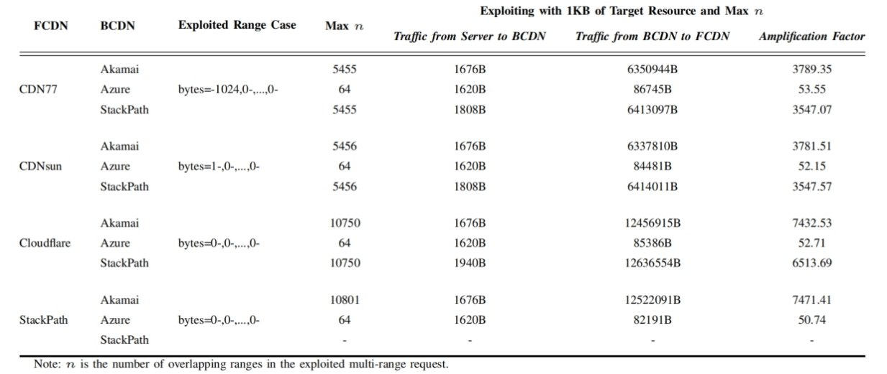
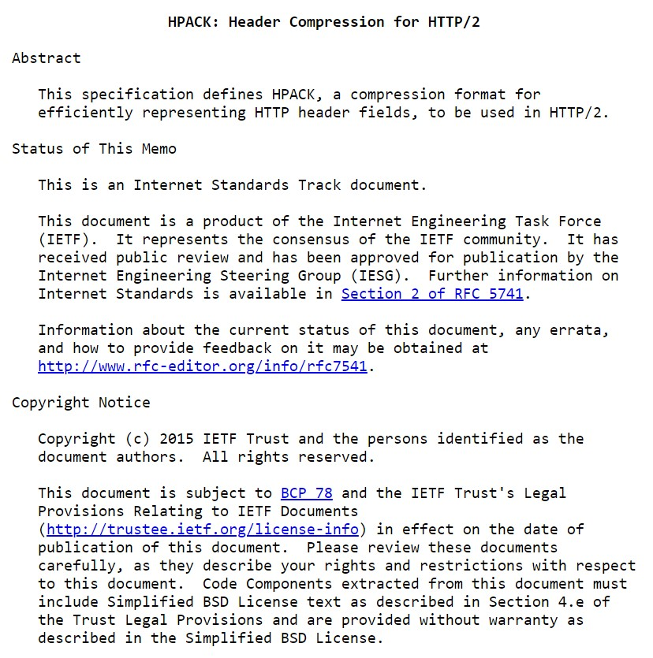
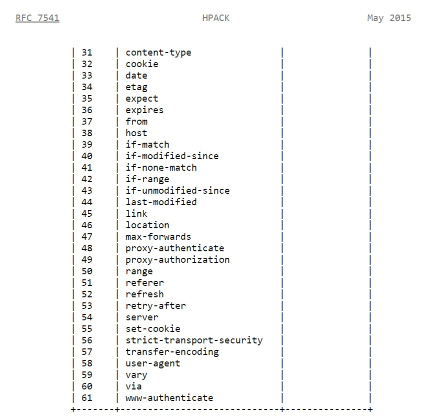
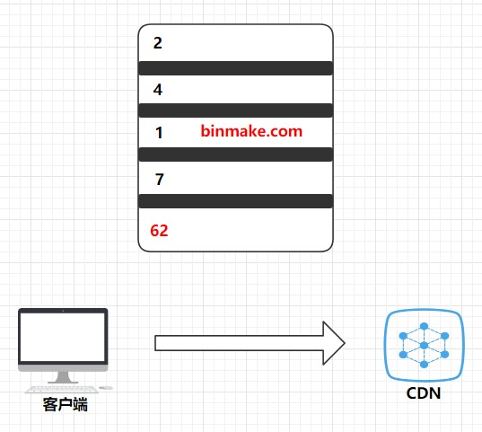
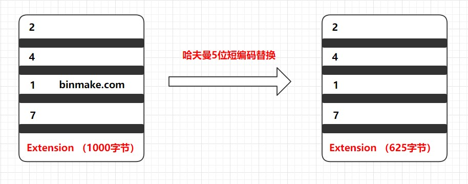

### HTTP范围放大攻击

范围放大攻击又称 Rangeamp，主要利用了HTTP协议中Range请求头的规范和特性来实现，针对目标网站，我们可以发送一个 HEAD 请求，来判断是否支持 Range 请求头


如果目标网站支持 Range 传输，则会返回 `Accept-Ranges: bytes` 

当然，我们也可以直接加上 `Range: bytes=` 请求头去发送数据包，然后查看其是否返回我们指定请求的字节数据，注意响应状态，返回的是 206 Partial Content


##### SBR小字节范围攻击

SBR小字节范围攻击主要是利用了请求和响应流量之间不对称的方式来进行放大攻击，客户端发送小字节（例如1字节）的Range范围请求，大多数CDN在接受到此类范围请求时，为了缓存优化、降低延迟和减少回源等，可能会采取删除Range头或者扩增请求字节的大小范围，然后再将处理后的HTTP请求发送给后端服务器。


这样一来，我们源请求和处理后的请求之间，会造成响应流量的严重倾斜，也就是不对称，其比值即为攻击放大的倍数。针对1024kb大小的资源来说，其放大倍数基本都在1000倍以上。

以下是实验中，目标资源大小分别为1MB、10MB和25MB时的流量放大倍数表：



##### OBR重叠字节范围攻击

OBR利用了多范围请求，多范围Range请求如图所示：




客户端发送类似 `Range: bytes=0-1,1-10,200-2000` 的多范围HTTP请求，正常情况下，服务器返回的是分段处理后的响应流。


此时客户端请求的是一份资源，但是服务器对重叠范围请求处理后，返回的是 N * 资源大小的数据流量，单词请求压力是之前的 N 倍，因为服务器要做大量的运算和字符串处理，重叠范围请求的越多，压力越大，内存消耗越多。

但是大部分网站都遵循RFC7233标准对重叠范围请求做了处理和修正。





如图所示，当我们发起请求多个重叠范围时，返回的最大数据为我们的单次资源最大字节数，并不能无限消耗和放大。

但是在CDN中，有一些CDN并没有遵循标准，此时可以针对两台CDN节点做级联放大攻击，以此来打跨CDN节点。


客户端发送OBR请求给前端CDN，前端CDN节点不经过处理直接发送给后端CDN节点，后端CDN节点与源站，也就是与服务器的交互请求受限于服务器的RFC标准，此时服务器返回最大单个资源请求响应数据。

后端CDN收到单个资源数据后，因为并未遵循RFC标准，将响应的资源数据放大N倍后传递给前端CDN节点，OBR重叠范围的数目越多，请求压力就越大，最终造成DDOS攻击。

以下是级联CDN的实测流量放大倍数表：





### 基于协议转换的HPACK攻击

在 `http/1.x` 的版本中，请求的Header字段未被压缩，Header字段以字符串进行传输，在高并发的场景下，每个请求都携带了Header字段，浪费了带宽，增加了网络延迟。

针对这个问题，`http/2.x` 的版本对Header信息进行压缩编码，从而提高带宽利用率，这种压缩编码算法就是HAPCK。HPACK一种新型压缩器，可消除冗余的header字段，限制已知安全攻击的漏洞，并且在受限环境中使用有限的内存要求。

在 `RFC7541` 标准中可以具体的来看HPACK



HPACK将HTTP请求的Header字段看作 `name-value` 的有序集合对，使用 2 个索引表（静态索引表、动态索引表）来把头部映射到索引值，并对不存在的头部使用哈夫曼编码，并动态缓存到索引，从而达到压缩头部的效果。

头部的内容包括了 `Header Name` 和 `Header Value `两部分，不同的类型包含了不同的内容。

静态表顾名思义，是预定义好的，总共有61对索引值，表如下：




动态表则是在每次HTTP请求中，由客户端进行扩充


k是可以增大的，每次在动态表中插入新的索引，新插入的 `key-value ` 对的索引下标是s+1,动态表里的其他数据下标依次往后挪。

总的来说，HPACK的压缩和编码特性，结合CDN的前后协议不一致，将会造成新的攻击态势。

##### 静态表的协议不对称放大攻击

针对源HTTP请求：

```html
GET / HTTP/1.1

Host: binmake.com

Scheme: https
```

经过静态表编码压缩的过程：


可以看到，压缩后直接从原来的 52 字节压缩到了 16字节：

````bash
82 84 87 41 0B 62 69 6e 6d 61 6b 65 2e 63 6f 6d 
````

 kali上我们可以用 nghttp2 自带的 h2load 来测试压缩效率


基本上所有的CDN都支持 HTTP2 协议，但不是所有的后端源服务器都支持。

所以利用前后端 HTTP 协议不一致造成的不对称差异，可以放大流量，制造拒绝服务攻击：


此时放大倍数约为3.3。

##### 动态表的协议不对称放大攻击

针对源HTTP请求：

```
GET / HTTP/1.1

Host: binmake.com

Scheme: https

Extension: ......(1000 bytes)
```

由于请求头中多出了 `Extension` 字段和1000字节的值，此时预定义的静态表中无法找到，那么HPACK就会使用扩展的动态表来记录：


注意，只有第一次请求的时候，需要未经压缩编码的扩展字段发送给 CDN ，CDN 在HPACK机制下，会将整个扩展字段在动态表中新增一条记录。

当再次请求同一资源时，CDN会检查匹配动态表是否命中：




后续的请求CDN 全部走动态表：


此时放大系数约为 62 倍，远远超过了静态表。

##### 利用哈夫曼编码的协议不对称放大攻击

根据数据结构当中的树型结构，在哈夫曼算法的支持下构造出一棵最优二叉树，我们把这类树命名为哈夫曼树。哈夫曼编码是在哈夫曼树的基础之上构造出来的一种编码形式，一般应用于压缩和解压缩。

HPACK 对字符串的处理是支持哈夫曼编码的，见如下表：

```
                                                        code
                          code as bits                 as hex   len
        sym              aligned to MSB                aligned   in
                                                       to LSB   bits
       (  0)  |11111111|11000                             1ff8  [13]
       (  1)  |11111111|11111111|1011000                7fffd8  [23]
       (  2)  |11111111|11111111|11111110|0010         fffffe2  [28]
       (  3)  |11111111|11111111|11111110|0011         fffffe3  [28]
       (  4)  |11111111|11111111|11111110|0100         fffffe4  [28]
       (  5)  |11111111|11111111|11111110|0101         fffffe5  [28]
       (  6)  |11111111|11111111|11111110|0110         fffffe6  [28]
       (  7)  |11111111|11111111|11111110|0111         fffffe7  [28]
       (  8)  |11111111|11111111|11111110|1000         fffffe8  [28]
       (  9)  |11111111|11111111|11101010               ffffea  [24]
       ( 10)  |11111111|11111111|11111111|111100      3ffffffc  [30]
       ( 11)  |11111111|11111111|11111110|1001         fffffe9  [28]
       ( 12)  |11111111|11111111|11111110|1010         fffffea  [28]
       ( 13)  |11111111|11111111|11111111|111101      3ffffffd  [30]


Peon & Ruellan               Standards Track                   [Page 27]
 
RFC 7541                          HPACK                         May 2015


       ( 14)  |11111111|11111111|11111110|1011         fffffeb  [28]
       ( 15)  |11111111|11111111|11111110|1100         fffffec  [28]
       ( 16)  |11111111|11111111|11111110|1101         fffffed  [28]
       ( 17)  |11111111|11111111|11111110|1110         fffffee  [28]
       ( 18)  |11111111|11111111|11111110|1111         fffffef  [28]
       ( 19)  |11111111|11111111|11111111|0000         ffffff0  [28]
       ( 20)  |11111111|11111111|11111111|0001         ffffff1  [28]
       ( 21)  |11111111|11111111|11111111|0010         ffffff2  [28]
       ( 22)  |11111111|11111111|11111111|111110      3ffffffe  [30]
       ( 23)  |11111111|11111111|11111111|0011         ffffff3  [28]
       ( 24)  |11111111|11111111|11111111|0100         ffffff4  [28]
       ( 25)  |11111111|11111111|11111111|0101         ffffff5  [28]
       ( 26)  |11111111|11111111|11111111|0110         ffffff6  [28]
       ( 27)  |11111111|11111111|11111111|0111         ffffff7  [28]
       ( 28)  |11111111|11111111|11111111|1000         ffffff8  [28]
       ( 29)  |11111111|11111111|11111111|1001         ffffff9  [28]
       ( 30)  |11111111|11111111|11111111|1010         ffffffa  [28]
       ( 31)  |11111111|11111111|11111111|1011         ffffffb  [28]
   ' ' ( 32)  |010100                                       14  [ 6]
   '!' ( 33)  |11111110|00                                 3f8  [10]
   '"' ( 34)  |11111110|01                                 3f9  [10]
   '#' ( 35)  |11111111|1010                               ffa  [12]
   '$' ( 36)  |11111111|11001                             1ff9  [13]
   '%' ( 37)  |010101                                       15  [ 6]
   '&' ( 38)  |11111000                                     f8  [ 8]
   ''' ( 39)  |11111111|010                                7fa  [11]
   '(' ( 40)  |11111110|10                                 3fa  [10]
   ')' ( 41)  |11111110|11                                 3fb  [10]
   '*' ( 42)  |11111001                                     f9  [ 8]
   '+' ( 43)  |11111111|011                                7fb  [11]
   ',' ( 44)  |11111010                                     fa  [ 8]
   '-' ( 45)  |010110                                       16  [ 6]
   '.' ( 46)  |010111                                       17  [ 6]
   '/' ( 47)  |011000                                       18  [ 6]
   '0' ( 48)  |00000                                         0  [ 5]
   '1' ( 49)  |00001                                         1  [ 5]
   '2' ( 50)  |00010                                         2  [ 5]
   '3' ( 51)  |011001                                       19  [ 6]
   '4' ( 52)  |011010                                       1a  [ 6]
   '5' ( 53)  |011011                                       1b  [ 6]
   '6' ( 54)  |011100                                       1c  [ 6]
   '7' ( 55)  |011101                                       1d  [ 6]
   '8' ( 56)  |011110                                       1e  [ 6]
   '9' ( 57)  |011111                                       1f  [ 6]
   ':' ( 58)  |1011100                                      5c  [ 7]
   ';' ( 59)  |11111011                                     fb  [ 8]
   '<' ( 60)  |11111111|1111100                           7ffc  [15]
   '=' ( 61)  |100000                                       20  [ 6]


Peon & Ruellan               Standards Track                   [Page 28]
 
RFC 7541                          HPACK                         May 2015


   '>' ( 62)  |11111111|1011                               ffb  [12]
   '?' ( 63)  |11111111|00                                 3fc  [10]
   '@' ( 64)  |11111111|11010                             1ffa  [13]
   'A' ( 65)  |100001                                       21  [ 6]
   'B' ( 66)  |1011101                                      5d  [ 7]
   'C' ( 67)  |1011110                                      5e  [ 7]
   'D' ( 68)  |1011111                                      5f  [ 7]
   'E' ( 69)  |1100000                                      60  [ 7]
   'F' ( 70)  |1100001                                      61  [ 7]
   'G' ( 71)  |1100010                                      62  [ 7]
   'H' ( 72)  |1100011                                      63  [ 7]
   'I' ( 73)  |1100100                                      64  [ 7]
   'J' ( 74)  |1100101                                      65  [ 7]
   'K' ( 75)  |1100110                                      66  [ 7]
   'L' ( 76)  |1100111                                      67  [ 7]
   'M' ( 77)  |1101000                                      68  [ 7]
   'N' ( 78)  |1101001                                      69  [ 7]
   'O' ( 79)  |1101010                                      6a  [ 7]
   'P' ( 80)  |1101011                                      6b  [ 7]
   'Q' ( 81)  |1101100                                      6c  [ 7]
   'R' ( 82)  |1101101                                      6d  [ 7]
   'S' ( 83)  |1101110                                      6e  [ 7]
   'T' ( 84)  |1101111                                      6f  [ 7]
   'U' ( 85)  |1110000                                      70  [ 7]
   'V' ( 86)  |1110001                                      71  [ 7]
   'W' ( 87)  |1110010                                      72  [ 7]
   'X' ( 88)  |11111100                                     fc  [ 8]
   'Y' ( 89)  |1110011                                      73  [ 7]
   'Z' ( 90)  |11111101                                     fd  [ 8]
   '[' ( 91)  |11111111|11011                             1ffb  [13]
   '\' ( 92)  |11111111|11111110|000                     7fff0  [19]
   ']' ( 93)  |11111111|11100                             1ffc  [13]
   '^' ( 94)  |11111111|111100                            3ffc  [14]
   '_' ( 95)  |100010                                       22  [ 6]
   '`' ( 96)  |11111111|1111101                           7ffd  [15]
   'a' ( 97)  |00011                                         3  [ 5]
   'b' ( 98)  |100011                                       23  [ 6]
   'c' ( 99)  |00100                                         4  [ 5]
   'd' (100)  |100100                                       24  [ 6]
   'e' (101)  |00101                                         5  [ 5]
   'f' (102)  |100101                                       25  [ 6]
   'g' (103)  |100110                                       26  [ 6]
   'h' (104)  |100111                                       27  [ 6]
   'i' (105)  |00110                                         6  [ 5]
   'j' (106)  |1110100                                      74  [ 7]
   'k' (107)  |1110101                                      75  [ 7]
   'l' (108)  |101000                                       28  [ 6]
   'm' (109)  |101001                                       29  [ 6]


Peon & Ruellan               Standards Track                   [Page 29]
 
RFC 7541                          HPACK                         May 2015


   'n' (110)  |101010                                       2a  [ 6]
   'o' (111)  |00111                                         7  [ 5]
   'p' (112)  |101011                                       2b  [ 6]
   'q' (113)  |1110110                                      76  [ 7]
   'r' (114)  |101100                                       2c  [ 6]
   's' (115)  |01000                                         8  [ 5]
   't' (116)  |01001                                         9  [ 5]
   'u' (117)  |101101                                       2d  [ 6]
   'v' (118)  |1110111                                      77  [ 7]
   'w' (119)  |1111000                                      78  [ 7]
   'x' (120)  |1111001                                      79  [ 7]
   'y' (121)  |1111010                                      7a  [ 7]
   'z' (122)  |1111011                                      7b  [ 7]
   '{' (123)  |11111111|1111110                           7ffe  [15]
   '|' (124)  |11111111|100                                7fc  [11]
   '}' (125)  |11111111|111101                            3ffd  [14]
   '~' (126)  |11111111|11101                             1ffd  [13]
       (127)  |11111111|11111111|11111111|1100         ffffffc  [28]
       (128)  |11111111|11111110|0110                    fffe6  [20]
       (129)  |11111111|11111111|010010                 3fffd2  [22]
       (130)  |11111111|11111110|0111                    fffe7  [20]
       (131)  |11111111|11111110|1000                    fffe8  [20]
       (132)  |11111111|11111111|010011                 3fffd3  [22]
       (133)  |11111111|11111111|010100                 3fffd4  [22]
       (134)  |11111111|11111111|010101                 3fffd5  [22]
       (135)  |11111111|11111111|1011001                7fffd9  [23]
       (136)  |11111111|11111111|010110                 3fffd6  [22]
       (137)  |11111111|11111111|1011010                7fffda  [23]
       (138)  |11111111|11111111|1011011                7fffdb  [23]
       (139)  |11111111|11111111|1011100                7fffdc  [23]
       (140)  |11111111|11111111|1011101                7fffdd  [23]
       (141)  |11111111|11111111|1011110                7fffde  [23]
       (142)  |11111111|11111111|11101011               ffffeb  [24]
       (143)  |11111111|11111111|1011111                7fffdf  [23]
       (144)  |11111111|11111111|11101100               ffffec  [24]
       (145)  |11111111|11111111|11101101               ffffed  [24]
       (146)  |11111111|11111111|010111                 3fffd7  [22]
       (147)  |11111111|11111111|1100000                7fffe0  [23]
       (148)  |11111111|11111111|11101110               ffffee  [24]
       (149)  |11111111|11111111|1100001                7fffe1  [23]
       (150)  |11111111|11111111|1100010                7fffe2  [23]
       (151)  |11111111|11111111|1100011                7fffe3  [23]
       (152)  |11111111|11111111|1100100                7fffe4  [23]
       (153)  |11111111|11111110|11100                  1fffdc  [21]
       (154)  |11111111|11111111|011000                 3fffd8  [22]
       (155)  |11111111|11111111|1100101                7fffe5  [23]
       (156)  |11111111|11111111|011001                 3fffd9  [22]
       (157)  |11111111|11111111|1100110                7fffe6  [23]


Peon & Ruellan               Standards Track                   [Page 30]
 
RFC 7541                          HPACK                         May 2015


       (158)  |11111111|11111111|1100111                7fffe7  [23]
       (159)  |11111111|11111111|11101111               ffffef  [24]
       (160)  |11111111|11111111|011010                 3fffda  [22]
       (161)  |11111111|11111110|11101                  1fffdd  [21]
       (162)  |11111111|11111110|1001                    fffe9  [20]
       (163)  |11111111|11111111|011011                 3fffdb  [22]
       (164)  |11111111|11111111|011100                 3fffdc  [22]
       (165)  |11111111|11111111|1101000                7fffe8  [23]
       (166)  |11111111|11111111|1101001                7fffe9  [23]
       (167)  |11111111|11111110|11110                  1fffde  [21]
       (168)  |11111111|11111111|1101010                7fffea  [23]
       (169)  |11111111|11111111|011101                 3fffdd  [22]
       (170)  |11111111|11111111|011110                 3fffde  [22]
       (171)  |11111111|11111111|11110000               fffff0  [24]
       (172)  |11111111|11111110|11111                  1fffdf  [21]
       (173)  |11111111|11111111|011111                 3fffdf  [22]
       (174)  |11111111|11111111|1101011                7fffeb  [23]
       (175)  |11111111|11111111|1101100                7fffec  [23]
       (176)  |11111111|11111111|00000                  1fffe0  [21]
       (177)  |11111111|11111111|00001                  1fffe1  [21]
       (178)  |11111111|11111111|100000                 3fffe0  [22]
       (179)  |11111111|11111111|00010                  1fffe2  [21]
       (180)  |11111111|11111111|1101101                7fffed  [23]
       (181)  |11111111|11111111|100001                 3fffe1  [22]
       (182)  |11111111|11111111|1101110                7fffee  [23]
       (183)  |11111111|11111111|1101111                7fffef  [23]
       (184)  |11111111|11111110|1010                    fffea  [20]
       (185)  |11111111|11111111|100010                 3fffe2  [22]
       (186)  |11111111|11111111|100011                 3fffe3  [22]
       (187)  |11111111|11111111|100100                 3fffe4  [22]
       (188)  |11111111|11111111|1110000                7ffff0  [23]
       (189)  |11111111|11111111|100101                 3fffe5  [22]
       (190)  |11111111|11111111|100110                 3fffe6  [22]
       (191)  |11111111|11111111|1110001                7ffff1  [23]
       (192)  |11111111|11111111|11111000|00           3ffffe0  [26]
       (193)  |11111111|11111111|11111000|01           3ffffe1  [26]
       (194)  |11111111|11111110|1011                    fffeb  [20]
       (195)  |11111111|11111110|001                     7fff1  [19]
       (196)  |11111111|11111111|100111                 3fffe7  [22]
       (197)  |11111111|11111111|1110010                7ffff2  [23]
       (198)  |11111111|11111111|101000                 3fffe8  [22]
       (199)  |11111111|11111111|11110110|0            1ffffec  [25]
       (200)  |11111111|11111111|11111000|10           3ffffe2  [26]
       (201)  |11111111|11111111|11111000|11           3ffffe3  [26]
       (202)  |11111111|11111111|11111001|00           3ffffe4  [26]
       (203)  |11111111|11111111|11111011|110          7ffffde  [27]
       (204)  |11111111|11111111|11111011|111          7ffffdf  [27]
       (205)  |11111111|11111111|11111001|01           3ffffe5  [26]


Peon & Ruellan               Standards Track                   [Page 31]
 
RFC 7541                          HPACK                         May 2015


       (206)  |11111111|11111111|11110001               fffff1  [24]
       (207)  |11111111|11111111|11110110|1            1ffffed  [25]
       (208)  |11111111|11111110|010                     7fff2  [19]
       (209)  |11111111|11111111|00011                  1fffe3  [21]
       (210)  |11111111|11111111|11111001|10           3ffffe6  [26]
       (211)  |11111111|11111111|11111100|000          7ffffe0  [27]
       (212)  |11111111|11111111|11111100|001          7ffffe1  [27]
       (213)  |11111111|11111111|11111001|11           3ffffe7  [26]
       (214)  |11111111|11111111|11111100|010          7ffffe2  [27]
       (215)  |11111111|11111111|11110010               fffff2  [24]
       (216)  |11111111|11111111|00100                  1fffe4  [21]
       (217)  |11111111|11111111|00101                  1fffe5  [21]
       (218)  |11111111|11111111|11111010|00           3ffffe8  [26]
       (219)  |11111111|11111111|11111010|01           3ffffe9  [26]
       (220)  |11111111|11111111|11111111|1101         ffffffd  [28]
       (221)  |11111111|11111111|11111100|011          7ffffe3  [27]
       (222)  |11111111|11111111|11111100|100          7ffffe4  [27]
       (223)  |11111111|11111111|11111100|101          7ffffe5  [27]
       (224)  |11111111|11111110|1100                    fffec  [20]
       (225)  |11111111|11111111|11110011               fffff3  [24]
       (226)  |11111111|11111110|1101                    fffed  [20]
       (227)  |11111111|11111111|00110                  1fffe6  [21]
       (228)  |11111111|11111111|101001                 3fffe9  [22]
       (229)  |11111111|11111111|00111                  1fffe7  [21]
       (230)  |11111111|11111111|01000                  1fffe8  [21]
       (231)  |11111111|11111111|1110011                7ffff3  [23]
       (232)  |11111111|11111111|101010                 3fffea  [22]
       (233)  |11111111|11111111|101011                 3fffeb  [22]
       (234)  |11111111|11111111|11110111|0            1ffffee  [25]
       (235)  |11111111|11111111|11110111|1            1ffffef  [25]
       (236)  |11111111|11111111|11110100               fffff4  [24]
       (237)  |11111111|11111111|11110101               fffff5  [24]
       (238)  |11111111|11111111|11111010|10           3ffffea  [26]
       (239)  |11111111|11111111|1110100                7ffff4  [23]
       (240)  |11111111|11111111|11111010|11           3ffffeb  [26]
       (241)  |11111111|11111111|11111100|110          7ffffe6  [27]
       (242)  |11111111|11111111|11111011|00           3ffffec  [26]
       (243)  |11111111|11111111|11111011|01           3ffffed  [26]
       (244)  |11111111|11111111|11111100|111          7ffffe7  [27]
       (245)  |11111111|11111111|11111101|000          7ffffe8  [27]
       (246)  |11111111|11111111|11111101|001          7ffffe9  [27]
       (247)  |11111111|11111111|11111101|010          7ffffea  [27]
       (248)  |11111111|11111111|11111101|011          7ffffeb  [27]
       (249)  |11111111|11111111|11111111|1110         ffffffe  [28]
       (250)  |11111111|11111111|11111101|100          7ffffec  [27]
       (251)  |11111111|11111111|11111101|101          7ffffed  [27]
       (252)  |11111111|11111111|11111101|110          7ffffee  [27]
       (253)  |11111111|11111111|11111101|111          7ffffef  [27]


Peon & Ruellan               Standards Track                   [Page 32]
 
RFC 7541                          HPACK                         May 2015


       (254)  |11111111|11111111|11111110|000          7fffff0  [27]
       (255)  |11111111|11111111|11111011|10           3ffffee  [26]
   EOS (256)  |11111111|11111111|11111111|111111      3fffffff  [30]
```

参照 `RFC7541` ，如果H为0，则编码数据是字符串文字的原始八位字节。 如果H是1，则编码数据是字符串文字的哈夫曼编码：


根据 `RFC7541` 给出的哈夫曼编码译表，我们需要关注的是最后一行的 length bit ，也就是编码的长度：


可见，最短的编码长度是 5 bit，将5位的字符整理出来后是：

```
0 | 1 | 2 | a | c | e | i | o | s | t |
```

我们现在用5位的短字符来替换原来的8位长字符，这样就实现了客户端请求的压缩：



这样，当我们针对同一网站不同资源做第一次动态表记录请求时，就极大幅度的缩小了自身请求的消耗，从而节约出机器资源，来发起更多的攻击连接。

