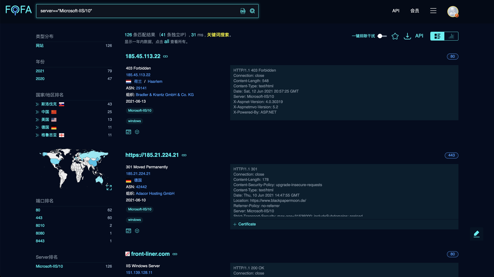
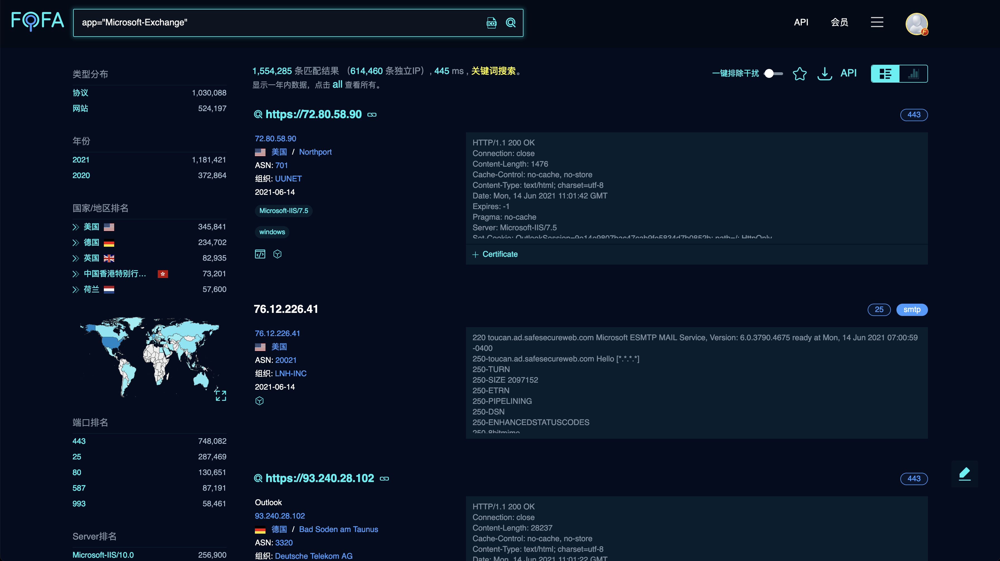

# 介绍

随着网络安全的普及，黑客的攻击手段也日新月异，越来越多的企业对网络安全产品与服务的需求有了新的变化。那么，在险象丛生的互联网世界之中企业如何能够更加有效的保护自己的网络空间资产呢？FOFA给出了相应的解决方案。与传统扫描相比，企业更需要一款能够根据特征、检索条件迅速进行全网资产匹配的搜索引擎。“佛法无边”通常比喻神通广大，无所不能，企业用户终于可以安心的“抱佛脚”了，FOFA可以迅速进行网站资产匹配，加快后续工作进程，如漏洞影响范围分析，应用分布统计，应用流行度排名统计等。

## 什么是FOFA

FOFA（网络空间资产检索系统）是世界上数据覆盖更完整的IT设备搜索引擎，拥有全球联网IT设备更全的DNA信息。探索全球互联网的资产信息，进行资产及漏洞影响范围分析、应用分布统计、应用流行度态势感知等。 

## 什么是F币

F币，全称FOFA币，是由FOFA推出的一种虚拟货币。通常它的兑价是1F币=10人民币，用于下载数据一般都是1F币=30元，充值6个以上（含6个）是6.7折，充值20个以上（含20个）是5折。

> 它可以用来下载数据：10000条数据/1F币；也可以调用API查询数据：10000条数据/1F币。

## 什么时候能用到FOFA

• 我想知道我司产品在互联网的部署情况？
 • 如何获取一个根域名所有子域名网站？如何根据IP确认企业？
 • 如何根据一个子域名网站找到跟他在一个IP的其他网站？
 • 全网漏洞扫描，一个新的漏洞全网的影响范围。

## FOFA具备哪些优势

• 包括标签在内的HTML代码级全文索引和检索，其检索内容更丰富，效果更快速、更精准
 • 预置超过50000条产品特征规则，且用户可以随时自行动态增加，灵活度更高
 • 深厚的全网数据积累，同高效的数据检索技术，快速提高用户的网络资产发现能力
 • 实际应用场景中稳定运行超过4年，成功部署于各类企业用户的生产环境中，发挥重要作用

## 会员权益

成为FOFA会员可免费查询海量的数据，并拥有稳定的数据资源及丰富的API接口，目前FOFA会员分普通会员和高级会员，是终身会员。[各等级会员区分如下：](https://fofa.so/static_pages/vip)

https://fofa.so/static_pages/vip


# 查询语法

FOFA作为一个搜索引擎，我们要熟悉它的查询语法，类似google语法，FOFA的语法也是简单易懂，主要分为检索字段以及运算符，所有的查询语句都是由这两种元素组成的。

直接输入查询语句，将从**标题，html内容，http头信息，url字段**中搜索 

## 从标题中搜索“北京”

```
title="beijing"
```


## 从http头中搜索“elastic”

```
header="elastic"
```


## 从html正文中搜索“网络空间测绘”

```
body="网络空间测绘"
```


## 搜索根域名带有qq.com的网站

```
domain="qq.com"
```


## 查找备案号为“京ICP证030173号”的网站

```
icp="京ICP证030173号"
```


## 查找网站正文中包含js/jquery.js的资产

```
js_name="js/jquery.js"
```


## 查找js源码与之匹配的资产

```
js_md5="82ac3f14327a8b7ba49baa208d4eaa15"
```


## 搜索使用此icon的资产。

```
icon_hash="-247388890"
```


## 从url中搜索”.gov.cn”

```
host=".gov.cn"
```


## 查找对应“6379”端口的资产

```
port="6379"
```


## 从ip中搜索包含“1.1.1.1”的网站

```
ip="1.1.1.1"
```


## 查询IP为“220.181.111.1”的C网段资产

```
ip="220.181.111.1/24"
```


## 查询服务器状态为“402”的资产

```
status_code="402"
```


## 查询quic协议资产

```
protocol="quic"
```


## 搜索指定国家(编码)的资产。

```
country="CN"
```


## 搜索指定行政区的资产。

```
region="Xinjiang"
```


## 搜索指定城市的资产。

```
city="Kunming"
```


## 搜索证书(https或者imaps等)中带有baidu的资产。

```
cert="baidu"
```


## 搜索证书持有者是Oracle Corporation的资产

```
cert.subject="Oracle Corporation"
```


## 搜索证书颁发者为DigiCert Inc的资产

```
cert.issuer="DigiCert"
```


## 验证证书是否有效，true有效，false无效

```
cert.is_valid=true
```


## 搜索FTP协议中带有users文本的资产。

```
banner=users && protocol=ftp
```


## 搜索所有协议资产，支持subdomain和service两种

```
type=service
```


## 搜索CentOS资产。

```
os="centos"
```


## 搜索IIS 10服务器。

```
server=="Microsoft-IIS/10"
```



## 搜索Microsoft-Exchange设备

```
app="Microsoft-Exchange"
```



## 时间范围段搜索

```
after="2021" && before="2021-06-01"
```


## 搜索指定asn的资产。

```
asn="19551"
```


## 搜索指定org(组织)的资产。

```
org="Amazon.com, Inc."
```


## 搜索指定udp协议的资产。

```
base_protocol="udp"
```


## 排除仿冒/欺诈数据

```
is_fraud=false
```


## 排除蜜罐数据

```
is_honeypot=false
```


## 搜索ipv6的资产

```
is_ipv6=true
```


## 搜索域名的资产

```
is_domain=true
```


## 查询开放端口数量等于"6"的资产

```
port_size="6"
```


## 查询开放端口数量大于"6"的资产

```
port_size_gt="6"
```


## 查询开放端口数量小于"12"的资产

```
port_size_lt="12"
```


## 搜索同时开放80和161端口的ip

```
ip_ports="80,161"
```


## 搜索中国的ip资产(以ip为单位的资产数据)。

```
ip_country="CN"
```


## 搜索指定行政区的ip资产(以ip为单位的资产数据)。

```
ip_region="Zhejiang"
```


## 搜索指定城市的ip资产(以ip为单位的资产数据)。

```
ip_city="Hangzhou"
```


## 搜索2021-03-18以后的ip资产(以ip为单位的资产数据)。

```
ip_after="2021-03-18"
```


## 搜索2019-09-09以前的ip资产(以ip为单位的资产数据)。

```
ip_before="2019-09-09"
```


## 注释

查询过程中，可通过点击左侧栏中的分类进行辅助查询，会自动构建对应的查询语句。


# 高级搜索

## 逻辑运算符

> 如果查询表达式有多个与或关系，尽量在外面用（）包含起来 

| 逻辑运算符 | 说明 | 其他         |
| ---------- | ---- | ------------ |
| &&         | 与   | 同时满足     |
| \|\|       | 或   | 满足其中一个 |
| !=         | 非   | 不等于       |
| ==         | 等   | 全等         |


## 标题中包含powered by且标题中不包含discuz

```
title="powered by" && title!=discuz
```


## 标题中不包含powered by且html正文中包含discuz

```
 title!="powered by" && body=discuz 
```


## 寻找Wordpress搭建的站点且从url中搜索”.gov.cn”

```
( body="content=\"WordPress" || (header="X-Pingback" && header="/xmlrpc.php" && body="/wp-includes/") ) && host="gov.cn"
```


## 排除干扰

使用规则`is_honeypot=false && is_fraud=false`可排除排除仿冒/欺诈数据和蜜罐数据


# 规则专题

https://fofa.so/subject


# 规则列表

FOFA可以从不同维度搜索网络组件，例如地区，端口号，网络服务，操作系统，网络协议等等。目前FOFA支持了多个网络组件的指纹识别，包括建站模块、分享模块、各种开发框架、安全监测平台、项目管理系统、企业管理系统、视频监控系统、站长平台、电商系统、广告联盟、前端库、路由器、SSL证书、服务器管理系统、CDN、Web服务器、WAF、CMS等等。

>  https://fofa.so/library


# API

通过API可快速从网站中获取数据，便于进行程序间的自动化查询、处理功能，进行进一步的业务分析，

所有调用都需要提供身份信息，主要是email和key，email主要是注册和登陆时填写的email，key需要用户到个人中心获取32位的hash值，即为API KEY。


将上面的两个信息填入api接口中，即可获取json格式的数据：


具体的使用如下：

> https://fofa.so/static_pages/api_help

# 下载功能

搜索到结果之后可在右侧选择下载功能，可下载搜索到的所有数据，下载的格式支持CSV，JSON格式，方便程序调用进行全网扫描。


# 数据统计

查询出的结果可通过图表的形式进行数据统计。


# 问题列表

## icon_hash语法怎么使用

使用方法①：已有icon文件时，通过在首页搜索框内上传icon搜索；

使用方法②：已知icon_hash时直接使用icon_hash=””语法搜索；

使用方法③：已知域名时，使用domain=””语法，系统会展示对应的icon，点击即可进行搜索；

## port_size语法怎么使用

该语法仅限高级会员、企业会员使用。

通过port_size=””语法，可以查询开放端口数量等于某数的资产； 

通过port_size_gt=””语法，可以查询开放端口数量大于某数的资产； 

通过port_size_lt=””语法，可以查询开放端口数量小于某数的资产； 

## API可以获取哪些字段？

host, title, ip, domain, port, country, province, city, country_name,  header, server, protocol, banner, cert, isp, as_number, as_organization, latitude, longitude, lastupdatetime等。

## 能显示独立ip吗？

支持，前往该IP的聚合页查看。


## 同IP数据重复

FOFA的资产是以ip和端口为单位，不是以ip为单位。所有存在同IP不同端口的数据。

## 同端口数据重复

端口数据分协议数据和网站数据。协议数据有协议等信息，网站数据有网站正文信息。

## 为何有的协议不支持跳转？

只有https及http协议支持跳转。

## 是否可以识别组件的版本？

公网暴露的信息中若存在版本特征，则可识别。

## API接口调用查询的时间选项，有很多是以前的信息

搜索语法增加时间限制。

## IP可以搜索到，Body中的内容搜索不到？

英文中的. :// _等未做分词，搜索整体才能搜到，搜索一部分搜不到。

## title支持模糊查询吗？

单等号搜索为包含关系，双等号搜索为绝对相同关系。

# Fofa采集工具

## fofa_viewer

> https://github.com/wgpsec/fofa_viewer

1. 多标签式查询结果展示
2. 丰富的右键菜单
3. 支持查询结果导出
4. 支持手动修改查询最大条数，方便非高级会员使用(修改`config.properties`中的`maxSize`即可)
5. 支持证书转换 将证书序列填写入启动页框内可转换，再使用 `cert="计算出来的值"` 语法进行查询
6. 支持输入智能提示
7. 支持fofa的一键排除干扰（蜜罐）功能。（注：需要高级会员才能使用，使用时会在tab页标记`(*)`）