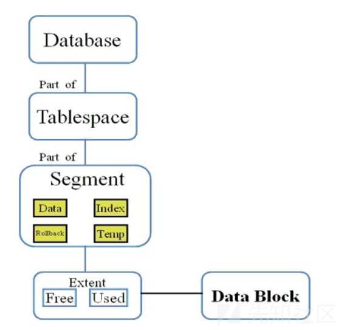
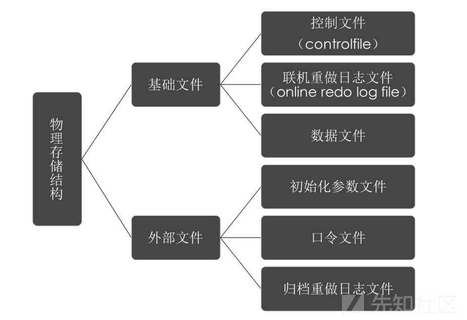
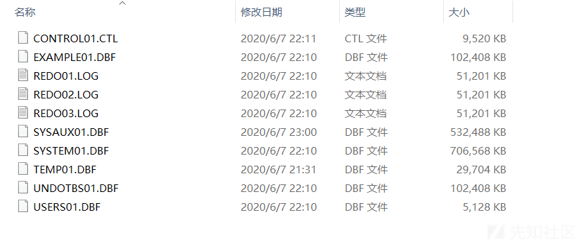

## Oracle 简介
Oracle Database，又名Oracle RDBMS，或简称Oracle。是甲骨文公司的一款关系数据库管理系统，系统可移植性好、使用方便、功能强，适用于各类大、中、小、微机环境。它是一种高效率、可靠性好的、适应高吞吐量的数据库方案。
数据库(Database)可以看成是一个大仓库，然后仓库里面又很分了很多的库房(Schema)，一个Schema就是一个库房，那么库房里面自然就有很多货架(Table)，
那么货架上就可以放很多你想存储的东西，有行有列，所以货架(Table)就是数据存储的基本单位。每个库房(Schema)都会有一个管理人员(User),这个关系是对应的，每个User只管理自己相应Schema里面的数据，如果你想要其他Schema里面的数据，就看管理这个Schema的User给不给你权限了，或者说看上一级领导(DBA)有没有给你这个权限，可能有的User管理着好几个Schema。如果你是仓库的老板，那么仓库里面的所有东西都是你的，你想存储什么或丢掉什么都是老板话算，还可以给下层的人分配不同的权限，比如仓库的不同主管，有的主管可能只读，有的主管有读写权限，这个就要涉及到仓库不同的角色(Role)，角色是一个权限的集合，不同的角色有不同的权限去管理这个数据库。
## 一些基本概念

1. SID(Site ID)：一个由字母和数字组成的系统标识符用来做实例的唯一性的区别，包含了至少一个应用程序的实例和数据存储设备
2. 实例(Instance):由一个实例数字(或是一个引导ID：SYS.V_$DATABASE.ACTIVATION#）表示，包含了一个操作系统程序的集合和与存储设备进行交谈的内部结构

ORACLE实例 = 进程 + 进程所使用的内存(SGA)

   - 进程：负责接受和处理客户端传来的数据，如 Windows 下由 oracle.exe 进程负责分发和处理请求
   - SGA:全称为 System Global Area(系统全局区域)。实际上是内存中的一片共享区域，其中包含实例配置、数据缓存、操作日志、SQL命令、用户信息等信息，由后台进程进行共享
3. 数据库：一般指物理存储的文件，Oracle 数据库除了基本的数据文件，还有控制文件和 Redo 日志(重做文件 + 控制文件 + 数据文件 + 临时文件)，这些文件一般存储在$ORACLE_HOME\oradata...路径下，后缀名后DBF

[关于实例和数据库之间的关系](https://yq.aliyun.com/articles/134241)
简而言之，实例是临时性的，数据库是永久性的，一个数据库可以对应多个实例，而一个实例只能对应一个数据库
## Oracle 数据结构
逻辑结构：表空间-->段-->区-->块

物理结构

Oracle关系型数据库管理系统从逻辑上把数据保存在表空间内，在物理上以数据文件的形式存储。表空间可以包含多种类型的内存区块，例如数据区块（Data Segment）、索引区块（Index Segment）等等。区块相应的由一个或多个扩展（extent）组成
表空间(Tablespace)：数据文件就是由多个表空间组成的，这些数据文件和相关文件形成一个完整的数据库（以下的DBF后缀就是数据库默认创建的表空间）


- SYSTEM表空间：包含了数据字典以及（默认的）索引和集群。数据字典包含了一个保存了所有数据库中用户对象的信息的表,用于存储系统表和管理配置等基本信息
- SYSAUX表空间：是SYSTEM表的一个辅助表空间，主要存放一些系统附加信息，用来降低SYSTEM表空间的负载
- TEMP表空间：是个临时表空间，主要用途是在数据库进行排序运算、管理索引、访问视图等操作时提供临时的运算空间，运算完后系统自动清理，可减少内存负担(temp表的大小也会一直增长)
- UNDOTBS表空间：用于事务回退的表空间，存放撤销数据
- USERS表空间：通常用于存放应用系统所使用的数据库对象，存储我们定义的表和数据
- EXAMPLE表空间：存放各实例的相关数据

## 权限和用户

### 权限与角色
Oracle 中划分了许多用户权限，权限的集合称为角色。例如 CONNECT 角色具有连接到数据库权限，RESOURCE 能进行基本的 CURD 操作（即，增加：create，修改：update，查找：read，删除：delete），DBA 则集合了所有的用户权限。
创建数据库时，会默认启用 sys、system 等用户：

- sys：相当于 Linux 下的 root 用户。为 DBA 角色
- system：与 sys 类似，但是相对于 sys 用户，无法修改一些关键的系统数据，这些数据维持着数据库的正常运行。为 DBA 角色。
- public：public 代指所有用户（everyone），对其操作会应用到所有用户上（实际上是所有用户都有 public 用户拥有的权限，如果将 DBA 权限给了 public，那么也就意味着所有用户都有了 DBA 权限）
## SQL语句
```sql
select column, group_function(column)
from table
[where condition]
[group by group_by_expression]
[having group_condition]
[order by column];
```
执行过程：from — where — group by — having — select — order by,可以看出，和 MySQL 很类似。实际上都是 SQL 标准的语法

## 参考链接
[https://xz.aliyun.com/t/9940](https://xz.aliyun.com/t/9940)

[https://xz.aliyun.com/t/7897](https://xz.aliyun.com/t/7897)

[https://blog.csdn.net/yuyecsdn/article/details/91410802](https://blog.csdn.net/yuyecsdn/article/details/91410802)

[https://www.tr0y.wang/2019/04/16/Oracle%E6%B3%A8%E5%85%A5%E6%8C%87%E5%8C%97/](https://www.tr0y.wang/2019/04/16/Oracle%E6%B3%A8%E5%85%A5%E6%8C%87%E5%8C%97/)

