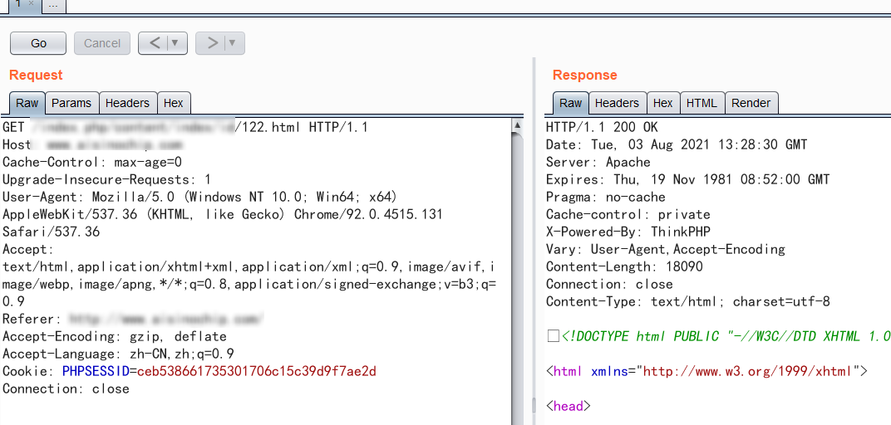
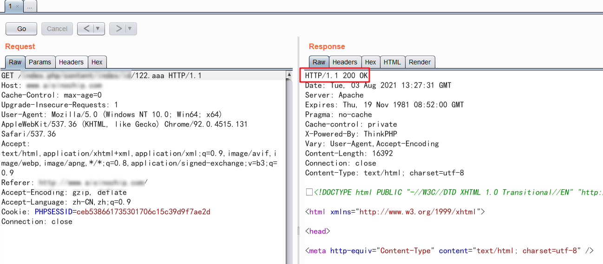
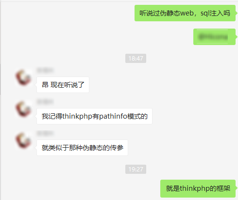

### 背景
从QAX出来之后，当上了快乐安服仔。虽然以前实习那会儿干过安服，但是手艺不精，现在重操旧业，快乐安服，冲！
今天在做SRC审核的时候，发现GET型参数中，注入的语句中存在xxx and 1=1.html，我当时心想这是混SRC吗？本想立即驳回这个漏洞的时候，我的好奇心驱使我把白帽子的报告看完，当我看到后面就发现确实人家白帽子盲注是将数据库名给注入出来了。当时我就傻了，立马复测。
### 测试详情
#### 提出问题
在测试之前，所有的页面都是以html结尾，心想这就是个静态web资源吧，但是心想白帽子把payload都写得明明白白了，这里.html这里多半有妖怪，然后我在这里将*.html的文件后缀更改为了不常见的文件后缀，顺便看看thinkphp的banner信息

我尝试了很多不存在的文件后缀，发现解析都是200，这里就有提出一个疑问了，如果他真是静态资源文件，那么为什么访问一个服务器上不存在的资源还能正常解析？
这里我问了我的hxd，确定存在了应该是存在我的hxd所说的内东西
#### 测试结果
and 1=1 恒成立

and 1=2 恒false

标准的布尔盲注
### 总结
目前只遇到了thinkphp类的伪静态页面，在这种伪静态页面中，带有的参数是会和数据库交互，并且极有可能存在sqli，所以在测试诸如此类问题的时候，可以尝试是否解析静态资源文件来判断
