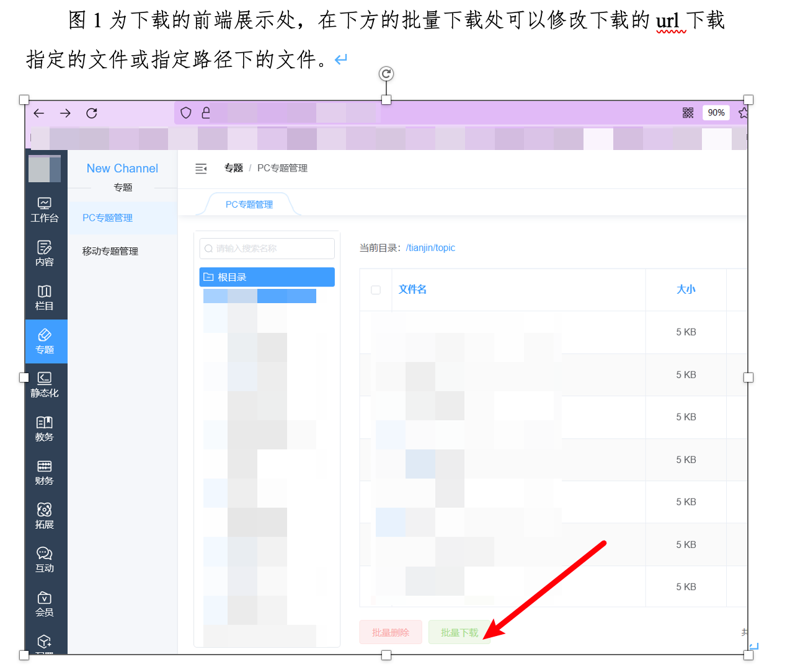

## 简介

在读取文件内容文件或文件下载处，未严格限制读取/下载文件的路径及文件后缀，导致可利用`../`，`#`等目录操作字符进行目录穿越、截断等手段，从而读取/下载服务器上任意文件，比如配置文件等。

任意文件读取是属于文件操作漏洞的一种，一般任意文件读取漏洞可以读取配置信息甚至系统重要文件。严重的话，就可能导致SSRF，进而漫游至内网。
 **漏洞产生原因**

- 存读取文件的函数
- 读取文件的路径用户可控，且未校验或校验不严
- 输出了文件内容

```php
<?php
$filename=”test.txt”;
readfile($filename);
?>
```

```php
<?php
$filename=”test.txt”;
echo file_get_contents($filename);
?>
```

**文件读取函数**
 `readfile()`、`file_get_contents()`、`fopen()`中，`$filename`没有经过校验或者校验不合格，用户可控制变量读取任意文件，如`/etc/passwd`、`./index.php`、`/config.ini`。

## 漏洞详情

**文件读取**如果系统未对读取/下载文件的文件目录做限制，攻击者利用此漏洞可直接读取web目录下任意文件，比如配置文件、数据库文件等，甚至直接获取服务器上任意文件内容。

一些网站由于业务需求，往往需要提供文件下载功能，但若对用户下载的文件不做限制，则恶意用户就能够下载任意敏感文件，这就是文件下载漏洞。
 **漏洞产生原因**

- 有读取文件的函数
- 读物文件的路径用户可控，且没有经过校验，或者校验不严格
- 输出文件内容
- 一个正常的网站，存在一个下载文件的功能，同时还会从浏览器接收文件名字

**文件下载的两种方式**

1. 直接下载

```html
<a href=”http://www.a.com/xxx.rar”>下载</a>
```

2. 增加header头

```php
<?php
    $filename = $_GET['filename'];
    echo '<h1>开始下载文件</h1><br /><br />';
    echo file_get_contents($filename);

    header('Content-Type: imgage/jpeg');
    header('Content-Disposition: attachment; filename='.$filename);
    header('Content-Lengh: '.filesize($filename));
?>
```

## 漏洞利用

- 下载常规的配置文件，例如: ssh,weblogic,ftp,mysql等相关配置
- 下载各种`.log`文件，从中寻找一些后台地址，文件上传点之类的地方，如果运气好的话会获得一些前辈们的后门。
- 下载web业务文件进行白盒审计，利用漏洞进一步攻入服务器。

尝试读取`/root/.bash_history`看自己是否具有root权限。
 如果没有，就只能利用`../`来回跳转读取一些`.ssh`下的配置信息文件。
 读取mysql下的`.bash_history`文件。来查看是否记录了一些可以利用的相关信息。然后逐个下载需要审计的代码文件，但是下载的时候变得很繁琐，只能尝试去猜解目录，然后下载一些中间件的记录日志进行分析。

**一些常见利用方式**

**Windows：**

```text
C:\boot.ini //查看系统版本
C:\Windows\System32\inetsrv\MetaBase.xml //IIS配置文件
C:\Windows\repair\sam //存储系统初次安装的密码
C:\Program Files\mysql\my.ini //Mysql配置
C:\Program Files\mysql\data\mysql\user.MYD //Mysql root
C:\Windows\php.ini //php配置信息
C:\Windows\my.ini //Mysql配置信息
```

**Linux**

```text
/root/.ssh/authorized_keys //如需登录到远程主机，需要到.ssh目录下，新建authorized_keys文件，并将id_rsa.pub内容复制进去
/root/.ssh/id_rsa //ssh私钥,ssh公钥是id_rsa.pub
/root/.ssh/id_ras.keystore //记录每个访问计算机用户的公钥
/root/.ssh/known_hosts
//ssh会把每个访问过计算机的公钥(public key)都记录在~/.ssh/known_hosts。当下次访问相同计算机时，OpenSSH会核对公钥。如果公钥不同，OpenSSH会发出警告， 避免你受到DNS Hijack之类的攻击。
/etc/passwd // 账户信息
/etc/shadow // 账户密码文件
/etc/my.cnf //mysql 配置文件
/etc/httpd/conf/httpd.conf // Apache配置文件
/root/.bash_history //用户历史命令记录文件
/root/.mysql_history //mysql历史命令记录文件
/proc/self/fd/fd[0-9]*(文件标识符)
/proc/mounts //记录系统挂载设备
/porc/config.gz //内核配置文件
/var/lib/mlocate/mlocate.db //全文件路径
/porc/self/cmdline //当前进程的cmdline参数
```

## 示例




## 修复方案

1. 服务端过滤特殊字符，如：….// ….\/ …./\ ….\\。
2. 判断用户输入的参数的格式是否合法。指定文件类型白名单（如：jpg、gif、png、rar、zip、pdf、doc、xls、ppt等），禁止用户读取、下载白名单以外的文件。
3. 指定下载路径，禁止用户读取、下载指定目录以外的文件。

## 参考链接

https://xz.aliyun.com/t/6594

