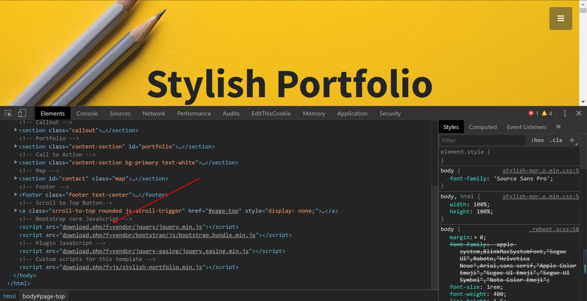

## 简介
文件包含漏洞是代码注入的一种。其原理就是注入一段用户能控制的脚本或代码，并让服务器端执行，代码注入的典型代表就是文件包含File inclusion。文件包含可能会出现在jsp、php、asp等语言中。服务器通过函数去包含任意文件时，由于要包含的这个文件来源过滤不严，而攻击者可以构造恶意文件在服务器上执行，获取服务器权限。
## 常见文件包含函数
`php`: include() 、include_once()、require()、require_once()、fopen()、readfile()
`jsp`: ava.io.file()、java.io.filereader()
`asp`: include file、include virtual
以php举例

- include：包含并运行指定文件，当包含外部文件发生错误时，系统给出警告，但整个php文件继续执行
- require：跟include唯一不同的是，当产生错误时候，include会继续运行而require停止运行
- include_once：这个函数跟include函数作用几乎相同，只是他在导入函数之前先检测下该文件是否被导入。如果已经执行一遍那么就不重复执行了
- require_once：这个函数跟require函数作用几乎相同，与include_once和include类似

php.ini配置文件：allow_url_fopen=off 即不可以包含远程文件。php4存在远程包含&本地包含，php5仅存在本地包含。
使用上面几个函数包含文件时，该文件将作为PHP代码执行，PHP内核并不在意被包含的文件是什么类型的。也就是说用这几个函数包含任何文件时，也会将其当做php文件来执行。
## 漏洞成因
程序员写程序的时候，不喜欢干同样的事情，也不喜欢把同样的代码（比如一些公用的函数）写几次（抽离公共方法，这样做叫解耦，减少代码冗余度），于是就把需要公用的代码写在一个单独的文件里面，比如 share.php，而后在其它文件需要使用时进行包含调用
示例 DVWA中文件包含漏洞
在开启allow_url_fopen=on，allow_url_include=on 的时候，即允许远程文件包含

```php
<?php
// The page we wish to display
$file = $_GET[ 'page' ];
?>
```
包含本地文件：

包含远程文件：

## 漏洞挖掘场景

1. 引用外部文件，如script
2. 引用内部模板文件
3. 引用远程模板文件
4. 等等
## 案例
### 0x1 本地文件包含（引用内部模板文件）
在此处可以看到script标签里，引用了`vendor/jquery/jquery.min.js`，在此处可以看到外部链接由本地文件`download.php`处理，通过`f`参数，引用vendor中的js文件



### 0x2 远程文件包含配合SSTi RCE
Atlassian Confluence，在6.14.2版本前存在一处未授权的目录穿越漏洞，通过该漏洞，攻击者可以读取任意文件，或利用Velocity模板注入执行任意命令


