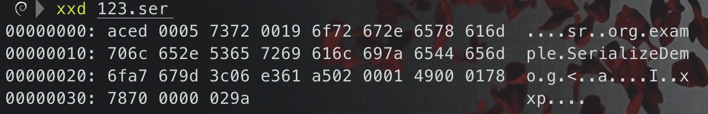
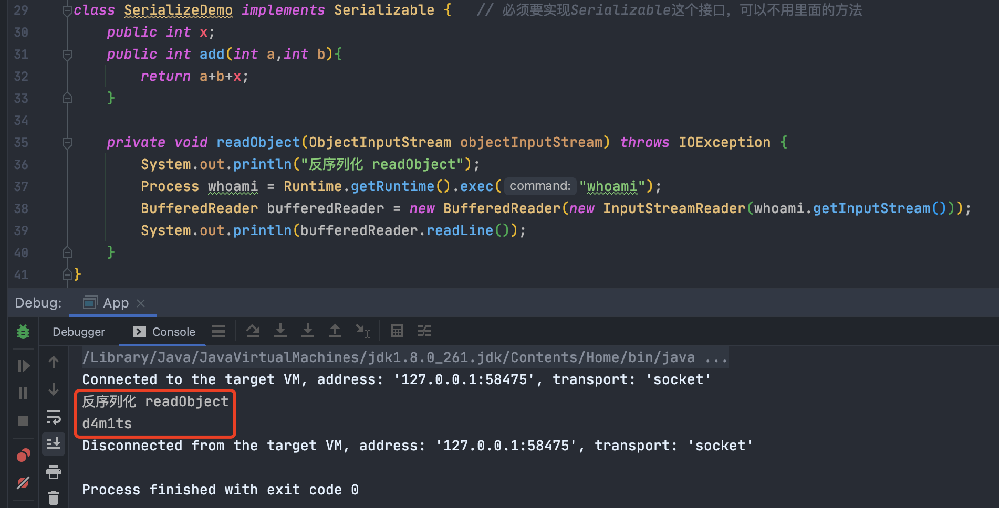
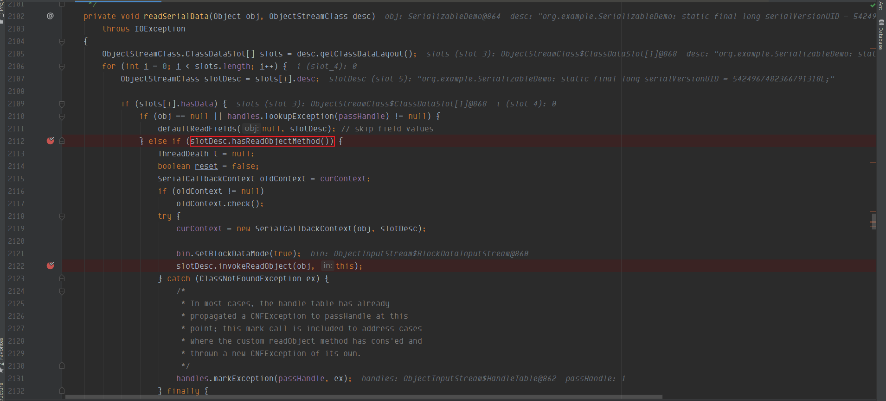
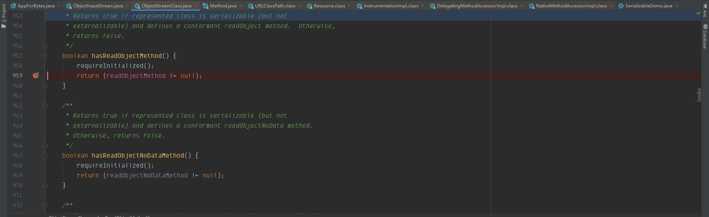
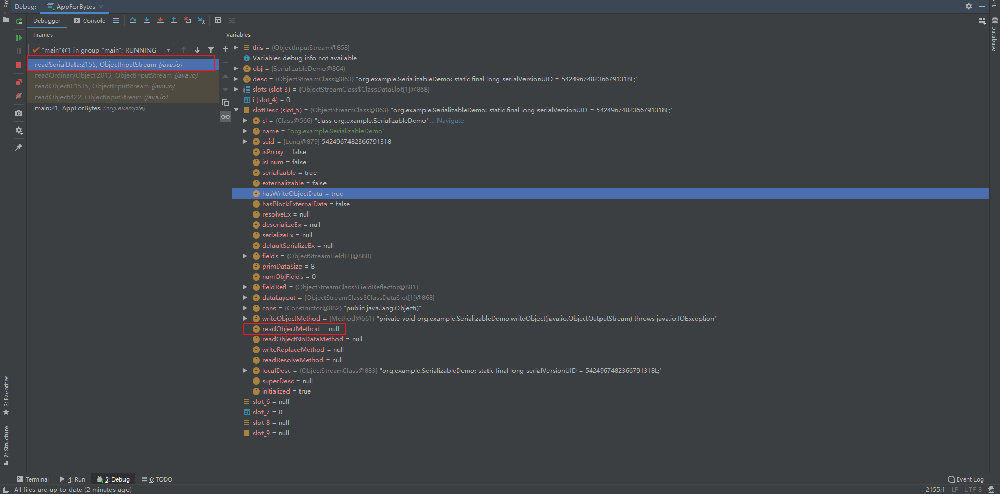

# Java 序列化和反序列化

## 介绍

> **序列化和反序列化都是在对象的基础上进行的！！！**


> **必须要 **`**implements Serializable**`** 的类才可以序列化和反序列化**


---

### 什么是序列化和反序列化

> java的序列化机制就是为了持久化存储某个对象或者在网络上传输某个对象。我们都知道，一旦jvm关闭，那么java中的对象也就销毁了，所以要想保存它，就需要把他转换为字节序列写到某个文件或是其它哪里。


1. Java 提供了一种对象序列化的机制，该机制中，**一个对象可以被表示为一个字节序列**，该字节序列包括该对象的**数据、有关对象的类型的信息和存储在对象中数据的类型**。即序列化是指把一个Java对象变成二进制内容，本质上就是一个`byte[]`数组。
2. 为什么要把Java对象序列化呢？因为序列化后可以把`byte[]`保存到文件中，或者把`byte[]`通过网络传输到远程，这样，就相当于把Java对象存储到文件或者通过网络传输出去了。
3. 将序列化对象写入文件之后，可以从文件中读取出来，并且对它进行反序列化，即把一个二进制内容（也就是`byte[]`数组）变回Java对象。有了反序列化，保存到文件中的`byte[]`数组又可以“变回”Java对象，或者从网络上读取`byte[]`并把它“变回”Java对象。也就是说，对象的类型信息、对象的数据，还有对象中的数据类型可以用来在内存中新建对象。
4. 整个过程都是 Java 虚拟机（JVM）独立的，也就是说，在一个平台上序列化的对象可以在另一个完全不同的平台上反序列化该对象。
5. Java的序列化机制仅适用于Java，如果需要与其它语言交换数据，必须使用通用的序列化方法，例如JSON。

### 序列化要求

一个Java对象要能序列化，必须实现一个特殊的`java.io.Serializable`接口，它的定义如下：

```java
public interface Serializable {
}
```

`Serializable`接口没有定义任何方法，它是一个空接口。我们把这样的空接口称为**“标记接口”（Marker Interface）**，实现了标记接口的类仅仅是给自身贴了个“标记”，并没有增加任何方法。

### 其他

类 `ObjectInputStream` 和 `ObjectOutputStream` 是高层次的数据流，它们包含反序列化和序列化对象的方法。

`ObjectOutputStream` 类包含很多写方法来写各种数据类型，但是一个特别的方法例外：

```java
public  final  void  writeObject(Object  x)  throws  IOException
```

上面的方法序列化一个对象，并将它发送到输出流。相似的 ObjectInputStream 类包含如下反序列化一个对象的方法：

```java
public  final  Object  readObject()  throws  IOException, ClassNotFoundException
```

该方法从流中取出下一个对象，并将对象反序列化。它的返回值为`Object`，因此，你需要将它转换成合适的数据类型。

## 序列化步骤

> 把对象转换为字节序列


-  **步骤一：创建一个ObjectOutputStream输出流；** 
-  **步骤二：调用ObjectOutputStream对象的writeObject输出可序列化对象。** 


## 反序列化步骤

> 把字节序列转换为对象


- **步骤一：创建一个ObjectInputStream输入流；**
- **步骤二：调用ObjectInputStream对象的readObject()得到序列化的对象。**


## 代码举例

### 序列化和反序列化 --> 文件

```java
package org.example;


import java.io.*;

public class App{
    public static void main(String[] args) throws IOException, ClassNotFoundException {
        SerializeDemo serializeDemo = new SerializeDemo();
        serializeDemo.x = 666;

        // 序列化
        // 创建一个FileOutputStream，且将这个FileOutputStream封装到ObjectOutputStream中
        ObjectOutputStream objectOutputStream = new ObjectOutputStream(new FileOutputStream("123.ser"));
        // 调用writeObject方法，序列化对象到文件123.ser中
        objectOutputStream.writeObject(serializeDemo);
        objectOutputStream.close();

        // 反序列化
        //  创建一个FIleInutputStream，并将FileInputStream封装到ObjectInputStream中
        try (ObjectInputStream objectInputStream = new ObjectInputStream(new FileInputStream("123.ser"))) {
            // 调用readObject从123.ser中反序列化出对象，还需要进行一下类型转换，默认是Object类型
            SerializeDemo ss = (SerializeDemo) objectInputStream.readObject();
            System.out.println(ss.add(1,2));
        }

    }
}


class SerializeDemo implements Serializable {   // 必须要实现Serializable这个接口，可以不用里面的方法
    public int x;
    public int add(int a,int b){
        return a+b+x;
    }
}
```

这里要注意以下要点：

1.  `readObject()` 方法中的 `try/catch`代码块尝试捕获 `ClassNotFoundException` 异常。对于 JVM 可以反序列化对象，它必须是能够找到字节码的类。如果JVM在反序列化对象的过程中找不到该类，则抛出一个 `ClassNotFoundException` 异常。 
2.  `readObject()` 方法的返回值被转化成 `SerializeDemo`引用。 

---

### 序列化和反序列化 --> bytes数组

```java
package org.example;


import java.io.*;
import java.util.Arrays;

public class App{
    public static void main(String[] args) throws IOException, ClassNotFoundException {
        SerializeDemo serializeDemo = new SerializeDemo();
        serializeDemo.x = 666;

        // 序列化
        ByteArrayOutputStream byteArrayOutputStream = new ByteArrayOutputStream();  // 本体
        ObjectOutputStream objectOutputStream = new ObjectOutputStream(byteArrayOutputStream); // 只是一个装饰器的作用 Filter模式，懂？
        objectOutputStream.writeObject(serializeDemo);
        objectOutputStream.close();
        System.out.println(Arrays.toString(byteArrayOutputStream.toByteArray()));

        // 反序列化
        ByteArrayInputStream byteArrayInputStream = new ByteArrayInputStream(byteArrayOutputStream.toByteArray());
        ObjectInputStream objectInputStream = new ObjectInputStream(byteArrayInputStream);
        SerializeDemo serializeDemo1 = (SerializeDemo)objectInputStream.readObject();
        objectInputStream.close();
        serializeDemo1.add(1,2);
    }
}


class SerializeDemo implements Serializable {   // 必须要实现Serializable这个接口，可以不用里面的方法
    public int x;
    public int add(int a,int b){
        return a+b+x;
    }
}


/*
[-84, -19, 0, 5, 115, 114, 0, 25, 111, 114, 103, 46, 101, 120, 97, 109, 112, 108, 101, 46, 83, 101, 114, 105, 97, 108, 105, 122, 101, 68, 101, 109, 111, -89, 103, -99, 60, 6, -29, 97, -91, 2, 0, 1, 73, 0, 1, 120, 120, 112, 0, 0, 2, -102]
669
*/
```

## 序列化特征

十六进制查看我们生成的`123.ser`

```bash
# hexdump没有xxd直观
xxd 123.ser
```



xxd显示的结果，中间那一栏是文件的十六进制显示，最右边是字符显示。这里需要注意的特征值就是16进制显示时的前32位：

**AC ED**：`STREAM_MAGIC`，声明使用了序列化协议，**从这里可以判断保存的内容是否为序列化数据。** （这是在黑盒挖掘反序列化漏洞很重要的一个点）

**00 05**：`STREAM_VERSION`，序列化协议版本。

## 安全性

因为Java的序列化机制可以导致一个实例能直接从`byte[]`数组创建，而不经过构造方法，因此，它存在一定的安全隐患。一个精心构造的`byte[]`数组被反序列化后可以执行特定的Java代码，从而导致严重的安全漏洞。

实际上，Java本身提供的基于对象的序列化和反序列化机制既存在安全性问题，也存在兼容性问题。更好的序列化方法是通过JSON这样的通用数据结构来实现，只输出基本类型（包括String）的内容，而不存储任何与代码相关的信息。

## 反序列化漏洞的攻击流程

1. 客户端构造payload(有效载荷)，并进行一层层的封装，完成最后的exp（exploit-利用代码）
2. exp发送到服务端，进入一个服务端自主重写（也可能是也有组件重写）的readobject函数，它会反序列化恢复我们构造的exp去形成一个恶意的数据格式exp_1（剥去第一层）
3. 这个恶意数据exp_1在接下来的处理流程(可能是在自主重写的readobject中、也可能是在外面的逻辑中)，会执行一个exp_1这个恶意数据类的一个方法，在方法中会根据exp_1的内容进行函处理，从而一层层地剥去（或者说变形、解析）我们exp_1变成exp_2、exp_3......
4. 最后在一个可执行任意命令的函数中执行最后的payload，完成远程代码执行。

---

那么以上大概可以分成三个主要部分：

1. **payload：**需要让服务端执行的语句：比如说弹计算器还是执行远程访问等；
2. **反序列化利用链：**服务端中存在的反序列化利用链，会一层层拨开我们的exp，最后执行payload。(如commons-collections利用链)
3. **重写readObject：**服务端中存在的可以与我们漏洞链相接的并且可以从外部访问的readObject函数重写点

## 漏洞挖掘

java是支持自定义`readObject`与`writeObject`方法的，只要某个类中按照特定的要求实现了`readObject`方法，那么在反序列化的时候就会自动调用它，如果这个自定义的`readObject`方法里进行了一些危险操作，那么就会导致反序列化漏洞的发生了。

举例如下：



可以看到自定义的`readObject`的确执行了，不过真实的应用中危险操作比较隐蔽。
需要注意的是，实现 `readObject/writeObject` 方法一定需要private 私有化，否则会找不到自定义的方法，从而使用ObjectOutputStream中的readObject方法








