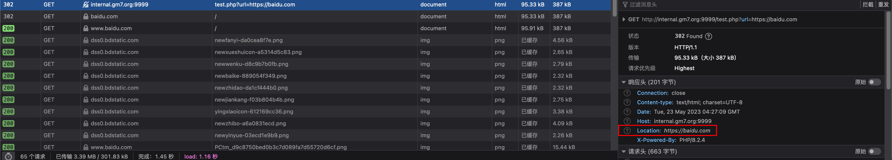
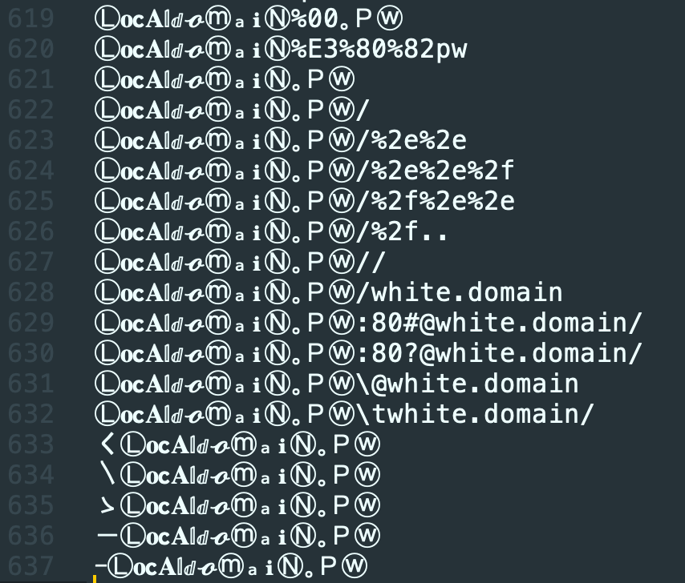

| 作者   | 版本 | 说明 | 修订时间            |
| ------ | ---- | ---- | ------------------- |
| 屈林成 | v1.0 | 投稿 | 2023-05-25 15:00:00 |

## 漏洞介绍

URL跳转漏洞（URL Redirection Vulnerability）又叫开放重定向漏洞（Open Redirect Vulnerability），是一种常见的网络安全漏洞，它存在于许多网站和应用程序中。该漏洞的根本原因是没有对用户提供的URL进行充分的验证和过滤，导致攻击者可以通过构造恶意URL，将用户重定向到任意的网站或应用程序中。

## 漏洞危害

> 以攻击用户客户端为主，对服务器本身不造成影响。

1. **钓鱼攻击：** 攻击者可以将用户重定向到伪装成合法网站的钓鱼网站，以获取用户的敏感信息，如用户名、密码、银行账户等。
2. **恶意软件传播：** 攻击者可以将用户重定向到恶意网站，从而下载和安装恶意软件，对用户设备进行感染。
3. **网络针对性攻击：** 攻击者可以将用户重定向到特定的恶意网站，利用浏览器或插件漏洞来攻击用户的系统。
4. **品牌声誉受损：** 恶意重定向可能会导致受攻击网站的品牌声誉受损，用户会失去对该网站的信任。

## 漏洞复现

### 场景搭建

将如下代码保存为`test.php`

```php
<?php
$url=$_GET['url'];
header("Location: $url");
?>
```

依然使用php快速启动

```shell
php -S 0.0.0.0:9999
```

访问`http://internal.gm7.org:9999/test.php`即可

### 复现过程

访问 `http://internal.gm7.org:9999/test.php?url=https://baidu.com`，将会跳转到`baidu.com`



其中`baidu.com`可以写成任意网站，用户也会根据参数url设置的值跳转到任意网站中。

## 绕过字典

上面的复现只是最基础的情况，但是大多数网站都或多或少做过一些加固，这里我直接贴出来我常用的绕过字典（[点击下载](README.assets/open-redirects.txt)），一共637条。

大家在使用的时候，只需要将`white.domain`替换为目标允许的白名单域名即可。




## 漏洞实战

某网站存在“阅读原文”功能，如下图


点击后会跳转到对应的网站中，根据经验，可发现`goto`后面为一串网址的base64编码，因此我们只需要构造：

```
https://xxx.com/goto/<base64(网址)>
```

就可以跳转到任意网站中，如：

```
https://xxx.com/goto/aHR0cHM6Ly9ibG9nLmdtNy5vcmcv
```

测试后成功跳转：


## 修复建议

1. **输入验证：** 在接受用户输入并用于构建URL跳转功能之前，始终进行输入验证。确保只接受合法的URL，并防止恶意代码的注入。
2. **白名单验证：** 对于跳转的URL，建议使用白名单验证，只允许跳转到事先定义的合法域名或URL。
3. **安全编码实践：** 开发人员应遵循安全编码实践，包括对用户输入进行适当的转义和过滤，以防止恶意URL的构造。
4. **警告和提示：** 在重定向之前，向用户显示明确的警告和提示信息，确保用户能够确认将要访问的目标网站的合法性。