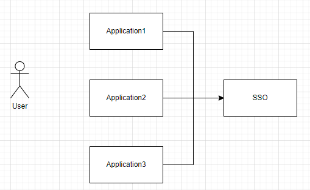
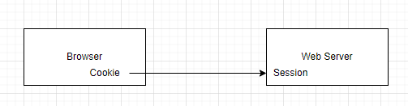
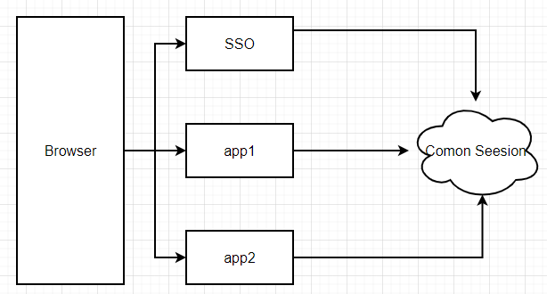
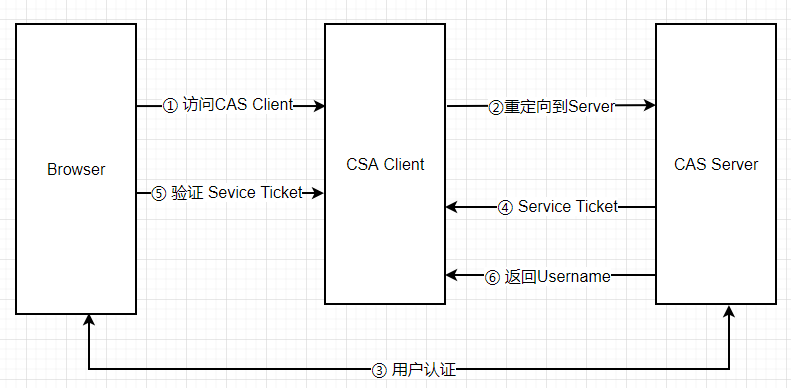
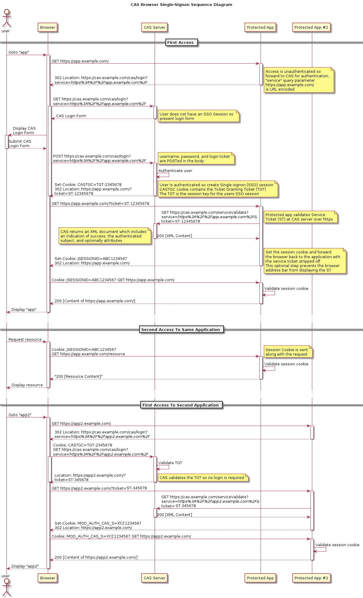

## 简介
在企业发展初期，企业使用的系统很少，通常一个或者两个，每个系统都有自己的登录模块，运营人员每天用自己的账号登录，很方便。
但随着企业的发展，用到的系统随之增多，运营人员在操作不同的系统时，需要多次登录，而且每个系统的账号都不一样，这对于运营人员
来说，很不方便。于是，就想到是不是可以在一个系统登录，其他系统就不用登录了呢？这就是单点登录要解决的问题。

单点登录英文全称Single Sign On，简称就是SSO。它的解释是：**在多个应用系统中，只需要登录一次，就可以访问其他相互信任的应用系统。**


如上图所示，图中有4个系统，分别是Application1、Application2、Application3、和SSO。Application1、Application2、Application3没有登录模块，而SSO只有登录模块，没有其他的业务模块，当Application1、Application2、Application3需要登录时，将跳到SSO系统，SSO系统完成登录，其他的应用系统也就随之登录了。这完全符合我们对单点登录（SSO）的定义。
## 技术实现
### 普通认证机制
当用户在浏览器（Browser）中访问一个应用，这个应用需要登录，再填写完用户名和密码之后，完成登录认证。这时这个用户的Session中，登录状态为yes（已登录），同时服务端会发送Cookie到客户端，浏览器(Browser)就会写下（保存）一份Cookie，这个Cookie就是用户的唯一标识。下次用户再访问这个应用的时候，请求中就会携带Cookie，服务端会根据这个Cookie找到对应的Session，通过Session来判断这个用户是否登录。

### 同域下的单点登录
一个企业一般情况下只有一个域名，通过二级域名区分不同的系统。比如我们有个域名叫做：a.com，同时有两个业务系统分别为：app1.a.com和app2.a.com。我们要做单点登录（SSO），需要一个登录系统，叫做：sso.a.com
我们只要再sso.a.com登录，app1.a.com和app2.a.com也就登录了。通过上面的登录认证机制，我们可以知道，在sso.a.com中登录之后，其实是在sso.a.com的服务端的Session中记录了登录状态，同时在浏览器端的sso.a.com下写入了Cookie，那么我们怎么才能让app1.a.com和app2.a.com登录呢？这里存在两个问题

1. Cookie 是不能跨域的，Cookie的domain属性是sso.a.com，在给app1.a.com 和 app2.a.com发送请求是带不上的
2. sso、app1、app2 是不同应用，它们的session存在自己的应用内，是不共享的

那么这俩问题应该如何解决呢？
**针对第一个问题：**
SSO登录之后，可以将Cookie的域设置为一级域，即`a.com`，这样所有的子域系统都可以访问到顶域的Cookie。**在我们设置Cookie的时候，只能设置顶域和自己的域，不能设置其他的域。比如：我们不能在自己的系统中给**`**baidu.com**`**的域设置Cookie**。
**针对第二个问题：**
当在SSO系统登录了，这时再访问app1，Cookie也带到了app1的服务端（Server），app1的服务端怎么找到这个Cookie对应的Session呢？这里就要把3个系统的Session共享，如下图所示。共享Session的解决方案有很多，例如：Spring-Session。这样第2个问题也解决了

## 不同域下的单点登录
同域下的单点登录是巧用了Cookie顶域的特性。如果是不同域呢？不同域之间Cookie是不共享的，怎么办？
这里我们就要说一说CAS流程了，这个流程是单点登录的标准流程。
### CAS基本协议过程

#### 名词解释
**Ticket Grangting Ticket(TGT) ：**
TGT是CAS为用户签发的登录票据，拥有了TGT，用户就可以证明自己在CAS成功登录过。TGT封装了Cookie值以及此Cookie值对应的用户信息。用户在CAS认证成功后，CAS生成cookie（叫TGC），写入浏览器，同时生成一个TGT对象，放入自己的缓存，TGT对象的ID就是cookie的值。当HTTP再次请求到来时，如果传过来的有CAS生成的cookie，则CAS以此cookie值为key查询缓存中有无TGT，如果有的话，则说明用户之前登录过，如果没有，则用户需要重新登录。
**Ticket-granting cookie(TGC)：**
存放用户身份认证凭证的cookie，在浏览器和CAS Server间通讯时使用，并且只能基于安全通道传输（Https），是CAS Server用来明确用户身份的凭证。
**Service ticket(ST) ：**
服务票据，服务的惟一标识码 , 由 CASServer 发出（ Http 传送），用户访问Service时，service发现用户没有ST，则要求用户去CAS获取ST.用户向CAS发出获取ST的请求，CAS发现用户有TGT，则签发一个ST，返回给用户。用户拿着ST去访问service，service拿ST去CAS验证，验证通过后，允许用户访问资源
**CAS Server：**
CASServer 负责完成对用户的认证工作 , 需要独立部署 , CAS Server 会处理用户名 /密码等凭证 (Credentials) 。
**CAS Client：**
负责处理对客户端受保护资源的访问请求，需要对请求方进行身份认证时，重定向到 CAS Server 进行认证。（原则上，客户端应用不再接受任何的用户名密码等 Credentials ）。
CAS Client 与受保护的客户端应用部署在一起，以 Filter 方式保护受保护的资源。
### 
CAS 登录流程
#### 步骤一
浏览器向CAS客户端发起登陆请求，CAS客户端生成“登陆URL”,并把浏览器重定向到该URL。 登陆URL:`https://${cas-server-host}:${cas-server-port}/cas-server/login?service=${client-service-url}`
其中

- cas-server-host: cas认证服务器的域名
- cas-server-port: cas认证服务器的port
- client-service-url: 用于登陆成功后，浏览器重定向的URL
#### 步骤二
浏览器向“登陆URL”发起重定向请求，CAS服务端创建会话，把TGT（Ticket Granting Ticket）放入cookie，并返回登陆页面
#### 步骤三
用户输入用户名和密码,然后提交登陆表单. CAS服务端通过登陆验证后，会生成一个ST(service ticket,简称ticket), 然后把浏览器重定向到`${client-service-url}?ticket=${service-ticket}`
#### 步骤四
浏览器重定向到${client-service-url}?ticket=${service-ticket}发起重定向请求
#### 步骤五
CAS客户端取出ticket，生成“ticket验证URL”,然后向"ticket验证URL"发起http GET请求 "ticket验证URL": `http://${cas-server-host}:${cas-server-port}/cas-server/serviceValidate?ticket=${service-ticket}&service=${client-service-url}`
#### 步骤六
如果CAS服务器通过ticket的有效性检查，那么会返回类似如下格式的XML片段
```xml
<cas:serviceResponse xmlns:cas='http://www.yale.edu/tp/cas'>
    <cas:authenticationSuccess> 
        <cas:user>AAAA</cas:user>
    </cas:authenticationSuccess> 
</cas:serviceResponse>
```
其中AAAA是登陆的用户名
否则返回：
```xml
<cas:serviceResponse xmlns:cas='http://www.yale.edu/tp/cas'> 
    <cas:authenticationFailure code='XXX'> YYY </cas:authenticationFailure> 
</cas:serviceResponse>
```
其中：

- XXX的可能取值是INVALID_REQUEST, INVALID_TICKET, INVALID_SERVICE, INTERNAL_ERROR
- YYY是错误描述信息

至此CAS的登陆流程结束
登陆成功后，CAS客户端应该在会话中保存登陆状态信息。CAS服务器通常在步骤 6会建立ticket和${client-service-url}的映射关系，以便在登出时通知其业务系统清除缓存中的状态信息
#### 简易步骤

1. 用户访问app系统，app系统是需要登录的，但用户现在没有登录。
2. 跳转到CAS server，即SSO登录系统，**以后CAS Server我们统一叫做SSO系统。** SSO系统也没有登录，弹出用户登录页。
3. 用户填写用户名、密码，SSO系统进行认证后，将登录状态写入SSO的session，浏览器（Browser）中写入SSO域下的Cookie。
4. SSO系统登录完成后会生成一个ST（Service Ticket），然后跳转到app系统，同时将ST作为参数传递给app系统。
5. app系统拿到ST后，从后台向SSO发送请求，验证ST是否有效。
6. 验证通过后，app系统将登录状态写入session并设置app域下的Cookie。

至此，跨域单点登录就完成了。以后我们再访问app系统时，app就是登录的。接下来，我们再看看访问app2系统时的流程

1. 用户访问app2系统，app2系统没有登录，跳转到SSO。
2. 由于SSO已经登录了，不需要重新登录认证。
3. SSO生成ST，浏览器跳转到app2系统，并将ST作为参数传递给app2。
4. app2拿到ST，后台访问SSO，验证ST是否有效。
5. 验证成功后，app2将登录状态写入session，并在app2域下写入Cookie。

**SSO系统登录后，跳回原业务系统时，带了个参数ST，业务系统为什么还要拿ST再次访问SSO进行验证？登录认证通过后，为什么不能通过回调地址将用户信息返回给原业务系统，原业务系统直接设置登录状态**
**如果SSO没有登录，而是直接在浏览器中敲入回调的地址，并带上伪造的用户信息，业务系统会认为登录了，这里就存在票据伪造，所以业务系统还需要拿着ST再次访问SSO进行验证。**
## 总结

1. 单点登录（SSO系统）是保障各业务系统的用户资源的安全 。
2. 各个业务系统获得的信息是，这个用户能不能访问我的资源。
3. 单点登录，资源都在各个业务系统这边，不在SSO那一方。 用户在给SSO服务器提供了用户名密码后，作为业务系统并不知道这件事。 SSO随便给业务系统一个ST，那么业务系统是不能确定这个ST是用户伪造的，还是真的有效，所以要拿着这个ST去SSO服务器再问一下，这个用户给我的ST是否有效，是有效的我才能让这个用户访问
## 参考链接
[https://developer.aliyun.com/article/636281](https://developer.aliyun.com/article/636281)

[https://www.jianshu.com/p/8daeb20abb84](https://www.jianshu.com/p/8daeb20abb84)

