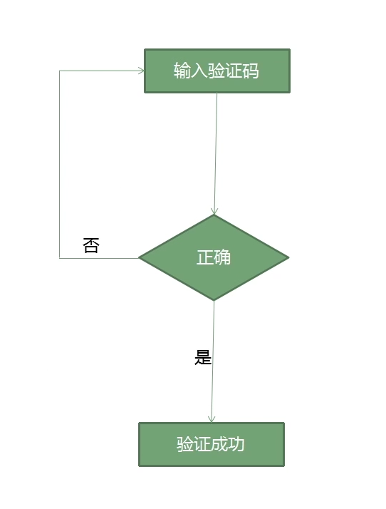
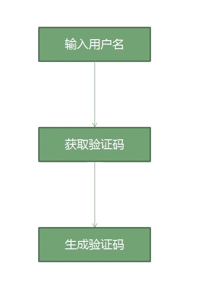
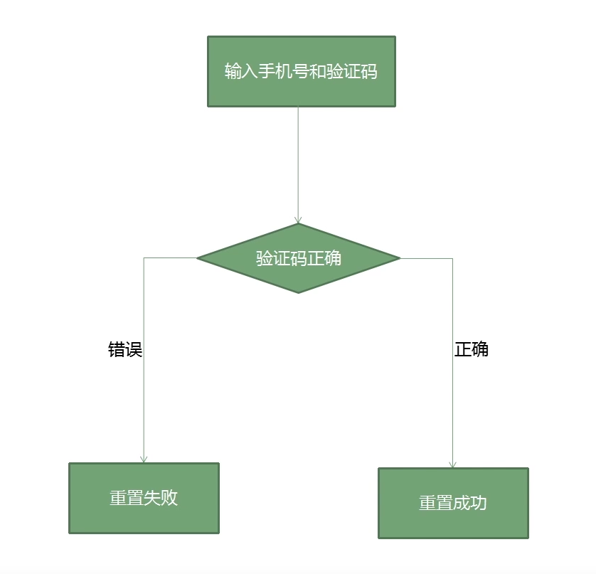
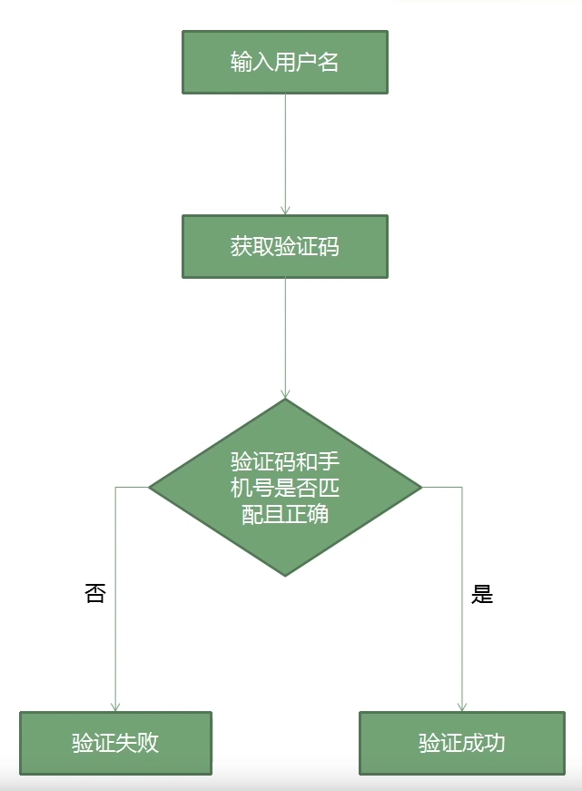
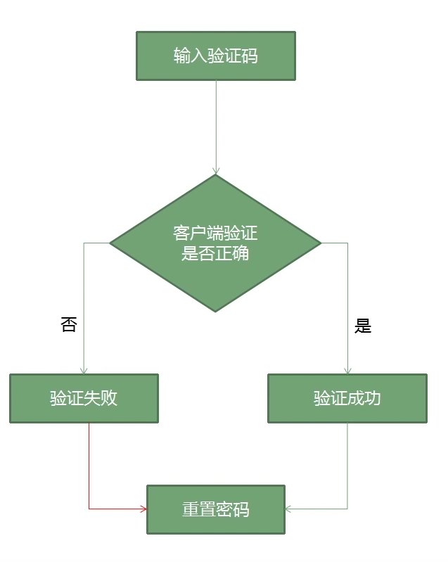
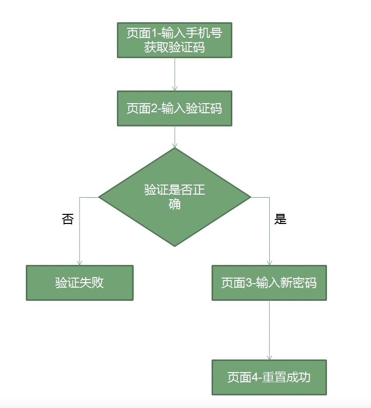
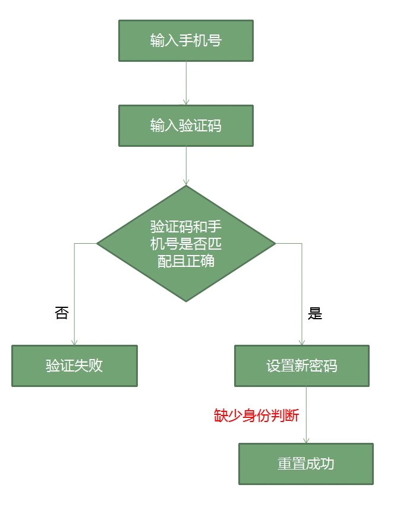
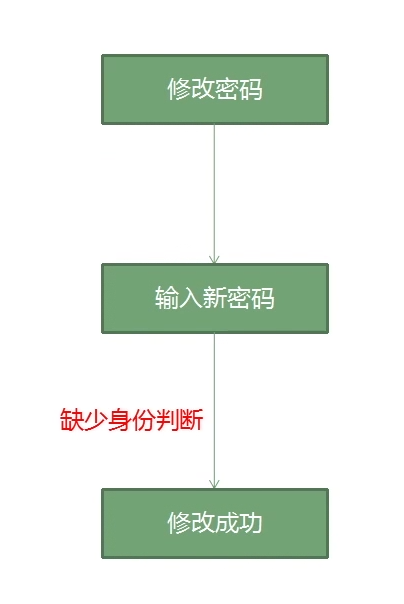
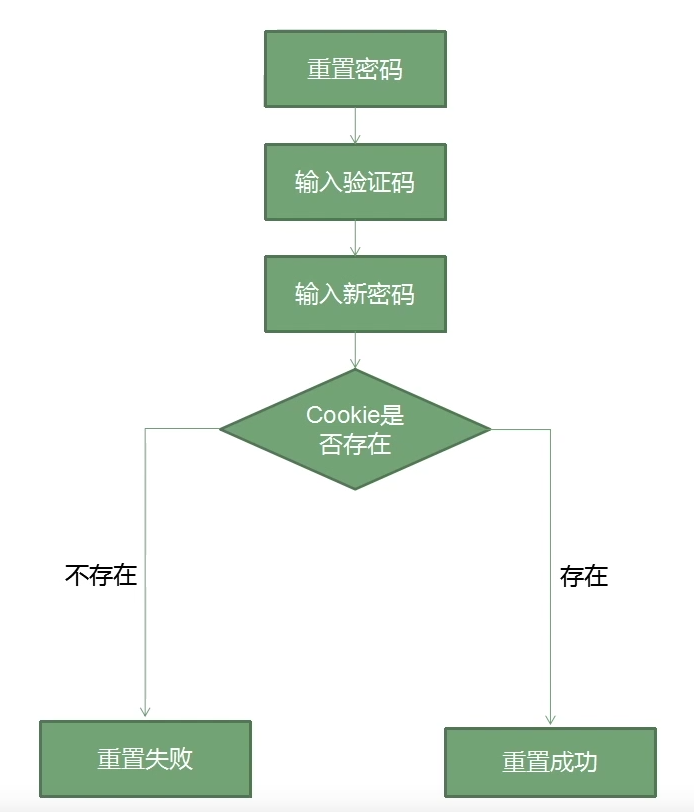
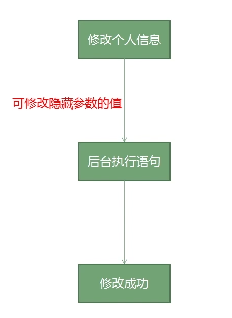

# 任意用户密码重置的10种姿势
## 验证码不失效

### 造成原因
找回密码的时候获取的验证码缺少时间限制，仅判断了验证码的值是否正确，未判断验证码是否过期
### 测试方法
通过枚举找到真正的验证码完成验证
## 验证码直接返回

### 造成原因
直接输入目标手机号，点击获取验证码，并观察返回包即可
### 测试方法
输入手机号后点击获取验证码，验证码在客户端生成，并直接返回在Response以方便对接下来的验证码进行比对
## 验证码未绑定用户
### 造成原因
输入手机号和验证码进行重置密码的时候，仅对验证码是否正确进行了判断，未对该验证码是否与手机号匹配做验证

### 测试方法
在提交手机号和验证码的时候，替换手机号为他人手机号进行测试，成功通过验证并重置他人密码
## 修改接收的手机或邮箱

### 造成原因
用户名、手机号、验证码三者没有统一进行验证，仅判断了三者中的手机号和验证是否匹配和正确，如果正确则判断成功并进入下一流程。
### 测试方法
输入用户名获取验证码，修改接收验证码的手机号为自己的号码，自己手机成功接收验证码，提交到网站进行验证，验证成功并进入下一流程。
## 本地验证绕过

### 造成原因
客户端在本地进行验证码是否正确的判断，而该判断结果也可以在本地修改，最终导致欺骗客户端，误以为我们已经输入了正确的验证码。
### 测试方法
重置目标用户，输入错误验证码，修改返回包，把错误改为正确，即可绕过验证步骤，最终重置用户密码。
## 跳过验证步骤

### 造成原因
对修改密码的步骤，没有做校验，导致可以直接输入最终修改密码的网址，直接跳转到该页面，然后输入新密码达到重置密码的目的。
### 测试方法
首先使用自己的账号走一次流程，获取每个步骤的页面链接，然后记录页面3对应的输入新密码的链接，重置他人用户时，获取验证码后，直接输入页面3链接到新密码的界面，输入密码重置成功。
## 未效验用户字段的值

### 造成原因
在整个重置密码的流程中，只对验证码和手机号做了校验，未对后面设置新密码的用户身份做判断，导致在最后一步通过修改用户身份来重置他人的密码。
### 测试方法
使用自己的手机号走流程，在走到最后一个设置密码的流程时，修改数据包里的用户信息。
## 修改密码处ID可替换

### 造成原因
修改密码的时候，没有对原密码进行判断，且根据id的值来修改用户的密码，类似的SQL语句：
```
update user set  password="qwer1234" where id = ‘1’
```
修改数据包里的id的值，即可修改他人密码。
### 测试方法
修改自己用户密码，抓取数据包，替换数据包中用户对应的id值，即可修改他人的密码。
### Cookie值的替换

### 造成原因
重置密码走到最后一步的时候仅判断唯一的用户标识cookie是否存在，并没有判断该cookie有没有通过之前重置密码过程的验证，导致可替换cookie重置他人用户密码。(cookie可指定用户获取。)
### 测试方法
重置自己用户密码到达最后阶段，抓到数据包，并在第一阶段重新获取目标用户cookie，替换cookie到我们抓取的数据包中，发包测试。
## 修改信息时替换字段

### 造成原因
在执行修改信息的sql语句的时候，用户的密码也当作字段执行了，而且是根据隐藏参数loginid来执行的，这样就导致修改隐藏参数loginid的值，就可以修改他人的用户密码。
### 测试方法
修改个人资料的时候，抓取数据包，然后来修改数据包的参数和对应的值，参数名一般可以在其他地方找到，替换隐藏参数即可修改他人的密码等信息。
## 视频地址
[http://loudong.360.cn/School/content/id/214](http://loudong.360.cn/School/content/id/214)

## 大佬总结链接
[http://www.sqlsec.com/2017/10/resetpass.html](c6b23a5c60eeb1c75a04156721953ba1)

