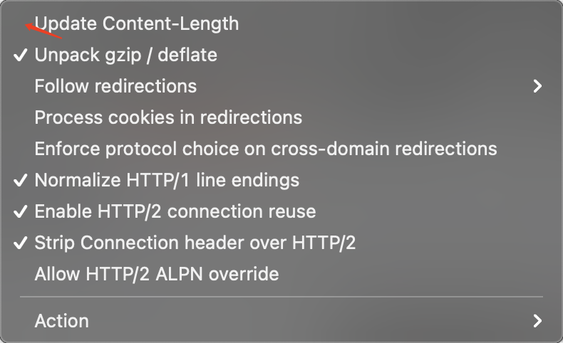
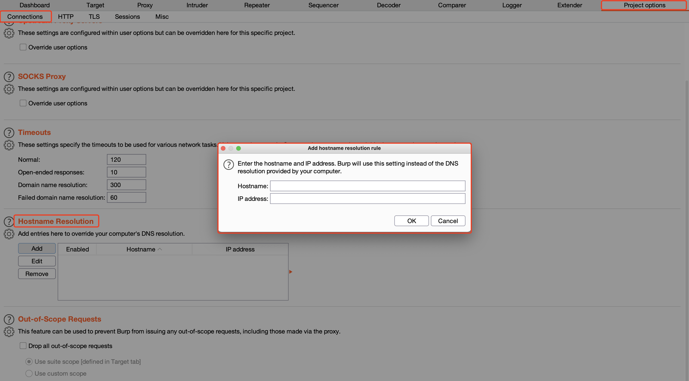

## 概述
通用的方法，不仅限于SQL注入，就是万金油，无非就是大小写、双写、编码、注释、垃圾字符、分块传输、HPP、WAF特性等
**核心：**所有能改的地方，都捣鼓捣鼓改改，增加就加，能删就删，多拿点其他内容来混淆视听。
## 大小写
```sql
unIoN Select
```
## 双写
一些后端可能会直接给关键词过滤为空，那么就可以利用双写来绕过
```sql
ununionion ==> 去掉union ==> union
```
## 编码

1. URL编码
2. Unicode编码
3. 十六进制编码
4. 其他后端会解析的编码
## 注释
如mysql中的内联注释，可以用来代替空格
注释也可以和换行搭配使用，注释掉后面的内容，再通过换行逃逸到注释之外
```sql
test.php?id=1 /*!order*//**/%23A%0A/**/%23A%0A/*!by*//**/2
```
## 垃圾字符
一些WAF设置了过滤的数据包长度，如果数据包太大太长，为了考虑性能就会直接略过这个数据包
```http
GET /foo?sqli=111...80万个1...111'+and+2*3=6+--+ HTTP/1.1
User-Agent: Mozilla/5.0
Host: Host
Accept: */*
```
## 分块传输
burp插件：[https://github.com/c0ny1/chunked-coding-converter.git](https://github.com/c0ny1/chunked-coding-converter.git)
在头部加入 `Transfer-Encoding: chunked` 之后，就代表这个报文采用了分块编码。这时，post请求报文中的数据部分需要改为用一系列分块来传输。每个分块包含十六进制的长度值和数据，长度值独占一行，长度不包括它结尾的，也不包括分块数据结尾的，且最后需要用0独占一行表示结束。
## HTTP协议绕过
### HTTP 0.9
HTTP 0.9协议只有GET方法，且没有HEADER信息等，WAF就可能认不出这种的请求包，于是达到绕过WAF的效果
### 参数污染（HPP）
简单来说，存在多个同名参数的情况下，可能存在逻辑层和WAF层对参数的取值不同，即可能逻辑层使用的第一个参数，而WAF层使用的第二个参数，我们只需要第二个参数正常，在第一个参数插入payload，这样组合起来就可以绕过WAF，如下数据包：
```http
GET /foo?par=first&par=last HTTP/1.1
User-Agent: Mozilla/5.0
Host: Host
Accept: */*
```
**部分中间件的处理方法：**

| Web环境 | 参数获取函数 | 获取到的参数 |
| --- | --- | --- |
| PHP/Apache | $_GET("par") | last |
| JSP/Tomcat | Request.getParameter("par") | first |
| Perl(CGI)/Apache | Param("par") | first |
| Python/Apache | getvalue("par") | ["first","last"] |
| ASP.NET/IIS | Request.QueryString("par") | first,last |

### Pipeline（keep-alive）
http请求头部中有`Connection`这个字段，建立的tcp连接会根据此字段的值来判断是否断开，当发送的内容太大，超过一个http包容量，需要分多次发送时，值会变成`keep-alive`，即本次发起的http请求所建立的tcp连接不断开，直到所发送内容结束`Connection`为`close`为止
我们可以手动将此值置为keep-alive，然后在http请求报文中构造多个请求，将恶意代码隐藏在第n个请求中，从而绕过waf
> 记得把brupsuite自动更新`Content-Length`的勾去掉


大概数据包就是这样
```http
POST / HTTP/1.1
Host: www.baidu.com
User-Agent: Mozilla/5.0 (Windows NT 10.0) AppleWebKit/537.36 (KHTML, like Gecko) Chrome/99.0.7113.93 Safari/537.36
Accept: text/html,application/xhtml+xml,application/xml;q=0.9,image/avif,image/webp,*/*;q=0.8
Accept-Language: zh-CN,zh;q=0.8,zh-TW;q=0.7,zh-HK;q=0.5,en-US;q=0.3,en;q=0.2
Accept-Encoding: gzip, deflate
Upgrade-Insecure-Requests: 1
Connection: Keep-Alive
Content-Type: application/x-www-form-urlencoded
Content-Length: 3
a=1GET / HTTP/1.1
Host: www.baidu.com
User-Agent: Mozilla/5.0 (Windows NT 10.0) AppleWebKit/537.36 (KHTML, like Gecko) Chrome/99.0.7113.93 Safari/537.36
Accept: text/html,application/xhtml+xml,application/xml;q=0.9,image/avif,image/webp,*/*;q=0.8
Accept-Language: zh-CN,zh;q=0.8,zh-TW;q=0.7,zh-HK;q=0.5,en-US;q=0.3,en;q=0.2
Accept-Encoding: gzip, deflate
Upgrade-Insecure-Requests: 1
Connection: close
```
### HTTP charset
利用`Content-Type: xxx;charset=xxx`编码绕过，payload转义后，由于大部分的WAF默认用UTF8编码检测，所以能用此方法来达到绕过关键词过滤的效果
```
application/x-www-form-urlencoded; charset=ibm037
multipart/form-data; charset=ibm037, boundary=blah
multipart/form-data; boundary=blah ; charset=ibm037
```
## WAF特性
### 云WAF绕过
找到真实IP，修改本地hosts文件或者直接在burp中指定解析，避免流量走到云WAF上即可。

### 白名单绕过
一些WAF为了保证核心功能如登陆功能正常，会在内部设立一个文件白名单，或内容白名单，只要和这些文件或内容有关，无论怎么测试，都不会进行拦截。
如：WAF设立了白名单`/admin`，那么我们的测试payload可以通过如下的手法来绕过
```sql
# 原来被拦截
http://a.a/?id=123 and 2*3=6
# 现在不拦截
http://a.a/?a=/admin&id=123 and 2*3=6
```
### 静态文件绕过
一些WAF为了减少服务器的压力，会对静态文件如`.png`、`.css`等直接放行，那么我们可以尝试伪装成静态文件来绕过
如：
```sql
# 原来被拦截
http://a.a/?id=123 and 2*3=6
# 现在不拦截
http://a.a/?1.jpg&id=123 and 2*3=6
```
### Content-Type绕过
一些WAF识别到特定的content-type后，则会判定为该请求的类型，如：
发现`Content-Type`为`multipart/form-data`时，会认为这属于文件上传的请求，从而只检测文件上传漏洞，导致不拦截其他类型的payload
### 请求方式绕过

1. 一些WAF对于`get`请求和`post`请求的处理机制不一样，可能对POST请求稍加松懈，因此给`GET`请求变成`POST`请求有可能绕过拦截。
2. 一些WAF检测到`POST`请求后，就不会对`GET`携带的参数进行过滤检测，因此导致被绕过。


### 解析兼容性
一些WAF检测时，完全按照标准的HTTP协议去匹配，但WEB容器会做一些兼容性适配，如上传时
```
filename="shell.php"
```
我们只需要稍加修改，那么按照标准协议去解析就找不到文件名，从而绕过拦截
```
filename="shell.php
filename='shell.php'
filename=shell.php
```
## 容器特性
> [!tip]
> 可通过所有fuzz一遍，看看容器是如何处理的

**IIS+ASP：**

1. `%`会被自动去掉
2. unicode会自动解码


```
<script> == <%s%cr%u0131pt>
```
**tomcat:**
路径穿越
```
/path1/path2/ == ;/path1;foo/path2;bar/;
```
## 参考

- [waf绕过拍了拍你](https://www.anquanke.com/post/id/212272)

