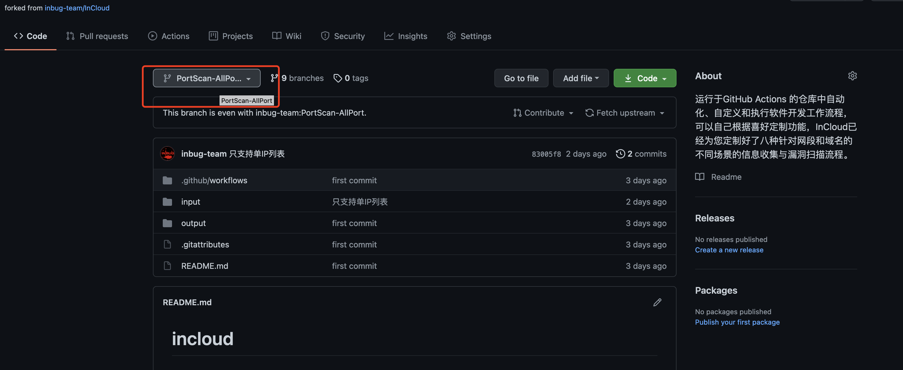
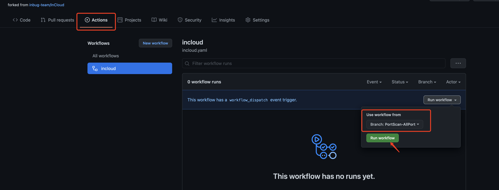
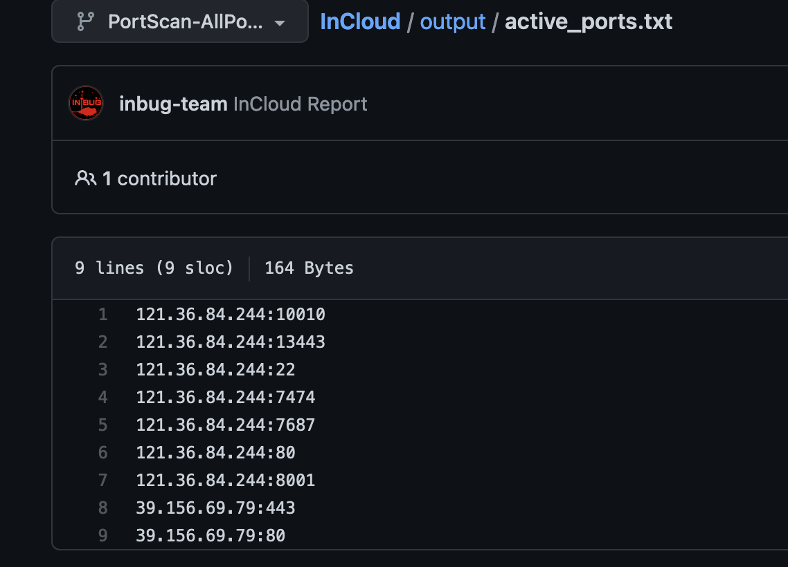
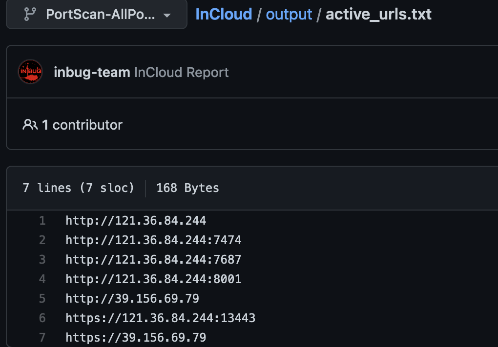

## 前言
**GitHub提供六小时的容器使用时长**。
可以利用其进行对外的端口扫描、目录扫描等操作。
## 过程举例
> [https://github.com/inbug-team/InCloud](https://github.com/inbug-team/InCloud)

运行于GitHub Actions 的仓库中自动化、自定义和执行软件开发工作流程，可以自己根据喜好定制功能，InCloud已经为您定制好了八种针对网段和域名的不同场景的信息收集与漏洞扫描流程。

- [PortScan-AllPort](https://github.com/inbug-team/InCloud/tree/PortScan-AllPort) 对单IP文件列表进行全端口扫描，输出可用Web服务标题。
- [PortScan-AllPort-Xray-Dirscan](https://github.com/inbug-team/InCloud/tree/PortScan-AllPort-Xray-dirscan)   对单IP文件列表进行全端口扫描，输出可用Web服务标题，对Web服务进行Xray爬虫爬取与漏洞扫描，对Web服务进行Ffuf目录递归扫描。。
- [PortScan-Top1000](https://github.com/inbug-team/InCloud/tree/PortScan-Top1000) 对单C段IP列表进行Top1000端口扫描，输出可用Web服务标题。
- [PortScan-Top1000-Xray](https://github.com/inbug-team/InCloud/tree/PortScan-Top1000-Xray) 对单C段IP列表进行Top1000端口扫描，输出可用Web服务标题，对Web服务进行Xray爬虫爬取与漏洞扫描。
- [PortScan-Top1000-Dirscan](https://github.com/inbug-team/InCloud/tree/PortScan-Top1000-Dirscan) 对单C段IP列表进行Top1000端口扫描，输出可用Web服务标题，，对Web服务进行Ffuf目录递归扫描。
- [SubDomain-Portscan-Vulnscan](https://github.com/inbug-team/InCloud/tree/SubDomain-Portscan-Vulnscan) 对域名进行子域名枚举与接口查询，对查询的子域名进行Top1000端口扫描，输出可用Web服务标题，对Web服务进行Nuclei漏洞扫描。
- [SubDomain-Portscan-Xray](https://github.com/inbug-team/InCloud/tree/SubDomain-Portscan-Xray) 对域名进行子域名枚举与接口查询，对查询的子域名进行Top1000端口扫描，输出可用Web服务标题，对Web服务进行Xray爬虫爬取与漏洞扫描。
- [SubDomain-Portscan-Dirscan](https://github.com/inbug-team/InCloud/tree/SubDomain-Portscan-Dirscan) 对域名进行子域名枚举与接口查询，对查询的子域名进行Top1000端口扫描，输出可用Web服务标题，，对Web服务进行Ffuf目录递归扫描。

---

这里以[端口扫描](https://github.com/inbug-team/InCloud/tree/PortScan-AllPort)为例
1、将项目fork到自己的github，选择端口扫描的分支。



2、修改流程文件（.github/workflows/incloud.yaml）里的 git config --local  user.email  与   git config --global user.name  改成自己的邮箱与自己的ID（用于报告输出，可忽略）。
3、修改input目录的扫描目标


4、使用action标签进行在线编译。



5、查看运行的任务


6、点击`build`可查看对应的运行过程


7、GitHub提供六小时的容器使用时长，扫描结束后，扫描结果会自动上传到自己fork的output文件夹下。






8、需要更新最新版本，请删除fork的项目再重新fork此项目。

## 分析
> [GitHub Actions 入门教程](e996ab2273f4b08f75bc9aa421abfae2)
> [GitHub官方文档](https://docs.github.com/cn/actions)
> [GitHub官方市场](https://github.com/marketplace?type=actions)

### GitHub Actions 是什么？
大家知道，持续集成由很多操作组成，比如抓取代码、运行测试、登录远程服务器，发布到第三方服务等等。GitHub 把这些操作就称为 actions。
很多操作在不同项目里面是类似的，完全可以共享。GitHub 注意到了这一点，想出了一个很妙的点子，允许开发者把每个操作写成独立的脚本文件，存放到代码仓库，使得其他开发者可以引用。
如果你需要某个 action，不必自己写复杂的脚本，直接引用他人写好的 action 即可，整个持续集成过程，就变成了一个 actions 的组合。这就是 GitHub Actions 最特别的地方。
GitHub 做了一个[官方市场](https://github.com/marketplace?type=actions)，可以搜索到他人提交的 actions。另外，还有一个 [awesome actions](https://github.com/sdras/awesome-actions) 的仓库，也可以找到不少 action。


上面说了，每个 action 就是一个独立脚本，因此可以做成代码仓库，使用`userName/repoName`的语法引用 action。比如，`actions/setup-node`就表示`github.com/actions/setup-node`这个[仓库](https://github.com/actions/setup-node)，**它代表一个 action，作用是安装 Node.js**。事实上，GitHub 官方的 actions 都放在 [github.com/actions](https://github.com/actions) 里面。
既然 actions 是代码仓库，当然就有版本的概念，用户可以引用某个具体版本的 action。下面都是合法的 action 引用，用的就是 Git 的指针概念，详见[官方文档](https://help.github.com/en/articles/about-actions#versioning-your-action)。

```bash
actions/setup-node@74bc508 # 指向一个 commit
actions/setup-node@v1.0    # 指向一个标签
actions/setup-node@master  # 指向一个分支
```
### 基本概念
GitHub Actions 有一些自己的术语。
（1）**workflow** （工作流程）：持续集成一次运行的过程，就是一个 workflow。
（2）**job** （任务）：一个 workflow 由一个或多个 jobs 构成，含义是一次持续集成的运行，可以完成多个任务。
（3）**step**（步骤）：每个 job 由多个 step 构成，一步步完成。
（4）**action** （动作）：每个 step 可以依次执行一个或多个命令（action）。
### workflow 文件
GitHub Actions 的配置文件叫做 workflow 文件，存放在代码仓库的`.github/workflows`目录。
workflow 文件采用 [YAML 格式](60e6bcff907abbf161d77c95325edac4)，文件名可以任意取，但是后缀名统一为`.yml`，比如`foo.yml`。
一个库可以有多个 workflow 文件。GitHub 只要发现`.github/workflows`目录里面有`.yml`文件，就会自动运行该文件。
workflow 文件的配置字段非常多，详见[官方文档](https://help.github.com/en/articles/workflow-syntax-for-github-actions)。下面是一些基本字段。
#### `name`
`name`字段是 workflow 的名称。如果省略该字段，默认为当前 workflow  的文件名。
```bash
name: GitHub Actions Demo
```
#### `on`
`on`字段指定触发 workflow 的条件，通常是某些事件。
```bash
on: push
```
上面代码指定，`push`事件触发 workflow。
`on`字段也可以是事件的数组。
```bash
on: [push, pull_request]
```
上面代码指定，`push`事件或`pull_request`事件都可以触发 workflow。
完整的事件列表，请查看[官方文档](https://help.github.com/en/articles/events-that-trigger-workflows)。除了代码库事件，GitHub Actions 也支持外部事件触发，或者定时运行。
#### `on.<push|pull_request>.<tags|branches>`
指定触发事件时，可以限定分支或标签。
```bash
on:
  push:
    branches:    
      - master
```
上面代码指定，只有`master`分支发生`push`事件时，才会触发 workflow。
#### `jobs.<job_id>.name`
workflow 文件的主体是`jobs`字段，表示要执行的一项或多项任务。
`jobs`字段里面，需要写出每一项任务的`job_id`，具体名称自定义。`job_id`里面的`name`字段是任务的说明。
```javascript
jobs:
  my_first_job:
    name: My first job
  my_second_job:
    name: My second job
```
上面代码的`jobs`字段包含两项任务，`job_id`分别是`my_first_job`和`my_second_job`。
#### `jobs.<job_id>.needs`
`needs`字段指定当前任务的依赖关系，即运行顺序。
```javascript
jobs:
  job1:
  job2:
    needs: job1
  job3:
    needs: [job1, job2]
```
上面代码中，`job1`必须先于`job2`完成，而`job3`等待`job1`和`job2`的完成才能运行。因此，这个 workflow 的运行顺序依次为：`job1`、`job2`、`job3`。
#### `jobs.<job_id>.runs-on`
`runs-on`字段指定运行所需要的虚拟机环境。它是必填字段。目前可用的虚拟机如下。
> - `ubuntu-latest`，`ubuntu-18.04`或`ubuntu-16.04`
> - `windows-latest`，`windows-2019`或`windows-2016`
> - `macOS-latest`或`macOS-10.14`

下面代码指定虚拟机环境为`ubuntu-18.04`。
```javascript
runs-on: ubuntu-18.04
```
#### `jobs.<job_id>.steps`
`steps`字段指定每个 Job 的运行步骤，可以包含一个或多个步骤。每个步骤都可以指定以下三个字段。
> - `jobs.<job_id>.steps.name`：步骤名称。
> - `jobs.<job_id>.steps.run`：该步骤运行的命令或者 action。
> - `jobs.<job_id>.steps.env`：该步骤所需的环境变量。

下面是一个完整的 workflow 文件的范例。
```yaml
name: Greeting from Mona
on: push
jobs:
  my-job:
    name: My Job
    runs-on: ubuntu-latest
    steps:
    - name: Print a greeting
      env:
        MY_VAR: Hi there! My name is
        FIRST_NAME: Mona
        MIDDLE_NAME: The
        LAST_NAME: Octocat
      run: |
        echo $MY_VAR $FIRST_NAME $MIDDLE_NAME $LAST_NAME.
```
上面代码中，`steps`字段只包括一个步骤。该步骤先注入四个环境变量，然后执行一条 Bash 命令。
### PortScan-AllPort分析
```yaml
name: incloud	# workflow名称
on:
    workflow_dispatch:	# 手动触发
jobs:	# 任务
  build:	# job id
    runs-on: ubuntu-latest	# 指定运行所需要的虚拟机环境
    steps:	# 步骤
      # Checkout a Git repository at a particular version
      - name: Checkout Repo	# 步骤名
        uses: actions/checkout@master	# 指向一个分支 https://github.com/marketplace/actions/checkout
	  # 配置Go环境
      - name: Setup golang
        uses: actions/setup-go@v2	# https://github.com/marketplace/actions/setup-go-environment
        with:
          go-version: 1.14
	  # 安装依赖
      - name: Setup Dependencies
        run: sudo apt-get install libpcap-dev 
           
        
      - name: Cache Go
        id: cache-go
        uses: actions/cache@v2
        with:
          path: /home/runner/go
          key: ${{ runner.os }}-go
      - name: Setting up ProjectDiscovery tools
        if: steps.cache-go.outputs.cache-hit != 'true'
        env:
          GO111MODULE: on
        run: |
          go get -v github.com/projectdiscovery/subfinder/v2/cmd/subfinder
          go get -v github.com/projectdiscovery/dnsx/cmd/dnsx
          go get -v github.com/projectdiscovery/naabu/v2/cmd/naabu
          go get -v github.com/projectdiscovery/httpx/cmd/httpx
          go get -v github.com/projectdiscovery/nuclei/v2/cmd/nuclei
        shell: bash
      - name: Running naabu to check top all ports
        run: |
          naabu -iL input/target.txt  -rate 10000 -p - | tee output/active_ports.txt
        shell: bash
      - name: Running httpx for HTTP webservers probbing
        run: |
          httpx -l output/active_ports.txt -title
          httpx -l output/active_ports.txt | tee output/active_urls.txt
        shell: bash
      - name: Sorting the output results
        run: |
          find output -type f -exec sort {} -o {} \;
        shell: bash
	  # 更新扫描结果到github仓库中
      - name: Create local changes
        run: |
          git add output/active_ports.txt
          git add output/active_urls.txt
      - name: Commit results to Github
        run: |
          git config --local user.email "admin@inbug.org"
          git config --global user.name "inbug-team"
          git commit -m "InCloud Report" -a --allow-empty
      - name: Push changes
        uses: ad-m/github-push-action@master
        with:
          github_token: ${{ secrets.GITHUB_TOKEN }}
          branch: ${{ github.ref }}
```
## 举一反三
分析发现也不是特别麻烦
只需要 **配置环境 --> 安装工具 --> 下发扫描任务 --> 上传报告** 即可
后续可根据自己的需求，编写特定的workflow执行相应的任务。
