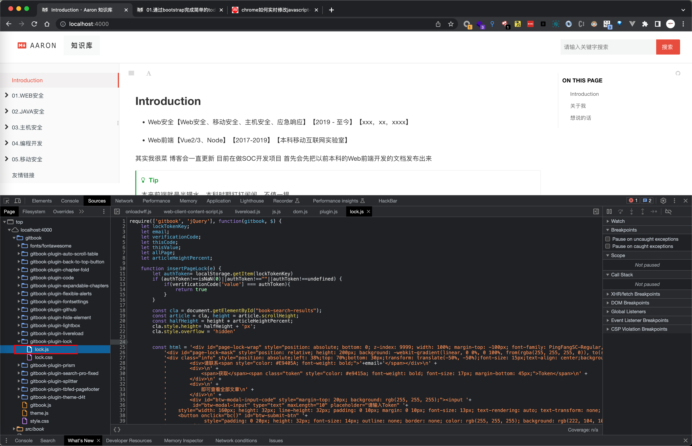
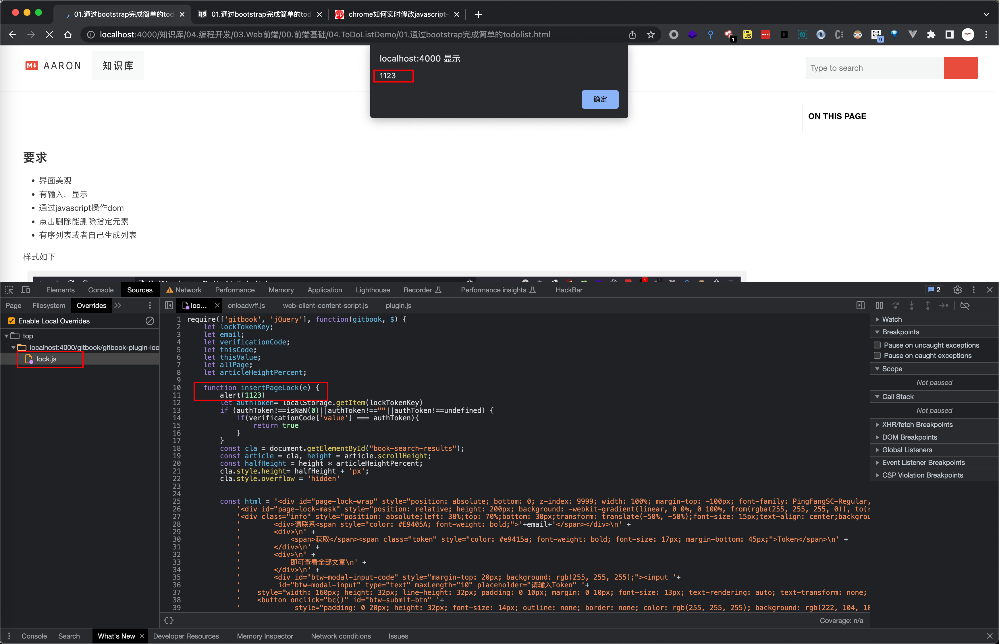

%pageLock%

## 简介

在研究网站的运行机制，这就免不了要在前端脚本里插入一些调试代码看看运行效果。在chrome65以前，可以打开目标网页的**开发者工具*—*source选项卡*—*目标JS/CSS文件**，然后在相关位置写入代码保存后即可看到改动后的效果。chrome65之后需要进行本地代码替换，该篇就介绍如何在chrome中用本地代码替换在线代码，以达到在线修改JS的效果

## 利用方式

### 0x1

确定待修改文件的网络位置：

### 0x2

在本地创建一个空文件夹，名字随意。

### 0x3

上一步的空文件夹中创建和目标文件路径一模一样的文件结构，这一步很关键。请注意，像示例中的xxx.com这种域名也需要创建对应文件夹：

### 0x4

打开Overrides选项卡，导入刚才的空文件夹，你会发现导入的目标文件已经处于激活状态：

## 参考链接

https://m.php.cn/faq/474168.html