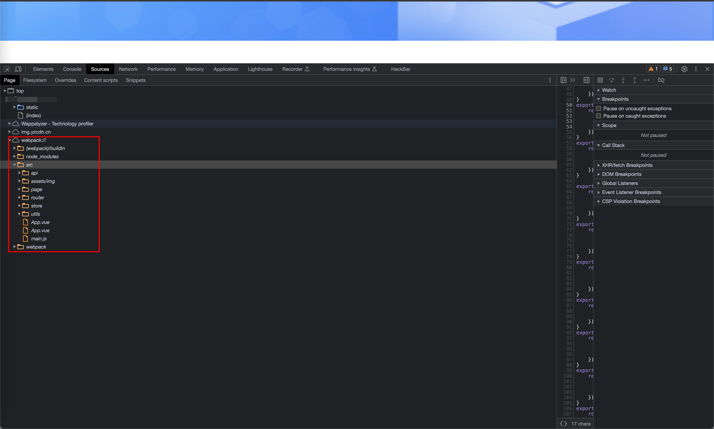
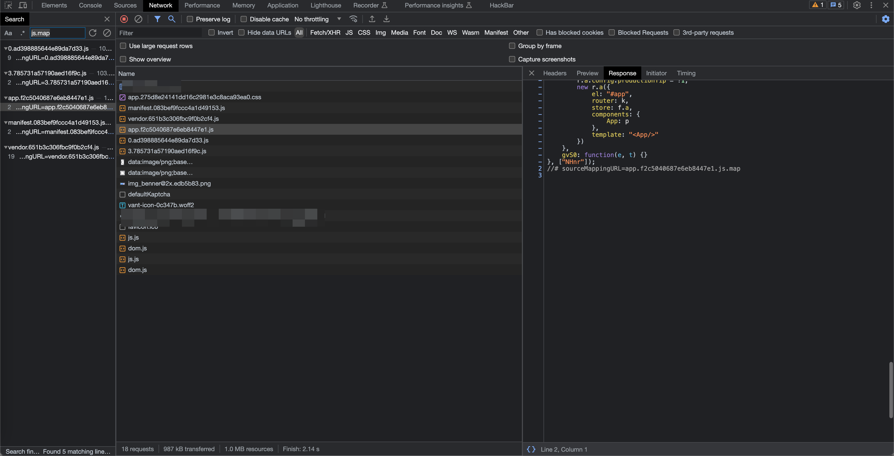
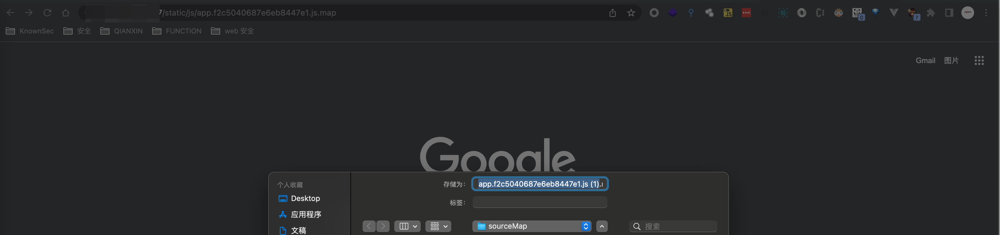
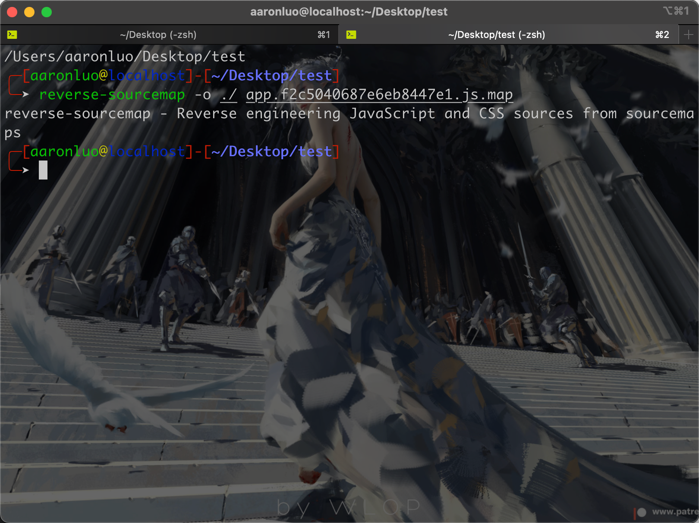
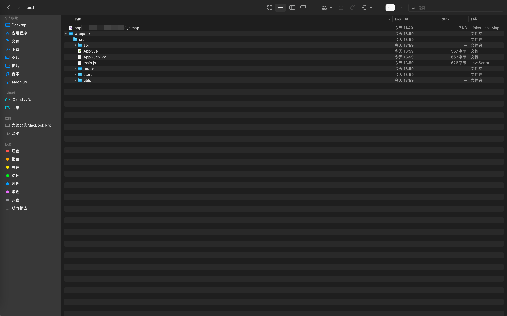
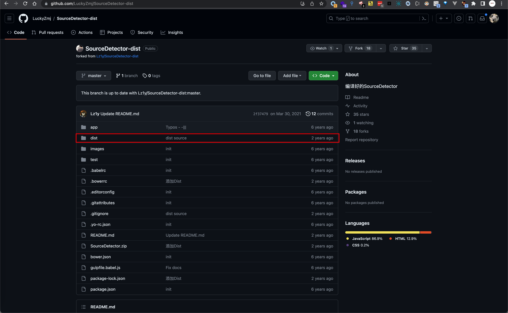

## 简介

### 介绍

webpack 是代码编译工具，有入口、出口、loader 和插件。webpack 是一个用于现代**javascript**应用程序的静态模块打包工具。当 webpack 处理应用程序时，它会在内部构建一个依赖图(dependency graph)，此依赖图对应映射到项目所需的每个模块，并生成一个或多个 **bundle**。

简单来说：webpack就是一个打包器（bundler），它能将多个js、css、json等文件打包成一个文件。这样可以使复杂的各种加载文件集合为整合为单一的集合，让代码更加模块化便于编程使用和浏览器加载。

大部分Vue应用会使用webpack进行打包，如果没有正确配置，就会导致Vue源码泄露，可能泄露的各种信息如API、加密算法、管理员邮箱、内部功能等等。

### 主要功能

其天生就代码分割、模块化，webpack2.0中加入tree shaking，用来提取公共代码，去掉死亡代码

### 危害

如果可以获得程序的js代码，那么就可以针对源代码对代码中各种信息如隐蔽接口、API、加密算法、管理员邮箱、内部功能等等，或者接口API可以尝试未授权漏洞，拼接接口越权漏洞，查找源代码中关键字去GitHub查找程序源码进行代码审计。

## 漏洞利用

一般在开发者工具中`Source`可以看到`webpack://`目录，这里就说明webpack泄漏了源码



然后在网络连接中寻找js.map文件，并将其下载下来





将其下载下来之后，使用工具reverse-sourcemap将其还原成代码

```shell
reverse-sourcemap -o ./ app.xxxx.js.map
```



然后在同级目录下就会生成webpack目录，该目录下就是所有的代码



> [!NOTE]
>
> 下载reverse-sourcemap
>
> ```shell
> npm install -g reverse-sourcemap
> ```

### 推荐插件

```text
https://github.com/LuckyZmj/SourceDetector-dist
```



将其下载下来之后，在chrome中导入dist目录，就能安装成功了

## 修复方案

如vue.js，在vue.config.js中，添加以下配置项

```javascript
productionSourceMap: false
```

传统webpack中，修改`config/index.js`中`build`对象`productionSourceMap: false`

## 参考链接

https://it.cha138.com/mysql/show-103811.html