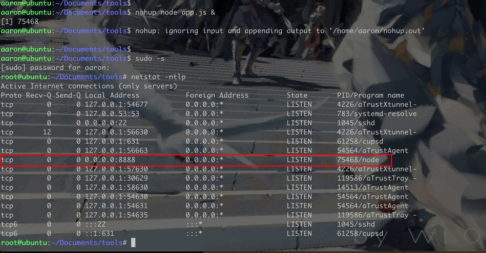
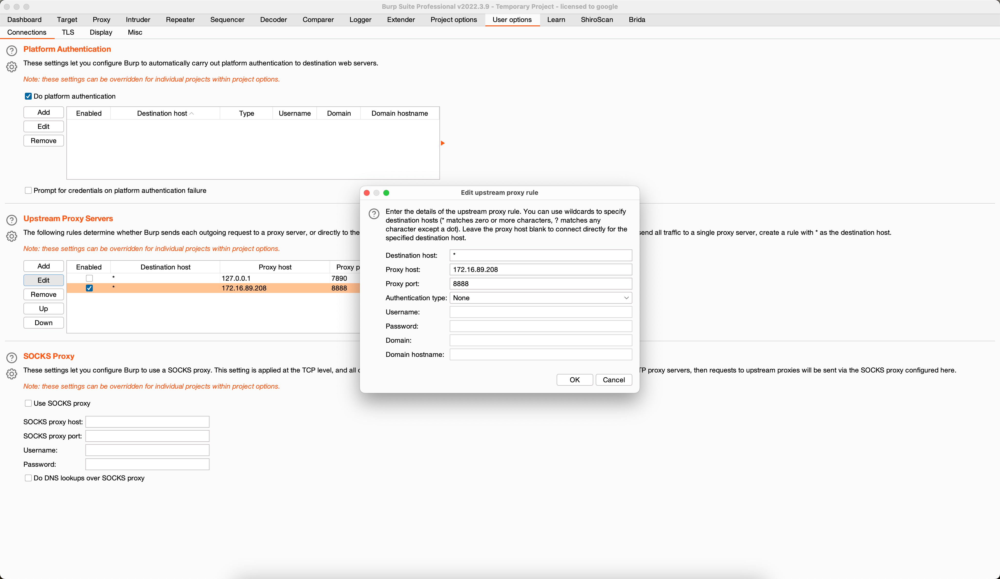
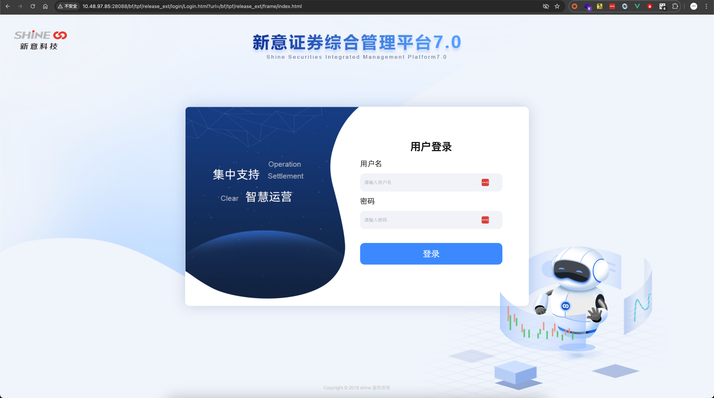
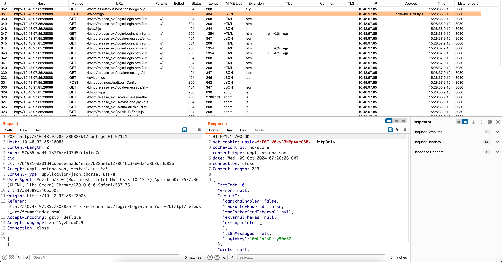
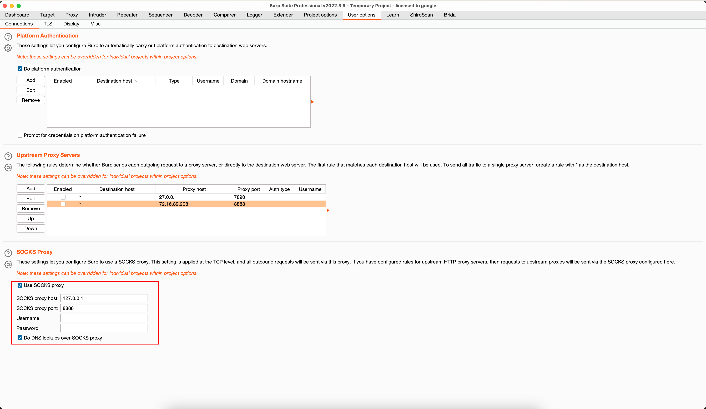
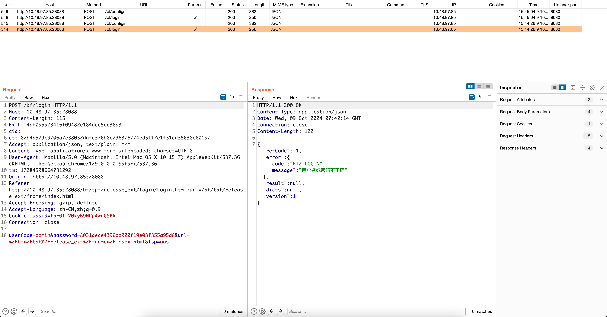

## 简介

Atrust是深信服的一款零信任工具，由于在平时做项目的时候不想将其安装在主机上，那么就可以将其安装在虚拟机里

- windows 上安装atrust 会将vpn网络环境与真实环境隔离开且无法通过端口转发，代理等方式将流量代理到VPN环境中，所以这里我们选择使用Linux来完成转发
- 在Linux/Mac中，aTrust的VPN网络环境是全局模式，那么在Linux/Mac上则可以登录上ATrust之后，通过代理的方式将流量代理出来，或者使用EW等工具做一次转发

> [!NOTE]
>
> 这里需要注意，由于我们需要通过代理或者端口转发，这里不能使用TCP转发，虽然TCP转发在内网的应用中比较广泛，但是这里需要从主机通过burp访问到对应的业务系统中，那么就需要HTTP/SOCKS5代理，目前比较好用的工具为[EW](https://github.com/idlefire/ew)（EarthWorm是一款用于开启 SOCKS v5 代理服务的工具，基于标准 C 开发，可提供多平台间的转接通讯，用于复杂网络环境下的数据转发。）

[Atrust客户端Ubuntu下载地址](https://support.sangfor.com.cn/productSoftware/list?product_id=19&category_id=97)

## HTTP代理

这里参考[HTTP代理原理及实现](/知识库/03.主机安全/17.HTTP代理原理及实现.html)

代码如下，根据实用效果来看，最后在代理处添加了异常处理，就能一直稳定运行

```javascript
// app.js
var http = require('http');
var net = require('net');
var url = require('url');

function request(cReq, cRes) {
    try{
        var u = url.parse(cReq.url);

        var options = {
            hostname : u.hostname,
            port     : u.port || 80,
            path     : u.path,
            method     : cReq.method,
            headers     : cReq.headers
        };
        var pReq = http.request(options, function(pRes) {
            cRes.writeHead(pRes.statusCode, pRes.headers);
            pRes.pipe(cRes);
        }).on('error', function(err) {
            cRes.writeHead(500, {'Content-Type': 'text/plain'});
            cRes.end('代理服务器错误');
        });
        cReq.pipe(pReq);
    }catch(e){
        cRes.writeHead(500, {'Content-Type': 'text/plain'})
        cRes.end('代理服务器错误')
    }

}

function connect(cReq, cSock) {
    try{
        var u = url.parse('http://' + cReq.url);

        var pSock = net.connect(u.port, u.hostname, function() {
            cSock.write('HTTP/1.1 200 Connection Established\r\n\r\n');
            pSock.pipe(cSock);
        }).on('error', function(err) {
            cSock.end();
        });
        cSock.on('error', function(err) {
            pSock.end();
        });
        cSock.pipe(pSock);
    }catch(e){
        cSock.end();
    }

}

http.createServer()
    .on('request', request)
    .on('connect', connect)
    .listen(8888, '0.0.0.0');
```

使用方法如下：

```shell
# 在Linux虚拟机下
nohup node app.js &
```

在这里可以看到8888端口就是我们的HTTP代理端口



在burp中添加上层代理（上层代理为HTTP代理）



然后浏览器可以访问得到内网地址



Burp抓包如下所示



## Socks5 代理

Socks5代理的方式有很多，这里我以最简单[SSH动态转发](/知识库/03.主机安全/09.SSH建立隧道以及转发.html#ssh动态转发)示例

在Linux下登录Atrust之后，在物理机上使用SSH动态转发

```shell
# 在物理机上
ssh -ND 1080 aaron@172.16.89.208
# 这里输入密码之后，即可使用本地127.0.0.1:1080的socks5 代理直接访问到内网资源
# 这里也可以挂起任务
```

在burp上可以使用





> [!NOTE]
>
> SSH 动态转发效果并不是很理想，并发量小且触发异常会崩溃

也可以使用工具EW或者代码实现socks5代理
