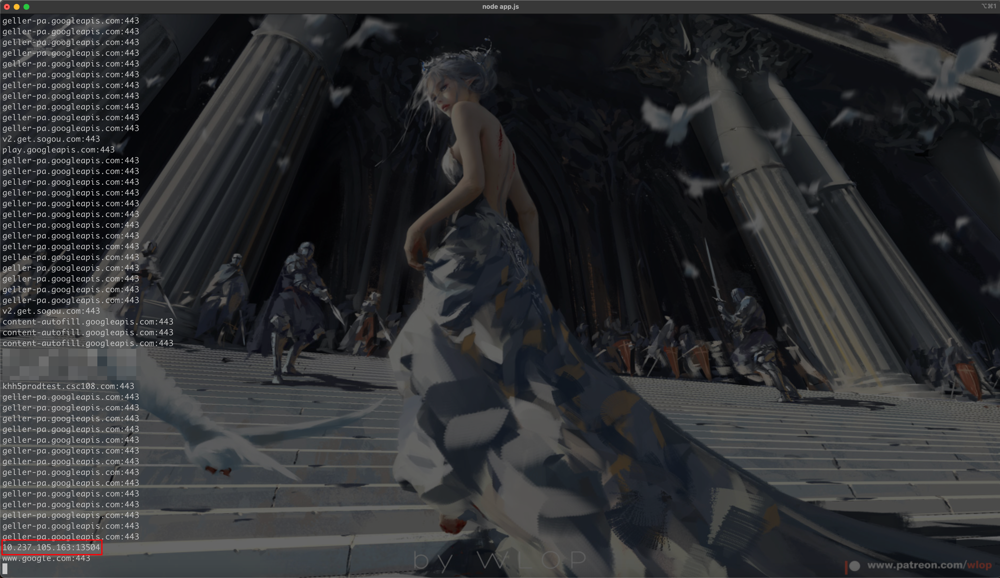
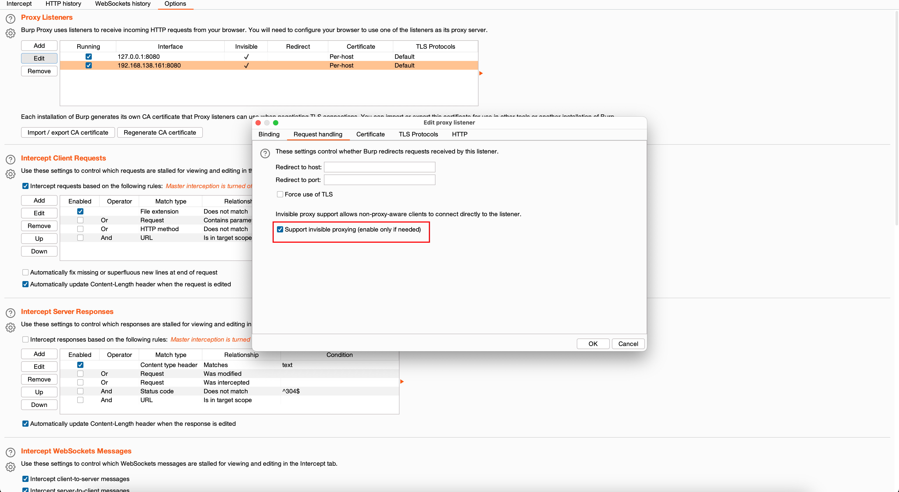
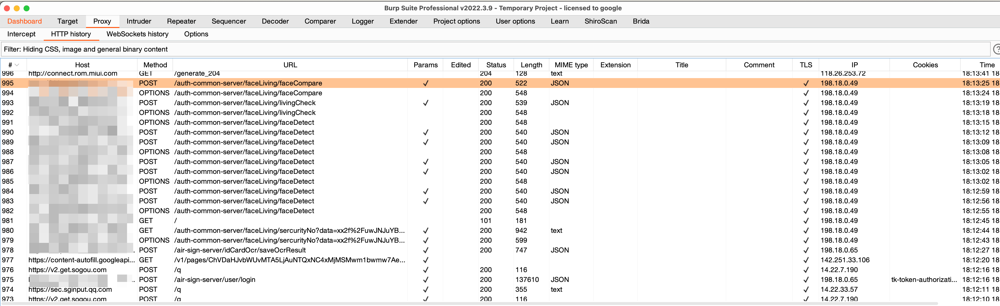

## 背景

在做项目的过程中，发现在渗透测试中，客户将人脸识别的`webrtc`服务的与内网做的连通，从手机上代理到`Burpsuite`的时候，这个服务会向内网发起一个请求，之后才会连通与另外一个域名发起通信进行人脸校验的HTTP包，由于Burpsuite不会转发以及拦截TCP的包，所以导致无法抓到包

在通信过程中，在我的Mac上登录Atrust（无隔离环境），用手机连接Burp的代理，发现无法进行人脸识别所以导致一直卡着，然后我使用[19.aTrust在Linux下的应用](/知识库/01.WEB安全/99.其他/19.aTrust在Linux下的应用.html)方法在我的Mac上（登录Atrust的环境中）开启了一个HTTP代理（手机系统代理为HTTP代理），发现可以进行人脸识别；故判断在某个地方一定是调用了内网的东西，导致无法调用后续人脸识别的包

## 寻找问题

使用[19.aTrust在Linux下的应用](/知识库/01.WEB安全/99.其他/19.aTrust在Linux下的应用.html)的node http代理，由于http代理，在处理https的时候会有一个connect请求

> [!NOTE]
>
> 这里针对HTTPS再说一下
>
> 1. **客户端与服务器建立 TCP 连接**：
>
>    客户端首先会与目标服务器建立一个普通的 TCP 连接。这是通过三次握手（TCP handshake）完成的，确保客户端和服务器之间可以可靠地进行数据传输。
>
> 2. **发起 SSL/TLS 握手**：
>
>    TCP 连接建立后，客户端会立即开始 SSL/TLS 握手过程。这个过程的目的是协商加密算法和密钥，以便之后的数据传输可以被加密。
>
>    具体步骤包括：
>
>    1. 客户端发送一个 `ClientHello` 消息，其中包含客户端支持的加密算法列表、SSL/TLS 协议版本等信息。
>    2. 服务器回应一个 `ServerHello` 消息，选择一个加密算法并发送服务器的数字证书。
>    3. 客户端验证服务器的数字证书，如果验证通过，会生成一个预主密钥（Pre-Master Secret），并用服务器的公钥加密后发送给服务器。
>    4. 服务器使用自己的私钥解密这个预主密钥，然后双方基于这个预主密钥生成对称加密密钥。
>    5. 客户端和服务器各自发送一个 `Finished` 消息，表示握手过程完成。
>
> 3. **数据传输**：
>
>    SSL/TLS 握手完成后，客户端和服务器之间的通信将使用对称加密进行加密传输。所有的数据都是通过加密的通道进行传输的，确保数据的机密性和完整性。

再说说为什么我的代理服务器能通过这个TCP连接？

对于 HTTPS 或其他 TCP 连接，手机会发起一个 `CONNECT` 请求，要求代理服务器建立一个 TCP 隧道来传输后续的加密流量

**TCP 连接的处理**：

1. 当客户端尝试发起一个 HTTPS 或任意的 TCP 连接时，客户端会首先向代理服务器发起一个 TCP 连接。
2. 代理服务器会捕获这个连接，并解析接收到的数据。因为客户端的流量是通过代理发送的，代理服务器能捕获到这个连接并判断是否为 `CONNECT` 请求。
3. 如果是 `CONNECT` 请求，代理服务器就会尝试与目标服务器建立一个隧道，将连接转发出去。

**代理服务器如何处理 `CONNECT` 请求**：

1. 当代理服务器收到 `CONNECT` 请求时，会根据请求的目标地址（例如 `example.com:443`）建立一个新的 TCP 连接到目标服务器
2. 之后，代理服务器会返回一个 `200 Connection Established` 响应，表示隧道已经成功建立。此时，客户端和目标服务器之间的通信通过这个隧道进行。

## 实验

在[19.aTrust在Linux下的应用](/知识库/01.WEB安全/99.其他/19.aTrust在Linux下的应用.html)中提供的HTTP代理中，来打印一下走了connect请求的IP和端口



可以看到这个代理服务器是捕获到了内网的请求，手机在没有atrust的环境下是无法连通到这个服务的，所以就会导致人脸识别一直卡着动不了

那么要让这个手机连通到内网中，那么可以做一个代理服务器，先把流量代理到Mac上，然后Mac连接了atrust，内网的服务就直接过了，接下来就是人脸识别就能正常使用了，那么怎么从代理服务器到Burp呢？我们以前都是做的流量先到Burp 再做上游代理或者socks代理转发出去来隐匿自己的真实ip，这里就需要做一个前置代理，先将流量代理到Mac上，然后再转发到Burp上，即

> [!NOTE]
>
> 手机 -> Mac上代理服务器（可转发内网的TCP服务，让内网的服务可以和手机通信） -> Burpsuite（专门接收http包对其进行拦截）

针对性的修改，由于Burp无法拦截/转发TCP包，所以我们在发现存在connect这个包之后，就直接不转发给Burp，而是在Mac上处理让其连通内网，其他的包直到burpsuite，由于burpsuite就直接可以访问到http/https的服务，就不用做其他处理了，就可以直接抓包

```javascript
const http = require('http');
const net = require('net');
const url = require('url');

// 处理 HTTP 请求
function request(cReq, cRes) {
    const u = url.parse(cReq.url);
    
    // 构造一个完整的 URL 以转发给 Burp Suite
    const options = {
        hostname: '127.0.0.1',
        port: 8080,
        path: cReq.url, // 使用绝对 URL
        method: cReq.method,
        headers: cReq.headers,
    };

    const pReq = http.request(options, (pRes) => {
        // 返回 Burp Suite 的响应给客户端
        cRes.writeHead(pRes.statusCode, pRes.headers);
        pRes.pipe(cRes, { end: true });
    });

    pReq.on('error', (err) => {
        console.error('Error with proxy request:', err);
        cRes.writeHead(500, { 'Content-Type': 'text/plain' });
        cRes.end('Proxy error');
    });

    cReq.pipe(pReq, { end: true });
}

// 处理 CONNECT 请求，用于 HTTPS 代理
function connect(cReq, cSock) {
    const u = url.parse(`http://${cReq.url}`); 
    // 创建到 Burp Suite 的连接
    let pSock = null
    if(u.hostname === '10.237.105.163'){
        pSock = net.connect(u.port, u.hostname, () => {
            cSock.write('HTTP/1.1 200 Connection Established\r\n\r\n');
            pSock.pipe(cSock, { end: true });
        });
    }else{
        pSock = net.connect(8080, '127.0.0.1', () => {
            cSock.write('HTTP/1.1 200 Connection Established\r\n\r\n');
            pSock.pipe(cSock, { end: true });
        });
    }
    pSock.on('error', (err) => {
        console.error('Error with proxy connect:', err);
        cSock.end();
    });

    cSock.on('error', (err) => {
        pSock.end();
    });

    cSock.pipe(pSock, { end: true });
    
}

// 创建 HTTP 服务器，并监听请求和 CONNECT 方法
const server = http.createServer(request);
server.on('connect', connect);

// 监听端口
server.listen(8888, '0.0.0.0', () => {
    console.log('Proxy server is running on http://0.0.0.0:8888');
});


```

在burpsuite上配置invisible模式

> [!NOTE]
>
> **隐形模式的作用**：当你将 Burp 设置为“invisible”模式时，它可能更好地适应了通过 HTTP 代理的流量。在这种模式下，Burp 可能会以一种更通用的方式处理流量，减少了与目标服务器的检测。
>
> **请求转发**：在“invisible”模式下，Burp 可能能更好地管理和转发请求，使得请求能够顺利通过 HTTP 代理转发到目标服务。



然后手机挂代理就可以先访问到我们的http代理，然后转发到burp上来

人脸识别就能抓包分析了，如下图所示



**那么如果是windows的朋友如何做代理转发呢？**

在Linux上登录atrust之后，使用上述代理服务，（但是需要将转发到burp的端口和ip更改）然后Linux上再开一个代理服务（socks代理或者http）作为burp的流量过atrust

> [!NOTE]
>
> 原理如下
>
> 1. Linux登录Atrust
> 2. Linux设置前置代理，确保内网的包能过Atrust，这个前置的代理可以把流量转发给windows的burp（如果Linux上没有安装burpsuite，嫌麻烦的话）
> 3. 手机系统代理设置为Linux下的前置代理，burp的后置代理（Socks或者HTTP）确保可以访问到burp
>
> 最重要的就是tcp包走atrust，如果burp的环境中没有atrust，再把burp的流量再走到atrust中就行

## 反思

Socks连接也可以，只是需要手机客户端需要装如shadow-sockets的客户端，还有就是Socks流量中判断HTTP流量转发到burp中 由于python实现的代码效果不理想，故没有将其展示出来

Socks代理是可以代理tcp，udp等等各种协议，应用广泛性高，但是手机默认支持的系统代理为HTTP代理，所以本次没有将其写出来，当有需要的时候再完善代码
