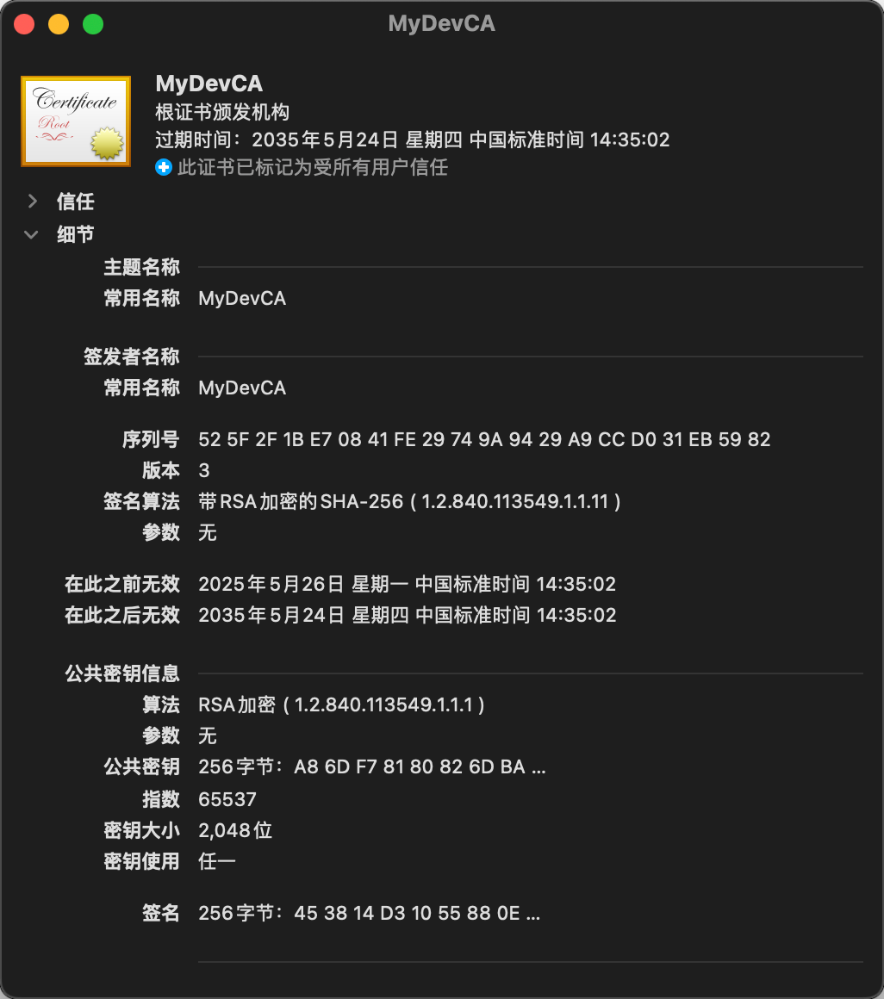
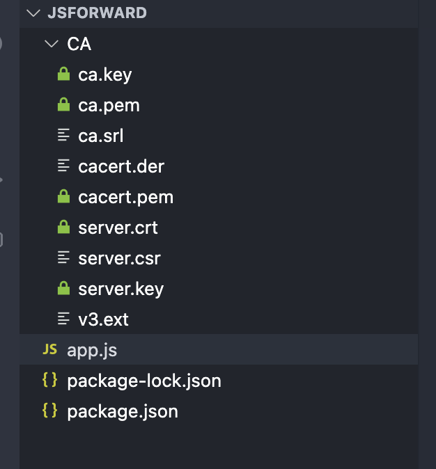
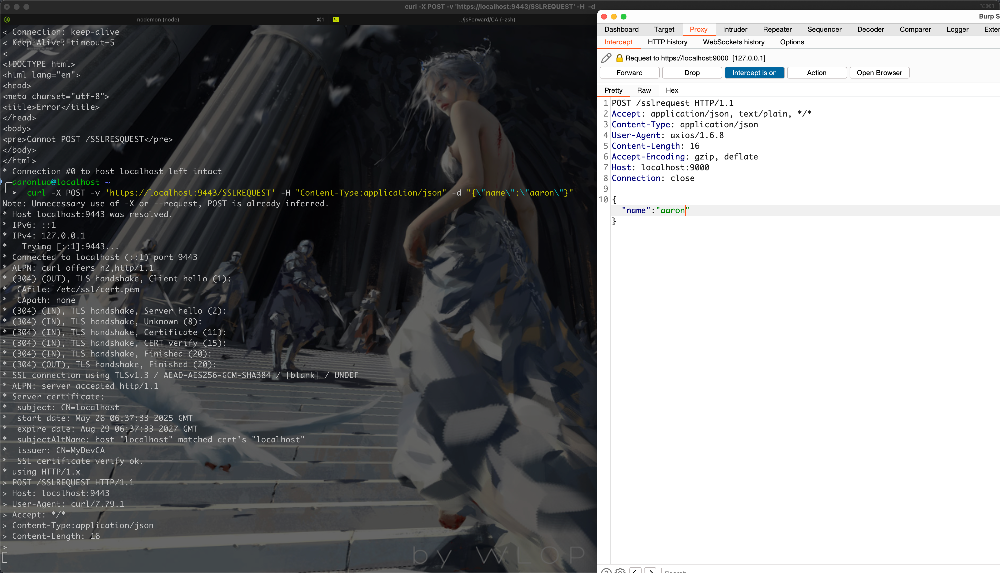
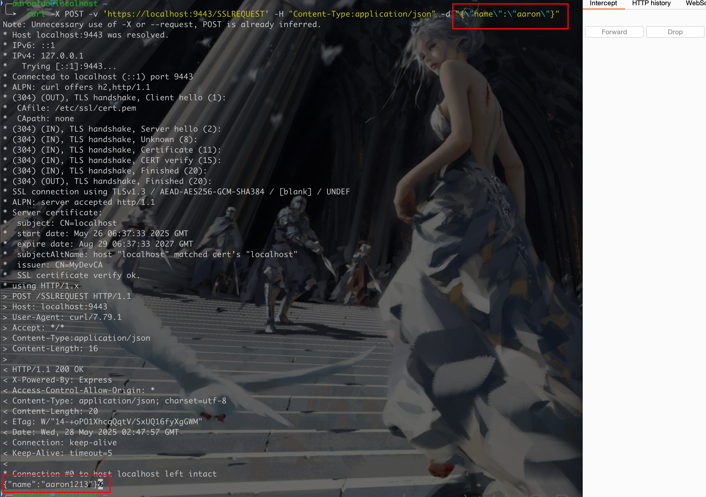
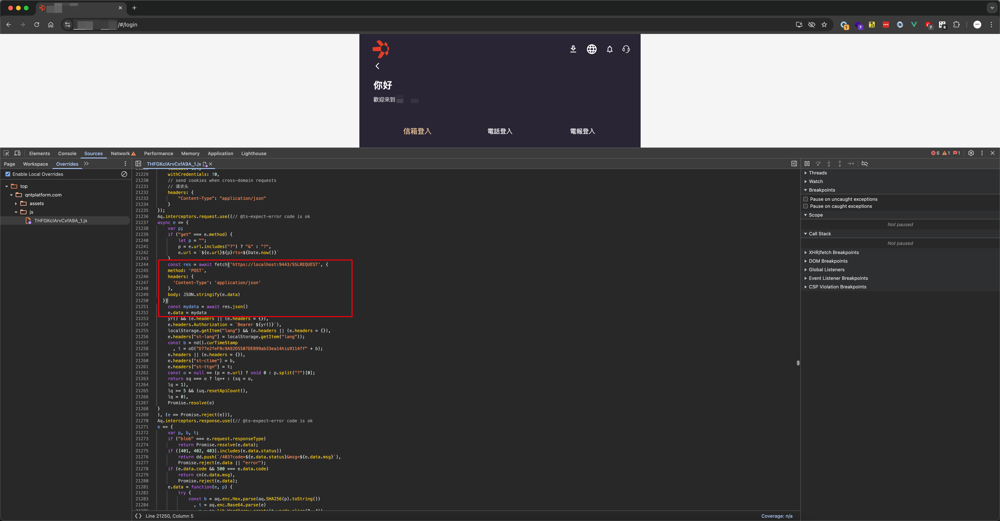
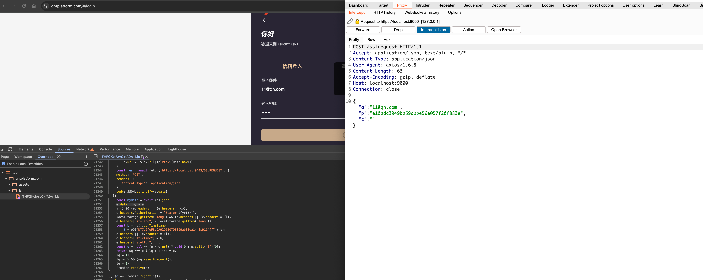
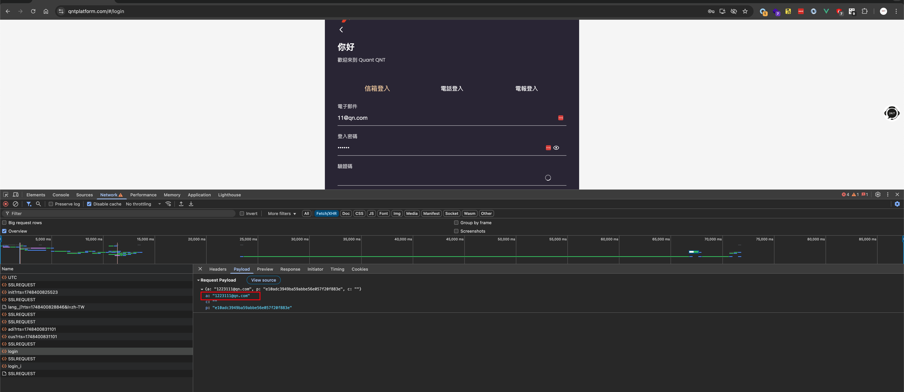
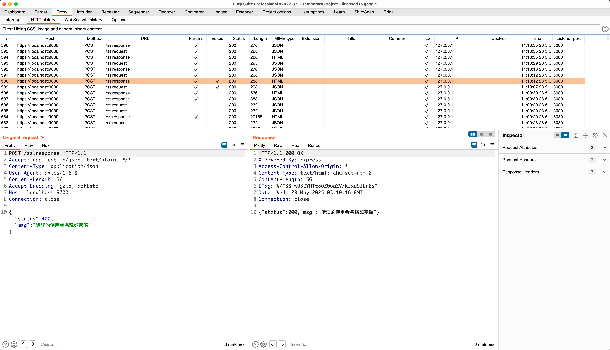

## NodeJS 版本js-forword

### 依赖环境

1. nodejs

### 使用方法

第一步信任该项目的CA目录下的`ca.pem`



添加burp的CA证书到该项目的CA目录下

使用命令将DER格式的证书转换成PEM格式证书（Nodejs axios 不支持DER格式证书）

```shell
openssl x509 -inform der -in cacert.der -out cacert.pem
```

目录如下所示




```shell
npm install
node app.js
```

启动程序之后，可以使用curl命令尝试是否可以正常到burp上来





测试通过之后，在需要加解密之前的地方Overrieds当前的js（以下示例是在request的拦截器，response的拦截器）



```javascript
 const res = await fetch('https://localhost:9443/SSLREQUEST', {
   method: 'POST',
    headers: {
      'Content-Type': 'application/json'
    },
    body: JSON.stringify(e.data)
  })
 // 这里是修改后的request
  const mydata = await res.json()
  //这里要看如何处理逻辑，本案例数据是在e.data中
  e.data = mydata
// 剩下走前端的加密，然后发给后端
```



在burp里修改之后，再走拦截器后续的加解密就是我们修改的部分了（登录包没有做全加密）



