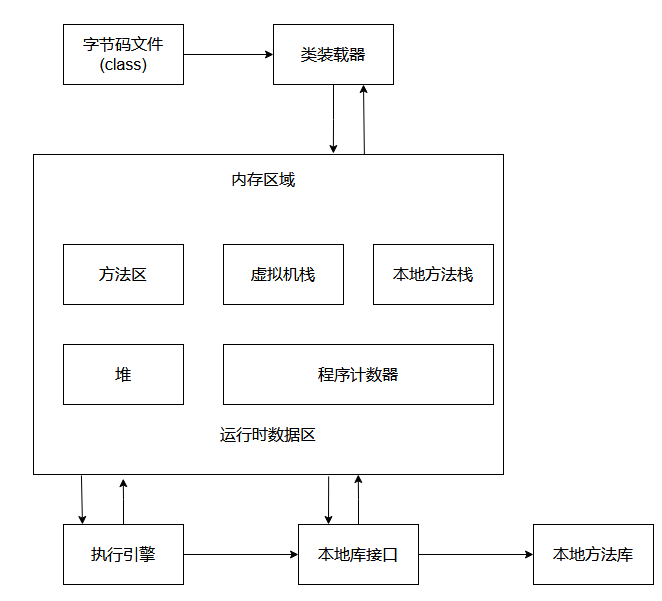

## JVM

JVM 内存划分：它是人为的根据不同的内存空间的存储特点以及存储数据（逻辑划分）

程序计数器：当前线程所执行的字节码的行号指示器

本地方法栈：为虚拟机使用native方法服务

Java虚拟机栈：描述Java方法执行的内存模型，每个方法被执行的时候都会同时创建一个栈帧用于存储该方法的局部变量表、操作栈、动态链接、方法出口等信息（每一个方法创建一个栈帧，栈帧存放了当前方法的数据信息（局部变量），当方法调用完毕，该方法的栈帧就被销毁了）
Java 堆：被所有线程共享的一块内存区域，在虚拟机启动时被创建。**所有的对象实例以及数组都要在堆上分配（当使用new 关键字，就表示在堆中开辟一块新的存储空间）**

方法区：线程共享的内存区域，存储已被虚拟机加载的类信息，常量、静态变量即时编译器编译后的代码数据等（这个区域的内存回收目标主要是针对常量的回收和对类型 的卸载)

## GC（Garbage Collection）垃圾回收器
Java的自动垃圾回收机制，简单理解为，程序员就不需要再手动的去控制内存的释放，当JVM发觉内存资源紧张的时候，就会自动地去清理无用对象（没有被引用的对象）
