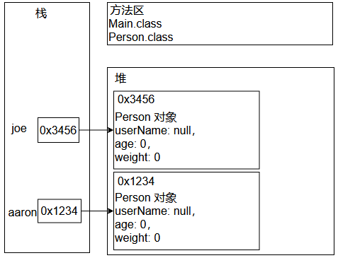
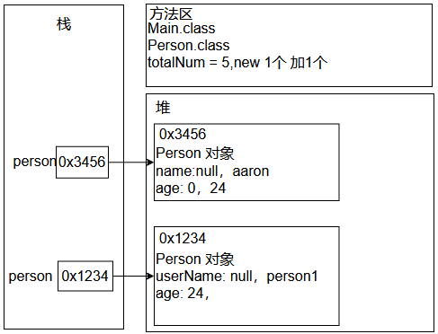

## 简介
### 面向过程
该思想是站在过程的角度思考问题，强调的是功能行为，功能的执行过程，先干什么，后干什么，而每一个功能，都是用函数（类似于方法）把这些步骤一步一步实现，使用的时候依次调用函数
### 面向过程的设计
最小的程序单元就是函数，每个函数负责完成某一个功能，用于接收输入数据，函数堆输入数据进行处理，然后输出结果数据
整个软件系统由一个个的函数组成，其中作为程序入口的函数称之为主函数，主函数依次调用其他函数，普通函数之间可以相互调用，从而实现整个系统功能
### 面向过程的设计缺陷
面向过程的设计，是采用了置顶而下的设计方式，再设计阶段就需要考虑每一个模块应该分解成哪些子模块，每个子模块有细分更小的子模块，如此类推，知道将模块细化成一个个函数
存在的问题：

- 设计不够直观，与人类思维习惯不一致（谁来吃饭，而不是吃饭谁来参与）
- 系统软件适应性差，可拓展性差，维护性低

面向过程最大的问题在于随着系统的膨胀，面向过程将无法应付，最终导致系统的崩溃。为了解决这一种软件危机，提出了面向对象的思想
### 面向对象
一种基于面向过程的新的编程思想，顾名思义该思想是站在对象的角度思考问题，我们把多个功能合理放到不同对象里，强调的是具备某些功能的对象，而具备某种功能的实体，称之为对象。
面向对象的最小程序单元是：类
### 面向对象的优势与特点
更加符合我们常规的思维方式，稳定性好，可重用性强，易于开发大型软件产品，有良好的可维护性，在软件工程中，面向对象可以使工程更加模块化，实现更低的耦合和更高的内聚，面向对象的三大特征如下：

- 封装
- 继承
- 多态

封装：指将对象的实现细节隐藏起来，然后通过公共的方法向外暴露该对象的功能
继承：面向对象实现软件复用的重要手段，当子类继承父类后，子类是一种特殊的父类，能直接或间接获得父类里的成员
多态：可以直接把子类对象赋值给父类变量，但是运行时依然表现出子类的行为特征，这意味着同一类型的对象在运行时可能表现出不同的行为特征
## 类和对象
面向对象的三大特征

- 封装
- 继承
- 多态
### 理解什么是抽象
从特定的角度出发，从已经存在的一些事物中抽取我们所关注的特性、行为、从而形成一个新的十五的思维过程，是一种复杂到简单的思维方式
### 对象和类的关系
对象可以定义为包含状态和行为的一个实体，对象（object）也称为实例（Instance）
实体：存在于现实世界中并且可以与其他物体区分开的物体，表示实际存在的个体
#### 对象

1. 人们要进行研究的任何事物，一切事物都可以认为是对象
2. 对象具有状态和行为
   1. 状态：比如姓名，年龄，性别等
   2. 行为：比如吃饭，睡觉，写代码等

通过多个同类型的对象分析，我们可以把对象抽象成类
#### 类
具有相同特性（状态）和行为（功能）的对象抽象就是类。因此，对象的抽象是类，类的具体化就是对象，也可以说类的实例就是对象，类实际上就是一种数据类型

1. 特性：对象的状态，用成员变量来描述
2. 功能：对象的行为，用方法来描述

类是对象的类型/模板；创建一个对象就是使用一个类作为构建该对象的基础，实际上解释类和对象的关系确实存在着“先有蛋还是先有鸡”的问题，描述类扫不了对象，相反，描述对象也少不了类。对象是类的实例，类是对象的模板
## 如何定义一个类
```java
[修饰符] class 类名{
    0 ~ N 个成员变量(字段/Field) 不要叫属性(JavaBean 中特殊的一种成员);
    0 ~ N 个方法
}
```
定义类的注意事项：

1. 如果类使用了public修饰符，必须保证当前文件名和当前类名相同
2. 类名使用名称表示，类表示某一类事物，首字母大写，如果是多个的单词组成使用驼峰表示法，如EmployeeAdvanceSetting
3. 在面向对象的过程中，定义类的时候，专门为描述对象提供一个类，该类不需要main方法
## 对象的创建和条用方法以及操作字段
```
1. 根据类来创建对象的语法
  a. 类名 变量 = new 类名();
2. 给字段设置值
  a. 对象变量.字段名称 = 该类型的值;
3. 获取对象的值
  a. 该字段类型对象变量 变量 = 对象变量.字段值
4. 通过对象调用方法
  a. 对象变量.方法(实参)
```
```java
// Person 类
package com.study.Object;

public class Person {
    public String userName;
    public int age;
    public int weight;


    public void sign() {
        System.out.println(this.userName + " is sign~");
    }

    public void dance() {
        System.out.println(this.userName + " is dance~");
    }
}

```
```java
// main 函数
package com.study.Object;

public class Main {
    public static void main(String[] args) {
        Person aaron = new Person();
        Person joe = new Person();
        aaron.userName = "aaron";
        aaron.age = 24;
        joe.userName = "joe";
        joe.age = 23;
        System.out.println(aaron.userName);
        System.out.println(joe.age);
    }
}
```
```
aaron
23
```
## 对象实例化的过程

1. 方法区是存放加载的类信息，方法信息的地址，程序要运行，首先要将Main.class（包含方法等）放置在方法区，然后再将Person.class字节码存入到方法区内
2. 栈里存放了方法运行（main方法）时的局部变量，aaron，joe都是对象变量
3. 堆：当使用**new 关键字，就表示在堆中开辟一块新的存储空间**

对象的引用地址就是在new的时候在堆里创建的一个地址，这种关系被称为引用关系，当我们操作aaron对象的时候，实际上是操作的0x1234这个地址的数据




## 对象的打印、比较、生命周期
### 打印
打印对象的时候，打印出来的效果如下：`类的名称@十六进制的hashcode`
如果想知道对象里的成员变量信息，就需要`Object.toString()`方法
```java
// Main
package com.study.Object;

public class Main {
    public static void main(String[] args) {
        Person aaron = new Person();
        Person joe = new Person();
        System.out.println(aaron);
        System.out.println(joe);
    }
}
```
```
com.study.Object.Person@1540e19d
com.study.Object.Person@677327b6
```
### 比较
`==` : 对于基本数据类型来说，比较的是值，对于引用类型来说，比较的是在内存中地址的值，每次使用new关键字，都表示在堆值新开辟一块内存空间，不同的内存空间地址值不同
如果对象拥有完全相同的数据，是否能俩对象相等？可以使用`Object.equals()`方法
```java
package com.study.Object;

public class Main {
    public static void main(String[] args) {
        Person aaron = new Person();
        Person joe = new Person();
        System.out.println(aaron == joe);
    }
}

```
```
false
```
### 生命周期
对象什么时候**出生**：每次使用new 关键字的时候，就会在堆内存中开辟新的空间，此时对象开始存在
对象什么时候**结束**：当堆中的对象没有被任何变量所引用，此时该对象就成了垃圾，就**等着垃圾回收器（GC）来回收该垃圾**，当被回收后，对象就被销毁了
回收垃圾的目的是为了释放更多的内存
### 匿名对象：匿名/佚名
没有名称的对象，也就是在堆中开辟一块新的内存空间，但是没有把该空间地址赋给任何变量，如下所示
```java
new Person();
```
因为没有名称，匿名对象仅仅只能使用一次，用完一次之后，就等着GC来回收，一般的把匿名对象作为方法的实参传递
## 构造器
```java
// 这个代码调用一个方法名为Person() 的无参数方法
// 这个方法就是构造方法(Constructor)
Person person = new Person();
```
我们在Person类中，没有找到该构造方法，却又没有报错，但是在反编译之后，是存在该构造方法
```java
package com.study.Object;

public class Person {
    public String userName;
    public int age;
    public int weight;


    public void sign() {
        System.out.println(this.userName + " is sign~");
    }

    public void dance() {
        System.out.println(this.userName + " is dance~");
    }
}

```
当我们在编译的时候，编译器会创建该默认(缺省)构造函数
### 构造器的作用

1. 创建对象，但是必须要和new一起使用
2. 完成对象的初始化操作
### 构造器的特点

1. 构造器的名称和当前所在类的名称相同
2. 禁止定义返回类型，千万不要使用void作为返回类型，`void Person(){}`这就是个普通方法
3. 在构造器中不需要使用return，返回的是当前创建对象的引用
### 编译器创建的默认构造器特点

1. 符合构造函数特点
2. 无参数
3. 无方法体
4. 如果类没有使用public修饰，则编译器创建的构造器也没有public修饰
## 自定义构造器与构造器重载
如果没有显示提供构造器，则编译器在编译过程中会创建一个缺省构造器，但是如果显式定义了一个构造器，编译器在编译过程中则不会再创建缺省构造器
### 自定义构造器
```java
// Person.java
package com.study.Object;

public class Person {
    public String userName;
    public int age;
    public int weight;
    public Person(){
        System.out.println("我被调用了");
    }

}

```
```java
// Main.java
package com.study.Object;

public class Main {
    public static void main(String[] args) {
        Person person = new Person();
    }
}

```
```java
我被调用了
```
说明创建对象其实是在调用构造器
### 构造器重载
方法的重载（Overload）避免在同一个类中，相同功能的方法名字不同
判断：两同一不同：同一个类，同一个方法名称，参数不同
构造器的的重载
构造器是一种特殊的方法，也可以存在重载
```java
// Person.java
package com.study.Object;

public class Person {
    public String userName;
    public int age;
    public int weight;
    public Person(){
        System.out.println("我被调用了");
    }
    public Person(String userName){
        System.out.println("我被调用了username");
    }


}

```
```java
// Main.java
package com.study.Object;

public class Main {
    public static void main(String[] args) {
        Person person = new Person();
        Person Person1 = new Person("aaron");
    }
}
```
```java
我被调用了
我被调用了username
```
## static 修饰符
状态和行为应该有对象和类型之分

- 有的状态和行为应该属于对象，不同的对象状态和行为可以不一样
- 有的状态和行为应该属于类型，不属于对象

static 的真正作用，用来区别字段，方法，内部类，初始化代码块
static 修饰符的特点：

1. static 修饰符修饰的成员(字段/方法)，随着所在类的加载而加载，当JVM把字节码加载进JVM的时候，static修饰的成员已经在内存中存在了
2. 优先于对象的存在，对象是手动通过new关键字创建出来的
3. static 修饰符修饰的成员被该类型的所有对象共享，根据该类创建出来的任何对象，都可以访问static成员，表面上通过对象去访问static 修饰的成员，其本质依然使用类型访问，和对象没有任何关系
4. 直接使用类名访问static成员，因为static修饰的成员直接属于类，不属于对象，可以直接使用类名访问static成员
```java
// Person.java
package com.study.Object;

public class Person {
    String name = "";
    int age = 0;
    static int totalNum = 5;

    public Person(String name, int age) {
        name = name;
        age = age;
        totalNum++;
    }

    void die() {
        totalNum--;
        System.out.println("die");
    }

    static void destory() {
        totalNum = 0;
        System.out.println("destory");
    }
}

```
```java
package com.study.Object;

public class Main {
    public static void main(String[] args) {
        System.out.println(Person.totalNum);
        Person person = new Person("aaron",24);
        System.out.println(Person.totalNum);
    }
}

```
```java
5
6
```
### static 成员在JVM中的存储
字节码加载进虚拟机，static成员就已经在方法区了



### 类成员与实例成员
类中的成员：字段、方法，内部类

类成员：使用static修饰的成员

实例成员：没有static 修饰的成员

**类成员只能访问类成员，实例成员只能访问实例成员**

类成员直接属于类，可以通过类访问static字段和static 方法

实例成员，只属于对象，通过对象来访问非static字段和非static 方法

在static 方法，只能调用static 成员

非static 方法，可以访问静态成员，也可以访问实例成员

什么时候定义成static 的字段和方法
如果这一个状态/行为属于整个事物（类）就直接使用static修饰i，被所有对象使用，一般在开发中，往往把工具方法使用static 修饰，如果不适用static修饰，则这些方法属于该类的对象，就得需要创建对象再调用方法，开发工具对象只需要一份即可，可能创建N个对象，此时往往把类设计为单例
弊端：生命周期长

未完待续。。。
