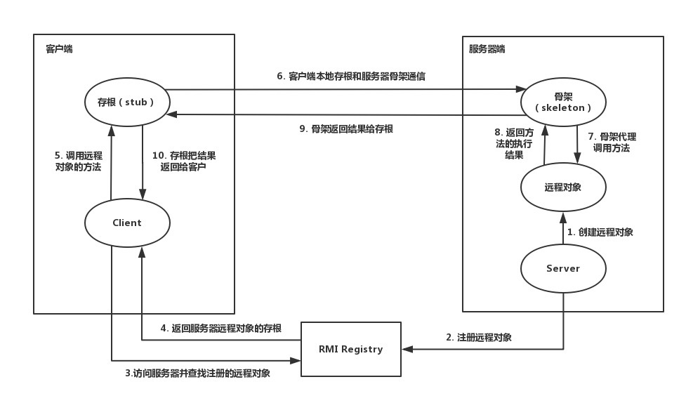
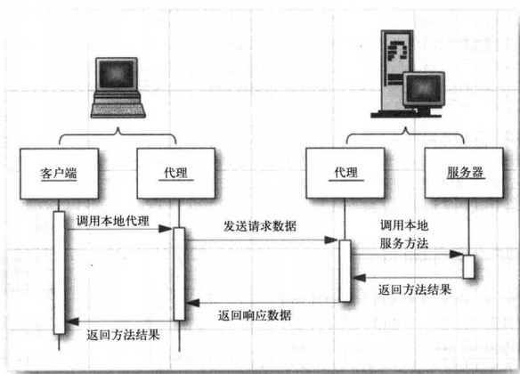

## RMI概述

**RMI: 远程方法调用(Remote Method Invocation)**，它支持存储于不同地址空间的程序级对象之间彼此进行通信，实现远程对象之间的无缝远程调用。

**Java RMI**：用于不同虚拟机之间的通信，这些虚拟机可以在不同的主机上、也可以在同一个主机上；一个虚拟机中的对象调用另一个虚拟机中的对象的方法（一个JVM中的代码可以通过网络实现远程调用另一个JVM的某个方法。），只不过是允许被远程调用的对象要通过一些标志加以标识。

提供服务的一方我们称之为服务器，而实现远程调用的一方我们称之为客户端。

---

具体实现方法：

远程服务器提供具体的类和方法，本地会通过**某种方式**获得远程类的一个代理，然后通过这个代理调用远程对象的方法，方法的参数是通过序列化与反序列化的方式传递的，所以：

1. 只要服务端的对象提供了一个方法，这个方法接收的是一个Object类型的参数，
2. 且远程服务器的classpath中存在可利用pop链，那么我们就可以通过在客户端调用这个方法，并传递一个精心构造的对象的方式来攻击rmi服务。

## RMI实现机制

**要实现RMI，服务器和客户端必须共享同一个接口。**Java的RMI规定此接口必须派生自`java.rmi.Remote`，并在每个方法声明抛出`RemoteException`。

上面说了本地会通过某种方式获得远程对象的代理，那么具体是怎么的实现机制呢？RMI模式中除了有Client与Server，还借助了一个Registry(注册中心)。

因此，RMI由3个部分构成

- 第一个是rmiregistry（JDK提供的一个可以独立运行的程序，在bin目录下）
- 第二个是server端的程序，对外提供远程对象
- 第三个是client端的程序，想要调用远程对象的方法。
| Server | Registry | Client |
| :---: | :---: | :---: |
| 提供具体的远程对象 | 一个注册表，存放着远程对象的位置（ip、端口、标识符） | 远程对象的使用者 |


其中Server与Registry可以在同一服务器上实现，也可以布置在不同服务器上，现在一个完整的RMI流程可以大概描述为：

1. 启动`Registry`服务，启动时可以指定服务监听的端口，也可以使用默认的端口（1099）。
2. `Server`端在本地先实例化一个提供服务的实现类，然后通过RMI提供的 **Naming/Context/Registry**（下面实例用的Registry）等类的`bind`或`rebind`方法将刚才实例化好的实现类**注册**到`RMI Registry`上并对外暴露一个名称。
3. `Client`端通过本地的接口和一个已知的名称（即`RMI Registry`暴露出的名称）再使用RMI提供的**`Naming/Context/Registry`**等类的`lookup`方法从`RMI Server`那拿到实现类。这样虽然本地没有这个类的实现类，但所有的方法都在接口里了，便可以实现远程调用对象的方法了。

**RMI的交互图**：


> PS： 图中的stub就是客户端代理，skeleton就是服务端代理

远程方法调用的通信模式：



## RMI实现举例

### 实现过程

大概实现过程

- 定义远程接口
- 服务端实现远程接口
- 服务端注册远程对象
- 客户端调用接口

### 实现举例

#### HelloInterface.java

```java
// 定义一个远程接口
package com.company;

import java.rmi.Remote;
import java.rmi.RemoteException;

public interface HelloInterface extends Remote {	// 创建接口，必须继承Remote
    String say (String name) throws RemoteException;	// 每个函数必须要抛出 RemoteException 异常
}
```

#### HelloImpl.java

```java
// 实现远程接口
package com.company;

import java.rmi.RemoteException;
import java.rmi.server.UnicastRemoteObject;	// 必须要这个，不然会报序列化的错

public class HelloImpl extends UnicastRemoteObject implements HelloInterface {
    public HelloImpl() throws RemoteException {	// 必须要这个
        super();
    }

    @Override
    public String say(String name) throws RemoteException {	// 实现刚才定义的接口的方法
        return "test " + name;
    }
}
```

#### Server.java

```java
// 创建一个注册表，并注册远程对象
package com.company;

import java.net.MalformedURLException;
import java.rmi.AlreadyBoundException;
import java.rmi.Naming;
import java.rmi.RemoteException;
import java.rmi.registry.LocateRegistry;
import java.rmi.registry.Registry;

//注册远程对象
public class Server {
    public static void main(String[] args) throws RemoteException, AlreadyBoundException, MalformedURLException {
        HelloInterface helloService = new HelloImpl();
        LocateRegistry.createRegistry(1099);    // 创建
        System.setProperty("java.rmi.server.hostname","127.0.0.1"); // 绑定IP，默认是 127.0.0.1
        Registry registry = LocateRegistry.getRegistry();	// 获取实例
        registry.bind("test",helloService);	// 注册远程对象
        //Naming.bind("test",helloService); // 上面2行可以用这个替换

    }
}
```

#### Client.java

```java
// 查找远程调用方法，并且调用远程方法
package com.company;

import java.net.MalformedURLException;
import java.rmi.Naming;
import java.rmi.NotBoundException;
import java.rmi.RemoteException;
import java.rmi.registry.LocateRegistry;
import java.rmi.registry.Registry;

public class Client 
{
    public static void main( String[] args ) throws RemoteException, NotBoundException, MalformedURLException {
        // HelloInterface hello = (HelloInterface) Naming.lookup("rmi://127.0.0.1:1099/test");	// 写法都可

        Registry registry = LocateRegistry.getRegistry("127.0.0.1", 1099);
        HelloInterface hello = (HelloInterface) registry.lookup("test");

        System.out.println(hello.says("123123"));
    }
}
```

### 注意事项

1. 接口需要继承`Remote接口`，且方法需要抛出`RemoteException`错误
2. 接口的实现类需要继承`UnicastRemoteObject`，同样的方法需要抛出`RemoteException`错误
3. 如果远程方法需要传参，需要保证参数是可序列化的，我这里传参只是传了字符串，字符串是可序列化的，如果传参是自定义的对象，那么这个对象需要实现`Serilizable`接口
4. 如果服务端与客户端不在同一主机，需要保证调用的远程对象实现的远程接口在客户端与服务端都存在

## 参考文章

[https://www.jianshu.com/p/5c6f2b6d458a](https://www.jianshu.com/p/5c6f2b6d458a)

[https://blog.csdn.net/qq_28081453/article/details/83279066](https://blog.csdn.net/qq_28081453/article/details/83279066)

[https://www.cnblogs.com/fanghao/p/8918953.html](https://www.cnblogs.com/fanghao/p/8918953.html)

[https://www.liaoxuefeng.com/wiki/1252599548343744/1323711850348577](https://www.liaoxuefeng.com/wiki/1252599548343744/1323711850348577)


